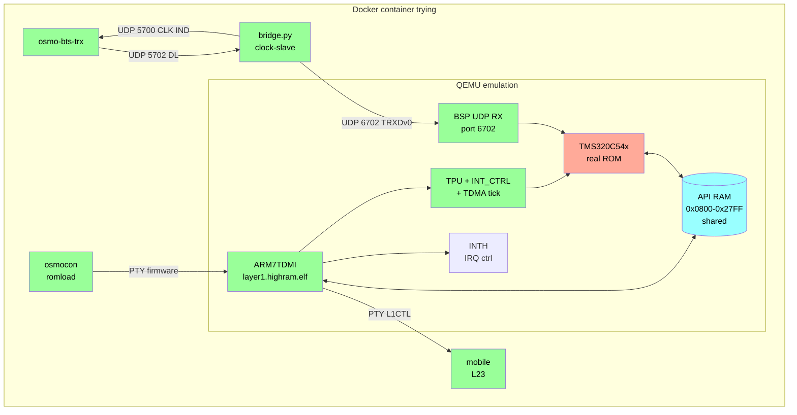
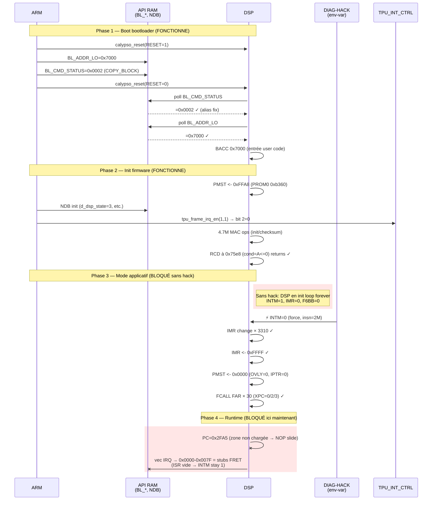

● Cartographie qemu-calypso — état post-session 2026-04-26                                                                                                                                                                                              
                                                                                                                                                                                                                                                        
  1. Architecture pipeline complet

  Vert = fonctionnel. Orange = fonctionnel mais piégé en init loop sans le hack.                                                                                                                                                                        
                                                            
  2. Séquence de boot — état actuel avec hack                                                                                                                                                                                                           

                                                                                                                                                                                                                                                        
  # qemu-calypso — Status

> Snapshot of the DSP memory map, what works end-to-end, and what's left.

## DSP Program Space

### `XPC = 0` (low pages)

| Range            | Region                     | Status | Notes                                                        |
| ---------------- | -------------------------- | :----: | ------------------------------------------------------------ |
| `0x0000–0x007F`  | Boot ROM stubs (TI ROM)    |   ⚠️   | FRET fallback — real TI boot ROM ISRs still to implement     |
| `0x0080–0x07FF`  | DARAM overlay (`OVLY=1`)   |   ✅   | Code copied from `PROM0[0x7080+]` at reset, aliased on api_ram |
| `0x0800–0x27FF`  | DARAM = API RAM (shared)   |   ✅   | ARM ↔ DSP mailbox: `BL_*`, NDB, `task_md`, `d_fb_det`        |
| `0x2800–0x6FFF`  | "Unmapped" / SARAM         |   ⚠️   | Firmware fetches here post-OVLY (PC=0x2FA5 stuck NOP slide)  |
| `0x7000–0xDFFF`  | PROM0 (24K words)          |   ✅   | Full ROM dump: init code, bootloader, IDLE clusters          |
| `0xE000–0xFF7F`  | PROM1 mirror (page-1 vec)  |   ✅   | Loaded from page-1 dump (`INT3=0x0100 fc20` etc.)            |
| `0xFF80–0xFFFF`  | Vector table (`IPTR=0x1FF`) | ✅   | Reset @ `0xFF80 = B 0xb410`; other vectors from PROM1        |

### `XPC = 1/2/3` (extended pages)

| Range              | Region | Status | Notes                                          |
| ------------------ | ------ | :----: | ---------------------------------------------- |
| `0x18000–0x1FFFF`  | PROM1  |   ✅   | Loaded; contains dispatcher @ `0x1a7c4`, RSBX INTM clusters |
| `0x28000–0x2FFFF`  | PROM2  |   ✅   | Loaded; reached with hack                      |
| `0x38000–0x39FFF`  | PROM3  |   ✅   | Loaded; reached with hack                      |

---

## What works

### Pipeline ARM ↔ BTS ↔ Mobile

- ✅ Bridge UDP relay (BTS DL `UDP 5702` → QEMU `6702`)
- ✅ Clock master (QEMU FN → bridge → BTS via `CLK IND` wall-clock)
- ✅ `osmo-bts-trx` full pipeline with `mobile` L23
- ✅ `osmocon` romload firmware upload (PTY native)
- ✅ Sercomm DLCI router PTY ↔ FIFO
- ✅ ARM main loop: `l1a_compl_execute`, `tdma_sched_execute`, `sim_handler`, `l1a_l23_handler`
- ✅ ARM PM scan (`PM_REQ` ARFCN range, PM MEAS publish)
- ✅ ARM FBSB request loop (`L1CTL_FBSB_REQ` retry)
- ✅ SIM module ISO 7816 emulated (`calypso_sim.c`, IMSI/Ki loaded)

### ARM ↔ DSP mailbox

- ✅ Bootloader handshake `BL_ADDR_LO` / `BL_CMD_STATUS` (BACC `0x7000`)
- ✅ NDB structure init on ARM side (`dsp_ndb_init`)
- ✅ `d_task_md` write (FB-det command, ~14 frames)
- ✅ DMA proof: ARM writes `task_d` / `task_u` / `task_md` per frame
- ✅ Aliasing data ↔ api_ram coherent (fix #1)

### DSP emulation core

- ✅ Reset state correct (`SP=0x5AC8`, `ST1=INTM`, `PMST=0xFFE0`)
- ✅ MVPD-style copy `PROM0[0x7080+] → DARAM[0x80+]` at reset (aliased api_ram)
- ✅ Boot ROM stub `0x0000=LDMM`, `0x0001=RET`, `0x0002–0x007F=FRET`
- ✅ Vec table `0xFF80` (reset → `0xb410`, others = PROM1 mirror)
- ✅ ROM loader (PROM0/1/2/3 + DROM/PDROM)
- ✅ OVLY mode (DARAM in program space when bit set)

### C54x opcodes verified (50+)

| Class        | Opcodes |
| ------------ | ------- |
| ALU          | `ADD`, `ADDS`, `SUB`, `SUBS`, `MAC`, `MAS`, `MPY`, `SQUR`, `FIRS`, `NORM` |
| Move         | `LD` (signed/unsigned/rounded/T-shift), `ST`/`STH`/`STL`/`STM`, `MVPD`, `MVDM` |
| Branch near  | `B`, `BC`, `BD`, `CC`, `CCD`, `CALL`, `CALLD`, `RET`, `RETD`, `RC`, `RCD`, `BANZ` |
| Branch far   | `FB`, `FBD`, `FCALL`, `FCALLD` (fix #5 tonight, set XPC properly) |
| Acc-target   | `BACC`, `CALA`, `BACCD`, `CALAD`, `FBACCD`, `FCALAD` |
| ISR          | `RETE`, `RETED`, `FRET`, `FRETED` (with APTS gate) |
| Status       | `RSBX`, `SSBX`, `IDLE 1/2/3`, `RPT`, `RPTB`, `RPTBD`, `RPTZ` |
| Conditional  | `AGEQ`/`ALT`/`ALEQ`/`AEQ`/`ANEQ`/`AGT`, `BGEQ`/etc., `TC`/`NTC`, `C`/`NC`, `OV`/`NOV` |
| Compare      | `CMPM`, `BITF`, `CMPS`, `CMPR` |
| Indirect     | Modes 0–15 (incl. mode 15 `*(lk)` absolute) |
| MMR access   | `IMR`, `IFR`, `ST0`, `ST1`, `AR0–AR7`, `SP`, `BK`, `BRC`, `RSA`, `REA`, `PMST`, `XPC` |

### IRQ / interrupts

- ✅ INTH controller (ARM-side) with level-clear
- ✅ `INT3` frame interrupt path (TPU `INT_CTRL` gate, fix #2)
- ✅ `BRINT0` raise after BSP DMA (gate IFR rate-limit)
- ✅ IRQ vec dispatch (`INTM=0` + IMR-mask)
- ✅ IRQ pending in IFR when masked
- ✅ IDLE wake-up on IRQ (masked or unmasked)
- ✅ FAR call/return XPC push iff APTS

### TPU / TSP / IOTA / Timer

- ✅ TPU TDMA tick at GSM frame rate
- ✅ `TPU_CTRL` writes (`RESET` / `EN` / `DSP_EN` / `CK_ENABLE`)
- ✅ `INT_CTRL` writes (`MCU_FRAME` / `DSP_FRAME` / `DSP_FRAME_FORCE`)
- ✅ TPU RAM scenarios
- ✅ IOTA `BDLENA` pulse delivery
- ✅ `TINT0` timer (CNTL bit 5 `CLOCK_ENABLE`, prescaler 4:2, lazy mode)

### BSP DMA pipeline

- ✅ UDP `6702` RX (TRXDv0 from bridge)
- ✅ FN-indexed queue per TN (tolerance window 64)
- ✅ Burst classification (FB pattern detect: 146 zeros)
- ✅ DARAM write @ `0x3FB0+` (fixed in init)
- ✅ `BRINT0` IRQ raise after DMA

### Diagnostic / instrumentation

- ✅ DIAG-HACK env-var driven (`CALYPSO_FORCE_INTM_CLEAR_AT`)
- ✅ Full dump (`PMST`, `IPTR`, `IMR`, `IFR`, `ST0`/`ST1`, vec table, `ALIAS-CHECK`)
- ✅ 30+ conditional tracers (`DYN-CALL`, `BCD/CAD`, `MAC-7700`, `RCD-75e8`, …)
- ✅ PC HIST sampling (top 20 per 50K cycles)
- ✅ `WATCH-READ` / `WATCH-WRITE` on critical mailbox slots

### Tooling / dev

- ✅ 3-way sync: `qemu-src` (host primary) ↔ `qemu` (mirror) ↔ container `/opt/GSM/qemu-src`
- ✅ Packaged repo `/home/nirvana/qemu-calypso` (`hw/`, `include/`, `CLAUDE.md`, `hack.patch`)
- ✅ Build container `ninja`
- ✅ `hack.patch` reversible (`patch -p1 -R`)
- ✅ Exhaustive `TODO.md` (601 lines, structured by root bug + technical debt)
- ✅ `CLAUDE.md` rule #1: "PAS DE HACK"

---

## What's left

| Priority | Item                                                                         | Type             |
| :------: | ---------------------------------------------------------------------------- | ---------------- |
| 🔴 High  | Identify silicon mechanism that clears `INTM` (NMI / TI boot ROM / MMIO)     | TI doc research  |
| 🔴 High  | Implement real ISR stubs at `0x0000–0x007F` (at minimum `RETE`)              | impl             |
| 🟠 Med   | Identify source of code at `PC ≥ 0x2800` post-OVLY (ext SARAM? ARM upload?) | research         |
| 🟢 Low   | Refactor structural aliasing (1 backing store instead of 3 paths)            | tech debt        |
| 🟢 Low   | `c54x_reset` MVPD: opcode-driven instead of fixed memcpy                     | tech debt        |
| 🟢 Low   | `prog_fetch` honor XPC for `≥0x8000`                                         | tech debt        |
