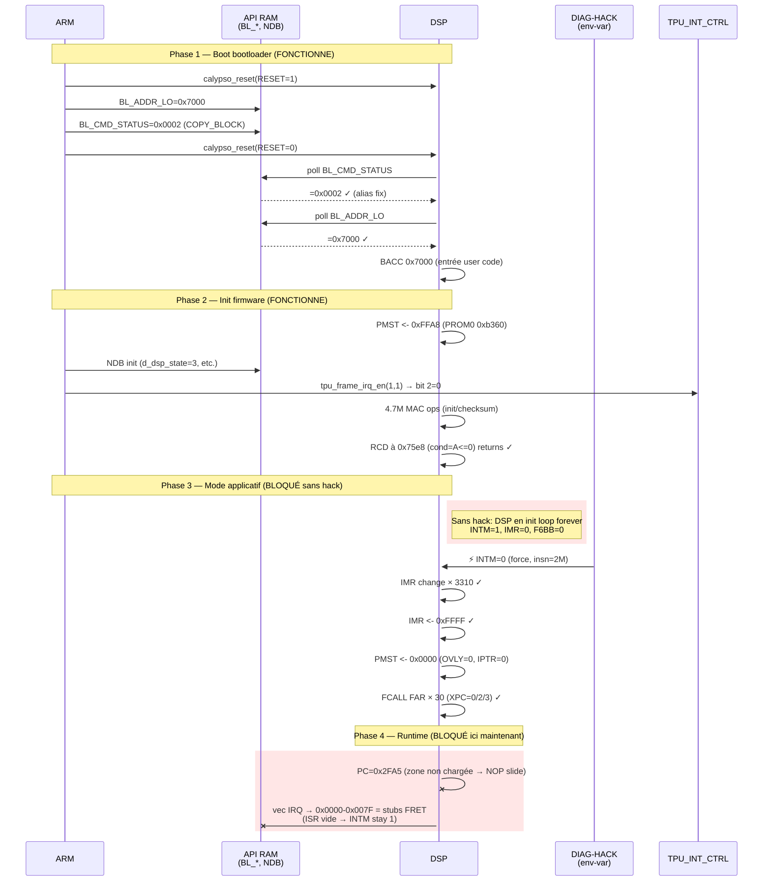

● Cartographie qemu-calypso — état post-session 2026-04-26                                                                                                                                                                                              
                                                                                                                                                                                                                                                        
  1. Architecture pipeline complet
```mermaid                                                                                                                                                                                                                                                      
  flowchart TB                                                                                                                                                                                                                                          
      subgraph Container [Docker container trying]                                                                                                                                                                                                    
          subgraph QEMU [QEMU emulation]                                                                                                                                                                                                                
              ARM[ARM7TDMI<br/>layer1.highram.elf]                                                                                                                                                                                                      
              DSP[TMS320C54x<br/>real ROM]                                                                                                                                                                                                              
              APIRAM[(API RAM<br/>0x0800-0x27FF<br/>shared)]                                                                                                                                                                                            
              BSP[BSP UDP RX<br/>port 6702]                                                                                                                                                                                                             
              TPU[TPU + INT_CTRL<br/>+ TDMA tick]                                                                                                                                                                                                       
              INTH[INTH<br/>IRQ ctrl]                                                                                                                                                                                                                   
              ARM <--> APIRAM                                                                                                                                                                                                                           
              DSP <--> APIRAM                                                                                                                                                                                                                           
              ARM --> TPU                                                                                                                                                                                                                               
              TPU --> DSP                                                                                                                                                                                                                               
              BSP --> DSP                                   
              ARM --> INTH                                                                                                                                                                                                                              
          end
          BRIDGE[bridge.py<br/>clock-slave]                                                                                                                                                                                                             
          BTS[osmo-bts-trx]                                                                                                                                                                                                                             
          MOBILE[mobile<br/>L23]                                                                                                                                                                                                                        
          OSMOCON[osmocon<br/>romload]                                                                                                                                                                                                                  
      end                                                                                                                                                                                                                                               
                                                            
      BTS -->|UDP 5702 DL| BRIDGE                                                                                                                                                                                                                       
      BRIDGE -->|UDP 6702 TRXDv0| BSP                       
      BRIDGE -->|UDP 5700 CLK IND| BTS                                                                                                                                                                                                                  
      OSMOCON -->|PTY firmware| ARM                                                                                                                                                                                                                     
      ARM -->|PTY L1CTL| MOBILE                                                                                                                                                                                                                         
                                                                                                                                                                                                                                                        
      style ARM fill:#9f9,color:#000                                                                                                                                                                                                                    
      style DSP fill:#fa9,color:#000                        
      style APIRAM fill:#9ff,color:#000                                                                                                                                                                                                                 
      style BSP fill:#9f9,color:#000                                                                                                                                                                                                                    
      style TPU fill:#9f9,color:#000
      style BRIDGE fill:#9f9,color:#000                                                                                                                                                                                                                 
      style BTS fill:#9f9,color:#000                        
      style MOBILE fill:#9f9,color:#000                                                                                                                                                                                                                 
      style OSMOCON fill:#9f9,color:#000                                                                                                                                                                                                                
  ```
 
  Vert = fonctionnel. Orange = fonctionnel mais piégé en init loop sans le hack.                                                                                                                                                                        
                                                            
  2. Séquence de boot — état actuel avec hack                                                                                                                                                                                                           

                                                                                                                                                                                                                                                        
  3. Carte DSP memory + état des zones                                                                                                                                                                                                                  
                                         
  DSP Program Space (XPC=0)             Status                                                                                                                                                                                                          
  ═══════════════════════════════════════════════════════════════                                                                                                                                                                                       
  0x0000 ─┐                                                                                                                                                                                                                                           
          │ Boot ROM stubs            ⚠️  FRET fallback (à implémenter                                                                                                                                                                                   
  0x007F ─┘ (TI ROM real)                vraies ISR boot ROM TI)                                                                                                                                                                                        
  0x0080 ─┐                                                                                                                                                                                                                                             
          │ DARAM overlay             ✓ Code copié de PROM0[0x7080+]                                                                                                                                                                                    
          │ (OVLY=1 only)                au reset, aliasé sur api_ram                                                                                                                                                                                   
  0x07FF ─┤                                                                                                                                                                                                                                             
          │ DARAM = API RAM           ✓ Shared ARM↔DSP, mailbox                                                                                                                                                                                         
          │ (shared via dsp_ram)         BL_*, NDB, task_md, d_fb_det                                                                                                                                                                                   
  0x27FF ─┘                                                                                                                                                                                                                                             
  0x2800 ─┐                                                                                                                                                                                                                                             
          │ "Unmapped" / SARAM        ⚠️  Firmware fetch ici post-OVLY                                                                                                                                                                                   
          │                              (PC=0x2FA5 stuck NOP slide)                                                                                                                                                                                    
  0x6FFF ─┘                                                                                                                                                                                                                                             
  0x7000 ─┐                                                                                                                                                                                                                                             
          │ PROM0                     ✓ ROM dump complet, code init                                                                                                                                                                                     
          │ (24K words)                  + bootloader + IDLE clusters                                                                                                                                                                                   
  0xDFFF ─┘                                                                                                                                                                                                                                             
  0xE000 ─┐                                                                                                                                                                                                                                             
          │ PROM1 mirror              ✓ Loaded from page 1 dump                                                                                                                                                                                         
          │ (page-1 vec table here       (vec INT3=0x0100 fc20 etc.)                                                                                                                                                                                    
  0xFF7F ─┤                                                                                                                                                                                                                                             
          │ Vector table              ✓ Reset @ 0xFF80 = B 0xb410                                                                                                                                                                                       
  0xFFFF ─┘ (IPTR=0x1FF default)         Other vectors from PROM1                                                                                                                                                                                       
                                                                                                                                                                                                                                                        
                                                                                                                                                                                                                                                        
  DSP Program Space (XPC=1/2/3) — extended pages                                                                                                                                                                                                        
  ═══════════════════════════════════════════════════════════════                                                                                                                                                                                       
  0x18000-0x1FFFF (PROM1)              ✓ Loaded, contient dispatcher                                                                                                                                                                                    
                                          à 0x1a7c4, RSBX INTM clusters                                                                                                                                                                                 
  0x28000-0x2FFFF (PROM2)              ✓ Loaded, atteint avec hack                                                                                                                                                                                    
  0x38000-0x39FFF (PROM3)              ✓ Loaded, atteint avec hack                                                                                                                                                                                      
                                                                                                                                                                                                                                                        
  4. Tout ce qui FONCTIONNE actuellement                                                                                                                                                                                                                
                                                                                                                                                                                                                                                        
  Pipeline ARM ↔ BTS ↔ Mobile                                                                                                                                                                                                                           
                                                                                                                                                                                                                                                        
  - ✓ Bridge UDP relay (BTS DL UDP 5702 → QEMU 6702)                                                                                                                                                                                                    
  - ✓ Clock master (QEMU FN → bridge → BTS via CLK IND wall-clock)                                                                                                                                                                                    
  - ✓ osmo-bts-trx full pipeline avec mobile L23                                                                                                                                                                                                        
  - ✓ osmocon romload upload firmware (PTY native)                                                                                                                                                                                                    
  - ✓ Sercomm DLCI router PTY ↔ FIFO                                                                                                                                                                                                                    
  - ✓ ARM main loop : l1a_compl_execute, tdma_sched_execute, sim_handler, l1a_l23_handler                                                                                                                                                               
  - ✓ ARM PM scan (PM_REQ ARFCN range, PM MEAS publish)                                                                                                                                                                                                 
  - ✓ ARM FBSB request loop (L1CTL_FBSB_REQ retry)                                                                                                                                                                                                      
  - ✓ SIM module ISO 7816 émulé (calypso_sim.c, IMSI/Ki chargés)                                                                                                                                                                                        
                                                                                                                                                                                                                                                        
  ARM ↔ DSP mailbox                                                                                                                                                                                                                                     
                                                                                                                                                                                                                                                        
  - ✓ Bootloader handshake BL_ADDR_LO/BL_CMD_STATUS (BACC 0x7000)                                                                                                                                                                                       
  - ✓ NDB structure init côté ARM (dsp_ndb_init)                                                                                                                                                                                                        
  - ✓ d_task_md write (FB-det command, ~14 frames)                                                                                                                                                                                                      
  - ✓ DMA proof : ARM writes task_d/u/md per frame                                                                                                                                                                                                    
  - ✓ Aliasing data ↔ api_ram cohérent (fix #1)                                                                                                                                                                                                         
                                                                                                                                                                                                                                                        
  DSP émulation core                                                                                                                                                                                                                                    
                                                                                                                                                                                                                                                        
  - ✓ Reset state correct (SP=0x5AC8, ST1=INTM, PMST=0xFFE0)                                                                                                                                                                                            
  - ✓ MVPD-style copy PROM0[0x7080+] → DARAM[0x80+] au reset (aliasé api_ram)                                                                                                                                                                           
  - ✓ Boot ROM stub 0x0000=LDMM, 0x0001=RET, 0x0002-0x007F=FRET                                                                                                                                                                                         
  - ✓ Vec table 0xFF80 (reset → 0xb410, autres = PROM1 mirror)                                                                                                                                                                                        
  - ✓ ROM loader (PROM0/1/2/3 + DROM/PDROM)                                                                                                                                                                                                             
  - ✓ OVLY mode (DARAM in program space when bit set)                                                                                                                                                                                                   
                                                                                                                                                                                                                                                        
  C54x opcodes vérifiés (50+)                                                                                                                                                                                                                           
                                                                                                                                                                                                                                                        
  - ✓ ALU : ADD/ADDS/SUB/SUBS, MAC/MAS/MPY/SQUR, FIRS, NORM                                                                                                                                                                                             
  - ✓ Move : LD (signed/unsigned/rounded/T-shift), ST/STH/STL/STM, MVPD, MVDM                                                                                                                                                                           
  - ✓ Branch near : B, BC, BD, CC, CCD, CALL, CALLD, RET, RETD, RC, RCD, BANZ                                                                                                                                                                           
  - ✓ Branch far : FB, FBD, FCALL, FCALLD (fix #5 ce soir, set XPC propre)                                                                                                                                                                            
  - ✓ Acc-target : BACC, CALA, BACCD, CALAD, FBACCD, FCALAD                                                                                                                                                                                             
  - ✓ ISR : RETE, RETED, FRET, FRETED (avec APTS gate)                                                                                                                                                                                                  
  - ✓ Status : RSBX, SSBX, IDLE 1/2/3, RPT, RPTB, RPTBD, RPTZ                                                                                                                                                                                           
  - ✓ Cond : AGEQ/ALT/ALEQ/AEQ/ANEQ/AGT, BGEQ/etc., TC/NTC, C/NC, OV/NOV                                                                                                                                                                                
  - ✓ Compare : CMPM, BITF, CMPS, CMPR                                                                                                                                                                                                                  
  - ✓ Indirect modes 0-15 (incl. mode 15 *(lk) absolute)                                                                                                                                                                                                
  - ✓ MMR access (IMR, IFR, ST0, ST1, AR0-7, SP, BK, BRC, RSA, REA, PMST, XPC)                                                                                                                                                                          
                                                                                                                                                                                                                                                        
  IRQ / interrupts                                                                                                                                                                                                                                      
                                                                                                                                                                                                                                                        
  - ✓ INTH controller (ARM-side) avec level-clear                                                                                                                                                                                                       
  - ✓ INT3 frame interrupt path (TPU INT_CTRL gate, fix #2)                                                                                                                                                                                             
  - ✓ BRINT0 raise après BSP DMA (gate IFR rate-limit)                                                                                                                                                                                                  
  - ✓ IRQ vec dispatch (INTM=0 + IMR-mask)                                                                                                                                                                                                            
  - ✓ IRQ pending dans IFR quand masquée                                                                                                                                                                                                                
  - ✓ IDLE wake-up sur IRQ (masked or unmasked)                                                                                                                                                                                                         
  - ✓ FAR call/return XPC push iff APTS                                                                                                                                                                                                                 
                                                                                                                                                                                                                                                        
  TPU / TSP / IOTA / Timer                                                                                                                                                                                                                              
                                                                                                                                                                                                                                                        
  - ✓ TPU TDMA tick au taux frame GSM                                                                                                                                                                                                                   
  - ✓ TPU_CTRL writes (RESET/EN/DSP_EN/CK_ENABLE)                                                                                                                                                                                                       
  - ✓ INT_CTRL writes (MCU_FRAME / DSP_FRAME / DSP_FRAME_FORCE)                                                                                                                                                                                         
  - ✓ TPU RAM scenarios                                                                                                                                                                                                                               
  - ✓ IOTA BDLENA pulse delivery                                                                                                                                                                                                                        
  - ✓ TINT0 timer (CNTL bit 5 CLOCK_ENABLE, prescaler 4:2, lazy mode)                                                                                                                                                                                   
                                                                                                                                                                                                                                                        
  BSP DMA pipeline                                                                                                                                                                                                                                      
                                                                                                                                                                                                                                                        
  - ✓ UDP 6702 RX (TRXDv0 from bridge)                                                                                                                                                                                                                  
  - ✓ FN-indexed queue per TN (tolerance window 64)                                                                                                                                                                                                     
  - ✓ Burst classification (FB pattern detect : 146 zeros)                                                                                                                                                                                              
  - ✓ DARAM write @ 0x3FB0+ (corrigé en init)                                                                                                                                                                                                         
  - ✓ BRINT0 IRQ raise après DMA                                                                                                                                                                                                                        
                                                                                                                                                                                                                                                        
  Diagnostic / instrumentation                                                                                                                                                                                                                          
                                                                                                                                                                                                                                                        
  - ✓ DIAG-HACK env-var driven (CALYPSO_FORCE_INTM_CLEAR_AT)                                                                                                                                                                                            
  - ✓ Dump complet (PMST, IPTR, IMR, IFR, ST0/1, vec table, ALIAS-CHECK)                                                                                                                                                                                
  - ✓ 30+ tracers conditionnels (DYN-CALL, BCD/CAD, MAC-7700, RCD-75e8, etc.)                                                                                                                                                                           
  - ✓ PC HIST sampling (top 20 par 50K cycles)                                                                                                                                                                                                        
  - ✓ WATCH-READ/WRITE sur mailbox slots critiques                                                                                                                                                                                                      
                                                                                                                                                                                                                                                        
  Tooling / dev                                                                                                                                                                                                                                         
                                                                                                                                                                                                                                                        
  - ✓ Sync 3-way : qemu-src (host primary) ↔ qemu (mirror) ↔ container /opt/GSM/qemu-src                                                                                                                                                                
  - ✓ Packaged repo /home/nirvana/qemu-calypso (hw/include/CLAUDE.md/hack.patch)                                                                                                                                                                        
  - ✓ Build container ninja                                                                                                                                                                                                                             
  - ✓ hack.patch reversible (patch -p1 -R)                                                                                                                                                                                                            
  - ✓ TODO.md exhaustif (601 lignes, structuré par bug racine + dette technique)                                                                                                                                                                        
  - ✓ CLAUDE.md règle #1 "PAS DE HACK"                                                                                                                                                                                                                  
                                                                                                                                                                                                                                                        
  5. Ce qui reste à faire                                                                                                                                                                                                                               
                                                                                                                                                                                                                                                        
  ┌──────────┬──────────────────────────────────────────────────────────────────────────────┬──────────────────┐                                                                                                                                        
  │ Priorité │                                     Item                                     │       Type       │                                                                                                                                        
  ├──────────┼──────────────────────────────────────────────────────────────────────────────┼──────────────────┤
  │ 🔴 H     │ Identifier mécanisme silicon clear INTM (NMI / boot ROM TI / MMIO)           │ recherche doc TI │
  ├──────────┼──────────────────────────────────────────────────────────────────────────────┼──────────────────┤
  │ 🔴 H     │ Implémenter ISR stubs réels à 0x0000-0x007F (au minimum RETE)                │ impl             │
  ├──────────┼──────────────────────────────────────────────────────────────────────────────┼──────────────────┤                                                                                                                                      
  │ 🟠 M     │ Identifier source du code à PC ≥ 0x2800 post-OVLY (SARAM ext ? upload ARM ?) │ recherche        │                                                                                                                                        
  ├──────────┼──────────────────────────────────────────────────────────────────────────────┼──────────────────┤                                                                                                                                        
  │ 🟢 L     │ Refactor aliasing structurel (1 backing store au lieu de 3 paths)            │ dette tech       │                                                                                                                                        
  ├──────────┼──────────────────────────────────────────────────────────────────────────────┼──────────────────┤                                                                                                                                        
  │ 🟢 L     │ c54x_reset MVPD : opcode-driven au lieu de memcpy fixe                       │ dette tech       │                                                                                                                                      
  ├──────────┼──────────────────────────────────────────────────────────────────────────────┼──────────────────┤                                                                                                                                        
  │ 🟢 L     │ prog_fetch honorer XPC pour ≥0x8000                                          │ dette tech       │                                                                                                                                      
  └──────────┴──────────────────────────────────────────────────────────────────────────────┴──────────────────┘    
