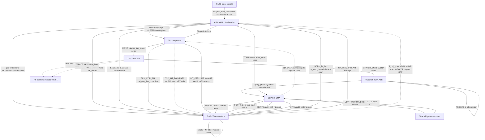

# Calypso DBB (QEMU) — Inter-Block Wiring Reference

*Assembled from the five component maps (TPU, TSP/ABB/RF, BSP, DSP C54x, ARM/SoC/clock). Every factual claim is cited to `file:line`, osmo firmware source, or a runtime log marker. Focus: the RX/FB signal chain and the interrupt/clock fabric under active debug.*

---

## 1. Overview of the Calypso block architecture

The emulation models a TI Calypso baseband as a set of cooperating QEMU device blocks plus a modeled TMS320C54x DSP core:

- **ARM946 + CalypsoSoC** (`calypso_soc.c` / `calypso_mb.c`) — the machine top. The board instantiates the ARM946 CPU and the SoC; the SoC realizes the INTH interrupt controller, timers, UARTs, SPI, I2C and calls `calypso_trx_init()` (`calypso_soc.c:346-352`; `calypso_trx.c:1762-1790`). INTH sits at `0xFFFFFA00` and its parent IRQ/FIQ are wired to `ARM_CPU_IRQ`/`ARM_CPU_FIQ` by the board after realize via `sysbus_pass_irq` (`calypso_soc.c:247-257`; `calypso_mb.c:107-110`).
- **calypso_trx.c** — the DSP-API / TPU / TSP / ULPD / SIM MMIO block, the C54x DSP instance, and the **4.615 ms TDMA master tick** (`s->tdma_timer`, `calypso_trx.c:1785`). This tick is the system heartbeat: it advances FN, runs the DSP twice, sends the CLK-UDP to the radio, raises the ARM frame IRQ, and drains UL (`calypso_tdma_tick` body `calypso_trx.c:1136-1547`).
- **TPU** (`calypso_tpu.c`) — a faithful micro-instruction sequencer: on `TPU_CTRL_EN` commit it replays the firmware TPU-RAM program against real TDMA ticks (qbit cursor 0..4999, `QBITS_PER_TDMA=5000`, `calypso_tpu.c:82`), decoding AT/WAIT/SYNCHRO/OFFSET/MOVE/SLEEP opcodes.
- **TSP + TWL3025/IOTA ABB + RF** (`calypso_tsp.c`, `calypso_iota.c`, `calypso_twl3025.c`) — the serial control port the TPU drives to shift words to the off-chip radio companions.
- **BSP / RIF DMA** (`calypso_bsp.c`) — owns the UDP TRXDv0 DL socket (port 6702), converts/passes RX I/Q, DMAs bursts into the DSP, and raises the RX interrupts.
- **DSP C54x** (`calypso_c54x.c`) — runs the GSM L1 firmware (FCCH/SCH correlator, FB/SB demod). Its interrupt engine (IMR/IFR/INTM, IPTR-relocated vector table at `iptr*0x80 + vec*4`) is driven by `c54x_interrupt_ex()` and re-checked per-instruction by `c54x_irq_level_check()` (`calypso_c54x.c:4283`, `:15091`).
- **TINT0** (`calypso_tint0.c`) — a standalone DSP-Timer0 clock module that is **dead code**: `calypso_tint0_start()` is never called (`calypso_tint0.c:42-45`).

The two cross-block command fabrics are: **ARM↔DSP** over the physically-shared API-RAM/DARAM window (`C54X_API_BASE=0x0800`, span `0x0800-0x27FF`), and **TPU↔TSP↔ABB↔RF** over the serial control port. The **RX sample fabric** is BSP→DSP DARAM `0x2a00` + PORTR.

---

## 2. Architecture diagram

*Dashed/red edges are GAP/STUB links (see §5).*

---

## 3. Per-link table

| From | To | Channel | Kind | Direction | Wired | Ref |
|---|---|---|---|---|---|---|
| TPU | TSP | MOVE opcode → `calypso_tsp_move` (TX_1..4, CTRL1/2, ACT_L/U, SET1-3); CTRL2.WR pulse | serial | A→B | WIRED | `calypso_tpu.c:98-101`, `:199-204`; `calypso_tsp.c:51-112`; `:81`→`calypso_iota.c:56` |
| TPU | DSP | `DSP_INT_PG` (0x10) bit0 → `c54x_interrupt_ex(seq.dsp,21,5)` BRINT0 vec21/bit5 | interrupt | A→B | **PARTIAL** | `calypso_tpu.c:103-119`; TX-only caller `tpu_window.c:199`; 0-hit on RX per `calypso_tpu.c:104-112`; log `qemu_live.log:1142-1145 VEC-INSTALL vec21@0xd4 BRINT0` |
| TPU | DSP | `TPU_INT_CTRL` ICTRL_DSP_FRAME + IMR bit3 (bit12 native) → periodic `c54x_interrupt_ex(dsp,19,bit3)`; DSP_EN = one-shot force | interrupt | A→B | WIRED | `calypso_trx.c:1270-1283`; `calypso_trx.h:52-75` |
| TPU | DSP | `TPU_CTRL_EN` → `calypso_dsp_done()`: write-page 20 words → DARAM `d[0x0586..]`, mirror `api_ram[0x08D4]` | dma | A→B | WIRED | `calypso_trx.c:792-820`, `:781/959` (gated off when shunt active) |
| ARM | TPU | MMIO TPU regs @ `0xFFFF9800`; `TPU_CTRL.EN`→`calypso_dsp_done`; INT_CTRL MCU_FRAME clear→`calypso_tdma_start`; TPU-RAM @ `0xFFFF9000` | register | B→A | WIRED | `calypso_trx.c:945-971`, `:977-979`, `:825`; `calypso_trx.h:42,52,57,62-63` |
| TPU | ARM | `calypso_dsp_done` raises `CALYPSO_IRQ_API` after scenario/DMA | interrupt | A→B | WIRED | `calypso_trx.c:827` |
| clock | TPU | `calypso_tpu_sequencer_tick(fn)` per TDMA frame from `calypso_tdma_tick`; AT/WAIT frame-delay resume | clock | B→A | WIRED | `calypso_trx.c:1192`; `calypso_tpu.c:238-246`, `:156-184`, `:82` |
| TPU | TSP | `calypso_tsp_owns_addr()`/`calypso_tsp_move(addr,data,fn)` dispatch | function-call | B→A | WIRED | `calypso_tpu.c:98-99`; `calypso_tsp.c:38-49,51` |
| TSP | TWL3025/IOTA | dev_idx==0 WR pulse → `calypso_iota_tsp_write(tsp.tx[0], expected_tn)` = BDLENA/BULENA byte | serial | A→B | **PARTIAL** | `calypso_tsp.c:61-81` (expected_tn hardcoded 0); `calypso_iota.c:56-77` |
| TSP | RF (mt6139/trf6151) | dev_idx≥1 PLL/band/gain word reconstructed then dropped, 'no consumer' log | serial | A→B | **GAP** | `calypso_tsp.c:82-88` |
| TSP | RF/ABB TSPACT | ACT_L/ACT_U latch 16-bit enable-line state (`tsp_act_update`) | register | A→B | **GAP** | `calypso_tsp.c:91-102` |
| TSP/IOTA | BSP | BDLENA rising edge queues pending TN; `calypso_iota_take_bdl_pulse(tn)` meant to gate BRINT0 | interrupt | A→B | **STUB** | `calypso_iota.c:82-101` defined; referenced only in comment `calypso_bsp.c:1164`; BRINT0 fired unconditionally `calypso_bsp.c:1166-1169` |
| TWL3025 | (AFC) | API-RAM `d_afc` (WP word15 off 0x001E/0x0046) → `set_afc_dac()`; BYPASSES DSP→TSP serialization | register | A→B | **PARTIAL** | `calypso_trx.c:545-547`; `calypso_twl3025.c:112-145` |
| TWL3025 | BSP | `apply_phase(iq,n,fn,tn)`: rotates RX IQ by AFC VCXO offset (~13.1 Hz/LSB) before `c54x_bsp_load` | shared-mem | A→B | WIRED | `calypso_bsp.c:1287`; `calypso_twl3025.c:174-216` |
| BSP | DSP | DARAM `dsp->data[0x2a00..]` direct word write (len 296, ring) | shared-mem | A→B | WIRED | `calypso_bsp.c:1086`, `:1303`; addr/len `:785-786`; consumer PC=0x93a5 AR3=0x2a00 `:781-784` |
| BSP | DSP | PORTR serial input `c54x_bsp_load(dsp,samples,ns)` (full 296-int16) | serial | A→B | WIRED | `calypso_bsp.c:1069`, `:1292`; decl via `:32` |
| BSP | DSP | BRINT0 vec21/IMR bit5 (RX buffer-received) → FB-det correlator ISR (PROM1[0xFFD4]→CALL 0xf310); anti-stack gated on `!(ifr&(1<<5))` | interrupt | A→B | WIRED | `calypso_bsp.c:1167`, `:1348-1350`, `:1411-1413`; rationale `:1334-1344`; direct-feed variant gated `:1041-1051` |
| BSP | DSP | INT3 frame IT vec19/bit3 (native remap vec28/bit12 under CALYPSO_FRAME_IT_NATIVE); anti-stack gated | interrupt | A→B | WIRED | `calypso_bsp.c:1029`, `:1214`; gate `:1027-1031`; comment `:977-982` |
| TRX bridge | BSP | UDP TRXDv0 DL recv port 6702; hdr 8B (tn+fn+rssi+toa) then 148 bits or cs16 IQ | socket | B→A | WIRED | `calypso_bsp.c:51`, `:362`, `:890-894`; parse `:450-459` |
| BSP | TRX bridge | UDP TRXDv0 UL send `:5702`, 8B hdr+148 soft-bits; peer learned from DL sender | socket | A→B | WIRED | `calypso_bsp.c:1470`; init `:822-824`; learn `:417-422`; RACH `:1558-1606` |
| BSP | dsp_shunt | `feed_iq`: `calypso_dsp_shunt_feed_iq(fn,buf+8,(n-8)/2)` → g_shunt.rx_* + last_iq replay | function-call | A→B | WIRED | `calypso_bsp.c:400-402` (gated `:372`); `calypso_dsp_shunt.c:1084`, `:1159-1164`, `:444-445` |
| BSP | dsp_shunt (gr-gsm) | UDP IQ tee to port 6703 (raw 8B hdr+cs16), diag side-channel, shunt-gated | socket | A→B | **PARTIAL** | `calypso_bsp.c:372-392`; `calypso_dsp_shunt.c:939,998` |
| BSP | TRX clock | `calypso_trx_get_fn()` for FN-match window ±64; `deliver_buffered(cur_fn)` off 5ms REALTIME drain | clock | B→A | WIRED | `calypso_bsp.c:483`, `:684-685`; window `:269-327`; timer `:914-916` |
| BSP | DSP | FN-match vs direct-feed selector: default `bsp_enqueue`→`deliver_buffered` (±64); `CALYPSO_BSP_DIRECT_FEED=1` → immediate `rx_burst` | register | A→B | **PARTIAL** | `calypso_bsp.c:613-624`; enqueue `:228-264`; drain `:1176-1417`; rationale `:607-612` |
| BSP | TPU/TSP/IOTA | silicon BDLENA RX-window gate: `take_bdl_pulse()` NEVER called, delivery unconditional; `CALYPSO_BSP_BYPASS_BDLENA` no-op relic | register | B→A | **GAP** | `calypso_bsp.c:33`, stale claim `:1162-1164`, unconditional `:977-982`, relic `:799-802`, hypothesis `:83` |
| DSP | TINT0 | vec20/TINT0/IMR bit4 = Timer0 underflow = 4.615ms master clock | clock | B→A | WIRED | `calypso_c54x.c:14504`; `calypso_dsp_shunt.c:466` (CALYPSO_TINT0_MASTER); `calypso_tint0.c` tick_cb |
| DSP | (scheduler) | vec28/IMR bit12 real per-frame scheduler (0x7234→CALL 0xa4e4→d_dsp_page→correlator); env-gated remap of vec19/bit3 | interrupt | B→A | **PARTIAL** | remap `calypso_c54x.c:15114-15115`; fire `calypso_dsp_shunt.c:458`; level-take `calypso_c54x.c:4355` |
| DSP | ARM | API-RAM write-page `d_task_md/d/u/ra` → mirrored DARAM `data[0x0586+i]` | shared-mem | B→A | WIRED | `calypso_trx.c:800`, `:814`, `:61`; shunt latch `calypso_dsp_shunt.c:148`; osmo `dsp_api.h:38` |
| DSP | ARM | NDB `d_dsp_page` 'go' trigger (B_GSM_TASK bit1 + page bit0); DSP mirror `api_ram[0x08D4-0x0800]` | register | B→A | WIRED | `calypso_trx.c:817`; shunt `calypso_dsp_shunt.c:432` (0x08E2 contested = d_dsp_state); osmo `dsp_api.h:113` |
| DSP | ARM | NDB read-back `d_fb_det` (1=FOUND) + `a_sync_demod[4]`=(TOA,PM,ANGLE,SNR) | shared-mem | A→B | WIRED | `calypso_dsp_shunt.c:1134`, `:1071`; osmo `dsp_api.h:202-204` |
| DSP | ARM | `qemu_irq CALYPSO_IRQ_API` frame/API IRQ after each DSP frame tick | interrupt | A→B | WIRED | `calypso_trx.c:827`, `:1313` |
| DSP | ARM | `d_ctrl_system` @ DSP `data[0x0810]` (RESET/RESUME) + IMR shadow `data[0x435b]` = go-live enable | register | B→A | **GAP** | osmo `dsp_api.h:75`; never written `calypso_dsp_shunt.c:383/506`; MEMORY golive-imr-shadow-435b |
| ARM/SoC | INTH | child @ `0xFFFFFA00`; `sysbus_pass_irq` to board | interrupt | A→B | WIRED | `calypso_soc.c:247-257` |
| ARM/SoC | ARM946 | INTH parent_irq→ARM_CPU_IRQ, parent_fiq→ARM_CPU_FIQ | interrupt | A→B | WIRED | `calypso_mb.c:107-110` |
| ARM/SoC | trx block | `calypso_trx_init(sysmem, irqs[])` | function-call | A→B | WIRED | `calypso_soc.c:346-352`; `calypso_trx.c:1762-1790` |
| ARM | DSP | per-write mirror: MMIO byte off → `data[off/2+0x0800]` under daram_lock | shared-mem | A→B | WIRED | `calypso_trx.c:433-469` |
| ARM | DSP | write-page DMA in `calypso_dsp_done`: `data[0x0584]=page`, `[0x0585]=fn`, `[0x0586+i]=wp[i]`, `api_ram[0x08D4]=page` | dma | A→B | WIRED | `calypso_trx.c:810-819` (gated `!shunt_active`) |
| ARM | TDMA tick | `s->tdma_timer` `timer_new_ns(calypso_tdma_clock, calypso_tdma_tick)`; armed by `calypso_tdma_start` on TPU INT_CTRL write; period `GSM_TDMA_NS` | clock | bidir | WIRED | `calypso_trx.c:1785`, `:1549-1557`, `:969`, `:1136-1547` |
| ARM | L1 sched | tdma_tick raises `CALYPSO_IRQ_TPU_FRAME`; lowered ~1ms later | interrupt | B→A | WIRED | `calypso_trx.c:1427-1429`, `:1090-1109`, `:1787` |
| ARM | DSP | `c54x_interrupt_ex(FRAME_VEC,bit)` each tick when INT_CTRL DSP_FRAME armed AND IMR bit3 (bit12 native) or DSP_EN force | interrupt | A→B | **PARTIAL** | `calypso_trx.c:1267-1283` (suppressed when shunt route_c54x active) |
| ARM | Radio bridge | 4-byte FN UDP per VIRTUAL tick via `s->clk_fd`; or `clk_master` pthread WALL 4.615ms | socket | A→B | WIRED | `calypso_trx.c:1161-1176`, `:866-925` |
| ARM | BSP | UL: tdma_tick reads `d_task_ra/d_task_u` → `calypso_bsp_send_ul`; DL drain decoupled in `bsp_drain_cb` | function-call | bidir | **PARTIAL** | `calypso_trx.c:1356-1401`, `:1340-1346` |
| ARM | TINT0 | `calypso_tint0_do_tick(fn)` → `calypso_tdma_tick`, BUT `calypso_tint0_start()` NEVER called → QEMUTimer never arms | clock | A→B | **STUB** | `calypso_tint0.c:37-71`, `:42-45`, `:83-104`; `calypso_trx.c:932-939` |
| ARM/SoC | DSP ROM | mb pushes `dsp-prom0..3/drom/pdrom` paths before realize so `c54x_reset` PROM→DARAM copy sees them | shared-mem | A→B | WIRED | `calypso_mb.c:96-99`; `calypso_trx.c:1744-1759,1807-1834` |

---

## 4. The RX/FB signal path — narrated

The receive/frequency-burst chain is the path under active debug. It runs **RF → TSP/ABB → BSP → DSP correlator → ARM L1**. Each hop:

**(a) RF frontend → TSP (analog tuning) — UNMODELED.** On silicon the ARM/DSP program the RF PLL, band and gain by shifting words over the TSP to `mt6139`/`trf6151` (TSP `dev_idx≥1`) and by toggling the 16-bit TSPACT lines. In QEMU these words are *decoded but dropped*: the non-zero-device branch only logs `WR dev=%u ... (no consumer)` (`calypso_tsp.c:82-88`), and ACT_L/ACT_U merely latch `tsp.act` with no downstream (`calypso_tsp.c:91-102`). There is no RF hardware model, so tuning is a no-op — acceptable because the "radio" is a UDP bridge, but it means band/gain state is not represented.

**(b) ABB / AFC → BSP IQ rotation.** The only wired TSP consumer is `dev_idx==0` = the TWL3025/IOTA ABB, which receives the BDLENA/BULENA burst-window byte (`calypso_tsp.c:61-81` → `calypso_iota.c:56-77`) — but with `expected_tn` hardcoded to 0 (`calypso_tsp.c:81`), so the TN correlation is loose. The AFC/VCXO loop that on silicon is serialized DSP→TSP→TWL3025 DAC is **short-circuited**: `calypso_trx.c:545-547` intercepts the `d_afc` API-RAM write (WP word15, off 0x001E/0x0046) and calls `calypso_twl3025_set_afc_dac()` directly (`calypso_twl3025.c:112-145`), bypassing the serial path. That DAC then drives `calypso_twl3025_apply_phase()` (`calypso_twl3025.c:174-216`), which rotates the delivered RX IQ samples by the VCXO offset (~13.1 Hz/LSB, baseline dac=-700) at `calypso_bsp.c:1287` inside `deliver_buffered`, just before the DSP load.

**(c) Bridge → BSP (downlink socket).** The BTS/bridge sends TRXDv0 DL bursts to UDP port 6702 (`#define BSP_TRXD_PORT 6702`, `calypso_bsp.c:51`). `recvfrom` (`calypso_bsp.c:362`, handler bound `:890-894`) parses the 8-byte header `tn(1)+fn(4)+rssi(1)+toa(2)` then 148 bits or cs16 IQ (`calypso_bsp.c:450-459`). IQ passthrough decimates 4SPS→1SPS (`CALYPSO_BSP_IQ_DECIM` default 4, `:546-565`).

**(d) BSP → DSP (DMA + serial + interrupts).** Two delivery paths exist. Default: `bsp_enqueue`→`deliver_buffered`, FN-matched within ±64 (`calypso_bsp.c:269-327`, `:613-624`), drained on a **5ms REALTIME timer** (`bsp_drain_cb`, `:914-916`) — not `tdma_tick` — because under `icount=auto` `c54x_run` starves the mainloop iohandler (`:647-664`). The gated `CALYPSO_BSP_DIRECT_FEED=1` bypasses matching for an immediate `rx_burst` (`:607-624`). Either way the burst lands in DSP DARAM `0x2a00` (`data[a]=iq[i]`, `:1086/:1303`, addr/len set `:785-786`) and is pushed through the PORTR serial buffer via `c54x_bsp_load` (full 296-int16, `:1069/:1292`). The DSP correlator consumes it at **PC=0x93a5, AR3 post-inc 0x2a00..** (canary-proven, `:781-784`). BSP then raises two interrupts: **INT3 / vec19 / IMR bit3** (frame IT, `c54x_interrupt_ex(dsp,19,3)`, `:1029/:1214`; native-remapped to scheduler vec28/bit12 under `CALYPSO_FRAME_IT_NATIVE`, `calypso_c54x.c:15114-15115`) and **BRINT0 / vec21 / IMR bit5** ('buffer received', wakes the FB-det correlator ISR PROM1[0xFFD4]→CALL 0xf310, `:1167/:1349/:1412`). Both are anti-stack gated on their own IFR bit.

**(e) DSP correlator → ARM (results + IRQ).** The DSP writes NDB read-back cells `d_fb_det` (1=FOUND) and `a_sync_demod[4]`=(TOA,PM,ANGLE,SNR) (`calypso_dsp_shunt.c:1134`, overlay `:1071`; osmo `dsp_api.h:202-204`), and posts the `d_dsp_page` go-trigger mirrored at `api_ram[0x08D4]` (`calypso_trx.c:817`; note the disputed `0x08E2` = likely `d_dsp_state`, `calypso_dsp_shunt.c:432`, per MEMORY dsp-dpage-offset-bug). The ARM is notified by `qemu_irq_raise(CALYPSO_IRQ_API)` after each DSP frame tick (`calypso_trx.c:827/:1313`), whereupon L1S reads the results.

**(f) The debug wall — interrupt/clock gating.** The chain above is fully wired on the data side, yet the correlator can stay dark. Two facts explain it:
- **BRINT0 is raised but not always taken.** BSP raises vec21 unconditionally, but the DSP-side ISR only runs when INTM=0 and IMR bit5 permit. When the IMR shadow `data[0x435b]` is left 0, firmware `0xa582` writes `IMR=0`, and per MEMORY golive-imr-shadow-435b the earlier `0xa509 STM #0x0010,IMR` clobbers the `0x3000` seed → `IMR=0x0050` → **frame bit12 lost before IFR bit12 arrives** → frame IT masked, correlator `0x8d00` at **0 hit** (MEMORY ndb-cells-098a). `FORCE_IMR=0x3000` (HACK=1) confirms the fix: frame IT taken 90× + real NB demod. So the wiring is present on the BSP side; the block is the **DSP interrupt-enable**, i.e. the missing ARM→DSP control bridge.
- **The RX frame timing is not delivered by the sequencer MOVE.** The code's own TPU→DSP `DSP_INT_PG`/BRINT0 vec21 (`calypso_tpu.c:118`) is **TX-multislot only** — its only osmo caller is `l1s_tx_multi_win_ctrl` (`tpu_window.c:199`), *not* `l1s_rx_win_ctrl` — so it is **0-hit on the native RX/FB run** (`calypso_tpu.c:104-112`; log shows `VEC-INSTALL vec21@0xd4 BRINT0` but no `DSP_INT_PG MOVE` line). RX frame timing is instead delivered by the periodic `calypso_trx.c:1279` path gated by `TPU_INT_CTRL` + IMR (vec19/bit3, or vec28/bit12 native). This matches the MEMORY "TPU RX frame-IT jamais câblé" concern: the `l1s_rx_win_ctrl → tpu_enq_dsp_irq` route is 0-hit.

**Master clock.** The 4.615ms heartbeat is `s->tdma_timer` in `calypso_trx.c` (`timer_new` `:1785`), armed once by `calypso_tdma_start` (`:1549`) when firmware clears `TPU_INT_CTRL.ICTRL_MCU_FRAME` (`:969`). On the DSP side the same cadence appears as vec20/TINT0/IMR bit4 (`calypso_c54x.c:14504`, shunt `:466`). The standalone `calypso_tint0.c` module is vestigial — `calypso_tint0_start()` is never invoked (`calypso_tint0.c:42-45,83-104`), tick delegated to `calypso_tdma_tick` (`calypso_trx.c:932-939`).

---

## 5. Wired-vs-GAP summary

**Fully WIRED (digital baseband + ARM/DSP fabric):**
- ARM↔DSP: per-write mirror (`calypso_trx.c:433-469`), write-page DMA (`:810-819`), API-RAM db_w/db_r cells, `CALYPSO_IRQ_API` (`:827/:1313`).
- BSP↔DSP: DARAM 0x2a00 DMA, PORTR `c54x_bsp_load`, BRINT0 vec21/bit5, INT3 vec19/bit3 — all present and exercised.
- Bridge↔BSP: UDP DL 6702 / UL 5702.
- Clock: TDMA `s->tdma_timer`, TPU sequencer tick, DSP vec20/TINT0.
- TPU↔ARM MMIO; TPU→DSP write-page DMA; TPU→TSP MOVE; TSP→TWL3025 dev0; TWL3025 AFC→BSP `apply_phase`.

**PARTIAL (present but loose or environment-gated):**
- TPU→DSP DSP_INT_PG/BRINT0 vec21 — TX-multislot-only, 0-hit on RX.
- vec28/bit12 native scheduler — reached only via env-gated remap.
- ARM→DSP frame INT (`calypso_trx.c:1267-1283`) — suppressed when shunt route_c54x active.
- TSP→TWL3025 dev0 — `expected_tn` hardcoded 0.
- AFC path — reaches DAC via ARM/API-RAM shunt, not serial TSP.
- BSP FN-match vs direct-feed selector; IQ tee 6703; ARM↔BSP UL/DL decoupling.

**GAP / STUB (see ranked list):**
1. **ARM→DSP control/IMR-enable bridge** (`d_ctrl_system@0x0810` + IMR shadow `0x435b`) — GAP, the active go-live blocker; correlator `0x8d00` undispatched.
2. **BSP BDLENA RX-window gate** — GAP, `take_bdl_pulse()` never called, delivery unconditional.
3. **TSP/IOTA→BSP BDLENA interrupt gate** — STUB, implemented but never invoked; `expected_tn=0`.
4. **TSP→RF PLL/band/gain (dev_idx≥1)** — GAP, decoded then dropped.
5. **TSP→RF/ABB TSPACT lines** — GAP, latched, never consumed.
6. **TINT0 standalone module** — STUB, dead code (`calypso_tint0_start` unreferenced).

Net picture: the **digital baseband RX chain is wired end-to-end** (socket → DMA/serial → interrupts → API-RAM results → ARM IRQ). The **analog RF frontend is entirely unmodeled** (harmless given the UDP bridge), the **BDLENA burst-window gating is missing** (delivery unconditional, TN uncorrelated), and the **single blocking gap for go-live is the ARM→DSP IMR/control-enable bridge** — without it the correlator's interrupts are raised but never taken.

## Diagramme d architecture (composants)

## GAPs inter-blocs (classés, cités)

1. RANK 1 - ARM->DSP control/IMR-enable bridge (d_ctrl_system @ DSP data[0x0810] + IMR shadow data[0x435b]) is GAP: the ARM never writes d_ctrl_system, and data[0x435b] is never initialized so firmware 0xa582 writes IMR=0 (clobbering the 0xa4c7/0x3000 seed), masking bit12/frame -> FB correlator 0x8d00 stays undispatched at go-live. This is the ACTIVE go-live blocker. Cited: osmo dsp_api.h:75 d_ctrl_system; calypso_dsp_shunt.c:383/506 (never written by ARM); MEMORY golive-imr-shadow-435b (0xa509 STM #0x0010,IMR overwrites 0x3000 -> IMR=0x0050, frame IT masked; FORCE_IMR=0x3000 confirms fix, frame IT taken 90x + NB demod).

2. RANK 2 - Silicon BDLENA RX-window gate (TPU scenario -> TSP write -> IOTA BDLENA arms BSP DMA) is GAP on the BSP side: calypso_iota.h is included but calypso_iota_take_bdl_pulse() is NEVER called, DL delivery is unconditional, and the stale comment claims the window was consumed. CALYPSO_BSP_BYPASS_BDLENA is a no-op relic. Cited: calypso_bsp.c:33 (include unused for gating), calypso_bsp.c:1162-1164 (stale 'take_bdl_pulse consumed' claim, no such call), calypso_bsp.c:977-982 (unconditional delivery), calypso_bsp.c:799-802 (bypass relic), calypso_bsp.c:83 (bug amont TPU/INTH hypothesis).

3. RANK 3 - TSP/IOTA -> BSP BDLENA interrupt gate is STUB: calypso_iota_take_bdl_pulse() and the BDLENA pending-TN queue are fully implemented but never invoked; BSP fires BRINT0 vec21 unconditionally and the TSP write passes expected_tn=0 hardcoded, so burst-window/TN correlation is not enforced. Cited: calypso_iota.c:82-101 (take_bdl_pulse defined), calypso_bsp.c:1164 (referenced only in comment), calypso_bsp.c:1166-1169 (BRINT0 unconditional), calypso_tsp.c:81 (expected_tn hardcoded 0).

4. RANK 4 - TSP -> RF frontend (mt6139/trf6151) PLL/band/gain tuning words for dev_idx>=1 is GAP: CTRL2 WR reconstructs dev_idx/bitlen/dout but drops the word with a 'no consumer' log only; no RF hardware model exists. Cited: calypso_tsp.c:82-88 (else branch TSP_LOG 'WR dev=%u ... no consumer').

5. RANK 5 - TSP -> RF/ABB band-select + PA enable (TSPACT 16-bit lines) is GAP: TSP_ACT_L/TSP_ACT_U latch tsp.act enable-line state via tsp_act_update but nothing downstream consumes them (band switch / PA enable unmodeled). Cited: calypso_tsp.c:91-102 (ACT_L/ACT_U update latch + TSP_LOG only, no downstream).

6. RANK 6 - TINT0 standalone clock module is STUB/dead code: calypso_tint0_start() is never called anywhere, so tint0_tick_cb/QEMUTimer never arms; the 4.615ms tick is delegated to calypso_trx s->tdma_timer instead. Not on the RX critical path but a modeling relic. Cited: calypso_tint0.c:42-45 (in-file comment start never called), calypso_tint0.c:83-104 (calypso_tint0_start unreferenced), calypso_trx.c:932-939 (calypso_tint0_do_tick -> calypso_tdma_tick).

7. NOTE PARTIAL (adjacent, not GAP) - TPU -> DSP DSP_INT_PG/BRINT0 vec21 is TX-multislot-only: c54x_interrupt_ex(seq.dsp,21,5) has its only osmo caller in l1s_tx_multi_win_ctrl (tpu_window.c:199), NOT l1s_rx_win_ctrl, so it is 0-hit on the native RX/FB run; RX frame timing is instead delivered via calypso_trx.c:1279 INT_CTRL+IMR periodic path. Cited: calypso_tpu.c:103-119, calypso_tpu.c:104-112 (0-hit comment), calypso_trx.c:1270-1283.

## Synthèse

Complete cited wiring doc for the Calypso QEMU block set, assembled from the 5 component maps. The RX/FB chain RF->TSP/ABB->BSP->DSP correlator->ARM L1 is wired end-to-end on the digital baseband side (BSP UDP DL 6702 -> DARAM 0x2a00 / PORTR c54x_bsp_load -> BRINT0 vec21/bit5 + INT3 vec19/bit3 -> DSP correlator PC 0x93a5 -> NDB d_fb_det/a_sync_demod -> ARM via CALYPSO_IRQ_API), but the analog RF frontend (TSP dev_idx>=1 PLL/band/gain, TSPACT lines) is entirely unmodeled, the silicon BDLENA RX-window gate (TPU->TSP->IOTA->BSP) is never called so DL delivery is unconditional, and the go-live blocker is the ARM->DSP control/IMR-enable bridge (d_ctrl_system@0x0810 / IMR shadow data[0x435b]) which is never written, leaving the FB correlator 0x8d00 undispatched. TINT0 is dead code; the real 4.615ms tick is calypso_trx s->tdma_timer. TPU->DSP DSP_INT_PG/BRINT0 vec21 is TX-multislot-only (0 hit on RX/FB); RX frame timing is delivered via the INT_CTRL+IMR periodic path (vec19/bit3, remapped vec28/bit12 under CALYPSO_FRAME_IT_NATIVE).
