# QEMU Calypso — Project UML

All diagrams use Mermaid syntax.

---

## 1. System Context

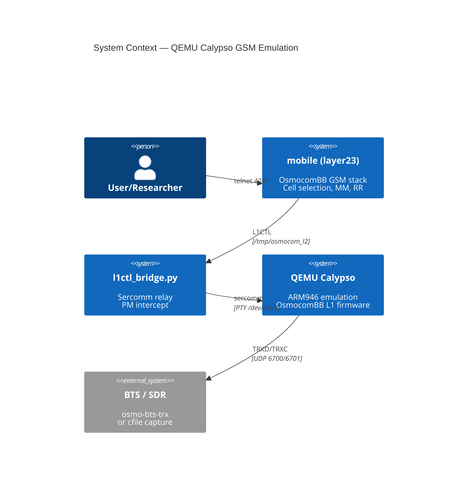

---

## 2. Component Diagram

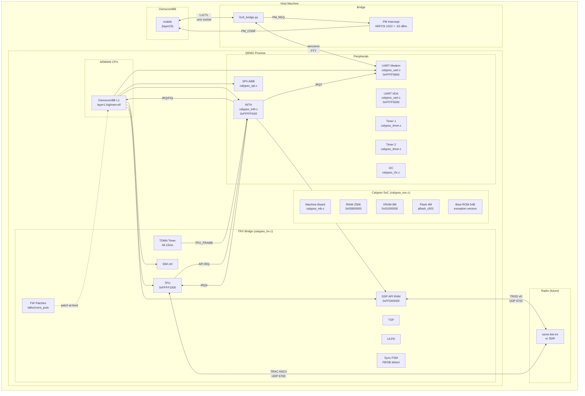

---

## 3. L1CTL Message Sequence

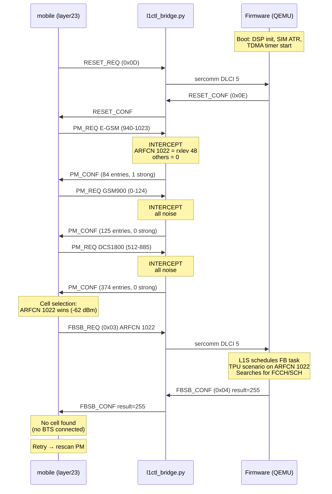

---

## 4. Firmware Boot Sequence

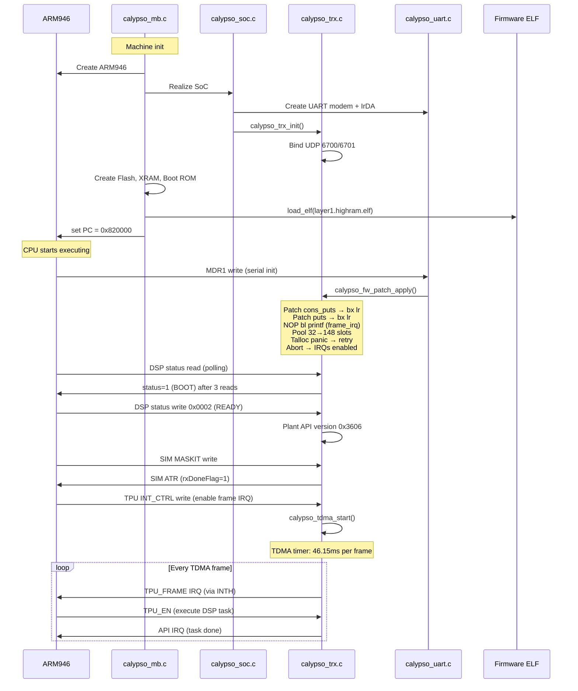

---

## 5. DSP Task Processing

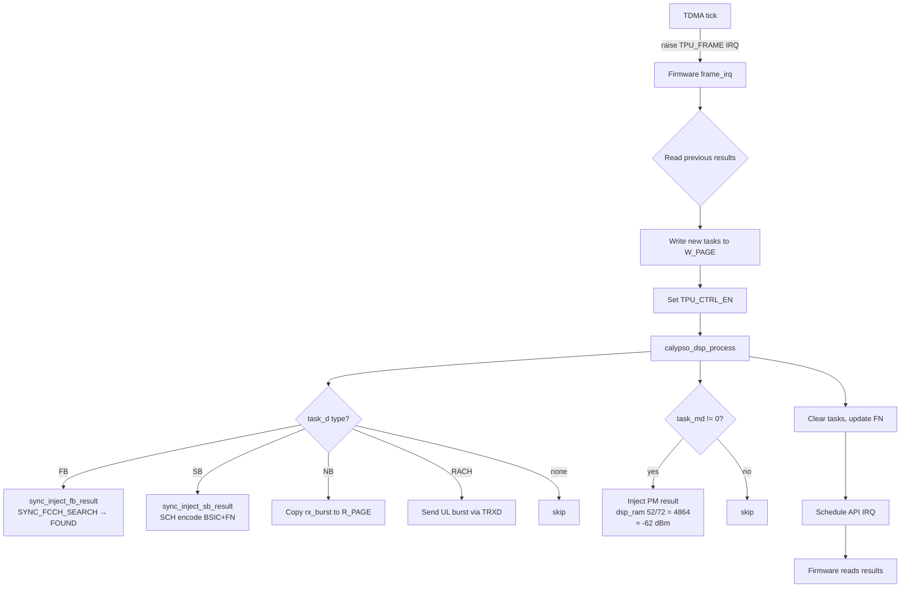

---

## 6. INTH Interrupt Flow

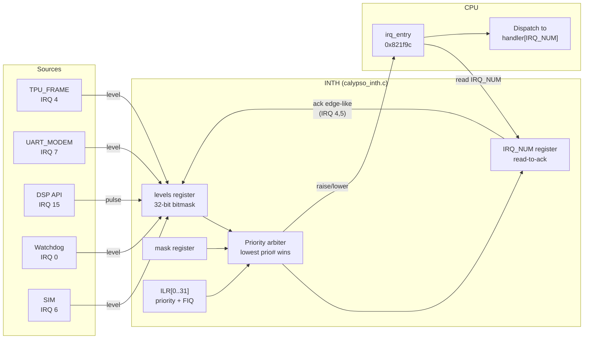

---

## 7. UART TX Burst Drain

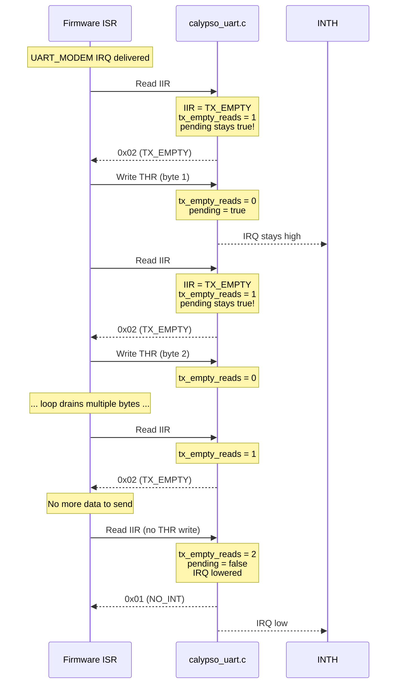

---

## 8. Sync State Machine

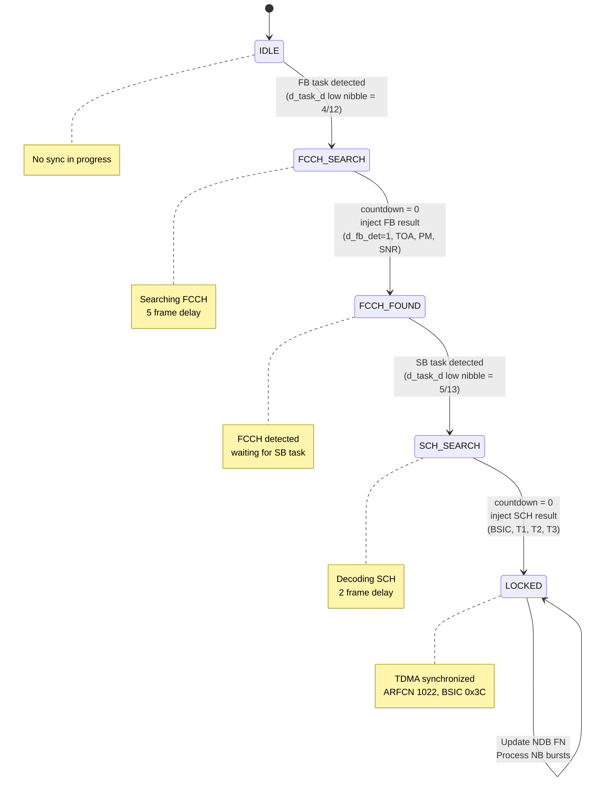

---

## 9. PM Bridge Intercept

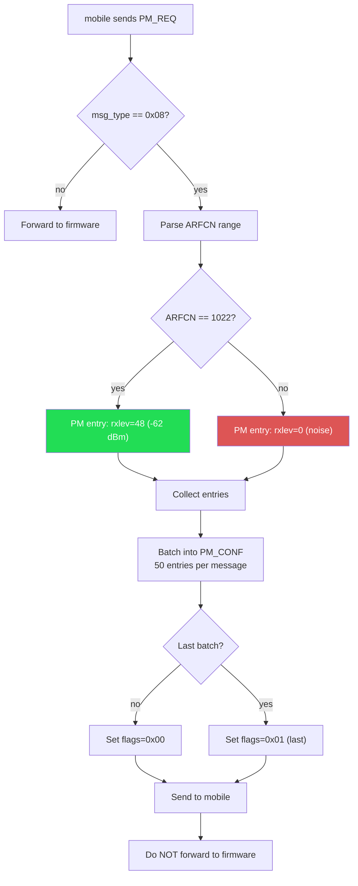

---

## 10. Firmware Patch Points

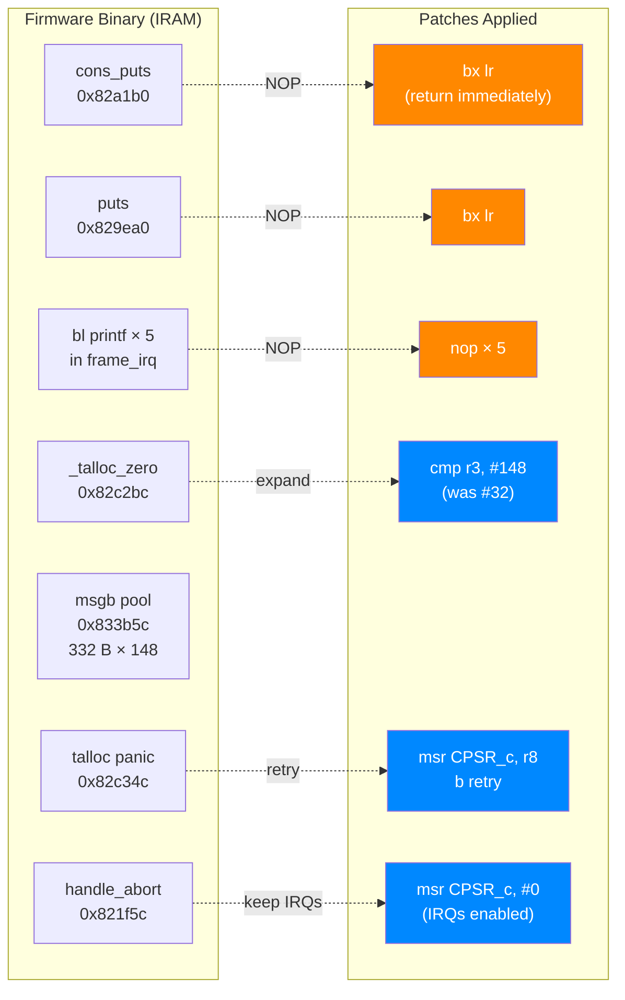

---

## 11. Class Diagram (QEMU Device Types)

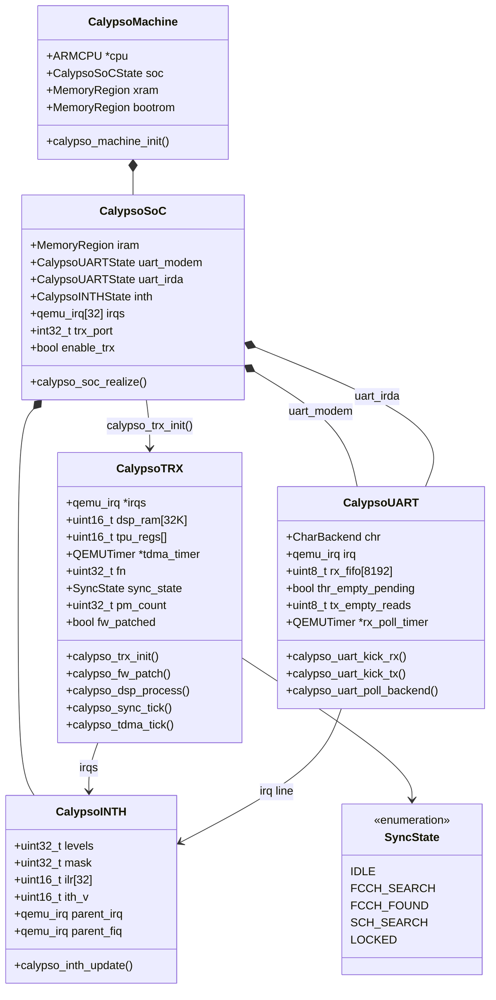

---

## 12. Deployment Diagram

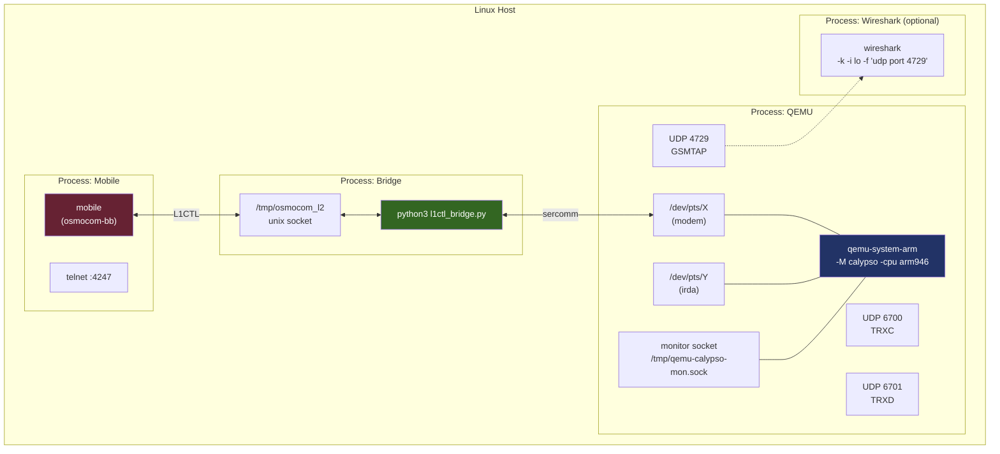
