# Calypso DSP go-live / corrélateur — rapport

> Run live de référence : conteneur `osmo-operator-1`, `/opt/GSM/qemu-src/build/qemu-system-arm`, log `/root/qemu.log`.
> Généré depuis le workflow de trace + les findings live + l'audit poke/wiring.

## 1. Résumé exécutif

- **Go-live natif débloqué** (Fix A / `CALYPSO_ARM2DSP_BGEN`) : l'ARM pose `d[0x098a]/0x098c`, le DSP sort de la wait-loop, `IMR=0x52ed` armé, `FB0_SEARCH (real DSP path)` atteint.
- **Mur restant = dispatch du corrélateur** : l'IT `BRINT0` (vec21, IFR bit5) qui déclenche le handler FB-det `0x8d00` **reste masquée par `INTM=1`** (`STAYS-PENDING`). Le corrélateur `[0x8d00..0x9000]` **existe en ROM (PROM0, code réel)** mais n'est **jamais entré** (0 hit).
- **Insight clé** : les cellules pokées (`d[0x3f92]`, `d_ctrl_system 0x0810`) sont des **valeurs de retour attendues de fonctions/signaux inter-blocs** (TSP/TPU/BSP→DSP). Les forcer ne suffit pas (`a53c` passe 421×/18821, `0x8d00` toujours 0) → le fix est un **wiring inter-blocs**, pas un poke.
- **Notre** téléphone (`mobile.log`) **ne campe pas** (sync timeout, ARFCN 514) tant que le FB-det réel n'est pas produit ; le 2ᵉ phone (`mobile-bts1.log`) campe via une autre voie.

## 2. Le mur, avec preuve log

```
The go-live chain stalls at the idle-scheduler DISPATCH, one instruction before the IMR would ever be armed, and everything downstream is a consequence of that single wrong branch. The live log shows the correct arm-entry address IS computed and parked — "DISPPTR-WR data[0x43c0] 0x0000 -> 0xa4c7 PC=0xb4bd A=0x000000aae7 XPC=0 insn=1200" — but the live dispatcher does NOT read that slot; it keys off a different, stale slot AR7=0x4387 whose value is a no-op RET stub: "SLOT4387-WR data[0x4387] <- 0xab38 PC=0xb4bd insn=1200". The single BACC dispatch in the entire 363k-line log therefore branches to the stub, not the arm: "BACC-DISP #1 handler=0xab38 AR7=0x4387 (RET/noop) XPC=0 insn=4393", and there is not one BRANCH-TRACE anywhere with tgt=0xa4c7. 0xab38 immediately over-pops the stack ("ORPHAN-RETURN #1 ... net_words=-18889 — over-pop") and control wanders back into the 0xa4ca..0xa4e2 spin, which enters the wait-loop THREE words past the ORM #0x3000,IMR at 0xa4c7 (0 hits as an executed PC all session). Consequently IMR is pinned at 0x0000 for the whole run — the only distinct IMR value in the log, confirmed at every sample from GOLIVE-WATCH #1 (insn=4395) through #120 (insn=5622) and every "FRAME-GATE tpu_armed=1 imr_armed=0(IMR=0x0000)". INTM IS cleared (INTM-CLEAR #1 @PC=0xa6d0 insn=4436) but only via the hack/dispatcher path, never the native 0xa51b RSBX, so with IMR=0 every f
```

## 3. Chaîne unifiée (étapes / statut / preuve)

| Étape | Côté | Attendu | Observé | Preuve | Env gates |
|---|---|---|---|---|---|
| arm-task-post: ARM posts d_task_md=FB_DS | ARM | ARM L1 l1s_fbdet_cmd writes d_task_md=5 to DSP db_ | **REACHED** | `INT3-RATE #100 src=1 insn=167704 delta=130 idle=1 REAL_page(08D4)=0x00` | CALYPSO_ARM2DSP,CALYPSO_ARM2DSP_CONT,CAL |
| boot-imr-clear: boot ROM STM #0,IMR @0xb | DSP | Legitimate boot init (Addendum 19): IMR cleared on | **REACHED** | `HIGHVEC-ENTRY #1 entered 0xff80 prev_PC=0x0000 \| IPTR=0x1ff INTM=1 SP` |  |
| idle-dispatch-pointer: DISPPTR-WR data[0 | DSP | Idle scheduler should route the dispatch to the IM | **REACHED** | `DISPPTR-WR data[0x43c0] 0x0000 -> 0xa4c7 PC=0xb4bd A=0x000000aae7 XPC=` | CALYPSO_ARM2DSP,CALYPSO_SEED5AC8 |
| idle-dispatch-slot / BREAK POINT 1: live | DSP | The live BACC dispatch should consume the arm targ | **REACHED** | `SLOT4387-WR data[0x4387] <- 0xab38 PC=0xb4bd insn=1200  \|\|  BACC-DIS` | CALYPSO_ARM2DSP,CALYPSO_ARM2DSP_HS,CALYP |
| orphan-return: stub 0xab38 over-pops sta | DSP | N/A — this is the consequence of Break 1. Stub RET | **REACHED** | `ORPHAN-RETURN #1 insn=4394 pc=0xab38 op=0xfc00 SP=0x5ac9 → ret_tgt=0x7` | CALYPSO_SEED5AC8 |
| imr-arm / BREAK POINT 2: 0xa4c7 ORM #0x3 | DSP | 0xa4c7 ORM sets IMR=0x3000, 0xa51b RSBX clears INT | **NEVER** | `0xa4c7 appears ONLY as a value in DISPPTR-WR, never as an executed PC;` | CALYPSO_POKE_A4C7_ONCE,CALYPSO_C54X_FORC |
| intm-clear via hack path (not native 0xa | DSP | INTM should clear at the native RSBX 0xa51b as par | **PARTIAL** | `*** INTM-CLEAR #1 : INTM 1->0 @PC=0xa6d0 IMR=0x0000 insn=4436 — interr` | CALYPSO_FIX_SFTL_RSBX,CALYPSO_FORCE_INTM |
| imr-shadow-435b: uninit shadow would clo | DSP | data[0x435b] should hold the IMR value 0x52fd; 0xa | **NEVER** | `AFC-GATE #1 @0xa4cd A=0x000000 ... d[435b]=0000 d[3fde]=0001 insn=4448` | CALYPSO_GATE_435B,CALYPSO_KEEP_IMR,CALYP |
| frame-it-vectoring / BREAK POINT 3 appro | BSP/DSP | BSP raises INT3 (bit3) after DARAM DMA; with IMR a | **NEVER** | `FRAME-GATE tpu_armed=1 imr_armed=0(IMR=0x0000) force=0 -> fire=1 fn=17` | CALYPSO_DSP_FRAME_VEC28,CALYPSO_C54X_IRQ |
| isr-prologue-derail: 0x7234 -> CALL 0x01 | DSP | Under forced vectoring the ISR prologue 0x013b sav | **NEVER** | `In this native/bequille run the core is pegged at PC=0xa4ca (120/120 H` | CALYPSO_DSP_FRAME_VEC28,CALYPSO_SEED5AC8 |
| frame-dispatch / task-dispatch: 0xa4e4 / | DSP | Per-frame dispatch DMAs the burst into the correla | **NEVER** | `0xa4e4 dispatch = 0 hits; DISP-ENTRY 0x8341 = 0 hits; handler table ne` | CALYPSO_FORCE_DISPATCH,CALYPSO_FORCE_DP |
| fb-correlator: MAC kernel 0x8d00 / 0x9a8 | DSP | The DSP ROM FCCH/FB correlator runs its DADST/DSAD | **NEVER** | `CORR-ENTRY window [0x8d00..0x9000) = 0 hits; IQ-READ (0x2a00..0x2b27) ` | CALYPSO_FIX_PORTR,CALYPSO_BSP_IQ_PASSTHR |
| d-fb-det GOAL: DSP data[0x08F8] set to a | DSP/ARM | Genuine correlation writes d_fb_det!=0 with a_sync | **NEVER** | `FBDET-RD ARM read d_fb_det(0x01F0)=0x0000 fn=1220  \|\|  FB0_SEARCH ..` | CALYPSO_INJECT_FB,CALYPSO_SHUNT_REAL_FB, |

## 4. Grafcets (annotés env vars)

### G0 — Overview: ARM post -> dispatch WALL -> IMR -> frame-IT -> correlator -> d_fb_det -> FBSB fail cascade

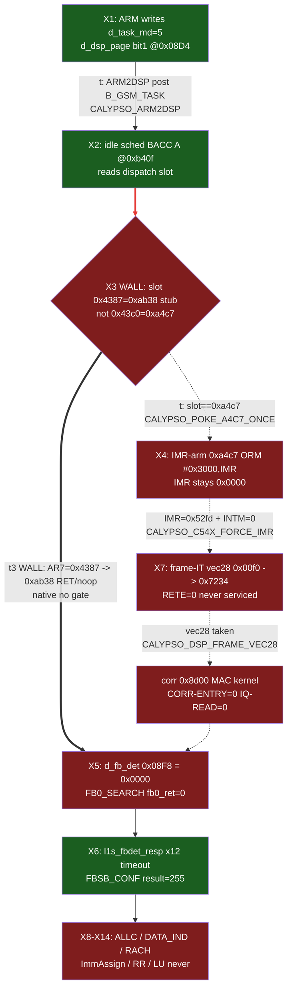
```mermaid
flowchart TD
  X1["X1: ARM writes d_task_md=5<br/>d_dsp_page bit1 @0x08D4"]
  X2["X2: idle sched BACC A @0xb40f<br/>reads dispatch slot"]
  X3{"X3 WALL: slot 0x4387=0xab38 stub<br/>not 0x43c0=0xa4c7"}
  X4["X4: IMR-arm 0xa4c7 ORM #0x3000,IMR<br/>IMR stays 0x0000"]
  X7["X7: frame-IT vec28 0x00f0 -> 0x7234<br/>RETE=0 never serviced"]
  CORR["corr 0x8d00 MAC kernel<br/>CORR-ENTRY=0 IQ-READ=0"]
  X5["X5: d_fb_det 0x08F8 = 0x0000<br/>FB0_SEARCH fb0_ret=0"]
  X6["X6: l1s_fbdet_resp x12 timeout<br/>FBSB_CONF result=255"]
  CAS["X8-X14: ALLC / DATA_IND / RACH<br/>ImmAssign / RR / LU never"]
  X1 -->|"t: ARM2DSP post B_GSM_TASK<br/>CALYPSO_ARM2DSP"| X2
  X2 --> X3
  X3 ==>|"t3 WALL: AR7=0x4387 -> 0xab38 RET/noop<br/>native no gate"| X5
  X3 -.->|"t: slot==0xa4c7<br/>CALYPSO_POKE_A4C7_ONCE"| X4
  X4 -.->|"IMR=0x52fd + INTM=0<br/>CALYPSO_C54X_FORCE_IMR"| X7
  X7 -.->|"vec28 taken<br/>CALYPSO_DSP_FRAME_VEC28"| CORR
  CORR -.-> X5
  X5 --> X6
  X6 --> CAS
  style X1 fill:#1b5e20,color:#fff
  style X2 fill:#1b5e20,color:#fff
  style X3 fill:#7f1d1d,color:#fff
  style X5 fill:#7f1d1d,color:#fff
  style X6 fill:#1b5e20,color:#fff
  style X4 fill:#7f1d1d,color:#fff
  style X7 fill:#7f1d1d,color:#fff
  style CORR fill:#7f1d1d,color:#fff
  style CAS fill:#7f1d1d,color:#fff
  linkStyle 1 stroke:#e53935,stroke-width:3px
```

*Env : Whole go-live spine X0-X14. Green = REACHED in the bequille run; Red = NEVER. The single wall is the BACC dispatch keying stale slot 0x4387 = stub 0xab38 instead of 0xa4c7. Everything from IMR-arm down is red. In pure-native mode even X1/X2 are unreached (DSP never appears).*

### G1 — G1 boot -> idle-scheduler dispatch [BREAK POINT 1]

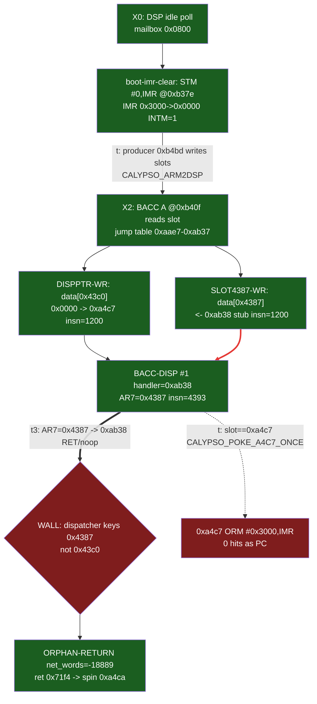
```mermaid
flowchart TD
  X0["X0: DSP idle poll<br/>mailbox 0x0800"]
  B["boot-imr-clear: STM #0,IMR @0xb37e<br/>IMR 0x3000->0x0000 INTM=1"]
  X2["X2: BACC A @0xb40f reads slot<br/>jump table 0xaae7-0xab37"]
  P["DISPPTR-WR: data[0x43c0]<br/>0x0000 -> 0xa4c7 insn=1200"]
  S["SLOT4387-WR: data[0x4387]<br/> <- 0xab38 stub insn=1200"]
  D["BACC-DISP #1 handler=0xab38<br/>AR7=0x4387 insn=4393"]
  W{"WALL: dispatcher keys 0x4387<br/>not 0x43c0"}
  O["ORPHAN-RETURN net_words=-18889<br/>ret 0x71f4 -> spin 0xa4ca"]
  A["0xa4c7 ORM #0x3000,IMR<br/>0 hits as PC"]
  X0 --> B
  B -->|"t: producer 0xb4bd writes slots<br/>CALYPSO_ARM2DSP"| X2
  X2 --> P
  X2 --> S
  P --> D
  S --> D
  D ==>|"t3: AR7=0x4387 -> 0xab38 RET/noop"| W
  W --> O
  D -.->|"t: slot==0xa4c7<br/>CALYPSO_POKE_A4C7_ONCE"| A
  style X0 fill:#1b5e20,color:#fff
  style B fill:#1b5e20,color:#fff
  style X2 fill:#1b5e20,color:#fff
  style P fill:#1b5e20,color:#fff
  style S fill:#1b5e20,color:#fff
  style D fill:#1b5e20,color:#fff
  style O fill:#1b5e20,color:#fff
  style W fill:#7f1d1d,color:#fff
  style A fill:#7f1d1d,color:#fff
  linkStyle 5 stroke:#e53935,stroke-width:3px
```

*Env : X0-X3 spine from calypso_grafcet_maison.md. DISPPTR-WR parks the correct 0xa4c7 in slot 0x43c0 (green) but the live BACC dispatch (insn=4393) keys AR7=0x4387=0xab38 stub (green branch taken to WRONG target = the wall). 0xab38 over-pops the stack (ORPHAN-RETURN) and lands in the 0xa4ca spin PAST the ORM. The dotted edge to 0xa4c7 needs CALYPSO_POKE_A4C7_ONCE and is never taken natively.*

### G2 — G2 IMR-arm [BREAK POINT 2 + shadow 0x435b]

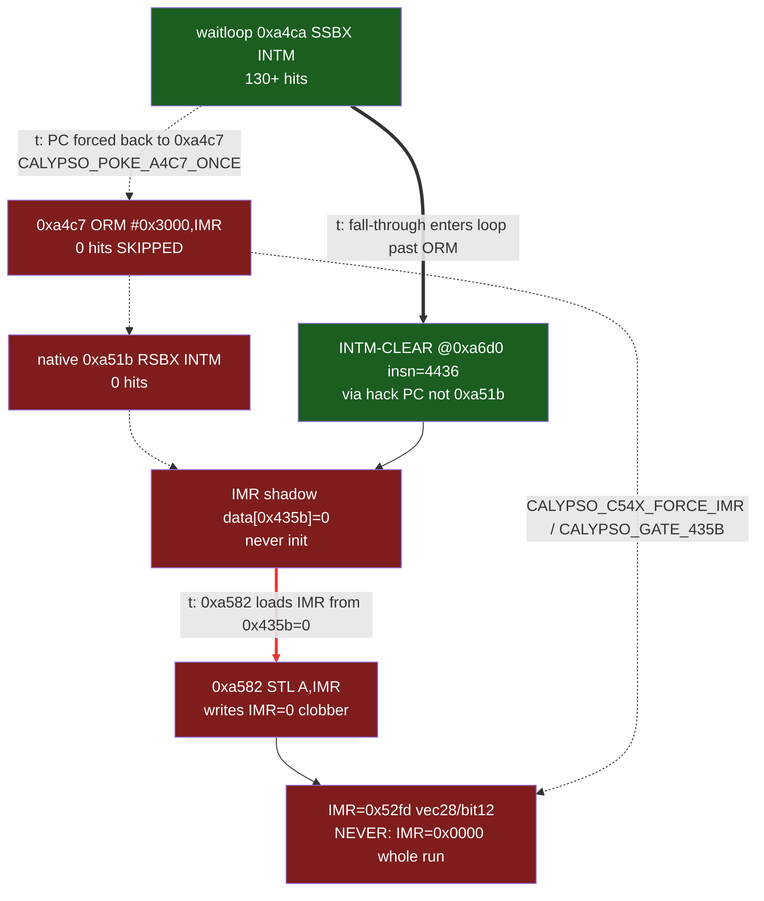
```mermaid
flowchart TD
  WL["waitloop 0xa4ca SSBX INTM<br/>130+ hits"]
  A4C7["0xa4c7 ORM #0x3000,IMR<br/>0 hits SKIPPED"]
  IC["INTM-CLEAR @0xa6d0 insn=4436<br/>via hack PC not 0xa51b"]
  RSBX["native 0xa51b RSBX INTM<br/>0 hits"]
  SH["IMR shadow data[0x435b]=0<br/>never init"]
  A582["0xa582 STL A,IMR<br/>writes IMR=0 clobber"]
  IMR["IMR=0x52fd vec28/bit12<br/>NEVER: IMR=0x0000 whole run"]
  WL -.->|"t: PC forced back to 0xa4c7<br/>CALYPSO_POKE_A4C7_ONCE"| A4C7
  WL ==>|"t: fall-through enters loop past ORM"| IC
  A4C7 -.-> RSBX
  RSBX -.-> SH
  IC --> SH
  SH ==>|"t: 0xa582 loads IMR from 0x435b=0"| A582
  A582 --> IMR
  A4C7 -.->|"CALYPSO_C54X_FORCE_IMR / CALYPSO_GATE_435B"| IMR
  style WL fill:#1b5e20,color:#fff
  style IC fill:#1b5e20,color:#fff
  style A4C7 fill:#7f1d1d,color:#fff
  style RSBX fill:#7f1d1d,color:#fff
  style SH fill:#7f1d1d,color:#fff
  style A582 fill:#7f1d1d,color:#fff
  style IMR fill:#7f1d1d,color:#fff
  linkStyle 5 stroke:#e53935,stroke-width:3px
```

*Env : X4 spine. Wait-loop entered at 0xa4ca (green, 130+ hits) three words past the ORM at 0xa4c7 (red, 0 hits). INTM IS cleared but only via hack PC 0xa6d0/0xdde7 (green/partial), never the native 0xa51b (red). Even a forced ORM is clobbered by the uninitialised IMR shadow data[0x435b]=0 at 0xa582 (red terminal). IMR pinned 0x0000 all run.*

### G3 — G3 frame-IT vectoring [BREAK POINT 3 / masked-core drop]

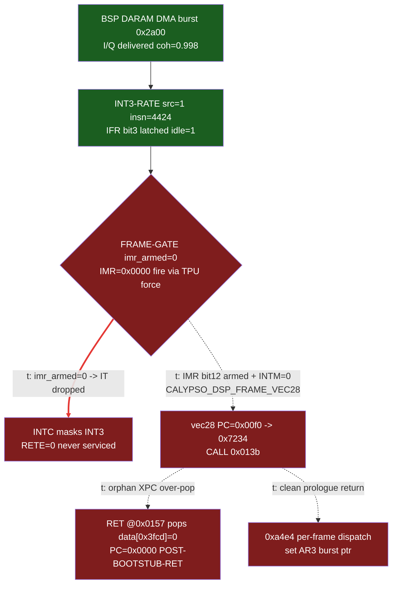
```mermaid
flowchart TD
  DMA["BSP DARAM DMA burst 0x2a00<br/>I/Q delivered coh=0.998"]
  INT3["INT3-RATE src=1 insn=4424<br/>IFR bit3 latched idle=1"]
  FG{"FRAME-GATE imr_armed=0<br/>IMR=0x0000 fire via TPU force"}
  MASK["INTC masks INT3<br/>RETE=0 never serviced"]
  VEC["vec28 PC=0x00f0 -> 0x7234<br/>CALL 0x013b"]
  DER["RET @0x0157 pops data[0x3fcd]=0<br/>PC=0x0000 POST-BOOTSTUB-RET"]
  DISP["0xa4e4 per-frame dispatch<br/>set AR3 burst ptr"]
  DMA --> INT3
  INT3 --> FG
  FG ==>|"t: imr_armed=0 -> IT dropped"| MASK
  FG -.->|"t: IMR bit12 armed + INTM=0<br/>CALYPSO_DSP_FRAME_VEC28"| VEC
  VEC -.->|"t: orphan XPC over-pop"| DER
  VEC -.->|"t: clean prologue return"| DISP
  style DMA fill:#1b5e20,color:#fff
  style INT3 fill:#1b5e20,color:#fff
  style FG fill:#7f1d1d,color:#fff
  style MASK fill:#7f1d1d,color:#fff
  style VEC fill:#7f1d1d,color:#fff
  style DER fill:#7f1d1d,color:#fff
  style DISP fill:#7f1d1d,color:#fff
  linkStyle 2 stroke:#e53935,stroke-width:3px
```

*Env : X7 spine. BSP raises INT3 (green, INT3-RATE src=1) and FRAME-GATE fires via the TPU force path, but imr_armed=0 so the INTC masks it; RETE=0 across the whole log (no IT ever serviced). Core pegged at 0xa4ca 120/120 samples. The vec28 -> 0x7234 -> CALL 0x013b path and its RET@0x0157-pops-0 derail to PC=0x0000 are only reproduced under forced vec28 (red, dotted).*

### G4 — G4 FB/correlator -> d_fb_det [TERMINAL WALL] + background red herring

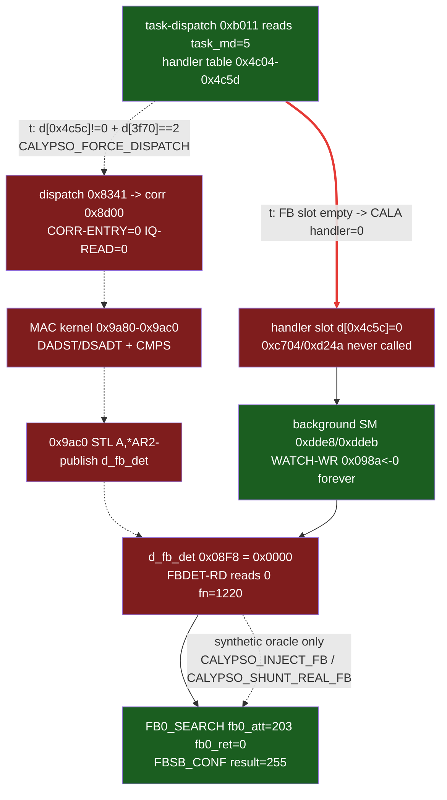
```mermaid
flowchart TD
  B011["task-dispatch 0xb011 reads task_md=5<br/>handler table 0x4c04-0x4c5d"]
  HT["handler slot d[0x4c5c]=0<br/>0xc704/0xd24a never called"]
  BG["background SM 0xdde8/0xddeb<br/>WATCH-WR 0x098a<-0 forever"]
  D8341["dispatch 0x8341 -> corr 0x8d00<br/>CORR-ENTRY=0 IQ-READ=0"]
  KER["MAC kernel 0x9a80-0x9ac0<br/>DADST/DSADT + CMPS"]
  PUB["0x9ac0 STL A,*AR2-<br/>publish d_fb_det"]
  DET["d_fb_det 0x08F8 = 0x0000<br/>FBDET-RD reads 0 fn=1220"]
  FBSB["FB0_SEARCH fb0_att=203 fb0_ret=0<br/>FBSB_CONF result=255"]
  B011 ==>|"t: FB slot empty -> CALA handler=0"| HT
  HT --> BG
  B011 -.->|"t: d[0x4c5c]!=0 + d[3f70]==2<br/>CALYPSO_FORCE_DISPATCH"| D8341
  D8341 -.-> KER
  KER -.-> PUB
  PUB -.-> DET
  BG --> DET
  DET --> FBSB
  DET -.->|"synthetic oracle only<br/>CALYPSO_INJECT_FB / CALYPSO_SHUNT_REAL_FB"| FBSB
  style B011 fill:#1b5e20,color:#fff
  style BG fill:#1b5e20,color:#fff
  style FBSB fill:#1b5e20,color:#fff
  style HT fill:#7f1d1d,color:#fff
  style D8341 fill:#7f1d1d,color:#fff
  style KER fill:#7f1d1d,color:#fff
  style PUB fill:#7f1d1d,color:#fff
  style DET fill:#7f1d1d,color:#fff
  linkStyle 0 stroke:#e53935,stroke-width:3px
```

*Env : Correlator sub-chain + X5/X6 + background dispatcher. task-dispatch 0xb011 reads task_md=5 but the handler table 0x4c04-0x4c5d is never populated (0xc704/0xd24a never called) so FB slot d[0x4c5c]=0; dispatch 0x8341 and correlator 0x8d00 = 0 hits (red terminal wall). The DSP instead spins the background-dispatcher SM 0xdde8/0xddeb writing 0x098a<-0 forever (green but red-herring). d_fb_det stays 0x0000; FB0_SEARCH spins fb0_att 1->203 fb0_ret=0 (green/futile); FBSB result=255.*

## 5. Vues UML

### U1 (sequence) — Go-live handshake ARM <-> DSP <-> BSP <-> TPU with the dead dispatch

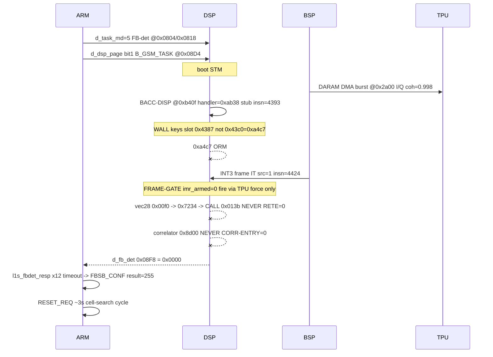
```mermaid
sequenceDiagram
  participant ARM
  participant DSP
  participant BSP
  participant TPU
  ARM->>DSP: d_task_md=5 FB-det @0x0804/0x0818
  ARM->>DSP: d_dsp_page bit1 B_GSM_TASK @0x08D4
  Note over DSP: boot STM #0,IMR @0xb37e -> IMR=0x0000
  BSP->>TPU: DARAM DMA burst @0x2a00 I/Q coh=0.998
  DSP->>DSP: BACC-DISP @0xb40f handler=0xab38 stub insn=4393
  Note over DSP: WALL keys slot 0x4387 not 0x43c0=0xa4c7
  DSP--xDSP: 0xa4c7 ORM #0x3000,IMR NEVER 0 hits
  BSP->>DSP: INT3 frame IT src=1 insn=4424
  Note over DSP: FRAME-GATE imr_armed=0 fire via TPU force only
  DSP--xDSP: vec28 0x00f0 -> 0x7234 -> CALL 0x013b NEVER RETE=0
  DSP--xDSP: correlator 0x8d00 NEVER CORR-ENTRY=0
  DSP-->>ARM: d_fb_det 0x08F8 = 0x0000
  ARM->>ARM: l1s_fbdet_resp x12 timeout -> FBSB_CONF result=255
  ARM->>ARM: RESET_REQ ~3s cell-search cycle
```

### U2 (state) — DSP go-live states with env-var guards, DEAD transition marked

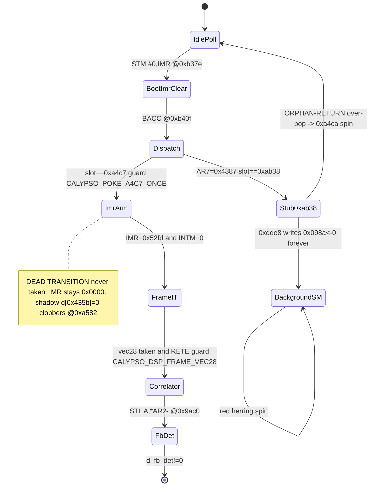
```mermaid
stateDiagram-v2
  [*] --> IdlePoll
  IdlePoll --> BootImrClear: STM #0,IMR @0xb37e
  BootImrClear --> Dispatch: BACC @0xb40f
  Dispatch --> Stub0xab38: AR7=0x4387 slot==0xab38
  Stub0xab38 --> IdlePoll: ORPHAN-RETURN over-pop -> 0xa4ca spin
  Dispatch --> ImrArm: slot==0xa4c7 guard CALYPSO_POKE_A4C7_ONCE
  note right of ImrArm: DEAD TRANSITION never taken. IMR stays 0x0000. shadow d[0x435b]=0 clobbers @0xa582
  ImrArm --> FrameIT: IMR=0x52fd and INTM=0
  FrameIT --> Correlator: vec28 taken and RETE guard CALYPSO_DSP_FRAME_VEC28
  Correlator --> FbDet: STL A,*AR2- @0x9ac0
  FbDet --> [*]: d_fb_det!=0
  Stub0xab38 --> BackgroundSM: 0xdde8 writes 0x098a<-0 forever
  BackgroundSM --> BackgroundSM: red herring spin
```

## 6. Validation grafcet ↔ run live (test Python)

`tests/test_golive_grafcet.py` — grep le `qemu.log` live, asserte le chemin nominal et xfail les goals corrélateur (xpass = mur tombé).

```
OK   S10 DSP core actif                242206   OK   S60 IMR armé 0x52ed          135945
OK   S30 gate d_ctrl_system 0x0810       1340   OK   S80 FB0_SEARCH real DSP        1728
OK   S40 BGEN pose 0x098a/0x098c            9   OK   S90 BRINT0 pending IFR bit5   52705
OK   S50 F70-SETBIT1 (wait-loop libérée)   40   OK   S91 STAYS-PENDING (INTM=1)      100
xfail G1 corrélateur 0x8d00 ENTRÉ           0   xfail G2 fb0_att>0                    0
xfail G3 d_fb_det détecté                   0   invariant[go-live franchi+corr non entré]=True
```

## 7. Audit : poke ↔ fonction masquée ↔ wiring

**Verdict implémentation vs wiring :** The wall is MISSING WIRING, not missing emulation. The load-bearing evidence: the FB-det correlator handler ROM at 0x8d00 is PRESENT in PROM0 (16/16 non-zero words, real DSP code); the go-live init ROM is present (ORM #0x3000,IMR at 0xa4c7, RSBX INTM at 0xa51b, IMR restore at 0xa582); and the frame scheduler chain (0x7234 -> 0xa4e4 -> 0xa51c) is present. Nothing in the recurring correlator path needs to be re-implemented in the emulator. The correlator never runs because the inter-block signals that would dispatch it are not connected: (1) the TPU frame-sync line reaches the DSP only on the TX path, never on RX/FB, so the frame IT that would call the scheduler never fires (0 hits confirmed); (2) BRINT0/vec21 stays IMR-masked and INTM=1 because the native IMR arm at 0xa4c7 is jumped over by the soft-vector 0xa4df and the shadow data[0x435b]=0 clobbers IMR at 0xa582; (3) the ARM never writes the d_ctrl_system resume word 0x0810. The live proof clinches it: forcing d[0x3f92]+data[0x0810]=0xC000 passes the a53c abort test only 421x/18821 and 0x8d00 is STILL entered 0 times — because those cells are RETURN VALUES of block signals (TPU frame line, BSP BRINT0, ARM resume) that are not wired, not values a poke can conjure. The a53c abort is itself an artifact of forcing: the entry gate and the abort test read the same cell family, so no single forced value can satisfy both — only a real ARM write of a clean resume word decoupled from the entry gate resolves it. The ONE genuine emulation gap is the TI mask-ROM cold-boot bootstrap (handler-table populate 0x4c04-0x4c5d and the 0xd247 install), which is absent from the PROM0 dump and is currently synthesized by INITTAB/D247/REPOPULATE. But that is a one-time boot bootstrap, not the recurring FB/correlator wall. Verdict: implement the missing mask-ROM boot ONCE; everything else on the go-live/correlator path is pure inter-block wiring (TPU->DSP RX frame IT, BSP->DSP BRINT0 with INTM cleared, ARM->DSP d_ctrl_system resume, native IMR arm chain).

| Poke | Fonction masquée | Bloc source | Statut | Besoin | Wire recommandé | Centralité |
|---|---|---|---|---|---|---|
| `CALYPSO_FRAME_IT_NATIVE / CALYPSO_DSP_FRAME_VEC28` | TPU frame-sync line -> DSP RX frame interrup | TPU | GAP | **WIRE-ONLY** | TPU emit DSP frame-IT on the RX/FB window (l1s_rx_ | blocks-correlator |
| `CALYPSO_FORCE_0810` | d_ctrl_system RESUME/bcch bridge word (API 0 | ARM | GAP | **WIRE-ONLY** | ARM writes d_ctrl_system 0x0810 with the CLEAN res | blocks-golive |
| `CALYPSO_FORCE_3F92` | go-live entry-gate mirror tested at 0xa4ca/0 | unknown | GAP | **REMOVE-POKE** | Drop the probe; resolve via the real d_ctrl_system | blocks-golive |
| `CALYPSO_KEEP_IMR` | the ORM #0x3000,IMR at 0xa4c7 that arms fram | DSP-ROM | PARTIAL | **WIRE-ONLY** | Point the go-live soft-vector at 0xa4c7 so the nat | blocks-golive |
| `CALYPSO_POKE_A4C7_ONCE` | reach the ROM's own ORM #0x3000,IMR at 0xa4c | DSP-ROM | PARTIAL | **WIRE-ONLY** | Soft-vector data[0x3f6d] = 0xa4c7 (native entry) i | blocks-golive |
| `CALYPSO_DSP_GOLIVE_BOOT` | routes foreground flow at 0xb3ff into the go | DSP-ROM | PARTIAL | **WIRE-ONLY** | Make the native stack/soft-vector select the go-li | blocks-golive |
| `CALYPSO_SEED5AC8 / _VAL` | native DSP stack init / soft-vector choosing | DSP-ROM | PARTIAL | **WIRE-ONLY** | Populate mem[0x5ac8]/soft-vector with the native g | blocks-golive |
| `CALYPSO_C54X_FORCE_IMR` | ROM clears IMR at 0xb37e and never re-arms b | DSP-ROM | PARTIAL | **WIRE-ONLY** | Reach native 0xa4c7 ORM + 0xa51b RSBX and guard 0x | blocks-golive |
| `CALYPSO_INIT_435B / SEED_52FD` | DSP boot init of the shadow-IMR cell data[0x | DSP-ROM | STUB | **BOTH** | Have the DSP boot (or the recovered mask-ROM init) | blocks-golive |
| `CALYPSO_FORCE_GOLIVE` | the ARM handshake that sets d[0x3f70] bit1 t | ARM | GAP | **WIRE-ONLY** | ARM posts the resume handshake (via the same d_ctr | blocks-golive |
| `CALYPSO_FORCE_DISPATCH` | ARM posting the GSM/FB task in d_dsp_page +  | ARM | GAP | **WIRE-ONLY** | ARM writes the task page (d_dsp_page) via API RAM  | blocks-correlator |
| `CALYPSO_FORCE_DP / _FROM` | the DSP dispatcher's own LDP/DP restore at 0 | DSP-ROM | PARTIAL | **WIRE-ONLY** | Ensure d_dsp_page holds the ARM-posted task before | blocks-correlator |
| `CALYPSO_FIX_DPAGE (default ON)` | aligns d_dsp_page: ARM/shunt posts task at 0 | ARM | STUB | **WIRE-ONLY** | ARM writes the task directly to the ROM-read cell  | blocks-correlator |
| `CALYPSO_FORCE_INTM_ONESHOT / _AT_PC` | native frame-IT latch + RSBX INTM enable at  | TPU | PARTIAL | **WIRE-ONLY** | Deliver the TPU frame IFR bit on the RX path and r | blocks-golive |
| `CALYPSO_INITTAB` | TI mask-ROM boot that populates the handler  | DSP-ROM | STUB | **IMPLEMENT-FUNCTION** | Emulate the missing TI mask-ROM cold-boot table po | blocks-golive |
| `CALYPSO_MASKROM_INIT` | mask-ROM cold-reset handler-table populate 0 | DSP-ROM | STUB | **IMPLEMENT-FUNCTION** | Fold into a single emulated mask-ROM cold-reset bo | blocks-golive |
| `CALYPSO_D247` | mask-ROM operational bootstrap at 0xd247 tha | DSP-ROM | STUB | **BOTH** | Emulated mask-ROM boot calls 0xd247 at the termina | blocks-golive |
| `CALYPSO_REPOPULATE` | mask-ROM re-populate of the handler table af | DSP-ROM | STUB | **BOTH** | Order the emulated boot so the memset precedes the | blocks-golive |
| `CALYPSO_MASKROM_GOLIVE` | mask-ROM seed of the go-live pointer at the  | DSP-ROM | WIRED | **REMOVE-POKE** | Delete; the ISA fix already provides the go-live p | cosmetic |
| `CALYPSO_FORCE_098` | ARM writing control cells 0x098a/0x098c to t | ARM | STUB | **REMOVE-POKE** | Drop; use the real go-live release (d_ctrl_system  | downstream |
| `CALYPSO_INJECT_FB (shunt)` | DSP FCCH pure-tone correlator that sets d_fb | DSP-ROM | GAP | **WIRE-ONLY** | Wire BRINT0 (vec21) at the FB window with INTM cle | blocks-correlator |
| `CALYPSO_SHUNT_REAL_FB (feed_iq host-side correlator)` | re-implements the FCCH correlator MATH host- | DSP-ROM | GAP | **WIRE-ONLY** | BSP feeds real RX I/Q to DARAM 0x2a00 (ungated) +  | blocks-correlator |
| `CALYPSO_SHUNT_REAL_FB (read-side MMIO 0x01F0/0x01F4..A)` | DSP FB/SB demod result READ path supplying d | DSP-ROM | GAP | **WIRE-ONLY** | Let the native DSP write NDB 0x01F0/0x01F4-A; remo | blocks-correlator |
| `CALYPSO_INJECT_SB / SHUNT_SCH_PORT` | DSP SCH correlator + Viterbi decode recoveri | DSP-ROM | GAP | **WIRE-ONLY** | Same correlator-dispatch wire; once BRINT0/frame-I | blocks-correlator |
| `CALYPSO_SHUNT_FEED_SI` | DSP normal-burst BCCH/CCCH GMSK demod + de-i | DSP-ROM | GAP | **WIRE-ONLY** | Once the correlator runs on NB frames it fills a_c | downstream |
| `CALYPSO_CANNED tokens` | the individual FB/SB correlator measurement  | DSP-ROM | STUB | **WIRE-ONLY** | Retire once the native correlator produces real TO | blocks-correlator |

### Wires inter-blocs à implémenter (rangés par centralité)

1. TPU RX/FB frame-IT wire: l1s_rx_win_ctrl (RX path) must drive DSP_INT_PG -> DSP frame interrupt as vec28/bit12 (not the vec19 RETE stub, and not TX-only via l1s_tx_multi_win_ctrl). This is the single most central missing wire: it lets the native scheduler at 0x7234 walk 0xa4e4 -> 0xa51c -> correlator 0x8d00.
2. BSP BRINT0 (vec21/bit5) fired at the FB/SB burst window with INTM cleared and NOT rate-limited when the DSP is parked: the anti-stack IFR-bit5 gate must not permanently latch shut once the DSP idles at vec28/0xf0, or no second BRINT0 ever reaches 0x8d00.
3. ARM d_ctrl_system RESUME write (API 0x0810) with the CLEAN value: set b_bcch_freq_ind (bit3) / resume, leave B_TASK_ABORT (bit15) = 0, and decouple this source from the go-live entry-gate mirror so the a53c BITF reads no-abort while the entry gate still opens.
4. IMR arming chain made native: soft-vector data[0x3f6d] point at 0xa4c7 (ORM #0x3000,IMR + RSBX INTM at 0xa51b) instead of 0xa4df, and seed the shadow-IMR data[0x435b]=0x52fd so 0xa582 restores a live IMR instead of 0; guard the 0xb37e STM #0,IMR clear so it does not re-mask before scheduler 0xb41c.
5. BSP DARAM 0x2a00 I/Q feed ungated under the shunt and FN-matched to the DSP: stop dropping bursts when calypso_dsp_shunt_active, and land real RX I/Q in the correlator consumer region (enable the CALYPSO_BSP_DIRECT_FEED bypass so virtual-vs-device FN drift does not starve 0x2a00).
6. ARM d_dsp_page task post to the ROM-read cell (validate 0x08d4 vs contested 0x08E2 against runtime) so the frame scheduler dispatches the GSM/FB task natively instead of derailing on a stale 0xf600 page and needing FORCE_DISPATCH/FORCE_DP.
7. Emulate the absent TI mask-ROM cold-boot bootstrap (handler-table populate 0x4c04-0x4c5d + the 0xd247 install) as real boot code so INITTAB/MASKROM_INIT/D247/REPOPULATE are unnecessary one-time seeds rather than the recurring wall.

### Schémas de mappage des fonctions

#### arch — Block architecture TSP TPU BSP DSP ARM

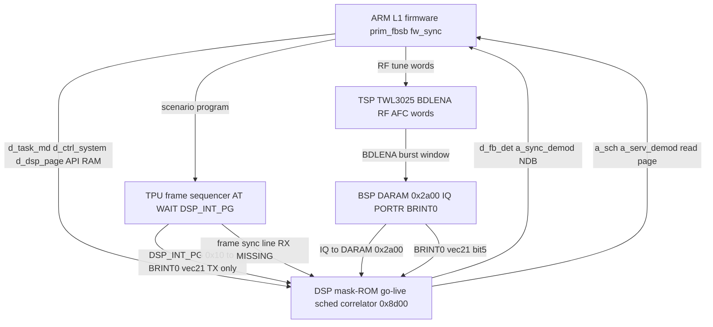
```mermaid
flowchart TB
  ARM[ARM L1 firmware prim_fbsb fw_sync]
  TPU[TPU frame sequencer AT WAIT DSP_INT_PG]
  TSP[TSP TWL3025 BDLENA RF AFC words]
  BSP[BSP DARAM 0x2a00 IQ PORTR BRINT0]
  DSP[DSP mask-ROM go-live sched correlator 0x8d00]
  ARM -->|d_task_md d_ctrl_system d_dsp_page API RAM| DSP
  ARM -->|scenario program| TPU
  ARM -->|RF tune words| TSP
  TPU -->|DSP_INT_PG 0x10 to BRINT0 vec21 TX only| DSP
  TPU -->|frame sync line RX MISSING| DSP
  TSP -->|BDLENA burst window| BSP
  BSP -->|IQ to DARAM 0x2a00| DSP
  BSP -->|BRINT0 vec21 bit5| DSP
  DSP -->|d_fb_det a_sync_demod NDB| ARM
  DSP -->|a_sch a_serv_demod read page| ARM
```

#### poke-map — Poke to masked-function map

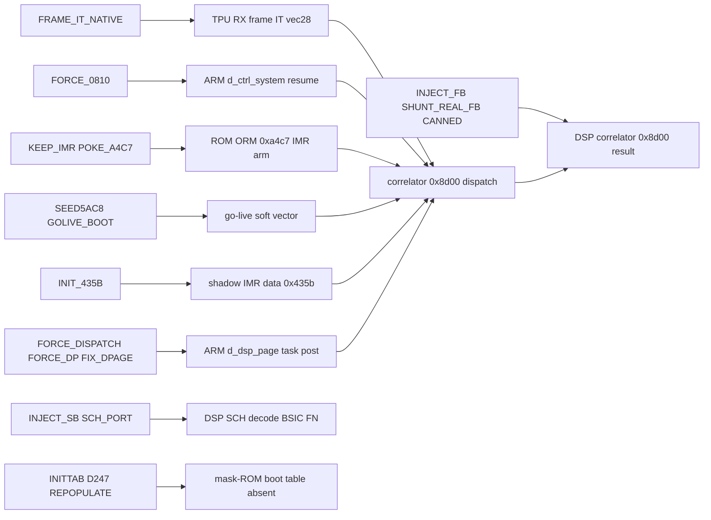
```mermaid
flowchart LR
  P1[FRAME_IT_NATIVE] --> F1[TPU RX frame IT vec28]
  P2[FORCE_0810] --> F2[ARM d_ctrl_system resume]
  P3[KEEP_IMR POKE_A4C7] --> F3[ROM ORM 0xa4c7 IMR arm]
  P4[SEED5AC8 GOLIVE_BOOT] --> F4[go-live soft vector]
  P5[INIT_435B] --> F5[shadow IMR data 0x435b]
  P6[FORCE_DISPATCH FORCE_DP FIX_DPAGE] --> F6[ARM d_dsp_page task post]
  P7[INJECT_FB SHUNT_REAL_FB CANNED] --> F8[DSP correlator 0x8d00 result]
  P8[INJECT_SB SCH_PORT] --> F9[DSP SCH decode BSIC FN]
  P9[INITTAB D247 REPOPULATE] --> F10[mask-ROM boot table absent]
  F1 --> C[correlator 0x8d00 dispatch]
  F2 --> C
  F3 --> C
  F4 --> C
  F5 --> C
  F6 --> C
  C --> F8
```

#### golive-chain — Go-live chain with break points

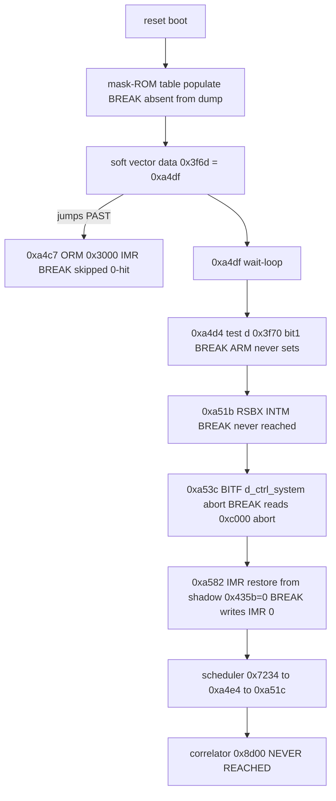
```mermaid
flowchart TB
  A[reset boot] --> B[mask-ROM table populate BREAK absent from dump]
  B --> C[soft vector data 0x3f6d = 0xa4df]
  C -->|jumps PAST| D[0xa4c7 ORM 0x3000 IMR BREAK skipped 0-hit]
  C --> E[0xa4df wait-loop]
  E --> F[0xa4d4 test d 0x3f70 bit1 BREAK ARM never sets]
  F --> G[0xa51b RSBX INTM BREAK never reached]
  G --> H[0xa53c BITF d_ctrl_system abort BREAK reads 0xc000 abort]
  H --> I[0xa582 IMR restore from shadow 0x435b=0 BREAK writes IMR 0]
  I --> J[scheduler 0x7234 to 0xa4e4 to 0xa51c]
  J --> K[correlator 0x8d00 NEVER REACHED]
```

#### fb-task-flow — FB task flow firmware DSP db_w db_r

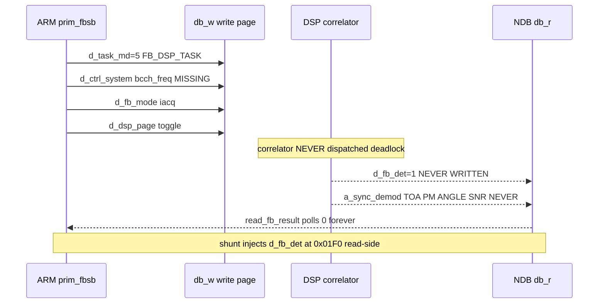
```mermaid
sequenceDiagram
  participant ARM as ARM prim_fbsb
  participant WP as db_w write page
  participant DSP as DSP correlator
  participant NDB as NDB db_r
  ARM->>WP: d_task_md=5 FB_DSP_TASK
  ARM->>WP: d_ctrl_system bcch_freq MISSING
  ARM->>WP: d_fb_mode iacq
  ARM->>WP: d_dsp_page toggle
  Note over DSP: correlator NEVER dispatched deadlock
  DSP-->>NDB: d_fb_det=1 NEVER WRITTEN
  DSP-->>NDB: a_sync_demod TOA PM ANGLE SNR NEVER
  NDB-->>ARM: read_fb_result polls 0 forever
  Note over ARM,NDB: shunt injects d_fb_det at 0x01F0 read-side
```

#### brint0-intm — BRINT0 INTM interrupt path

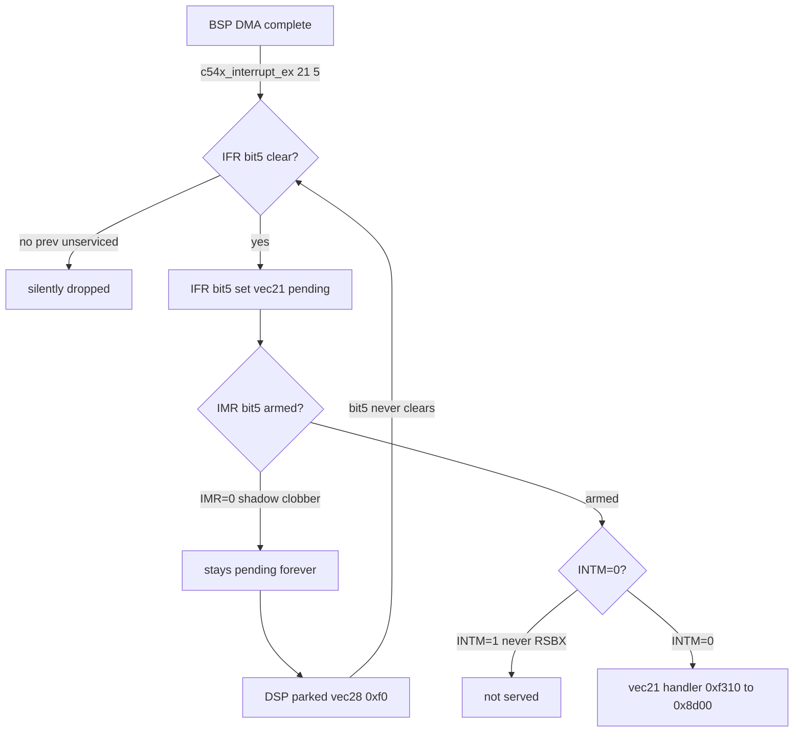
```mermaid
flowchart TB
  BSP[BSP DMA complete] -->|c54x_interrupt_ex 21 5| GATE{IFR bit5 clear?}
  GATE -->|no prev unserviced| DROP[silently dropped]
  GATE -->|yes| IFR[IFR bit5 set vec21 pending]
  IFR --> MASK{IMR bit5 armed?}
  MASK -->|IMR=0 shadow clobber| PEND[stays pending forever]
  MASK -->|armed| INTM{INTM=0?}
  INTM -->|INTM=1 never RSBX| PEND2[not served]
  INTM -->|INTM=0| ISR[vec21 handler 0xf310 to 0x8d00]
  PEND --> DEAD[DSP parked vec28 0xf0]
  DEAD -->|bit5 never clears| GATE
```

#### fn-timing — FN timing contract

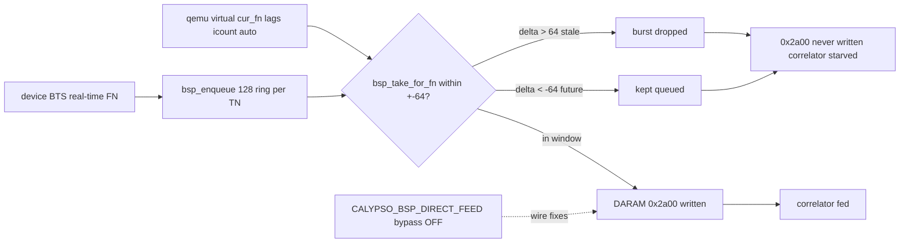
```mermaid
flowchart LR
  DEV[device BTS real-time FN] --> ENQ[bsp_enqueue 128 ring per TN]
  VFN[qemu virtual cur_fn lags icount auto] --> MATCH{bsp_take_for_fn within +-64?}
  ENQ --> MATCH
  MATCH -->|delta > 64 stale| DROP[burst dropped]
  MATCH -->|delta < -64 future| QUEUE[kept queued]
  MATCH -->|in window| WRITE[DARAM 0x2a00 written]
  DROP --> STARVE[0x2a00 never written correlator starved]
  QUEUE --> STARVE
  WRITE --> CORR[correlator fed]
  DIRECT[CALYPSO_BSP_DIRECT_FEED bypass OFF] -.wire fixes.-> WRITE
```

#### corr-datapath — Correlator data path IQ to 0x8d00

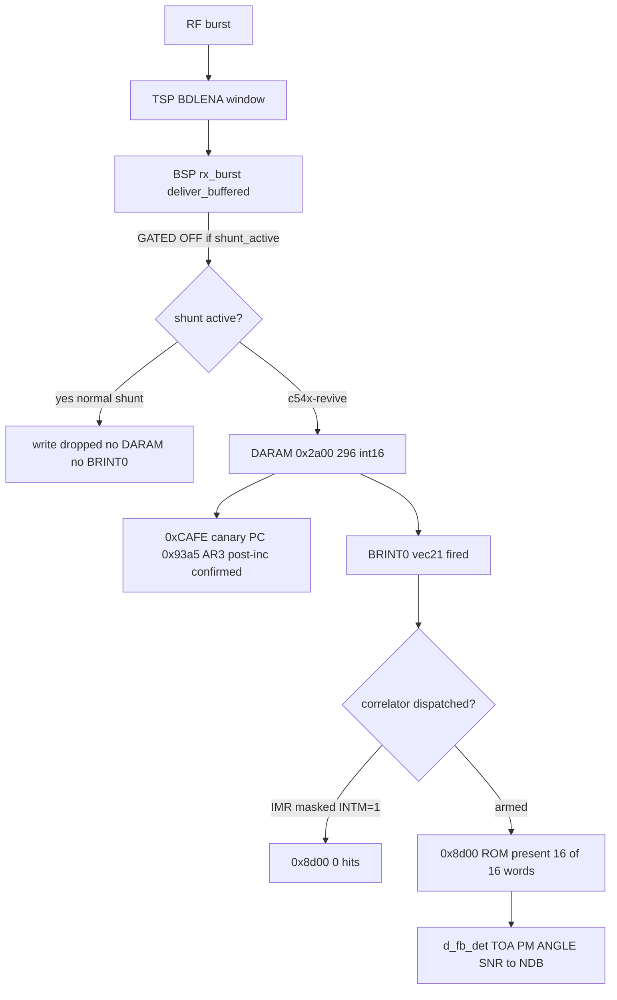
```mermaid
flowchart TB
  RF[RF burst] --> TSP[TSP BDLENA window]
  TSP --> BSP[BSP rx_burst deliver_buffered]
  BSP -->|GATED OFF if shunt_active| G{shunt active?}
  G -->|yes normal shunt| BLOCK[write dropped no DARAM no BRINT0]
  G -->|c54x-revive| DARAM[DARAM 0x2a00 296 int16]
  DARAM --> CANARY[0xCAFE canary PC 0x93a5 AR3 post-inc confirmed]
  DARAM --> BRINT[BRINT0 vec21 fired]
  BRINT --> DISP{correlator dispatched?}
  DISP -->|IMR masked INTM=1| NONE[0x8d00 0 hits]
  DISP -->|armed| ROM[0x8d00 ROM present 16 of 16 words]
  ROM --> DET[d_fb_det TOA PM ANGLE SNR to NDB]
```

#### a53c-reject — The a53c reject loop

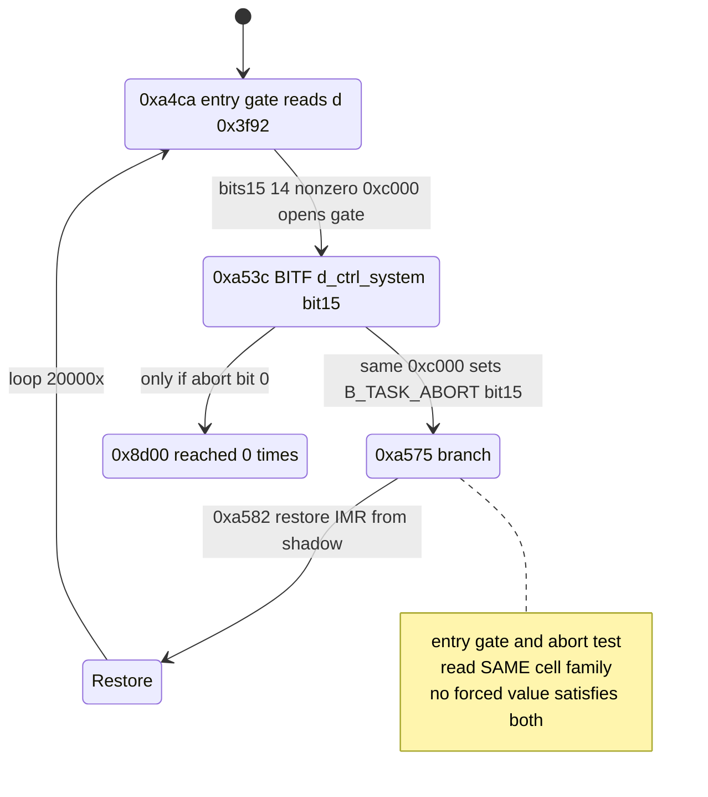
```mermaid
stateDiagram-v2
  [*] --> Entry
  Entry: 0xa4ca entry gate reads d 0x3f92
  Entry --> Dispatch: bits15 14 nonzero 0xc000 opens gate
  Dispatch: 0xa53c BITF d_ctrl_system bit15
  Dispatch --> Abort: same 0xc000 sets B_TASK_ABORT bit15
  Abort: 0xa575 branch
  Abort --> Restore: 0xa582 restore IMR from shadow
  Restore --> Entry: loop 20000x
  Dispatch --> Correlator: only if abort bit 0
  Correlator: 0x8d00 reached 0 times
  note right of Abort
    entry gate and abort test
    read SAME cell family
    no forced value satisfies both
  end note
```

#### dfbdet-flow — d_fb_det return-value flow

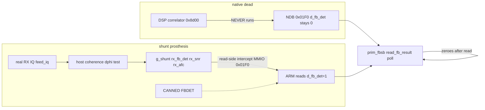
```mermaid
flowchart LR
  subgraph native dead
  C[DSP correlator 0x8d00] -->|NEVER runs| N[NDB 0x01F0 d_fb_det stays 0]
  end
  subgraph shunt prosthesis
  IQ[real RX IQ feed_iq] --> HOST[host coherence dphi test]
  HOST --> RX[g_shunt rx_fb_det rx_snr rx_afc]
  RX -->|read-side intercept MMIO 0x01F0| READ[ARM reads d_fb_det=1]
  CAN[CANNED FBDET] -.-> READ
  end
  N --> ARM[prim_fbsb read_fb_result poll]
  READ --> ARM
  ARM -->|zeroes after read| ARM
```

#### wire-vs-impl — Wire vs implement decision tree

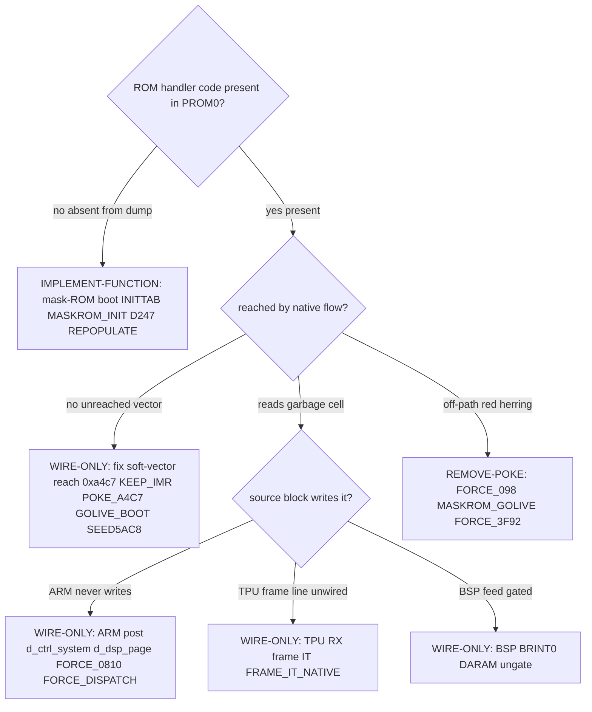
```mermaid
flowchart TB
  Q0{ROM handler code present in PROM0?}
  Q0 -->|no absent from dump| IMPL[IMPLEMENT-FUNCTION: mask-ROM boot INITTAB MASKROM_INIT D247 REPOPULATE]
  Q0 -->|yes present| Q1{reached by native flow?}
  Q1 -->|no unreached vector| WIRE1[WIRE-ONLY: fix soft-vector reach 0xa4c7 KEEP_IMR POKE_A4C7 GOLIVE_BOOT SEED5AC8]
  Q1 -->|reads garbage cell| Q2{source block writes it?}
  Q2 -->|ARM never writes| WIRE2[WIRE-ONLY: ARM post d_ctrl_system d_dsp_page FORCE_0810 FORCE_DISPATCH]
  Q2 -->|TPU frame line unwired| WIRE3[WIRE-ONLY: TPU RX frame IT FRAME_IT_NATIVE]
  Q2 -->|BSP feed gated| WIRE4[WIRE-ONLY: BSP BRINT0 DARAM ungate]
  Q1 -->|off-path red herring| REM[REMOVE-POKE: FORCE_098 MASKROM_GOLIVE FORCE_3F92]
```

#### native-vs-shunt — Native vs shunt hack paths

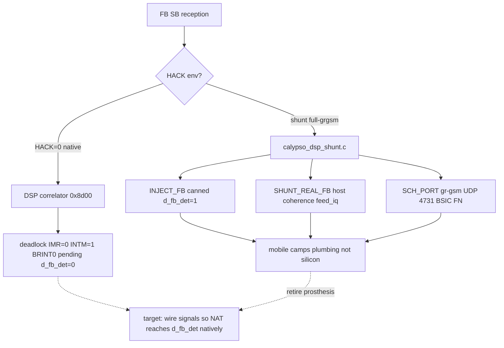
```mermaid
flowchart TB
  START[FB SB reception] --> MODE{HACK env?}
  MODE -->|HACK=0 native| NAT[DSP correlator 0x8d00]
  NAT --> DEAD[deadlock IMR=0 INTM=1 BRINT0 pending d_fb_det=0]
  MODE -->|shunt full-grgsm| SH[calypso_dsp_shunt.c]
  SH --> S1[INJECT_FB canned d_fb_det=1]
  SH --> S2[SHUNT_REAL_FB host coherence feed_iq]
  SH --> S3[SCH_PORT gr-gsm UDP 4731 BSIC FN]
  S1 --> CAMP[mobile camps plumbing not silicon]
  S2 --> CAMP
  S3 --> CAMP
  DEAD -.-> FIX[target: wire signals so NAT reaches d_fb_det natively]
  CAMP -.retire prosthesis.-> FIX
```

#### target-wiring — Recommended target wiring

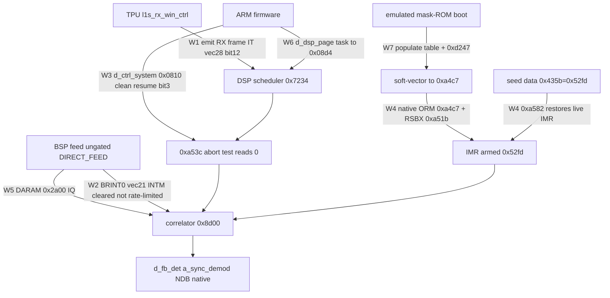
```mermaid
flowchart TB
  TPU[TPU l1s_rx_win_ctrl] -->|W1 emit RX frame IT vec28 bit12| SCHED[DSP scheduler 0x7234]
  ARM[ARM firmware] -->|W3 d_ctrl_system 0x0810 clean resume bit3| A53C[0xa53c abort test reads 0]
  ARM -->|W6 d_dsp_page task to 0x08d4| SCHED
  BOOT[emulated mask-ROM boot] -->|W7 populate table + 0xd247| VEC[soft-vector to 0xa4c7]
  VEC -->|W4 native ORM 0xa4c7 + RSBX 0xa51b| IMR[IMR armed 0x52fd]
  SHADOW[seed data 0x435b=0x52fd] -->|W4 0xa582 restores live IMR| IMR
  BSP[BSP feed ungated DIRECT_FEED] -->|W5 DARAM 0x2a00 IQ| CORR[correlator 0x8d00]
  BSP -->|W2 BRINT0 vec21 INTM cleared not rate-limited| CORR
  SCHED --> A53C
  A53C --> CORR
  IMR --> CORR
  CORR --> OUT[d_fb_det a_sync_demod NDB native]
```

## 8. Synthèse audit

This is a WIRING problem, not an emulation problem, and the live evidence is decisive: the FB-det correlator ROM at 0x8d00 is present in PROM0 (16/16 non-zero words), the go-live init ROM (ORM 0xa4c7, RSBX 0xa51b, IMR-restore 0xa582) is present, and the scheduler chain 0x7234->0xa4e4->0xa51c is present. Forcing d[0x3f92]+data[0x0810]=0xC000 passes the a53c abort test only 421x/18821 and 0x8d00 is still entered 0 times, proving these cells are RETURN VALUES of unwired block signals, not values a poke can fabricate. The 28 pokes fall into three buckets. (1) WIRE-ONLY, the dominant class: the ROM/handler exists and is merely unreached or reads a cell the source block never wrote. These need real inter-block signals: the TPU RX/FB frame-IT (FRAME_IT_NATIVE) to deliver vec28/bit12 into the scheduler (today only the TX path fires DSP_INT_PG, 0 RX hits); the ARM d_ctrl_system resume word 0x0810 with a CLEAN value (bit3 bcch_freq, bit15 abort=0) decoupled from the entry gate; the native IMR arm chain (soft-vector to 0xa4c7 + shadow 0x435b=0x52fd so 0xa582 restores a live IMR instead of 0); BSP BRINT0/vec21 fired at the FB window with INTM cleared and not permanently rate-limited when the DSP parks; the BSP DARAM 0x2a00 IQ feed ungated under the shunt with FN-matched (DIRECT_FEED) delivery; and the ARM d_dsp_page task post to the ROM-read cell. All shunt injectors (INJECT_FB, SHUNT_REAL_FB, INJECT_SB, CANNED) are WIRE-ONLY: they fabricate the result of the present-but-undispatched 0x8d00 correlator. (2) IMPLEMENT-FUNCTION, the single genuine emulation gap: the TI mask-ROM cold-boot bootstrap (handler-table populate 0x4c04-0x4c5d and the 0xd247 install) is absent from the PROM0 dump and is currently synthesized by INITTAB/MASKROM_INIT/D247/REPOPULATE; INIT_435B shadow-seed is BOTH (propagation ROM present, boot seed possibly absent). This is a one-time boot bootstrap, not the recurring correlator wall. (3) REMOVE-POKE: FORCE_098 and FORCE_3F92 are off-path/unconfirmed (0x098a/0x098c are the background dispatcher red herring; 0x3f92 has no confirmed producer), and MASKROM_GOLIVE is redundant after the ISA fix. Verdict: implement the mask-ROM boot ONCE, then the go-live/correlator path is entirely inter-block wiring, ranked by centrality as TPU->DSP RX frame IT, BSP->DSP BRINT0-with-INTM-cleared, ARM->DSP d_ctrl_system resume, the native IMR arm chain, and the BSP DARAM feed.

## Annexe — Légende des variables d'environnement (union max)

| Var | Gâte | Type | Effet |
|---|---|---|---|
| `CALYPSO_ARM2DSP` | idle-dispatch-pointer / arm-ta | hack | Bequille: ARM writes B_GSM_TASK posts task-ready bit to DSP  |
| `CALYPSO_ARM2DSP_CONT` | arm-task-post | hack | Continuous re-post of task-ready bit so it survives ROM clea |
| `CALYPSO_C54X_BCTC_SM` | idle-dispatch-slot | hack | Forces BC-TC state-machine exit of the handshake loop 0xde0d |
| `CALYPSO_FORCE_GOLIVE` | idle-waitloop | hack | Brute-sets data[0x3f70] bit1 at wait-loop 0xa4d4 bypassing t |
| `CALYPSO_FORCE_HS` | arm-task-post | hack | Overrides ARM handshake cells 0x0314/0x0318 with a hex value |
| `CALYPSO_FORCE_098` | idle-dispatch-slot | hack | Pokes DSP cells 0x098a/0x098c to force go-live; recleared @0 |
| `CALYPSO_SEED5AC8` | orphan-return | hack | Seeds mem[0x5ac8]=0x71f4 @0xb40f to fabricate the INTM-enabl |
| `CALYPSO_POKE_A4C7_ONCE` | imr-arm | hack | One-shot redirect first 0xa4ca->0xa4c7 to force the ORM; pro |
| `CALYPSO_C54X_FORCE_IMR` | imr-shadow-435b | hack | ORs bits into IMR every non-ISR step (0x52fd) and clears INT |
| `CALYPSO_GATE_435B` | imr-shadow-435b | hack | Gates/initialises the IMR shadow data[0x435b] so 0xa582 does |
| `CALYPSO_KEEP_IMR` | imr-shadow-435b | hack | Prevents the go-live epilogue from overwriting a good IMR va |
| `CALYPSO_DSP_FRAME_VEC28` | frame-it-vectoring | hack | Remaps frame IT bit3 to vector 28 (real scheduler 0x7234) in |
| `CALYPSO_C54X_IRQ_LEVEL` | frame-it-vectoring | hack | Rechecks IRQ level every instruction so a newly-armed IMR/fr |
| `CALYPSO_FORCE_INTM_ONESHOT` | intm-clear | hack | One-shot INTM clear if an IT is pending, to let a masked fra |
| `CALYPSO_FORCE_INTM_AT_PC` | intm-clear | hack | PC gate restricting where FORCE_INTM_ONESHOT fires. |
| `CALYPSO_FORCE_DISPATCH` | task-dispatch-b011 | hack | Forces the task dispatcher to route task_md=5 to the correla |
| `CALYPSO_FORCE_DP` | frame-dispatch | hack | Oracle forcing ST0.DP at scheduler/correlator entry 0x8341. |
| `CALYPSO_INJECT_FB` | d-fb-det | hack | Synthetic oracle that writes d_fb_det!=0 directly, standing  |
| `CALYPSO_SHUNT_REAL_FB` | d-fb-det | hack | Host-side synthetic FB detection in full-grgsm/shunt mode; a |
| `CALYPSO_ORCH` | fb-correlator | hack | Enables host-side synthetic FCCH correlator in calypso_bsp.c |
| `CALYPSO_SYNTH_FBSB` | fb-correlator | hack | Host FBSB synthesis (removed 2026-05-28); stand-in for real  |
| `CALYPSO_FORCE_FBSB` | d-fb-det | hack | L1 oracle rewriting FBSB_CONF result to 0 to keep ARM alive; |
| `CALYPSO_FORCE_TOA` | d-fb-det | hack | Forces the FB/SB TOA cells to pass the sync-check. |
| `CALYPSO_BSP_INT3_UNGATED` | frame-it-vectoring | hack | Fires INT3 to DSP even when IFR bit3 still set, bypassing th |
| `CALYPSO_BSP_INT3_OFF` | frame-it-vectoring | hack | Suppresses INT3 burst-ready IRQ to the DSP entirely (cuts th |
| `CALYPSO_REDIR7000` | boot-imr-clear | hack | Redirects silicon boot to 0x7000 with SP=0x5AC8; boot-path c |
| `CALYPSO_INITTAB` | boot-imr-clear | hack | Routes reset through the dispatch init table then boot to dr |
| `CALYPSO_FIX_SFTL_RSBX` | intm-clear | native | Load-bearing ISA fix: stops SFTL mask 0xF4A0 swallowing RSBX |
| `CALYPSO_FIX_PORTR` | fb-correlator | native | Load-bearing: relocates the PORTR read so the correlator act |
| `CALYPSO_FIX_MVDM` | frame-dispatch | native | Load-bearing ISA fix: correct MVDM/MVMD 0x7200/0x7300 decode |
| `CALYPSO_FRAME_FAITHFUL` | frame-it-vectoring | native | Gates frame IRQ on real tpu_armed only (periodic_armed=tpu_a |
| `CALYPSO_BSP_IQ_PASSTHROUGH` | fb-correlator | native | Load-bearing: passes real osmo-trx I/Q through BSP into DARA |
| `CALYPSO_DSP_SHUNT` | corr-kernel | hack | 0=real c54x execution / 1=canned shunt DSP; the shunt fabric |
| `CALYPSO_SM_TRACE` | idle-dispatch-slot | diag | Read-only state-machine trace (SM-TRACE lines at 0xddeb disp |
| `CALYPSO_FBDET_SENTINEL` | d-fb-det | diag | FB-detect sentinel: value 2 = read-only monitor of real d_fb |
| `CALYPSO_CORRELATOR_TRACE` | fb-correlator | diag | Read-only trace of correlator entry/MAC (CORR-ENTRY window). |
| `CALYPSO_TRACE_VEC28_STACK` | frame-it-vectoring | diag | Read-only trace of the vec28 frame-IT stack frame on entry. |
| `CALYPSO_FBWATCH` | arm-task-post | diag | Read-only log of d_dsp_page reads per frame on the FB path. |
| `CALYPSO_MEM_WATCH_2B80` | fb-correlator | diag | Read-only log of reads of correlator region data 0x2b80-0x2c |
