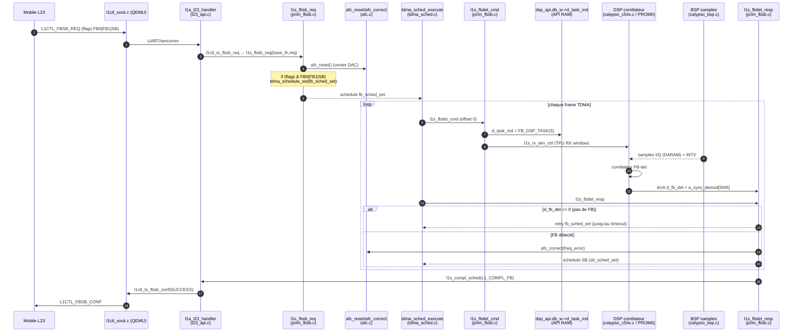

# FBSB sequence trace — du FBSB_REQ au FBSB_CONF (publish)

> Trace 2026-05-29. Chaîne osmocom-bb (firmware ARM) + QEMU (host model),
> du `L1CTL_FBSB_REQ` du mobile jusqu'au `L1CTL_FBSB_CONF`.
> **Marqueurs `⛔ NOUS PLANTONS ICI`** = où nos logs montrent la rupture.

## Acteurs / fichiers

| Couche | Fichier | Rôle |
|---|---|---|
| Mobile L23 | `osmocom-bb mobile` | envoie `L1CTL_FBSB_REQ`, attend `FBSB_CONF` |
| QEMU L1CTL sock | `hw/arm/calypso/l1ctl_sock.c` | pont socket `/tmp/osmocom_l2` ↔ UART/sercomm |
| QEMU UART | `hw/char/calypso_uart.c` + `sercomm_gate.c` | transport DLCI vers firmware |
| FW dispatch | `layer1/l23_api.c` (`l1a_l23_handler`, `l1ctl_rx_fbsb_req`) | décode L1CTL → `l1s_fbsb_req` |
| FW FBSB | `layer1/prim_fbsb.c` | `l1s_fbsb_req` / `l1s_fbdet_cmd` / `l1s_fbdet_resp` / SB / publish |
| FW AFC | `layer1/afc.c` | `afc_reset` (center DAC), `afc_correct` (freq_error→DAC) |
| FW scheduler | `layer1/tdma_sched.c` | `tdma_schedule_set`, `tdma_sched_execute` (par frame) |
| FW↔DSP API | `dsp_api.db_w->d_task_md`, `dsp_api.ndb->d_fb_det/a_sync_demod` | mailbox API RAM (DSP 0x0800) |
| QEMU DSP API | `hw/arm/calypso/calypso_trx.c` | voit les writes ARM→API (`D_TASK_MD_ALL` probe) |
| QEMU BSP | `hw/arm/calypso/calypso_bsp.c` | livre les samples I/Q en DARAM + INT3/BRINT0 |
| QEMU DSP | `hw/arm/calypso/calypso_c54x.c` | exécute le ROM C54x (corrélateur FB-det @PROM0) |
| QEMU AFC | `hw/arm/calypso/calypso_twl3025.c` | rotation samples par DAC (modèle VCXO) |

## Séquence attendue (osmocom)

1. **Mobile → `L1CTL_FBSB_REQ`** (band_arfcn, flags `FB0|FB1|SB`, rxlev_exp…).
2. `l1ctl_sock.c` → UART → FW `l1a_l23_handler` → `l1ctl_rx_fbsb_req` → **`l1s_fbsb_req(base_fn, req)`** (`prim_fbsb.c:538`).
3. `l1s_fbsb_req` : copie req, **`afc_reset()`** (center DAC), `toa_reset()`, puis
   **`if (flags & FB0|FB1|SB) tdma_schedule_set(base_fn, fb_sched_set, 0)`** (`:562`).
   ⚠️ **Si flags == 0 → RIEN n'est planifié.**
4. Chaque frame TDMA : **`tdma_sched_execute`** (`tdma_sched.c`) exécute les items dûs.
5. `fb_sched_set` → **`l1s_fbdet_cmd`** (`prim_fbsb.c:364`) à offset 0 :
   - **`dsp_api.db_w->d_task_md = FB_DSP_TASK (=5)`** (`:379`) ← *commande FB-det au DSP*
   - `dsp_api.ndb->d_fb_mode = fb_mode`
   - `l1s_rx_win_ctrl(...)` ← arme la fenêtre RX TPU
6. **DSP** lit `d_task_md=5` → corrélateur FB-det (PROM0) → écrit
   `ndb->d_fb_det` + `ndb->a_sync_demod[TOA/PM/ANG/SNR]`.
   (NB : le DSP **re-clear `d_fb_det` au sentinel `0xdfd0` en ~18 cycles** → lecture directe racy.)
7. **`l1s_fbdet_resp`** (`prim_fbsb.c:399`), frame suivante :
   - **`if (!dsp_api.ndb->d_fb_det)`** (`:404`) → pas détecté → retry (`tdma_schedule_set(1, fb_sched_set, …)`) jusqu'au timeout.
   - si détecté → lit TOA/PM/ANG/SNR, `afc_correct(freq_error)`, planifie **SB** (`sb_sched_set`).
8. SB détecté (`l1s_sbdet_resp`) → BSIC/SNR OK → **`l1s_compl_sched(L1_COMPL_FB)`**.
9. Completion → `l1ctl_tx_fbsb_conf(SUCCESS)` → **`L1CTL_FBSB_CONF`** → mobile camp.

## Diagramme de séquence

## Où NOUS plantons (d'après les logs 2026-05-29)

| Étape | Attendu | Observé | Verdict |
|---|---|---|---|
| 1-2 | FBSB_REQ reçu | `mobile→fw mt=0x08` ×1142 | ✅ reçu |
| 3 | `l1s_fbsb_req` planifie si flags set | — | ⛔ **à vérifier : flags du req == 0 ? → `tdma_schedule_set` jamais appelé** |
| 5 | `l1s_fbdet_cmd` écrit `d_task_md=5` | `D_TASK_MD_ALL` = **30× val=0x0000, jamais 5** | ⛔ **`l1s_fbdet_cmd` n'écrit jamais 5** |
| 6 | DSP corrèle (CORR-ENTRY/frame) | `CORR-ENTRY=1` (boot only) | ⛔ corrélateur jamais commandé |
| 6 | d_fb_det = SNR réel | `FB-DET-WR <- 0xdfd0` (sentinel) | ⚠️ on lit le sentinel, pas une vraie détection |
| 7-9 | FB→SB→CONF(success) | `fw→mobile type=0x09` ×1142 en **~21 ms** | ⛔ **CONF d'ÉCHEC immédiat** (trop rapide = pas attendu les frames) → mobile re-REQ |

### Hypothèse de rupture (priorité)
**Étape 3 — le gate `flags & (FB0|FB1|SB)`** dans `l1s_fbsb_req` (`prim_fbsb.c:562`).
Si le `L1CTL_FBSB_REQ` du mobile arrive avec **flags == 0**, `tdma_schedule_set`
n'est jamais appelé → `l1s_fbdet_cmd` jamais exécuté → `d_task_md` reste 0 →
DSP jamais en FB-det → `l1s_fbdet_resp`/timeout renvoie un **CONF d'échec** sans
jamais avoir corrélé. Cohérent avec le CONF en ~21 ms.

**À VÉRIFIER ENSUITE** : décoder le champ `flags` du `l1ctl_fbsb_req` reçu
(payload `08 00 00 00 01 00 00 00 02 02 02 02`) + confirmer si `l1s_fbsb_req`
puis `l1s_fbdet_cmd` sont atteints (trace ARM PC ou GDB bp `l1s_fbdet_cmd`
@`0x8262cc`). Si flags OK mais cmd pas atteint → scheduler/frame-clock ARM.
Si cmd atteint mais d_task_md=0 → `dsp_api.db_w` mal pagé (offset ≠ 0x0008/0x0030).

### Insights osmocom à appliquer APRÈS déblocage (du commit `fbsb` 84d7e02)
- `d_fb_det == 0xdfd0` = **sentinel** post-clear, pas "zéro détection".
- Publier **angle = 0** (pas de Doppler en QEMU → AFC=0) sinon `ANGLE→FREQ→AFC retry` boucle.
- Gate **SNR > 1500** sépare FCCH (milliers) du bruit data-burst (~400-800).
