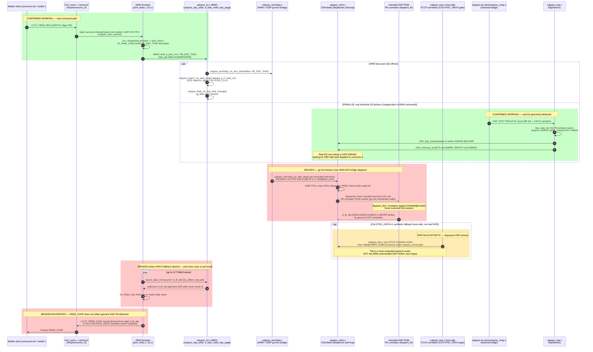

# Audit de code — QEMU Calypso (émulateur baseband GSM ARM+DSP)
_Généré par workflow multi-agents (11 agents), session 2026-07-03. Couvre les 8 groupes de modules du sous-système Calypso + 2 chemins critiques documentés en profondeur cette session (interruption/go-live, dispatch FB)._

---

## Architecture globale
```mermaid
flowchart LR

subgraph ARM_Side["ARM946 Core + SoC Peripheral Fabric"]
    ArmCore["ArmCore (ARM946 CPU)"]
    CalypsoMb["CalypsoMb (board/machine init)"]
    CalypsoSoc["CalypsoSoc (SoC realize/glue)"]
    CalypsoInth["CalypsoInth (32->2 IRQ arbiter)"]
    CalypsoTimer["CalypsoTimer (x2 GP timers)"]
    CalypsoUartModem["CalypsoUartModem"]
    CalypsoUartIrda["CalypsoUartIrda"]
    CalypsoSpi["CalypsoSpi (TWL3025 ABB regs)"]
    CalypsoI2c["CalypsoI2c (stub, no IRQ)"]
    SercommGate["SercommGate (DLCI demux)"]
    L1ctlSocket["L1ctlSocket (sercomm<->L1CTL bridge)"]
    FwConsole["FwConsole (DEAD: zero callers)"]
end

subgraph DSP_Side["C54x DSP Core"]
    C54xCore["C54xCore (TMS320C54x interpreter)"]
    Arm2DspBridge["Arm2DspBridge (go-live task handshake)"]
end

subgraph TRX_Bridge_Layer["Calypso TRX/BSP Emulation Glue"]
    CalypsoTrx["CalypsoTrx (MMIO + TDMA tick master)"]
    BspDelivery["BspDelivery (calypso_bsp.c)"]
    DspShunt["DspShunt (calypso_dsp_shunt.c, fake-DSP mock)"]
    FbsbOracle["FbsbOracle (calypso_fbsb.c)"]
    CalypsoLayer1["CalypsoLayer1 (HLE FCCH/SCH, CALYPSO_L1=c)"]
    Twl3025Model["Twl3025Model (AFC DAC/phase)"]
    SimModel["SimModel (calypso_sim.c ISO7816/SIM)"]
    IotaModel["IotaModel (BDLENA/BULENA, mostly dead)"]
    Tint0Model["Tint0Model (TINT0 timer, dead path)"]
end

subgraph Infra["Cross-Cutting Infra"]
    CalypsoDebug["CalypsoDebug (CALYPSO_DEBUG probe gate)"]
    CalypsoFullPcb["CalypsoFullPcb (locks/async-log, not a wiring hub)"]
    CalypsoOrch["CalypsoOrch (CALYPSO_ORCH env helper)"]
    EnvConfig["EnvConfig (env vars: CALYPSO_L1/DEBUG/ORCH/SIM_CFG)"]
end

subgraph External_Processes["External Host Processes"]
    IpcBridgeTool["IpcBridgeTool (calypso-ipc-device host bridge)"]
    OsmoTrxIpc["OsmoTrxIpc (osmo-trx-ipc / osmo-bts-trx)"]
    MobileClient["MobileClient (OsmocomBB mobile via osmocon)"]
    GrGsmRelay["GrGsmRelay (full-IQ grgsm transceiver, CALYPSO_IPC_RELAY)"]
    GrGsmBridge["GrGsmBridge (gr-gsm SI/BSIC decoder, GSMTAP/SCH)"]
    HostConsole["HostConsole (PTY chardev endpoint)"]
    LocalAnalysisTools["LocalAnalysisTools (named FIFOs)"]
end

%% ---- ARM/SoC wiring ----
CalypsoMb --> CalypsoSoc
CalypsoMb --> ArmCore
CalypsoMb -->|pflash_cfi01 register + load_elf/-kernel| ArmCore
CalypsoSoc --> CalypsoInth
CalypsoSoc --> CalypsoTimer
CalypsoSoc --> CalypsoUartModem
CalypsoSoc --> CalypsoUartIrda
CalypsoSoc --> CalypsoSpi
CalypsoSoc --> CalypsoI2c
CalypsoTimer -->|IRQ line 1/2| CalypsoInth
CalypsoSpi -->|IRQ line 13| CalypsoInth
CalypsoUartModem -->|IRQ line 7| CalypsoInth
CalypsoUartIrda -->|IRQ line 18| CalypsoInth
CalypsoInth -->|sysbus_pass_irq parent_irq/parent_fiq| CalypsoSoc
CalypsoSoc -->|connect to ARM_CPU_IRQ/FIQ| ArmCore
CalypsoSoc -->|calypso_trx_init(sysmem, irqs 32) at realize| CalypsoTrx
CalypsoSoc -->|calypso_trx_dsp_hw_reset on CNTL_RST write| CalypsoTrx
CalypsoMb -->|set_section_paths/set_registers_path pre-realize, get_dsp post-realize| CalypsoTrx
CalypsoMb -->|dsp_shunt_init + dsp_shunt_set_c54x(get_dsp)| DspShunt
CalypsoSoc -->|calypso_pcb_init(NULL) + start_threads| CalypsoFullPcb
CalypsoSoc -->|l1ctl_sock_init(uart_modem, path)| L1ctlSocket
CalypsoUartModem -->|calypso_async_log IER trace| CalypsoFullPcb
CalypsoUartModem -->|sercomm_gate_feed on chardev RX| SercommGate
SercommGate -->|calypso_uart_inject_raw re-wrapped DLCI!=4| CalypsoUartModem
CalypsoUartIrda -->|direct fifo_push receive| SercommGate
CalypsoUartModem -->|l1ctl_sock_uart_tx_byte per TX byte| L1ctlSocket
L1ctlSocket -->|calypso_uart_receive injects mobile bytes| CalypsoUartModem
SercommGate -->|DLCI4 TRXC stub reply via chr_fe_write_all| HostConsole

%% ---- DSP core & TRX bridge ----
CalypsoTrx -->|c54x_init/set_api_ram/reset/load_section/load_registers at init| C54xCore
CalypsoTrx -->|c54x_run(dsp,budget) every frame tick| C54xCore
CalypsoTrx -->|c54x_interrupt_ex FRAME_VEC/FRAME_BIT TPU IRQ| C54xCore
CalypsoTrx -->|dsp_ram aliased as C54xState.api_ram, shared MMIO window| C54xCore
CalypsoTrx -->|mirrors ARM write into dsp->data, reads dsp->data fallback dsp_ram| C54xCore
CalypsoTrx -->|writes data 0x0584 and api_ram 0x08D4 task-descriptor mirror, bypasses API| C54xCore
CalypsoTrx -->|g_c54x_int3_src=1 diagnostic tag shared global| C54xCore
CalypsoMb -->|c54x_load_blob_daram/c54x_set_initial_pc test fixture boot override| C54xCore
C54xCore -->|calypso_arm2dsp_on_dsp_step per executed instruction| Arm2DspBridge
CalypsoTrx -->|calypso_arm2dsp_on_arm_write on every ARM MMIO write| Arm2DspBridge
Arm2DspBridge -->|pokes C54xState fields directly, sets task-ready bit| C54xCore
C54xCore -->|lock/unlock calypso_pcb_daram_lock around DARAM access| CalypsoFullPcb
C54xCore -->|~300 calypso_debug_enabled gated probes| CalypsoDebug

CalypsoTrx -->|bsp_init once at realize; tx_rach_burst/tx_burst/send_ul UL path| BspDelivery
BspDelivery -->|calypso_trx_get_fn FN alignment| CalypsoTrx
BspDelivery -->|c54x_bsp_load / dsp->data DARAM burst write| C54xCore
BspDelivery -->|c54x_interrupt_ex INT3 vec19/IMR3, BRINT0 vec21/IMR5| C54xCore
BspDelivery -->|calypso_orch gated direct NDB d_fb_det/a_sync_demod write| C54xCore

CalypsoTrx -->|calypso_dsp_shunt_on_frame_tick every TPU tick| DspShunt
CalypsoTrx -->|calypso_dsp_shunt_active gates own c54x_run calls| DspShunt
CalypsoTrx -->|calypso_dsp_shunt_record_rach on RACH UL write| DspShunt
ArmCore -->|d_dsp_page NDB+0 write intercepted via shunt MemoryRegion overlay prio10| DspShunt
DspShunt -->|CALYPSO_DSP=c54x route: interrupt_ex/wake/c54x_run| C54xCore
DspShunt -->|writes dsp->data/dsp->api_ram directly, bypasses API| C54xCore
BspDelivery -->|calypso_dsp_shunt_active gate before DARAM DMA| DspShunt
BspDelivery -->|calypso_dsp_shunt_feed_iq fn,iq,n| DspShunt
DspShunt -->|l1ctl_inject_dl_si direct DATA_IND injection| L1ctlSocket
DspShunt -->|g_last_recorded_ra shared global, RACH timing| L1ctlSocket

CalypsoTrx -->|calypso_fbsb_init/on_dsp_task_change from ARM API-RAM write handler| FbsbOracle
FbsbOracle -->|calypso_bsp_get_fb_detection real FCCH correlator result| BspDelivery
FbsbOracle -->|CALYPSO_SYNTH_FBSB/CALYPSO_DSP_L1_STUB fallback gate| CalypsoOrch
BspDelivery -->|BURST-IN NDB write gate| CalypsoOrch
CalypsoOrch -->|getenv CALYPSO_ORCH| EnvConfig

C54xCore -->|shares d_task_md write + DSP DARAM I/Q data| CalypsoLayer1
CalypsoTrx -->|layer1_on_task_write on d_task_md MMIO write| CalypsoLayer1
CalypsoTrx -->|layer1_tick(dsp,dsp_ram,fn) once per TDMA frame| CalypsoLayer1
CalypsoLayer1 -->|getenv CALYPSO_L1 memoized| EnvConfig

CalypsoTrx -->|set_afc_dac(value) on d_afc MMIO write| Twl3025Model
Twl3025Model -->|get_afc_hz logging readback| CalypsoTrx
BspDelivery -->|apply_phase AFC IQ rotation before DMA| Twl3025Model
Twl3025Model -->|AFC-APPLY probe| CalypsoDebug

CalypsoTrx -->|sim_reg_read/write MMIO dispatch| SimModel
SimModel -->|qemu_irq_raise/lower on irqs CALYPSO_IRQ_SIM| CalypsoTrx
EnvConfig -->|CALYPSO_SIM_CFG env/mobile.cfg IMSI+Ki override| SimModel

CalypsoTrx -->|TPU-RAM MOVE decode TSP_CTRL2 WR bit dev=0| IotaModel
IotaModel -->|IOTA_DBG macro| CalypsoDebug
BspDelivery -.->|stale comment only; real gate is bsp_take_for_fn/BSP_FN_MATCH_WINDOW, DEAD ref| IotaModel

Tint0Model -.->|calypso_tint0_do_tick defined but unreachable, tint0_start never called| CalypsoTrx
BspDelivery -->|include for GSM_HYPERFRAME constant only| Tint0Model

CalypsoTrx -->|TRX_DBG probes: D_TASK_MD_ALL, D_DSP_PAGE, ROMMAP| CalypsoDebug
BspDelivery -->|BSP_DBG probes: BSP-RXBURST, PUMP, BSP-DELIVER| CalypsoDebug
CalypsoFullPcb -->|PCB_DBG macro| CalypsoDebug
CalypsoDebug -->|getenv CALYPSO_DEBUG parsed once| EnvConfig

CalypsoFullPcb -->|extern QemuMutex calypso_pcb_daram_lock| C54xCore
CalypsoFullPcb -->|daram_lock_acquire/release + api_ram_lock| CalypsoTrx
CalypsoFullPcb -->|daram_lock_acquire/release| FbsbOracle
CalypsoFullPcb -->|daram_lock_acquire/release around DARAM writes| BspDelivery
CalypsoFullPcb -.->|raise_irq/lower_irq DEAD: inth_inputs always NULL| CalypsoInth

%% ---- External process bridges ----
CalypsoTrx -->|UDP 6700, 4B BE FN heartbeat every TDMA tick| IpcBridgeTool
CalypsoTrx -->|/dev/shm/calypso_rach pwrite RA+BSIC+FN, polled| IpcBridgeTool
IpcBridgeTool -->|UDP 6702 sendto TRXDv0 DL burst 600B| BspDelivery
BspDelivery -->|UDP 6702 reply TRXDv0 UL burst 156B to trxd_peer| IpcBridgeTool
BspDelivery -->|UDP 6703 IQ tee, shunt-gated CALYPSO_IQ_TEE_PORT| GrGsmBridge
DspShunt -->|shm mmap DL I/Q out, SI in| GrGsmBridge
DspShunt -->|UDP GSMTAP 4730 / SCH 4731 listeners| GrGsmBridge
DspShunt -->|/dev/shm/calypso_sdcch_ul UL L2 sideband, polled| IpcBridgeTool
DspShunt -->|/dev/shm/calypso_tch_dl sideband poll| IpcBridgeTool
L1ctlSocket -->|/dev/shm/calypso_kc ciphering key write, polled| IpcBridgeTool
L1ctlSocket -->|sendmsg length-prefixed L1CTL over unix socket| MobileClient
MobileClient -->|recv + sercomm-wrap, forwarded to UART RX| L1ctlSocket
IpcBridgeTool <-->|AF_UNIX SOCK_SEQPACKET master+per-channel control| OsmoTrxIpc
IpcBridgeTool <-->|POSIX shm mmap sample rings osmo-trx-ipc-driver-shm2| OsmoTrxIpc
IpcBridgeTool -->|UDP 5810 sendto fc32 IQ, CALYPSO_IPC_RELAY=1| GrGsmRelay
GrGsmRelay -->|UDP 5811 sendto fc32 IQ UL| IpcBridgeTool
IpcBridgeTool -->|named FIFO writes /tmp/iq_*.fifo| LocalAnalysisTools
```

## Connection Reference Table

| From | To | Mechanism | Description |
|---|---|---|---|
| Arm2DspBridge | C54xCore | direct call, pokes struct fields | Sets C54xState task-ready bit / DSP fields directly to drive the ARM<->DSP go-live handshake. |
| ArmCore | CalypsoInth | qdev GPIO (sysbus_connect_irq) | INTH's parent_irq/parent_fiq are wired to ARM_CPU_IRQ/ARM_CPU_FIQ gpio-in — the only path any peripheral IRQ reaches the CPU. |
| ArmCore | DspShunt | MMIO write intercept (MemoryRegion overlay, priority 10) | Firmware write to d_dsp_page (NDB+0, 0xFFD001A8) is intercepted by `shunt_ndb_trigger_ops`, latching a pending DSP task when CALYPSO_DSP_SHUNT=1. |
| BspDelivery | C54xCore | direct call: c54x_bsp_load, dsp->data[] write | Writes a burst of I/Q samples into DSP DARAM at the configurable daram_addr (default 0x2a00). |
| BspDelivery | C54xCore | direct call: c54x_interrupt_ex | Fires INT3 (frame, vec19/IMR3) and BRINT0 (vec21/IMR5) to wake the DSP after a DARAM DMA. |
| BspDelivery | C54xCore | shared struct write (calypso_orch-gated) | Host-side FCCH correlator (BURST-IN discriminator) writes d_fb_det/a_sync_demod cells (dsp->data[0x08F8..0x08FD]) directly. |
| BspDelivery | CalypsoDebug | macro-wrapped call | BSP_DBG probes: BSP-RXBURST, PUMP, BSP-DELIVER. |
| BspDelivery | CalypsoFullPcb | mutex lock/unlock | Wraps DARAM burst writes and RACH d_rach reads in calypso_pcb_daram_lock_acquire/release. |
| BspDelivery | CalypsoOrch | env-gated inline helper | Gates whether host code (vs real DSP ROM) owns writing FB/SB "BURST-IN" NDB results. |
| BspDelivery | CalypsoTrx | direct call: calypso_trx_get_fn() | Reads current TDMA frame number for FN-aligned burst/SI scheduling. |
| BspDelivery | DspShunt | direct call: calypso_dsp_shunt_active() | Gate checked before performing DARAM DMA, to defer to the shunt when it owns the DSP. |
| BspDelivery | DspShunt | direct call: calypso_dsp_shunt_feed_iq(fn,iq,n) | Hands received DL I/Q to the shunt/gr-gsm bridge and, in CALYPSO_DSP=c54x mode, stashes it for replay into the real DSP. |
| BspDelivery | GrGsmBridge | UDP socket, port 6703 (IQ tee) | Tees raw DL I/Q to CALYPSO_IQ_TEE_PORT for an external gr-gsm/FFT decoder, gated by shunt activity. |
| BspDelivery | IotaModel | dead/stale reference | Comment claims calypso_iota_take_bdl_pulse gates RX delivery; no such call exists — actual gate is bsp_take_for_fn/BSP_FN_MATCH_WINDOW. |
| BspDelivery | IpcBridgeTool | UDP socket, port 6702 (reply, TRXDv0) | calypso_bsp_send_ul() sends the 156B UL burst back to bsp.trxd_peer (the source of the last DL packet). |
| BspDelivery | Tint0Model | header include (constant only) | `#include calypso_tint0.h` purely for the GSM_HYPERFRAME modulus constant; no function calls cross this boundary. |
| BspDelivery | Twl3025Model | direct call: calypso_twl3025_apply_phase | Rotates a queued RX IQ burst by the current AFC offset immediately before DMA into DARAM. |
| C54xCore | Arm2DspBridge | direct call: calypso_arm2dsp_on_dsp_step | Called once per executed DSP instruction from the fetch loop, letting the ARM->DSP bridge inject state. |
| C54xCore | CalypsoDebug | calypso_debug_enabled() gated probes | ~300 file-local debug/trace probes (pc_ring, sp_ring, IMR-W, SP-HIST, TRAP, etc.) — heaviest consumer of the debug infra. |
| C54xCore | CalypsoFullPcb | mutex lock/unlock | data_read/data_write take calypso_pcb_daram_lock around every DARAM access to guard against ARM-side races under MTTCG. |
| C54xCore | CalypsoLayer1 | shared struct/memory | calypso_layer1.c reads DSP DARAM I/Q (dsp->data[0x2a00..]) and writes FB/SB results into dsp->data[] NDB offsets, using the C54xState handed in by calypso_trx.c. |
| CalypsoDebug | EnvConfig | getenv(CALYPSO_DEBUG) | Parsed once at first use into the token list gating all probe names; fast-path flag is `calypso_debug_master`. |
| CalypsoFullPcb | BspDelivery | mutex lock/unlock | calypso_pcb_daram_lock_acquire/release wraps DARAM burst writes and RACH reads. |
| CalypsoFullPcb | C54xCore | extern QemuMutex (shared global) | calypso_pcb_daram_lock, defined here, is locked directly inside calypso_c54x.c's data_read/data_write. |
| CalypsoFullPcb | CalypsoDebug | macro (PCB_DBG) | calypso_full_pcb.c gates a debug macro through calypso_debug_enabled("PCB"). |
| CalypsoFullPcb | CalypsoInth | dead code (never wired) | calypso_pcb_raise_irq/lower_irq exist but are moot — calypso_soc.c calls calypso_pcb_init(NULL), so the IRQ table is always empty. |
| CalypsoFullPcb | CalypsoTrx | mutex lock/unlock | calypso_pcb_daram_lock_acquire/release and calypso_pcb_api_ram_lock guard calypso_dsp_read/write and calypso_dsp_done. |
| CalypsoFullPcb | FbsbOracle | mutex lock/unlock | calypso_pcb_daram_lock_acquire/release wraps NDB access in calypso_fbsb.c. |
| CalypsoInth | CalypsoSoc | sysbus_pass_irq | INTH's two arbitrated outputs (parent_irq/parent_fiq) pass through the SoC device to the top level. |
| CalypsoLayer1 | EnvConfig | getenv(CALYPSO_L1) | Memoized "starts with 'c'" check gates the entire HLE-L1 C model on/off. |
| CalypsoMb | ArmCore | qdev_new/object_new + qdev_realize | Creates and realizes the ARM946 CPU object. |
| CalypsoMb | ArmCore | pflash_cfi01_register, load_elf/load_image_targphys | Registers boot flash and loads `-kernel` firmware image into the machine. |
| CalypsoMb | C54xCore | direct call: c54x_load_blob_daram, c54x_set_initial_pc | Loads a raw test-fixture blob into DARAM and overrides PC after reset (dsp-blob machine option), bypassing the normal PROM boot path. |
| CalypsoMb | CalypsoSoc | object_initialize_child + sysbus_realize | Machine init instantiates and realizes the SoC device. |
| CalypsoMb | CalypsoTrx | direct call: set_section_paths/set_registers_path, get_dsp() | Stages DSP ROM/register-snapshot file paths before SoC realize, then retrieves the C54xState* after realize. |
| CalypsoMb | DspShunt | direct call: calypso_dsp_shunt_init, calypso_dsp_shunt_set_c54x | Initializes the shunt MMIO overlay and wires the real C54xState into it for the CALYPSO_DSP=c54x route. |
| CalypsoOrch | EnvConfig | getenv(CALYPSO_ORCH) | Env-gated inline helper toggling host-side L1 orchestration/injection vs letting the real DSP ROM run. |
| CalypsoSoc | ArmCore | sysbus_connect_irq | Connects INTH's two passed-through outputs to ARM_CPU_IRQ/ARM_CPU_FIQ gpio-in lines. |
| CalypsoSoc | CalypsoFullPcb | direct call: calypso_pcb_init(NULL), calypso_pcb_start_threads | Optionally spawns per-chip PCB emulation threads (CALYPSO_PCB_THREADS env-gated); IRQ table left NULL. |
| CalypsoSoc | CalypsoI2c | qdev_new + sysbus_realize_and_unref | Instantiates the I2C stub device; it has no IRQ line. |
| CalypsoSoc | CalypsoInth | object_initialize_child + sysbus_mmio_map | Creates INTH child device, mapped at 0xFFFFFA00. |
| CalypsoSoc | CalypsoSpi | object_initialize_child | Creates SPI/TWL3025 ABB child device. |
| CalypsoSoc | CalypsoTimer | object_initialize_child (x2) | Creates timer1 and timer2 child devices. |
| CalypsoSoc | CalypsoTrx | direct call: calypso_trx_init(sysmem, irqs) | Builds the 32-entry INTH gpio-in array and hands it to calypso_trx.c at SoC realize. |
| CalypsoSoc | CalypsoTrx | direct call: calypso_trx_dsp_hw_reset() | CNTL_RST MMIO write handler (RESET_DSP bit) hardware-resets the DSP core. |
| CalypsoSoc | CalypsoUartIrda | object_initialize_child | Creates the irda-label UART child device. |
| CalypsoSoc | CalypsoUartModem | object_initialize_child | Creates the modem-label UART child device. |
| CalypsoSoc | L1ctlSocket | direct call: l1ctl_sock_init | Creates /tmp/osmocom_l2 (or L1CTL_SOCK override) unix server socket once at SoC realize. |
| CalypsoSpi | CalypsoInth | sysbus_connect_irq, line 13 | SPI peripheral interrupt wired into the arbiter. |
| CalypsoTimer | CalypsoInth | sysbus_connect_irq, lines 1/2 | Timer1/timer2 interrupts wired into the arbiter. |
| CalypsoTrx | Arm2DspBridge | direct call: calypso_arm2dsp_on_arm_write | Called unconditionally from calypso_dsp_write() on every ARM MMIO write to the DSP API window. |
| CalypsoTrx | BspDelivery | direct call: calypso_bsp_init, tx_rach_burst, tx_burst, send_ul | Binds the BSP module to the DSP once at realize, then drives UL burst delivery every TDMA tick. |
| CalypsoTrx | C54xCore | direct call: c54x_init/set_api_ram/reset/load_section/load_registers | Device-init sequence that constructs and boots the DSP core. |
| CalypsoTrx | C54xCore | direct call: c54x_run(dsp, budget) | Executes DSP instructions every frame tick (multiple call sites). |
| CalypsoTrx | C54xCore | direct call: c54x_interrupt_ex | Delivers the TPU frame IRQ (FRAME_VEC/FRAME_BIT). |
| CalypsoTrx | C54xCore | shared memory (aliased pointer) | dsp_ram[] is aliased as C54xState.api_ram via c54x_set_api_ram; data_read/data_write redirect API-window accesses here. |
| CalypsoTrx | C54xCore | MMIO mirror + fallback read | calypso_dsp_write mirrors ARM writes into dsp->data[]; calypso_dsp_read prefers dsp->data[], falls back to dsp_ram[] before DSP alloc. |
| CalypsoTrx | C54xCore | direct struct field write (bypasses API) | Writes data[0x0584] and api_ram[0x08D4-BASE] directly to hand the DSP its per-frame task descriptor, outside the exported c54x.h API. |
| CalypsoTrx | C54xCore | shared global (g_c54x_int3_src) | Set to 1 when calypso_trx.c fires the DSP frame interrupt (vs 2 in BspDelivery, 3 in DspShunt), read back as a diagnostic tag. |
| CalypsoTrx | CalypsoDebug | macro-wrapped call | TRX_DBG probes: TRX, R_PAGE_SPLIT, DSP_WRITE_COUNT, D_TASK_MD_ALL, D_DSP_PAGE, TPU_RAM, ROMMAP. |
| CalypsoTrx | CalypsoLayer1 | direct call: calypso_layer1_on_task_write | Latches the ARM's d_task_md write value on every such MMIO write, gated by calypso_l1_c_active(). |
| CalypsoTrx | CalypsoLayer1 | direct call: calypso_layer1_tick | Runs the FCCH/SB detector once per TDMA frame, just before the TPU frame IRQ is raised. |
| CalypsoTrx | CalypsoUartIrda | direct call: calypso_uart_poll_backend/kick_rx | Forces RX drain every TDMA tick under -icount. |
| CalypsoTrx | CalypsoUartModem | direct call: calypso_uart_poll_backend/kick_rx; qemu_chr_fe_write_all | Forces RX polling per tick; also writes UL sercomm DLCI4 frames out the modem chardev. |
| CalypsoTrx | DspShunt | direct call: calypso_dsp_shunt_on_frame_tick | Main per-TPU-tick dispatch entry into the shunt (mock dispatch_* or real-DSP replay route). |
| CalypsoTrx | DspShunt | direct call: calypso_dsp_shunt_active() | Gates calypso_trx.c's own two c54x_run() call sites so the shunt can own the DSP instead. |
| CalypsoTrx | DspShunt | direct call: calypso_dsp_shunt_record_rach | Timestamps l1s.current_time.fn per RA on genuine RACH UL writes. |
| CalypsoTrx | FbsbOracle | direct call: calypso_fbsb_init/on_dsp_task_change | Triggered from the ARM API-RAM MMIO write handler when firmware writes d_task_md. |
| CalypsoTrx | IotaModel | direct call: calypso_iota_tsp_write | Feeds a decoded TSP byte (BDLON/BDLENA/BULON/BULENA bits) from the TPU-RAM scenario decoder; expected_tn hardcoded to 0. |
| CalypsoTrx | IpcBridgeTool | UDP socket, port 6700 | Sends a 4-byte BE FN counter every TDMA tick — the clock-slave heartbeat consumed by qemu_wrap.c's clk_listener. |
| CalypsoTrx | IpcBridgeTool | shared file /dev/shm/calypso_rach | calypso_rach_publish() writes RA/BSIC/FN on every genuine firmware d_rach write; read via pread by the bridge tool. |
| CalypsoTrx | SimModel | MMIO dispatch: calypso_sim_read/write | Every SIM register access from firmware routes through calypso_sim_reg_read/write. |
| CalypsoTrx | Twl3025Model | direct call: calypso_twl3025_set_afc_dac | Firmware write to dsp_api word 0x001E/0x0046 (d_afc) synchronously updates the AFC DAC model. |
| CalypsoUartIrda | CalypsoInth | sysbus_connect_irq, line 18 | irda UART interrupt wired into the arbiter. |
| CalypsoUartIrda | SercommGate | direct call: sercomm_gate_feed | Non-modem UART bytes are also fed into the sercomm demuxer path. |
| CalypsoUartModem | CalypsoFullPcb | direct call: calypso_async_log | Offloads a per-IER-toggle trace onto a dedicated drain thread instead of blocking the TCG thread on fprintf. |
| CalypsoUartModem | CalypsoInth | sysbus_connect_irq, line 7 | modem UART interrupt wired into the arbiter. |
| CalypsoUartModem | L1ctlSocket | direct call: l1ctl_sock_uart_tx_byte | Every byte the firmware writes to the modem UART TX register feeds the sercomm/L1CTL parser. |
| CalypsoUartModem | SercommGate | direct call: sercomm_gate_feed | PTY-chardev receive callback forwards host->firmware bytes into the sercomm HDLC demuxer. |
| DspShunt | C54xCore | direct call: c54x_interrupt_ex, c54x_wake, c54x_run | shunt_route_to_c54x() drives the real DSP core directly when CALYPSO_DSP=c54x, bypassing calypso_trx.c's own c54x_run calls. |
| DspShunt | C54xCore | direct struct write (bypasses API) | Writes dsp->data[]/dsp->api_ram[] directly before replaying the last DL burst. |
| DspShunt | GrGsmBridge | shared memory (mmap) | Publishes DL I/Q into a shm region for gr-gsm to consume and polls si_seq for decoded SI. |
| DspShunt | GrGsmBridge | UDP sockets, ports 4730 (GSMTAP) / 4731 (SCH) | Independent listeners to receive decoded SI/BSIC from the external gr-gsm bridge. |
| DspShunt | IpcBridgeTool | shared file /dev/shm/calypso_sdcch_ul | Publishes UL SDCCH/SACCH L2 frames; read by the bridge tool to build/inject SDCCH bursts. |
| DspShunt | IpcBridgeTool | shared file /dev/shm/calypso_tch_dl (implied) | Polls a TCH DL sideband file, part of the same sideband-file convention as the SDCCH path. |
| DspShunt | L1ctlSocket | direct call: l1ctl_inject_dl_si | Pushes gr-gsm-decoded SI straight into the mobile's L1CTL DATA_IND, bypassing UART. |
| DspShunt | L1ctlSocket | shared global: g_last_recorded_ra | record_rach() writes the RA; l1ctl_sock.c keys g_rach_conf_fn[] by it to rewrite IMM ASSIGN request-references. |
| FbsbOracle | BspDelivery | extern function call: calypso_bsp_get_fb_detection | Publishes a real (non-synthetic) TOA/PM/ANGLE/SNR into the NDB when CALYPSO_SYNTH_FBSB/CALYPSO_DSP_L1_STUB is set. |
| FbsbOracle | CalypsoOrch | env-gated inline helper | Gates whether calypso_fbsb.c's synth fallback path runs at all. |
| GrGsmRelay | IpcBridgeTool | UDP socket, port 5811 | Sends UL fc32 IQ back to the bridge tool, bypassing QEMU's DSP/BSP path entirely (CALYPSO_IPC_RELAY=1). |
| IotaModel | CalypsoDebug | macro (IOTA_DBG) | calypso_iota.c gates a debug macro through calypso_debug_enabled("IOTA"). |
| IpcBridgeTool | BspDelivery | UDP socket, port 6702 (TRXDv0) | sendto()s DL bursts (8B header + 148 cs16 IQ @ 1SPS, 600B) received by bsp_trxd_readable(). |
| IpcBridgeTool | GrGsmRelay | UDP socket, port 5810 | Sends continuous fc32 IQ to an external full-grgsm transceiver, gated by CALYPSO_IPC_RELAY=1. |
| IpcBridgeTool | LocalAnalysisTools | named FIFOs (/tmp/iq_*.fifo) | Frame-atomic writer threads tee the DL IQ stream to external analysis tools (fft/grgsm/record). |
| IpcBridgeTool | OsmoTrxIpc | AF_UNIX SOCK_SEQPACKET | Master + per-channel control sockets for greeting/info/open/start/stop/gain/freq primitives. |
| IpcBridgeTool | OsmoTrxIpc | POSIX shared memory (mmap, robust mutex/cond rings) | DL (ios_tx_to_device) and UL (ios_rx_from_device) sample rings shared via /osmo-trx-ipc-driver-shm2. |
| L1ctlSocket | CalypsoUartModem | direct call: calypso_uart_receive | Injects mobile->firmware bytes read off the unix socket into the UART RX FIFO. |
| L1ctlSocket | IpcBridgeTool | shared file /dev/shm/calypso_kc | Writes captured GSM ciphering key material from L1CTL_CRYPTO_REQ; read by the bridge tool for A5 encrypt/decrypt. |
| L1ctlSocket | MobileClient | unix socket (sendmsg, length-prefixed) | Sends firmware->mobile L1CTL messages over /tmp/osmocom_l2 (decoy in the orchestrated run; real socket owned by external osmocon). |
| MobileClient | L1ctlSocket | unix socket (recv) | Sends mobile->firmware L1CTL/sercomm frames, relayed into the UART RX path. |
| SercommGate | CalypsoUartModem | direct call: calypso_uart_inject_raw | Re-wraps and re-injects every DLCI other than 4 (including L1CTL/DLCI5) back into the UART RX FIFO. |
| SercommGate | HostConsole | qemu_chr_fe_write_all | gate_send_trxc_rsp() writes a sercomm-framed DLCI4 (TRXC) stub response back out the modem chardev/PTY; the real TRXC control is answered independently by IpcBridgeTool over UDP 5701 (no direct code path). |
| SimModel | CalypsoTrx | qemu_irq_raise/lower | SIM device raises interrupts back into the TRX device's own IRQ fan-out (irqs[CALYPSO_IRQ_SIM]). |
| Tint0Model | CalypsoTrx | dead callback path | calypso_tint0_do_tick(fn) is defined in calypso_trx.c and would be called from tint0's QEMUTimer callback, but calypso_tint0_start() is never invoked anywhere — path is unreachable; calypso_tdma_tick() is the real live master clock. |
| Twl3025Model | CalypsoDebug | direct call | AFC-APPLY probe gated through calypso_debug_enabled. |
| Twl3025Model | CalypsoTrx | direct call: calypso_twl3025_get_afc_hz | Read immediately after a DAC write, purely to log the resulting Hz offset. |
| EnvConfig | SimModel | file read at init (CALYPSO_SIM_CFG) | calypso_sim_new() parses the osmocom-bb layer23 mobile.cfg to override default IMSI/Ki so the emulated SIM matches whatever `mobile` binary (MobileClient) the harness runs. |

## Overview

The system is a two-CPU emulated baseband: an ARM946 (`ArmCore`) running unmodified osmocom-bb firmware, and a modeled TMS320C54x DSP (`C54xCore`) running the real Calypso ROM, glued together by `CalypsoTrx`'s MMIO handlers and a lightweight one-instruction-granularity `Arm2DspBridge`. `CalypsoSoc`/`CalypsoMb` assemble the ARM-side peripheral fabric (INTH interrupt arbiter, timers, two UARTs, SPI/I2C stubs) and, at realize time, hand `CalypsoTrx` the DSP API-RAM/TPU/TSP/SIM MMIO windows and a 32-line IRQ array; `CalypsoTrx`'s own `calypso_tdma_tick()` QEMUTimer (not the nominally-present but dead `calypso_tint0.c`) is the actual per-TDMA-frame master clock driving `c54x_run`, UART polling, and burst delivery. Downlink RF samples reach the DSP either through the "real" path — `BspDelivery` (`calypso_bsp.c`) receiving TRXDv0 bursts over UDP 6702 from the external `IpcBridgeTool` (calypso-ipc-device) and DMA'ing them into DSP DARAM with AFC phase correction from `Twl3025Model` — or through `DspShunt`, an env-gated (`CALYPSO_DSP_SHUNT=1`) fake-DSP that intercepts the ARM's task-post write via an MMIO overlay and either synthesizes FB/SB/SI results directly into shared NDB memory or, when `CALYPSO_DSP=c54x`, replays the buffered burst into the real DSP itself, competing with `CalypsoTrx`'s own driving of `c54x_run`. Auxiliary chip models (`SimModel` for the SIM card, `IotaModel` and `Tint0Model`, both largely dead/unwired) and `FbsbOracle`/`CalypsoLayer1` (host-side stand-ins for real DSP burst detection) round out the peripheral set, all optionally traced through the single shared `CalypsoDebug` env-var-gated probe mechanism and serialized against each other via `CalypsoFullPcb`'s mutexes (which, despite its name, is not a wiring hub — several of its exported IRQ-raise and "invoker" functions are unreferenced dead code). Console/control traffic flows from firmware through `CalypsoUartModem`, split by `SercommGate` into a stub-answered DLCI4 (TRXC) channel and everything else, which is re-injected for firmware's own sercomm driver; L1CTL/DLCI5 traffic is additionally tapped by `L1ctlSocket`, which in production is a decoy (`L1CTL_SOCK` pointed at a disabled path) because the real `/tmp/osmocom_l2` socket to `MobileClient` is created by external `osmocon`. The whole emulated radio, in turn, presents itself to the outside world as a UHD-like device to `OsmoTrxIpc` (osmo-trx-ipc/osmo-bts-trx) via AF_UNIX control sockets and POSIX shared-memory sample rings, with `IpcBridgeTool` acting as the single host-side integration point tying together the QEMU UDP/shm sideband files (`calypso_rach`, `calypso_sdcch_ul`, `calypso_kc`) and, optionally, external gr-gsm relay/decoder processes and local FIFO analysis tools. Several APIs across the codebase (IOTA BDLENA gating, `calypso_bsp_rx_burst`, PCB IRQ helpers, `fw_console.c`, `sercomm_gate_init`, various "invoker" functions) are fully wired at the header/declaration level but have zero live call sites, representing intended-but-superseded or not-yet-activated control paths.
---

## Chemins critiques (chaînes détaillées)

### Chaîne interruption / go-live (frame IT → IMR → corrélateur → d_fb_det)
```mermaid
sequenceDiagram
    autonumber
    participant IPC as calypso-ipc-device<br/>(host TRX bridge, UDP 6702)
    participant BSP as calypso_bsp.c<br/>(BspDelivery)
    participant DMA as C54x DARAM<br/>(dsp->data[0x2a00..])
    participant IFR as C54x IFR (latch)
    participant IMR as C54x IMR (mask, per-source)
    participant IDLE as Idle scheduler dispatch<br/>data[0x4387] via BACC@0xb40f
    participant ARM7 as IMR-arm routine<br/>0xa4c0-0xa4cd (PROM0)
    participant VEC as Vector table (IPTR)<br/>+ remap logic
    participant ISR as ISR chain<br/>0x00f0 -> 0x7234 -> CALL 0x013b
    participant DISP as Frame dispatch<br/>0xa4e4 (DMA burst + set AR3)
    participant COR as FCCH Correlator<br/>0x9a80-0x9ac0 (MAC loop)
    participant NDB as NDB d_fb_det<br/>data[0x08f8]

    Note over IPC,BSP: Confirmed SANE (addendum 10): FCCH tone delivered continuously,<br/>delivered= climbs ~217/s, FFT shows clean +Fs/4 peak

    IPC->>BSP: UDP 6702 sendto: TRXDv0 DL burst (FCCH tone, 148 IQ)
    BSP->>DMA: c54x_bsp_load() / DARAM write @0x2a00 (PORTR-visible @0x2a16)
    BSP->>IFR: c54x_interrupt_ex(dsp, vec19, imr_bit=3)  [frame INT3]
    Note right of BSP: BRINT0 (bit5/vec21) is a parallel independent<br/>channel (calypso_bsp.c:1307) — hits the SAME wall below.<br/>Confirms IMR=0 is a total block, not go-live-specific (Addendum 16)
    IFR->>IFR: IFR bit3 = 1 (frame IT latched)

    IFR->>IMR: check IMR bit3 (imr_bit) before vectoring
    Note over IMR: **IMR = 0x0000 for the ENTIRE run.**<br/>Cleared once at boot: `0xb37e STM #0x0000,IMR` (insn≈1047),<br/>confirmed legitimate/intentional init (Addendum 19 — NOT a decoder bug).<br/>Never re-armed naturally ⇒ IT stays masked, DSP never vectors on its own.

    rect rgb(255,230,230)
    Note over IDLE,ARM7: **BREAK POINT #1 — dispatch stuck on no-op stub**<br/>Idle-scheduler slot `data[0x4387]` (read via `BACC A @0xb40f`) is the ONLY<br/>live path to the IMR-arm code. Jump table @0xaae7-0xab37 has 2 entries<br/>pointing at `0xa4c7`, but the slot **rewrites its own current value every<br/>pass** ⇒ always resolves to stub `0xab38` (RET no-op), never `0xa4c7`.<br/>(Addenda 15/20/21 — "boucle fermée auto-référentielle")
    IDLE->>IDLE: data[0x4387] resolves -> 0xab38 (self-referential stub)
    IDLE-->>ARM7: (never routes here — 0 hits on 0xa4c7 all session)
    end

    rect rgb(255,230,230)
    Note over ARM7: **BREAK POINT #2 — armor instruction never executed**<br/>`0xa4c7: ORM #0x3000,IMR`  (would set bit12=vec28 + bit13)<br/>Immediately preceded by `0xa4c6 RET` of a separate routine ⇒ 0xa4c7 is a<br/>jump TARGET, not fallthrough. **0 hits on 0xa4c7 across every run this<br/>session.** 3 words later, `0xa4ca SSBX INTM` (start of the visible<br/>"wait-loop" entry) has 130 hits — execution reaches the loop by a<br/>DIRECT path that skips the ORM entirely.
    Note over ARM7: Falsification test (Addendum 22, diagnostic-only, reverted):<br/>force-redirect PC 0xa4ca→0xa4c7 once, let ROM execute its real ORM.<br/>Result: **IMR 0x0000→0x3000 (bit12=1) — CONFIRMED** the instruction<br/>itself is correct and sufficient; only its liveness (Break #1) is broken.
    end

    alt IMR successfully armed (bit12/vec28) — only reproduced via diagnostic poke, never naturally
        ARM7->>IMR: IMR |= 0x3000 (bit12 + bit13)
        IFR->>VEC: IFR bit(remapped)=1 & IMR bit=1 -> take interrupt
        Note over VEC: Requires CALYPSO_DSP_FRAME_VEC28 remap (bit3->vec28) to matter;<br/>without it IMR=0x3000 has no bit3(vec19) set -> still no vector (Addendum 22)
        VEC->>ISR: IPTR=0x001 -> vector 28 -> PC=0x00f0  (confirmed correct, NOT the 0x1ff/0xffcc garbage stub)
        ISR->>ISR: 0x00f0 branches -> 0x7234  (fires, 301x observed)
        ISR->>ISR: 0x7234 -> CALL 0x013b
        Note over ISR: `0x013b` = shared prologue subroutine (STM ST1=0x6900; STM ST0=0; ANDM...),<br/>copied from PROM0[0x713b], called from MULTIPLE normal-flow sites<br/>(0x7092/0x70a1/0x70b8) without issue — it is NOT ISR-specific,<br/>NOT itself buggy in isolation (Addendum 22)

        rect rgb(255,230,230)
        Note over ISR,DISP: **BREAK POINT #3 — post-0x013b derail in ISR context only**<br/>`0x7234` and `0x013b` each fire exactly ONCE, then PC storms to<br/>**0x0000** ("POST-BOOTSTUB-RET"), 6300+ occurrences, starting at<br/>insn=4470 (32 instructions after the poke at insn=4438).<br/>`0xa4e4` (dispatch -> DMA burst + set AR3 -> correlator) is<br/>**NEVER reached**. Reproducible regardless of trigger mechanism<br/>(same derail seen via earlier IMR pokes, Addenda 7-8, and via the<br/>faithful ORM instruction, Addendum 22). Root cause isolated to:<br/>the CALL 0x013b **return continuation specific to ISR entry context**<br/>(pushed PC/XPC from c54x_interrupt_ex) — untraced beyond this point.
        ISR--xDISP: derail: PC -> 0x0000 (storm), 0xa4e4 never executed
        end
    else IMR stays 0x0000 (actual state, every real run)
        Note over IFR,VEC: No vectoring occurs at all. DSP stays in idle loops<br/>71xx/a4ca/b3xx/b4xx. `d[0x3f70]` toggles 0x0000<->0x0001 only<br/>(dismiss path via SM 0xdde0, itself gated by d_background_enable/state<br/>= d[0x098a..0x098e], deliberately zeroed by real firmware — Addendum 11/18, a RED HERRING)
    end

    DISP-->>COR: (intended) DMA burst into correlator page + AR3=burst pointer
    COR-->>NDB: (intended) MAC over I/Q -> peak detect -> write d_fb_det
    Note over NDB: **Observed: d_fb_det (data[0x08f8]) = 0x0000 for the entire run.**<br/>FBSB_CONF = FAIL. Every real run stops at Break #1 (never reaches<br/>Break #2/#3 without diagnostic force).
```

Three independent, confirmed break points gate this chain, and all downstream of them is proven-good: (1) the idle-scheduler dispatch slot `data[0x4387]` (read via `BACC @0xb40f`) never resolves to the IMR-arm entry point `0xa4c7`, permanently self-resolving to the no-op stub `0xab38` (Addenda 15/20/21); (2) as a direct consequence, `0xa4c7: ORM #0x3000,IMR` — verified correct and sufficient when force-executed (IMR 0x0000→0x3000, Addendum 22) — has zero natural hits across every run this session; (3) even when IMR/vectoring is forced to fire faithfully, the shared prologue `CALL 0x013b` (itself fine in normal, non-ISR call sites) returns into a derailed continuation unique to ISR-entry context, storming to `PC=0x0000` before ever reaching the real dispatch/correlator code at `0xa4e4` (Addendum 22). Everything upstream (BSP burst delivery, FCCH signal quality, INT3/BRINT0 raising, IFR latching) and the vector-table mechanics themselves (IPTR routing to `0x00f0`→`0x7234`) are independently confirmed sound — the wall is entirely inside three narrow, now-precisely-located DSP-ROM-internal control-flow gaps. Statement-of-record source: `/opt/GSM/qemu-calypso/doc/project/STATUS_2026-07-01.md`, Addenda 15/19/20/21/22.
### Chaîne de commande FB (mobile → ARM → API-RAM → DSP → réponse)


**Caption.** The ARM-side half of this flow is genuinely working this session: the mobile's FBSB_REQ reaches osmocom-bb firmware over the L1CTL/sercomm path, and `prim_fbsb.c`'s `l1s_fbdet_cmd()` performs a real MMIO write of `d_task_md=FB_DSP_TASK` into the API-RAM window (`calypso_trx.c`), which fans out correctly to `calypso_arm2dsp.c`, the layer1 HLE latch, and the FBSB tracker. In parallel, and fully independently, `calypso-ipc-device/qemu_wrap.c` genuinely delivers real downlink I/Q over UDP 6702 into `calypso_bsp.c`, which DMAs it into the DSP's DARAM at 0x2a00 and raises INT3/BRINT0 — so both "halves" of the intended pipeline (command in, samples in) are confirmed present in the DSP's address space at the same time. What's broken is the middle: the C54x dispatcher's go-live handshake (`calypso_arm2dsp_on_dsp_step` setting the task-ready bit) never actually causes the DSP ROM's ready-made FB correlator to run against that DARAM data, so `d_fb_det` (NDB 0x08F8-0x08FD) is never populated by genuine DSP computation. Unless the `CALYPSO_ORCH` host-side synthetic fallback in `calypso_bsp.c` is enabled to fabricate a result directly, ARM firmware's up-to-12-frame poll of `l1s_fbdet_resp` sees stale/zero data, and any `FBSB_CONF` sent back to the mobile does not reflect a real FCCH detection by the emulated DSP.
---

## Détail par module

### C54x DSP Core (calypso_c54x.c/.h)
**Fichiers** : `hw/arm/calypso/calypso_c54x.c, hw/arm/calypso/calypso_c54x.h`

**Rôle** : Implements the full TMS320C54x DSP instruction-set interpreter and CPU state that emulates the Calypso baseband's GSM signal-processing DSP (Viterbi decode, deinterleaving, burst correlation). It owns the DSP's program/data memories, register file, IMR/IFR/INTM interrupt model, and the API-RAM window shared with the ARM side, and is driven externally (per radio frame) by calypso_trx.c/calypso_bsp.c/calypso_dsp_shunt.c which feed it I/Q samples and interrupts and pull it forward via c54x_run.

**État clé possédé** :
- C54xState (calypso_c54x.h) - the entire DSP CPU state: accumulators A/B, AR0-7, ST0/ST1/PMST, IMR/IFR, prog[256K]/data[64K] memories, api_ram pointer (shared with ARM), bsp_buf (radio I/Q burst buffer), delayed-branch and RPT/RPTB state, cycle/insn counters
- s->data[] vs s->api_ram[] - dual-view of the 0x0800-0x27FF DSP address range: data[] is the DSP's private backing store, api_ram[] is the actual ARM-shared window; data_read/data_write funnel accesses in that range preferentially through api_ram[] so ARM writes are visible and DSP writes propagate back
- g_c54x_int3_src (global int) - RO diagnostic set by whichever external module (trx/bsp/shunt) last drove an INT3 frame interrupt, read inside c54x_interrupt_ex's tracer
- reg_init[0x20]/reg_init_valid - optional MMR reset snapshot loaded from calypso_dsp.Registers.bin, applied by c54x_reset() after the hardcoded silicon defaults
- WK_* writer_kind enum / s->writer_kind - per-instruction tag set by opcode handlers before data_write, used purely for internal DATA-W-MMR debug attribution
- Hundreds of file-local static debug/probe globals (pc_ring, sp_ring, xpc_insn_count, watch-write zone counters, etc.) - purely internal instrumentation state, not exposed

**Fonctions exposées** :
- `c54x_init() - allocate/zero a fresh C54xState`
- `c54x_set_api_ram(s, api_ram) - wire the shared ARM/DSP API-RAM pointer`
- `c54x_reset(s) - apply silicon/.bin reset MMR state + PROM->DARAM auto-copy`
- `c54x_run(s, n_insns) - execute up to n_insns instructions, returns count executed`
- `c54x_interrupt_ex(s, vec, imr_bit) - raise/latch an IMR-bit interrupt and vector or wake-from-IDLE as appropriate`
- `c54x_wake(s) - clear IDLE state (interrupt occurred but masked, or external wake)`
- `c54x_bsp_load(s, samples, n) - copy a burst of I/Q samples into the internal BSP sample buffer for PORTR reads`
- `c54x_set_initial_pc(s, pc) - test-fixture override of PC after reset (used by dsp-blob)`
- `c54x_load_blob_daram(s, path, daram_addr) - load a raw LE16 blob into DARAM (test fixture)`
- `c54x_load_section(s, path, start_addr, is_program) - load a ROM section into prog[]/data[] at a fixed DSP address`
- `c54x_load_registers(s, path) - load calypso_dsp.Registers.bin into reg_init[] for reset-time MMR override`

**Connexions** :

| Vers | Mécanisme | Description |
|---|---|---|
| calypso_trx.c | direct call | TRX device drives the DSP core each frame tick: c54x_init()/c54x_set_api_ram()/c54x_load_section()/c54x_load_registers()/c54x_reset() at device init (calypso_trx.c:2392-2459), then c54x_run(s->dsp, budget) repeatedly (calypso_trx.c:196,657,1733,1819) and c54x_interrupt_ex(s->dsp, C54X_INT_FRAME_VEC, C54X_INT_FRAME_BIT) to deliver the TPU frame IRQ (calypso_trx.c:1806). |
| calypso_bsp.c | direct call | BSP (Baseband Serial Port) module calls calypso_bsp_init(dsp) to cache the C54xState* (calypso_bsp.c:780, called from calypso_trx.c:2465), then feeds burst I/Q via c54x_bsp_load(bsp.dsp, samples, n) and raises INT3/BRINT0 via c54x_interrupt_ex(bsp.dsp, 19, 3) and c54x_interrupt_ex(bsp.dsp, 21, 5) (calypso_bsp.c:1001-1098). |
| calypso_dsp_shunt.c | direct call | Shunt path (CALYPSO_DSP=c54x alt route) writes directly into dsp->data[]/dsp->api_ram, then calls c54x_bsp_load/c54x_interrupt_ex(dsp, C54X_INT_FRAME_VEC, C54X_INT_FRAME_BIT)/c54x_wake/c54x_run (calypso_dsp_shunt.c:1039-1054) as an alternate per-frame driver of the same DSP core. |
| calypso_arm2dsp.c | callback / direct call | c54x_exec_one's fetch loop calls out calypso_arm2dsp_on_dsp_step(s, exec_pc) every instruction (calypso_c54x.c:12110) to let the ARM->DSP go-live bridge inject state; conversely calypso_trx.c:573 calls calypso_arm2dsp_on_arm_write() on every ARM MMIO write into the API window, and that module pokes C54xState fields directly. |
| calypso_mb.c | direct call | Machine/board init loads a test blob into DARAM via c54x_load_blob_daram(dsp, s->dsp_blob, 0x0100) and c54x_set_initial_pc(dsp, 0x0100) (calypso_mb.c:241-246), overriding the normal PROM boot path set up by c54x_reset(). |
| api_ram / calypso_trx.c dsp_ram[] | shared memory (aliased pointer) | C54xState.api_ram is set via c54x_set_api_ram(s->dsp, s->dsp_ram) (calypso_trx.c:2394) to point at ARM's dsp_ram[]; data_read/data_write redirect any access in [C54X_API_BASE, +C54X_API_SIZE) to this shared array instead of s->data[] (calypso_c54x.c:1985-2052, 3348-3351), making it the DSP<->ARM shared-memory API window. |
| calypso_full_pcb.c | shared global / mutex | data_read()/data_write() take calypso_pcb_daram_lock (QemuMutex defined in calypso_full_pcb.c:35) around every DARAM access to guard against the ARM-side overlay race under MTTCG (calypso_c54x.c:1658-1660, 2459-2461). |
| calypso_debug.c | direct call | Pervasive calls to calypso_debug_enabled("PROBE_NAME") gate the file's very large number of debug/trace probes (hundreds of call sites, e.g. calypso_c54x.c:24, 241, 331...) — a one-way dependency out to the shared debug-gating module. |
| g_c54x_int3_src (cross-module global) | shared global | int g_c54x_int3_src is defined in calypso_c54x.c:13820 and written by calypso_trx.c:1805, calypso_bsp.c:1002/1151, and calypso_dsp_shunt.c:1042 (each `extern`-declaring it) to record which caller last raised INT3, then read back inside c54x_interrupt_ex's diagnostic log (calypso_c54x.c:13870). |
| api_write_cb (unused hook) | callback pointer (dead) | C54xState carries an api_write_cb/api_write_cb_opaque pair invoked from data_write() on API-RAM writes (calypso_c54x.c:3393-3394), but no other file in the tree ever assigns s->api_ram... wait api_write_cb — grep shows zero assignment sites, so this callback path is defined but currently dead code; ARM instead observes writes via the shared api_ram array directly. |
| calypso_trx.c NDB/API write-page DMA | shared memory + mirrored write | calypso_trx.c writes s->dsp->data[0x0584] and s->dsp->api_ram[0x08D4-C54X_API_BASE] directly (calypso_trx.c:1017,1022) to hand the DSP its per-frame task descriptor (d_dsp_page) outside of the c54x.h API, i.e. external code reaches into C54xState internals rather than going through an exported setter. |

### Calypso TRX MMIO + ARM-DSP Bridge
**Fichiers** : `hw/arm/calypso/calypso_trx.c, include/hw/arm/calypso/calypso_trx.h, hw/arm/calypso/calypso_arm2dsp.c, hw/arm/calypso/calypso_arm2dsp.h`

**Rôle** : Registers the ARM-visible MMIO windows for the Calypso DSP API-RAM, TPU/TPU-RAM, TSP, ULPD and SIM peripherals, and drives the TDMA frame-tick state machine that steps the emulated C54x DSP (c54x_run/c54x_interrupt_ex/c54x_reset), performs the TPU-triggered write-page->DARAM DMA, and forwards UL/DL burst data to calypso_bsp.c. calypso_arm2dsp.c is a narrow, env-gated (CALYPSO_ARM2DSP=1) side-channel that watches ARM writes to d_dsp_page (B_GSM_TASK) via calypso_trx.c's write path and, once per DSP step (called from calypso_c54x.c's execute loop), sets the DSP's own task-ready bit so the DSP's ROM dispatcher naturally picks up the posted task instead of requiring a forced PC redirect. calypso_dsp_read/calypso_dsp_write in calypso_trx.c are the single MMIO chokepoint for all ARM-DSP API-RAM traffic and contain the documented dsp_ram[]/dsp->data[] dual-array history (2026-05-15 fix: reads used to only see dsp_ram[], missing DSP-side writes to dsp->data[]; now dsp->data[] is the authoritative mirror, dsp_ram[] is fallback before DSP alloc).

**État clé possédé** :
- struct CalypsoTRX (static g_trx singleton): owns dsp_ram[32K words] (ARM-facing API RAM shadow), tpu_regs/tpu_ram, tsp_regs, ulpd_regs, sim (CalypsoSim*), dsp (C54xState*), dsp_booted/boot_frame (fake boot handshake latch), dsp_page, fn (current TDMA frame number), tdma_timer/dsp_timer/frame_irq_timer/g_kick_timer, clk_fd/clk_peer (UDP CLK socket to calypso-ipc-device port 6700)
- CALYPSO_DSP_BASE=0xFFD00000/64KB (API RAM), CALYPSO_TPU_BASE=0xFFFF1000/0x100, CALYPSO_TPU_RAM_BASE=0xFFFF9000/0x800, CALYPSO_TSP_BASE=0xFFFE0800/0x100, CALYPSO_SIM_BASE=0xFFFE0000/0x100, CALYPSO_ULPD_BASE=0xFFFE2800/0x100 (all defined in calypso_trx.h, registered via memory_region_init_io/add_subregion in calypso_trx_init)
- g_wall_fn (atomic, shared between clk_master pthread and calypso_tdma_tick) - canonical GSM frame-number clock source
- a2d_pending/a2d_posts/a2d_cont (calypso_arm2dsp.c static state) - pending-task-post latch and continuous-post mode flag, gated by CALYPSO_ARM2DSP env vars
- extern g_uart_modem/g_uart_irda (CalypsoUARTState*, defined in calypso_soc.c) - polled every tdma_tick for UART RX delivery
- extern g_c54x_int3_src (defined calypso_c54x.c) - RW diagnostic tag set to 1 here when calypso_trx.c fires the DSP frame interrupt (vs 2 in calypso_bsp.c, 3 in calypso_dsp_shunt.c)
- extern g_arm_taskmd5_insn/g_arm_taskmd5_ea (defined calypso_c54x.c) - written here on ARM d_task_md=5 (FB task command) writes for cross-file timing probe correlation
- static CalypsoFbsb g_fbsb / g_fbsb_inited - FBSB host-orchestration bridge object, forwarded DSP task-change events via calypso_fbsb_on_dsp_task_change (calypso_fbsb.c)

**Fonctions exposées** :
- `calypso_trx_init(sysmem, irqs) - top-level hardware bring-up, called once from calypso_soc.c during SoC realize`
- `calypso_trx_get_dsp() - returns the C54xState* singleton, used by calypso_mb.c (dsp-blob machine fixture) and calypso_dsp_shunt.c (calypso_dsp_shunt_set_c54x)`
- `calypso_trx_dsp_hw_reset(assert_reset) - DSP hold/release-reset, called from calypso_soc.c's CNTL_RST register write handler`
- `calypso_trx_set_section_paths()/calypso_trx_set_registers_path() - called by calypso_mb.c machine_init before sysbus_realize to stage per-section DSP ROM/register-snapshot paths consumed inside calypso_trx_init`
- `calypso_trx_get_fn() - current TDMA frame number, called from calypso_bsp.c and calypso_dsp_shunt.c for FN-aligned burst/SI scheduling`
- `calypso_tint0_do_tick(fn) - invoked by calypso_tint0.c's timer callback to drive calypso_tdma_tick with the tint0-clocked frame number`
- `calypso_trx_rx_burst()/calypso_trx_tx_burst_poll() - declared in calypso_trx.h for sercomm DLCI4 burst transport but currently have no call sites anywhere in the tree (dead/unwired as of this read)`
- `calypso_trx_kick_invoke()/calypso_trx_tdma_tick_invoke()/calypso_trx_frame_irq_lower_invoke() - declared as 'public invokers for pcb tick threads' but grep across the full /opt/GSM tree found zero call sites in calypso_full_pcb.c or elsewhere; currently dead code`
- `calypso_w1c_latch_enabled() - declared in calypso_trx.h, no external call sites found in this pass`
- `calypso_arm2dsp_on_arm_write(offset, value) - called unconditionally from calypso_dsp_write() on every ARM MMIO write to the DSP API window (calypso_trx.c:573)`
- `calypso_arm2dsp_on_dsp_step(s, exec_pc) - called once per DSP instruction from the c54x execute loop (calypso_c54x.c:12110)`

**Connexions** :

| Vers | Mécanisme | Description |
|---|---|---|
| calypso_c54x.c (C54xCore) | direct call | calypso_trx.c drives the DSP core via c54x_init/c54x_reset/c54x_run/c54x_interrupt_ex/c54x_set_api_ram/c54x_load_section/c54x_load_registers (e.g. c54x_run at calypso_trx.c:1733/1819/196/657, c54x_interrupt_ex at :1806, c54x_reset at :937/2308/2459); all defined in calypso_c54x.c. |
| calypso_arm2dsp.c/.h (ArmDspBridge) | direct call, bidirectional | calypso_dsp_write() calls calypso_arm2dsp_on_arm_write(offset,value) on every ARM API-RAM write (calypso_trx.c:573); calypso_c54x.c's instruction-step loop calls calypso_arm2dsp_on_dsp_step(s, exec_pc) once per DSP instruction (calypso_c54x.c:12110), which reads/writes s->data[] and s->api_ram[] (C54xState fields owned by calypso_c54x.c). |
| calypso_soc.c (CalypsoSoc) | direct call | calypso_soc.c calls calypso_trx_init(sysmem, irqs) during SoC realize (calypso_soc.c:365) and calypso_trx_dsp_hw_reset() from its CNTL register write handler on RESET_DSP bit toggles (calypso_soc.c:107); calypso_soc.c also owns g_uart_modem/g_uart_irda globals that calypso_tdma_tick polls. |
| calypso_mb.c (BoardInit) | direct call | calypso_mb.c's machine_init calls calypso_trx_set_section_paths()/calypso_trx_set_registers_path() (calypso_mb.c:96,99) before sysbus_realize, then calls calypso_trx_get_dsp() after SoC realize (calypso_mb.c:235) to hand the C54xState to the dsp-blob fixture and to calypso_dsp_shunt_set_c54x (calypso_mb.c:266). |
| calypso_bsp.c (BspDelivery) | direct call, bidirectional | calypso_tdma_tick() calls calypso_bsp_tx_rach_burst/calypso_bsp_tx_burst/calypso_bsp_send_ul for UL burst delivery (calypso_trx.c:1921-1935) and calypso_bsp_init(s->dsp) at init (:2465); calypso_bsp.c calls back calypso_trx_get_fn() (calypso_bsp.c:521,694) for FN-aligned DL burst scheduling. |
| calypso_dsp_shunt.c (DspShuntMock) | direct call, bidirectional | calypso_frame_irq_lower() calls calypso_dsp_shunt_on_frame_tick() (calypso_trx.c:1599); calypso_dsp_write() calls calypso_dsp_shunt_record_rach() on real d_rach writes (:817); dsp_real_rom_mode()/calypso_dsp_done() gate on calypso_dsp_shunt_active(); calypso_dsp_shunt.c calls back calypso_trx_get_fn() extensively (calypso_dsp_shunt.c:361,393,866,1808) and calypso_trx_get_dsp() via calypso_mb.c. |
| calypso_tint0.c (Tint0Timer) | direct call | calypso_tint0.c's timer callback calls the extern calypso_tint0_do_tick(fn) (calypso_tint0.c:52), which calypso_trx.c defines to set g_trx->fn and invoke calypso_tdma_tick(g_trx) (calypso_trx.c:1185-1192). |
| hw/char/calypso_uart.c (UartRx) | direct call | calypso_tdma_tick() polls calypso_uart_poll_backend()/calypso_uart_kick_rx() on g_uart_modem and g_uart_irda every TDMA tick (calypso_trx.c:1702-1709) to deliver pending chardev bytes to firmware; also writes UL sercomm DLCI4 frames via qemu_chr_fe_write_all(&g_uart_modem->chr,...) in calypso_trx_send_ul_burst (:2259). |
| calypso_sim.c (SimCard) | direct call | calypso_sim_read/write MMIO ops forward directly to calypso_sim_reg_read(s->sim, off)/calypso_sim_reg_write(s->sim, off, v) (calypso_trx.c:1264-1273); calypso_sim_new() is called once in calypso_trx_init (:2365) to construct the SIM device bound to CALYPSO_IRQ_SIM. |
| calypso_iota.c / calypso_twl3025.c (RfCodec) | direct call | The TPU-scenario scanner in calypso_dsp_done() calls calypso_iota_tsp_write(tsp_tx1,0) for TSP bus MOVE writes to device 0 (calypso_trx.c:1073); the AFC hook in calypso_dsp_write() calls calypso_twl3025_set_afc_dac()/calypso_twl3025_get_afc_hz() on writes to d_afc words 0x001E/0x0046 (:735,739). |
| calypso_fbsb.c / calypso_layer1.c / calypso_orch.c (L1 scaffolding) | direct call | ARM task-write hook calls calypso_fbsb_init()/calypso_fbsb_on_dsp_task_change() (calypso_trx.c:901,909); d_task_md write hook calls calypso_layer1_on_task_write() gated by calypso_l1_c_active() (:678-679), and tdma_tick calls calypso_layer1_tick() gated the same way (:1954); several force/NB/RACH probes gate on calypso_orch() (static inline in calypso_orch.h). |
| UDP 6700 / calypso-ipc-device | socket (UDP send/recv) | calypso_trx.c's clk_master pthread and calypso_tdma_tick send a 4-byte big-endian FN counter to 127.0.0.1:6700 every TDMA tick (calypso_trx.c:1153-1164, 1672-1678); tools/calypso-ipc-device/qemu_wrap.c binds QEMU_CLK_PORT=6700 (qemu_wrap.c:267,293) as the clock-slave consumer that paces its own UL/DL FIFOs off this heartbeat. |
| /dev/shm/calypso_rach | shared memory file (pwrite/read) | calypso_rach_publish() in calypso_trx.c writes a fixed 16-byte RA/BSIC/FN record to /dev/shm/calypso_rach on every genuine firmware d_rach write (calypso_trx.c:486-502,814-818); tools/calypso-ipc-device/qemu_wrap.c's calypso_rach_read() (qemu_wrap.c:872-875) reads it to inject the real RA into the emitted RACH burst instead of a hardcoded value. |
| calypso_full_pcb.c (PcbLockDomain) | shared global / mutex | calypso_dsp_read/write and calypso_dsp_done take calypso_pcb_daram_lock_acquire()/release() and lock/unlock the extern QemuMutex calypso_pcb_api_ram_lock (defined calypso_full_pcb.c:36) to serialize DARAM/API-RAM access against calypso_full_pcb.c's own tick threads; despite a comment claiming calypso_full_pcb.c calls calypso_trx_kick_invoke/tdma_tick_invoke/frame_irq_lower_invoke, no such call sites exist anywhere in the current tree - these three exported functions are dead code. |
| calypso_c54x.h (C54xState fields) | shared struct fields | calypso_dsp_read/write directly index s->dsp->data[] (the DSP's own word memory, mirrored 1:1 with ARM writes at dsp_word=offset/2+0x0800) and s->dsp->api_ram[] (aliased to CalypsoTRX.dsp_ram via c54x_set_api_ram at init) - this is the api_ram vs dsp_ram distinction: dsp_ram[] is the CalypsoTRX-local ARM-side shadow array, api_ram is a C54xState-side pointer set to alias the SAME dsp_ram buffer (c54x_set_api_ram(s->dsp, s->dsp_ram) at calypso_trx.c:2394), while dsp->data[] is the DSP's full 64K-word private memory space of which only the top 0x0800+ window overlaps the ARM-visible API RAM. |

### Calypso BSP / DSP-Shunt / FBSB (burst delivery + DSP mock)
**Fichiers** : `hw/arm/calypso/calypso_bsp.c, include/hw/arm/calypso/calypso_bsp.h, hw/arm/calypso/calypso_dsp_shunt.c, hw/arm/calypso/calypso_dsp_shunt.h, hw/arm/calypso/calypso_fbsb.c, hw/arm/calypso/calypso_fbsb.h`

**Rôle** : This group emulates the path by which downlink RF samples reach — or are bypassed around — the Calypso's C54x DSP. calypso_bsp.c owns a UDP socket (port 6702, TRXDv0 format) fed by calypso-ipc-device/osmo-bts-trx, converts hard-bits or passthrough I/Q into DARAM writes at a configurable address (default 0x2a00) and fires C54x INT3 (frame, vec19/IMR3) and BRINT0 (vec21/IMR5) to wake the real DSP; it also owns the reverse UL UDP path back to the BTS and RACH-burst encoding. calypso_dsp_shunt.c is an alternate, env-gated (CALYPSO_DSP_SHUNT=1) "fake DSP": it intercepts the ARM's NDB+0 (d_dsp_page) MMIO write as a task-latch trigger, and on the next TPU frame tick either (a) drives a set of canned/bridge-fed dispatch_* handlers that write FB/SB/SI/AGCH/TCH results directly into API RAM/NDB (mock path), or (b), when CALYPSO_DSP=c54x, replays the last DL I/Q burst into the real C54x's BSP buffer and calls c54x_run() itself (real-DSP-but-shunt-driven path). calypso_fbsb.c is now a thin logger/state-tracker: real FB/SB detection is written into the NDB either by the genuine DSP ROM or, as of the 2026-05-28 cleanup, by calypso_bsp.c's own host-side FCCH correlator (BURST-IN discriminator) writing bsp.dsp->data[0x08F8.. 0x08FD] directly and exposing it via calypso_bsp_get_fb_detection() for calypso_fbsb's optional CALYPSO_SYNTH_FBSB/CALYPSO_DSP_L1_STUB fallback path.

**État clé possédé** :
- bsp (static struct in calypso_bsp.c): owns trxd_fd (UDP 6702 socket), trxd_peer (BTS UL destination), per-TN FN-indexed burst queues (BspBurstQueue q[8]), daram_addr/daram_len (DMA target, env-overridable), drain_timer (5ms REALTIME QEMUTimer), and fb_valid/fb_toa/fb_pm/fb_ang/fb_snr (host FCCH-correlator FB detection latch read by calypso_fbsb).
- g_shunt (static struct dsp_shunt_state in calypso_dsp_shunt.c): active flag (CALYPSO_DSP_SHUNT=1 gate), pending task latch (d_task_md/d_task_d/d_task_u/d_task_ra/d_fn/page_idx), c54x pointer (set via calypso_dsp_shunt_set_c54x, non-NULL enables the CALYPSO_DSP=c54x real-DSP route), last_iq[]/last_iq_n (last DL burst replayed into c54x), si_set[6]/agch_buf/sdcch_buf/sacch_buf (canned/bridge-fed NDB payloads), g_shm (shared-memory bridge to gr-gsm for I/Q out and SI in).
- g_fbsb (CalypsoFbsb, owned by calypso_trx.c but populated via calypso_fbsb_init): state machine mirroring firmware prim_fbsb.c, pointer 's->ndb' into ARM/DSP-visible dsp_ram or dsp->data[0x0800..] word array.
- shunt_ndb_trigger_ops MemoryRegion overlay: 2-byte IO region overlaid on BASE_API_NDB+0 (0xFFD001A8, d_dsp_page) at priority 10, installed only when the shunt is active; this is how the shunt intercepts the ARM's task-post write.

**Fonctions exposées** :
- `calypso_bsp_init(C54xState *dsp) — bind UDP 6702 (or load CALYPSO_BSP_REPLAY_FILE), arm the 5ms drain timer; called once from calypso_trx.c:2465.`
- `calypso_bsp_rx_burst(tn,fn,iq,n) — public DMA-into-DARAM entry point; declared/documented but has no remaining call site anywhere in the tree (superseded 2026-05-29 by the drain-timer -> calypso_bsp_deliver_buffered inline path) — effectively dead code today.`
- `calypso_bsp_deliver_buffered(current_fn) — drains the per-TN queues and DMAs matching bursts into DSP DARAM + fires INT3/BRINT0; called only internally from bsp_drain_cb (same file), despite its header comment claiming calypso_trx.c calls it every TDMA frame — that call site does not exist in calypso_trx.c.`
- `calypso_bsp_send_ul(tn,fn,bits) / calypso_bsp_tx_burst(tn,fn,bits) / calypso_bsp_tx_rach_burst(fn,bits) — UL path; called from calypso_trx.c:1921-1935.`
- `calypso_bsp_get_fb_detection(toa,pm,ang,snr) — consumed by calypso_fbsb.c:118 to publish a real (not synthetic) FB into the NDB when CALYPSO_SYNTH_FBSB/CALYPSO_DSP_L1_STUB is set.`
- `calypso_bsp_get_daram_addr/len/get_last_att — defined, exported via header, but grep finds no external call sites (unused getters today).`
- `calypso_dsp_shunt_init(system_memory,as) — called once from calypso_mb.c:257 (machine init).`
- `calypso_dsp_shunt_on_frame_tick(void) — called every TPU frame tick from calypso_trx.c:1599; this is the shunt's main dispatch loop (mock dispatch_* or, if CALYPSO_DSP=c54x, shunt_route_to_c54x -> c54x_run).`
- `calypso_dsp_shunt_active(void) — gate read from calypso_bsp.c (rx_burst, deliver_buffered, bsp_trxd_readable) and calypso_trx.c (multiple sites) to skip DARAM DMA / c54x_run whenever the shunt owns the DSP.`
- `calypso_dsp_shunt_feed_iq(fn,iq,n) — called from calypso_bsp.c:432 (bsp_trxd_readable) to hand DL I/Q to the shunt/gr-gsm bridge and, in CALYPSO_DSP=c54x mode, stash it for replay into the real DSP.`
- `calypso_dsp_shunt_set_c54x(C54xState*) — called from calypso_mb.c:266 right after shunt init, wiring calypso_trx_get_dsp() into the shunt so CALYPSO_DSP=c54x can drive the real DSP from the shunt's frame tick.`
- `calypso_dsp_shunt_record_rach(ra) — called from calypso_trx.c:817 on RACH UL to timestamp l1s.current_time.fn per RA.`
- `calypso_dsp_shunt_route_c54x_active(void) — exported, documented as 'used by calypso_trx.c', but grep finds zero call sites anywhere — dead/unused API today.`
- `calypso_dsp_shunt_feed_fb_result(...) — exported 'Phase 2' hook, body is a no-op stub, no callers.`
- `calypso_dsp_shunt_feed_si(l2,len) — called internally (shunt_poll_si_shm) and is the injection point CALL_FLOW docs describe for gr-gsm-decoded SI; no external-file callers found (only intra-file).`
- `calypso_fbsb_init/reset(CalypsoFbsb*,...) and calypso_fbsb_on_dsp_task_change(...) — called from calypso_trx.c:901/909 inside the ARM API-RAM MMIO write handler, triggered when firmware writes d_task_md.`
- `calypso_fbsb_publish_fb_found(...) — called only internally from calypso_fbsb_on_dsp_task_change when calypso_orch() && fbsb_synth_enabled(), sourcing values from calypso_bsp_get_fb_detection().`

**Connexions** :

| Vers | Mécanisme | Description |
|---|---|---|
| UDP 6702 (TrxdBridge) | UDP socket (recvfrom/sendto) | calypso_bsp.c binds/listens on port 6702 for TRXDv0 DL bursts from calypso-ipc-device/osmo-bts-trx (calypso_ipc_device.c:4,8 and qemu_wrap.c:86 QEMU_BSP_PORT_DEFAULT=6702 confirm the peer); UL replies (calypso_bsp_send_ul) are sent back to the learned peer, defaulting to 127.0.0.1:5702. |
| C54xCore (calypso_c54x.c) | direct function calls: c54x_bsp_load, c54x_interrupt_ex, c54x_wake, c54x_run | calypso_bsp.c writes samples via c54x_bsp_load() and bsp.dsp->data[] and fires INT3/BRINT0 via c54x_interrupt_ex (calypso_bsp.c:1003,1098,1152,1312,1375); calypso_dsp_shunt.c's shunt_route_to_c54x() (dsp_shunt.c:1015-1056) additionally calls c54x_interrupt_ex, c54x_wake and c54x_run(dsp,budget) itself when CALYPSO_DSP=c54x, i.e. the shunt can directly drive the real DSP core, bypassing calypso_trx.c's own c54x_run calls. |
| CalypsoTrx (calypso_trx.c) | direct calls both directions | calypso_trx.c:2465 calls calypso_bsp_init(s->dsp) once; calypso_trx.c:1921/1934/1935/817 call calypso_bsp_tx_rach_burst/tx_burst/send_ul/dsp_shunt_record_rach; calypso_trx.c:1599 calls calypso_dsp_shunt_on_frame_tick() every TPU tick; calypso_trx.c gates its own two c54x_run() call sites (lines 1733,1819) with !calypso_dsp_shunt_active(); calypso_trx.c:901/909 calls calypso_fbsb_init/on_dsp_task_change from its ARM API-RAM MMIO write handler; calypso_bsp.c calls calypso_trx_get_fn() (extern, defined calypso_trx.c:152) to timestamp/align bursts against the virtual TDMA FN. |
| CalypsoMb (calypso_mb.c, machine init) | direct calls at machine realize | calypso_mb.c:257 calls calypso_dsp_shunt_init(sysmem,&address_space_memory); calypso_mb.c:266 calls calypso_dsp_shunt_set_c54x(calypso_trx_get_dsp()) right after, wiring the real DSP handle into the shunt for the CALYPSO_DSP=c54x route. |
| CalypsoPcb (calypso_full_pcb.c) | direct calls: calypso_pcb_daram_lock_acquire/release, calypso_dsp_daram_read | calypso_bsp.c wraps every DARAM burst write (rx_burst, deliver_buffered) and RACH d_rach read in the PCB's DARAM lock (calypso_bsp.c:1037,1082,1223,1234,1259,1271,1359) to avoid racing a future DSP-thread Phase-2 PCB; calypso_bsp_tx_rach_burst calls calypso_dsp_daram_read(bsp.dsp,...) (calypso_bsp.c:1529). |
| CalypsoTwl3025 (calypso_twl3025.c) | direct call: calypso_twl3025_apply_phase | calypso_bsp_deliver_buffered() applies AFC/VCXO phase rotation to the queued I/Q burst just before writing it to DARAM (calypso_bsp.c:1250), wiring TWL3025 AFC state into the delivered samples. |
| L1ctlSocket (l1ctl_sock.c) | extern function call: l1ctl_inject_dl_si | calypso_dsp_shunt_feed_si() (dsp_shunt.c:1808) calls l1ctl_inject_dl_si(si_buf,23,fn) to push gr-gsm-decoded SI straight into the mobile's L1CTL DATA_IND, in parallel with writing it into the mock's a_cd NDB cell. |
| CalypsoFbsb (calypso_fbsb.c) | extern function call: calypso_bsp_get_fb_detection | calypso_fbsb.c:22,118 calls the BSP's host-side FCCH-correlator latch to publish real (not synthetic) TOA/PM/ANGLE/SNR into the NDB when CALYPSO_SYNTH_FBSB/CALYPSO_DSP_L1_STUB env gates are set; note calypso_bsp.c ALSO writes d_fb_det/a_sync_demod cells directly itself (bsp.dsp->data[0x08F8..0x08FD], calypso_bsp.c:1225-1233) under calypso_orch(), independent of calypso_fbsb.c. |
| CalypsoOrch (calypso_orch.h, static inline) | header-inline function calls to a getenv-memoized flag | Both calypso_bsp.c (line 1222) and calypso_fbsb.c (lines 50,113) gate NDB-writing behavior on calypso_orch() (CALYPSO_ORCH env var) to decide whether host-side code or the real DSP ROM owns writing FB/SB results. |
| IpcBridgeTool (tools/calypso-ipc-device/*.c) | UDP sockets: port 6702 (BSP DL in), 5702 (default UL peer), 6703 (IQ tee), GSMTAP 4730/SCH 4731 (shunt only) | calypso-ipc-device / qemu_wrap.c is the actual UDP peer for calypso_bsp.c's 6702 listener and its UL sendto; when the shunt is active, calypso_bsp.c additionally tees raw I/Q to CALYPSO_IQ_TEE_PORT (default 6703, calypso_bsp.c:404-434) for a separate gr-gsm/FFT bridge, and calypso_dsp_shunt.c independently opens GSMTAP (4730) and SCH (4731) UDP listeners (shunt_gsmtap_init/shunt_sch_init) to receive decoded SI/BSIC from that bridge. |
| shm bridge (/dev/shm/calypso_* + POSIX shm) | shared memory (mmap) + sideband files | calypso_dsp_shunt.c publishes DL I/Q into g_shm (shunt_shm_init) for gr-gsm to consume and polls g_shm->si_seq (shunt_poll_si_shm) for decoded SI; also writes UL SDCCH/SACCH L2 frames to /dev/shm/calypso_sdcch_ul (calypso_sdcch_ul_publish) and polls a TCH DL sideband file (calypso_tch_dl_poll) — none of this touches calypso_bsp.c directly. |

### CalypsoLayer1 + CalypsoDebug
**Fichiers** : `hw/arm/calypso/calypso_layer1.c, hw/arm/calypso/calypso_layer1.h, hw/arm/calypso/calypso_debug.c, include/hw/arm/calypso/calypso_debug.h`

**Rôle** : calypso_layer1.{c,h} is a small, strictly opt-in (CALYPSO_L1=c) high-level-emulation stand-in for the Calypso DSP's Layer-1 FCCH/SCH burst detector: it is driven once per TDMA frame from calypso_trx.c's calypso_tdma_tick, reads I/Q samples the real DSP core placed in shared DARAM, runs a matched-filter FCCH detector, and pokes the result back into NDB memory that the unmodified ARM osmocom-bb firmware polls — while also latching the ARM's transient d_task_md write (captured at write-time from calypso_dsp_write) so the per-frame tick doesn't miss it. calypso_debug.c is an unrelated, generic cross-cutting utility: it implements the single-env-var (CALYPSO_DEBUG=tag1,tag2,...) probe-gating mechanism whose inline fast path lives in calypso_debug.h and is called from dozens of probe sites across nearly every calypso_*.c file in the tree.

**État clé possédé** :
- g_l1_task_md (static uint16_t in calypso_layer1.c) - latched copy of the last d_task_md value written by the ARM, consumed only inside calypso_layer1_tick
- calypso_debug_master (extern int in calypso_debug.c/.h) - -1=uninit, 0=CALYPSO_DEBUG empty (fast path, no probes ever enabled), 1=at least one probe token active; read inline by every call site via the header
- s_entries[]/s_entries_n/s_all (static in calypso_debug.c) - parsed, normalized CALYPSO_DEBUG token list and the ALL-flag, guarded by pthread mutex s_mu

**Fonctions exposées** :
- `calypso_l1_c_active(void) - memoized check of CALYPSO_L1=c env var, gates the whole HLE-L1 C model on/off`
- `calypso_layer1_on_task_write(uint16_t md) - latches the ARM's d_task_md write value into a static, called from calypso_dsp_write on every d_task_md write`
- `calypso_layer1_tick(C54xState *dsp, uint16_t *dsp_ram, uint32_t fn) - per-TDMA-frame hook that runs the FCCH/FB detector against DSP DARAM I/Q and writes NDB results back`
- `calypso_debug_master_init(void) - one-time parse of CALYPSO_DEBUG env var, sets the calypso_debug_master fast-path gate`
- `calypso_debug_enabled_(const char *probe_name) - out-of-line probe-name lookup against the parsed CALYPSO_DEBUG token list`

**Connexions** :

| Vers | Mécanisme | Description |
|---|---|---|
| calypso_trx.c | direct call | calypso_dsp_write() (DSP MMIO write handler) calls calypso_l1_c_active() then calypso_layer1_on_task_write((uint16_t)value) at calypso_trx.c:678-679 whenever the ARM writes d_task_md (offset 0x0008/0x0030), latching the transient task id into calypso_layer1.c's static g_l1_task_md. |
| calypso_trx.c | direct call | calypso_tdma_tick() calls calypso_l1_c_active() and calypso_layer1_tick(s->dsp, s->dsp_ram, s->fn) at calypso_trx.c:1953-1954, once per TDMA frame, just before the TPU FRAME IRQ is raised to the ARM. |
| calypso_c54x.h / C54xState | shared struct / memory | calypso_layer1.c reads DSP DARAM I/Q samples from dsp->data[0x2a00...] and writes FB/SB detection results into dsp->data[] NDB offsets (0x08F8-0x08FD) on the C54xState passed in from calypso_trx.c; calypso_layer1.h includes hw/arm/calypso/calypso_c54x.h for this type. |
| getenv("CALYPSO_L1") | env var | calypso_l1_c_active() (calypso_layer1.c:51-59) memoizes whether CALYPSO_L1 env var starts with 'c', gating the entire HLE-L1 C model on/off for both call sites in calypso_trx.c. |
| calypso_debug.h (inline calypso_debug_enabled) | header-inlined fast path + out-of-line fallback | The static inline calypso_debug_enabled() in include/hw/arm/calypso/calypso_debug.h checks the extern global calypso_debug_master; on first call (master<0) it calls calypso_debug_master_init() (defined in calypso_debug.c:86-92), and when master==1 it calls out to calypso_debug_enabled_() (calypso_debug.c:96-121) which does the real CALYPSO_DEBUG env parse/lookup. |
| calypso_c54x.c | macro-wrapped call (C54_DBG/CALYPSO_DBG -> calypso_debug_enabled) | calypso_c54x.c has ~70+ call sites of calypso_debug_enabled("PROBE") gating fprintf probes (e.g. D_TASK_MD-RD c54x:1715, DISP-POLL c54x:1752, IMR-W c54x:3143, SP-HIST c54x:10079, TRAP c54x:10172) — by far the heaviest consumer of the debug infra. |
| calypso_trx.c | macro-wrapped call (TRX_DBG/CALYPSO_DBG -> calypso_debug_enabled) | calypso_trx.c gates ~10 probes via calypso_debug_enabled, e.g. TRX (trx.c:40 macro), R_PAGE_SPLIT (trx.c:216), DSP_WRITE_COUNT (trx.c:597), D_TASK_MD_ALL (trx.c:681), D_DSP_PAGE (trx.c:697), TPU_RAM (trx.c:1239), ROMMAP (trx.c:2448). |
| calypso_bsp.c | macro-wrapped call (BSP_DBG/CALYPSO_DBG -> calypso_debug_enabled) | calypso_bsp.c gates BSP (bsp.c:49 macro), BSP-RXBURST (bsp.c:946), PUMP (bsp.c:990,1140), BSP-DELIVER (bsp.c:1244) probes through the shared debug gate. |
| calypso_twl3025.c | direct call (calypso_debug_enabled) | calypso_twl3025.c:185 gates an AFC-APPLY probe with calypso_debug_enabled("AFC-APPLY"). |
| calypso_full_pcb.c, calypso_iota.c | macro-wrapped call (PCB_DBG/IOTA_DBG -> calypso_debug_enabled) | calypso_full_pcb.c:31 and calypso_iota.c:13 each define a component debug macro built on calypso_debug_enabled("PCB")/("IOTA") respectively. |

### Calypso SoC/Board glue (INTH, timers, UART, SPI/I2C) — ARM-side peripheral fabric
**Fichiers** : `hw/arm/calypso/calypso_soc.c, hw/arm/calypso/calypso_mb.c, hw/intc/calypso_inth.c, hw/timer/calypso_timer.c, hw/ssi/calypso_i2c.c, hw/ssi/calypso_spi.c, hw/char/calypso_uart.c, include/hw/arm/calypso/calypso_soc.h, include/hw/arm/calypso/calypso_inth.h`

**Rôle** : This module group assembles the ARM946-side of the Calypso baseband SoC and the top-level `-M calypso` machine. calypso_mb.c creates the ARM CPU, flash/XRAM/bootrom, loads firmware, then instantiates and realizes the CalypsoSoCState device; calypso_soc.c (child devices INTH, 2x GP timer, SPI+TWL3025 ABB, I2C stub, 2x UART, plus the CNTL/keypad/misc MMIO stubs) wires every peripheral's sysbus IRQ output into the INTH's 32 GPIO inputs, and calypso_mb.c connects the INTH's two sysbus outputs (parent_irq/parent_fiq, passed through via sysbus_pass_irq) to the ARM CPU's IRQ/FIQ lines. calypso_inth.c implements the level-sensitive priority arbiter that turns 32 peripheral lines into the CPU's two interrupt lines. calypso_timer.c and calypso_uart.c are the two peripherals whose correctness most directly gates firmware TDMA/console timing; calypso_uart.c also bridges into the sercomm/L1CTL software stack (calypso_trx.c, sercomm_gate.c, l1ctl_sock.c) that lives outside this module group.

**État clé possédé** :
- CalypsoSoCState (calypso_soc.h): owns iram, inth, timer1/timer2, uart_modem, uart_irda, spi, cntl_iomem/extra_conf/iram_at_zero — the SoC's QOM instance state, child of TYPE_SYS_BUS_DEVICE
- CalypsoINTHState (calypso_inth.h): levels/mask/ilr[32]/ith_v/fiq_v/rr_start — interrupt arbiter state; parent_irq/parent_fiq are its two sysbus IRQ outputs
- CalypsoMachineState (calypso_mb.c, local): parent MachineState + ARMCPU *cpu + CalypsoSoCState soc + xram/bootrom regions + dsp_* firmware-path properties for `-M calypso,dsp-*=`
- g_uart_modem / g_uart_irda (globals defined in calypso_soc.c): raw pointers to the two live CalypsoUARTState instances, read by calypso_trx.c's TDMA tick to force RX polling/kick under -icount
- CalypsoTimerState per-instance: ctrl/load/count/epoch_ns/tick_ns/running + QEMUTimer *timer — 16-bit down counter model
- CalypsoUARTState per-instance: full 16550-like register set (ier/iir/lcr/mcr/lsr/msr/fcr + rx_fifo ring buffer) plus CharBackend chr and rx_poll_timer; also the static-scoped `romload` FSM (file-local) that fakes the Calypso ROM loader handshake over the modem UART
- CalypsoSPIState.abb_regs[]: the emulated TWL3025 Analog Baseband register file exposed only via SPI transactions

**Fonctions exposées** :
- `calypso_uart_receive/calypso_uart_can_receive (calypso_uart.c): CharBackend RX callbacks installed via qemu_chr_fe_set_handlers, invoked by QEMU chardev core when PTY/socket data arrives`
- `calypso_uart_kick_rx / calypso_uart_poll_backend (calypso_uart.c): called every TDMA tick from calypso_trx.c on g_uart_modem/g_uart_irda to force RX drain under -icount`
- `calypso_uart_inject_raw (calypso_uart.c): called by sercomm_gate.c to push framed HDLC bytes back into a UART's RX FIFO (sercomm software loopback for the modem channel)`
- `calypso_uart_force_init / calypso_uart_kick_tx (calypso_uart.c): exported helpers, declared for external callers (kick_tx currently has no external call site found)`
- `TYPE_CALYPSO_SOC / TYPE_CALYPSO_INTH / TYPE_CALYPSO_TIMER / TYPE_CALYPSO_UART / TYPE_CALYPSO_SPI / "calypso-i2c" QOM type names: consumed by calypso_mb.c (soc) and calypso_soc.c (children) via object_initialize_child/qdev_new`
- `TYPE_CALYPSO_MACHINE ("calypso" / alias "calypso-high"): registered MachineClass picked up by QEMU's -M option parsing`

**Connexions** :

| Vers | Mécanisme | Description |
|---|---|---|
| calypso_trx.c (DSP/TRX bridge) | direct call + shared globals | calypso_soc_realize() builds an array of 32 qemu_irq via qdev_get_gpio_in(inth) and calls calypso_trx_init(sysmem, irqs) (calypso_soc.c:360-366 -> calypso_trx.c:2344); TRX later raises INTH lines directly (irqs[CALYPSO_IRQ_SIM/API/TPU_FRAME] in calypso_trx.c:1080,1595,1829,1977,2365), and reads/kicks g_uart_modem/g_uart_irda every tdma_tick (calypso_trx.c:1702-1708). |
| calypso_trx.c: calypso_trx_dsp_hw_reset() | direct call | calypso_soc.c's CNTL_RST MMIO write handler (offset 4) calls calypso_trx_dsp_hw_reset((value>>1)&1) to hardware-reset the DSP core (calypso_soc.c:107 -> calypso_trx.c:2290). |
| calypso_trx.h / calypso_trx.c: calypso_trx_set_section_paths/set_registers_path/get_dsp() | direct call | calypso_mb.c pushes DSP ROM section file paths and reads back the C54xState* before/after SoC realize (calypso_mb.c:96-99, 235, 266) to sequence firmware loading against calypso_trx_init()'s c54x_reset(). |
| calypso_dsp_shunt.c | direct call | calypso_mb.c calls calypso_dsp_shunt_init(sysmem,&address_space_memory) and calypso_dsp_shunt_set_c54x(calypso_trx_get_dsp()) after SoC realize (calypso_mb.c:257,266) to attach the ARM-side DSP mock/shunt to the real c54x instance. |
| calypso_full_pcb.c (PCB thread orchestrator) | direct call | calypso_soc_realize() calls calypso_pcb_init(NULL) then calypso_pcb_start_threads(pcb) (calypso_soc.c:408-411 -> calypso_full_pcb.c:131,160) to optionally spawn per-chip emulation threads gated by CALYPSO_PCB_THREADS env vars; also calypso_uart.c calls calypso_async_log() from calypso_full_pcb.c for off-main-thread IER logging (calypso_uart.c:724 -> calypso_full_pcb.c:106). |
| sercomm_gate.c | direct call, bidirectional | calypso_uart_receive() forwards host->firmware bytes via sercomm_gate_feed(s,buf,size) (calypso_uart.c:486,497 -> sercomm_gate.c:179); sercomm_gate.c calls back into calypso_uart_inject_raw() to push HDLC-framed bytes into the same UART's RX FIFO (sercomm_gate.c:82-192). |
| l1ctl_sock.c (OsmocomBB mobile L1CTL relay) | direct call + unix socket bridge | calypso_soc_realize() calls l1ctl_sock_init(&s->uart_modem, L1CTL_SOCK env or /tmp/osmocom_l2) (calypso_soc.c:334 -> l1ctl_sock.c:436); every modem-UART TX byte is also forwarded via l1ctl_sock_uart_tx_byte(ch) (calypso_uart.c:703 -> l1ctl_sock.c:257), which relays sercomm/L1CTL traffic to an external OsmocomBB `mobile` client over a UNIX socket. |
| ARM CPU (target/arm, qdev GPIO) | sysbus_connect_irq / qdev_get_gpio_in | calypso_mb.c connects the SoC's two passed-through sysbus IRQ outputs (INTH's parent_irq/parent_fiq) to qdev_get_gpio_in(DEVICE(cpu), ARM_CPU_IRQ/ARM_CPU_FIQ) (calypso_mb.c:107-110), the only path by which any peripheral interrupt reaches the CPU core. |
| QEMU chardev/CLI plumbing (qemu_chr_find/serial_hd, DriveInfo, pflash_cfi01, ELF loader) | direct call to generic QEMU subsystem APIs | calypso_soc.c binds UART chardevs via qemu_chr_find("modem"/"irda") or serial_hd() (calypso_soc.c:309,340); calypso_mb.c registers pflash_cfi01 for flash, drive_get(IF_PFLASH,0,0), and load_elf()/load_image_targphys() for -kernel firmware loading (calypso_mb.c:133-219). |
| Peripheral children (calypso_timer.c, calypso_uart.c x2, calypso_spi.c, calypso-i2c) -> INTH | sysbus_connect_irq at fixed IRQ numbers | calypso_soc_realize() wires timer1->INTH_IRQ(1), timer2->INTH_IRQ(2), spi->INTH_IRQ(13), uart_modem->INTH_IRQ(7), uart_irda->INTH_IRQ(18) (calypso_soc.c:284,292,305,327-328,355-356); calypso-i2c has no IRQ (stub, sysbus_realize_and_unref only, calypso_soc.c:295-297). |

### TWL3025/IOTA analog baseband + SIM + TINT0 (calypso_twl3025.c, calypso_sim.c, calypso_iota.c, calypso_tint0.c)
**Fichiers** : `hw/arm/calypso/calypso_twl3025.c, include/hw/arm/calypso/calypso_twl3025.h, hw/arm/calypso/calypso_sim.c, hw/arm/calypso/calypso_iota.c, include/hw/arm/calypso/calypso_iota.h, hw/arm/calypso/calypso_tint0.c, hw/arm/calypso/calypso_tint0.h`

**Rôle** : Four small "peripheral chip" models glued onto the main Calypso device (calypso_trx.c/calypso_bsp.c). calypso_twl3025.c models the ABB AFC DAC: it takes the firmware's DAC value (written into DSP dsp_api RAM and mirrored via an ARM MMIO hook) and turns it into a per-sample IQ phase rotation applied to RX bursts, closing the AFC loop in quasi-real-time. calypso_sim.c is a fairly complete ISO7816/GSM11.11 SIM card emulator (ATR, APDU dispatch, minimal filesystem) driven purely through MMIO register read/write called from calypso_trx.c. calypso_iota.c models the IOTA chip's BDLENA/BULENA TSP pins that are supposed to gate the BSP RX/TX sample window, fed by TSP bytes decoded out of TPU RAM scenarios in calypso_trx.c — but critically, its consumer-side API (calypso_iota_bdl_ena / calypso_iota_take_bdl_pulse / calypso_iota_init) has NO callers anywhere in the tree today; calypso_bsp.c's actual RX delivery gate is a different, FN-window-based mechanism (bsp_take_for_fn/BSP_FN_MATCH_WINDOW), and a stale comment in calypso_bsp.c still attributes the gating to the IOTA credit system. calypso_tint0.c models the DSP's TINT0 hardware timer/master clock, but per its own in-code comment, calypso_tint0_start() is never invoked by the running system — the live per-frame master clock is calypso_tdma_tick() in calypso_trx.c on its own QEMUTimer, so calypso_tint0.c's tick path (and the calypso_tint0_do_tick() hook it would call in calypso_trx.c) is currently dead code; only its header constant GSM_HYPERFRAME is consumed (by calypso_bsp.c) as a plain #define.

**État clé possédé** :
- twl (static struct in calypso_twl3025.c): dac_value (current AFC DAC reg, chip-level state seeded to -700 calibration baseline), force_hz/afc_enabled (env-gated diag overrides), dac_writes/apply_calls (diag counters)
- iota (static struct in calypso_iota.c): bdl_ena/bul_ena pin state, bdl_pulses counter, pending_tn ring buffer of armed BDLENA windows per TN — API to consume it (calypso_iota_take_bdl_pulse) is currently unused/dead
- tint0 (static struct in calypso_tint0.c): QEMUTimer*, fn (frame counter), running, tpu_en_pending — this whole timer path is currently unstarted/dead in the live system per its own code comment
- CalypsoSim (struct in calypso_sim.c): SIM card device state — cmd/stat/conf1/conf2/maskit/it/it_cd register shadows, TX APDU assembly buffer, RX FIFO, selected DF/EF, GET_RESPONSE pending buffer, ki/ki_valid (COMP128 key), qemu_irq line, ATR/WT QEMUTimers
- sim_files[] (static array in calypso_sim.c): the minimal GSM11.11 filesystem (MF/DF_GSM/DF_TELECOM + EF_ICCID/IMSI/PLMNsel/SST/ACC/AD/LOCI/BCCH/SPN)

**Fonctions exposées** :
- `calypso_twl3025_set_afc_dac(int16_t) - update chip DAC register from firmware write, called from calypso_trx.c`
- `calypso_twl3025_get_afc_dac()/get_afc_hz()/get_afc_phase_step() - read current AFC state, used internally and for logging from calypso_trx.c`
- `calypso_twl3025_apply_phase(iq,n,fn,tn) - rotate an RX IQ burst in place by the current AFC offset, called from calypso_bsp.c at burst-delivery time`
- `calypso_twl3025_reset() - defined but has zero callers anywhere in the tree (dead)`
- `calypso_sim_new(qemu_irq) - construct the SIM device + load IMSI/Ki from CALYPSO_SIM_CFG, called once from calypso_trx.c device init`
- `calypso_sim_reg_read(CalypsoSim*, hwaddr)/calypso_sim_reg_write(...) - MMIO register access, called from calypso_trx.c's calypso_sim_read/calypso_sim_write MemoryRegionOps handlers`
- `calypso_iota_init() - defined but has zero callers anywhere in the tree (dead)`
- `calypso_iota_tsp_write(data, expected_tn) - feed one decoded TSP byte (BDLON/BDLENA/BULON/BULENA bits) into the IOTA model, called from calypso_trx.c's TPU-RAM scenario decoder`
- `calypso_iota_bdl_ena()/calypso_iota_bdl_ena_pulses()/calypso_iota_take_bdl_pulse(tn) - IOTA pin-state/credit accessors intended for calypso_bsp.c to gate RX delivery, but have zero callers anywhere in the tree today (only referenced in a stale comment in calypso_bsp.c)`
- `calypso_tint0_start()/set_fn()/fn()/running()/tpu_en()/tpu_en_pending()/tpu_en_clear()/tick_invoke() - TINT0 public API, all currently unused/uncalled outside calypso_tint0.c itself; calypso_tint0_do_tick(uint32_t) is declared extern here but its actual definition lives in calypso_trx.c and would only run if calypso_tint0_start() were ever called (it isn't)`

**Connexions** :

| Vers | Mécanisme | Description |
|---|---|---|
| calypso_trx.c | direct call | calypso_trx.c:735 calls calypso_twl3025_set_afc_dac(dac_value) inside its ARM MMIO write hook for dsp_api word 0x001E/0x0046 (d_afc), i.e. AFC DAC updates are triggered synchronously by firmware writes to DSP RAM, not by any TSP byte stream. |
| calypso_trx.c | direct call (logging) | calypso_trx.c:740 calls calypso_twl3025_get_afc_hz() right after the DAC write, purely to log the resulting Hz offset. |
| calypso_bsp.c | direct call | calypso_bsp.c:1250, inside calypso_bsp_deliver_buffered(), calls calypso_twl3025_apply_phase(sl->iq, sl->n/2, sl->fn, tn) to rotate a queued RX burst's IQ samples by the current AFC offset immediately before handing them to the DSP via c54x_bsp_load(); a second call site at calypso_bsp.c:601 (in the IQ-passthrough RX path) is commented out/disabled since 2026-05-29 in favor of doing the rotation at delivery time. |
| calypso_trx.c | MMIO dispatch + direct call | calypso_trx.c:1264-1276 defines calypso_sim_read/calypso_sim_write as the MemoryRegionOps for the SIM MMIO region; they call calypso_sim_reg_read(s->sim,off) / calypso_sim_reg_write(s->sim,off,v), so every SIM register access from firmware routes through this file into calypso_sim.c. |
| calypso_trx.c | direct call at device init | calypso_trx.c:2365-2366 calls calypso_sim_new(s->irqs[CALYPSO_IRQ_SIM]) and wires the resulting MMIO region into the Calypso address space; the SIM's qemu_irq is one of the device's own IRQ lines, so calypso_sim.c raises interrupts back into calypso_trx.c's IRQ fan-out. |
| calypso_trx.c | direct call (TSP byte feed) | calypso_trx.c:1073, inside the TPU-RAM scenario decoder (triggered on API IRQ / TPU_CTRL_EN), decodes MOVE instructions writing TPUI_TSP_CTRL2's WR bit for dev==0 (TWL3025) and calls calypso_iota_tsp_write(tsp_tx1, 0) with the raw byte containing BDLON/BDLENA/BULENA bits; note expected_tn is hardcoded to 0 here, not derived from an AT instruction as the header comment describes. |
| calypso_bsp.c | dead/unused (stale comment only) | calypso_bsp.c:1093-1095 comments that 'calypso_iota_take_bdl_pulse() consumed the window above', but no call to calypso_iota_take_bdl_pulse/calypso_iota_bdl_ena exists anywhere in the codebase; the actual RX-delivery gate used at calypso_bsp.c:1124-1125 is bsp_take_for_fn(tn,current_fn) matching against BSP_FN_MATCH_WINDOW, a wholly separate FN-proximity mechanism — the IOTA BDLENA gate described in calypso_iota.h's module doc is not wired into the live RX path. |
| calypso_trx.c | intended callback, currently unreachable | calypso_tint0.c declares `extern void calypso_tint0_do_tick(uint32_t fn)` and calls it from its own QEMUTimer callback tint0_tick_cb(); calypso_trx.c:1184-1191 defines that function (sets g_trx->fn and calls calypso_tdma_tick). However calypso_tint0_start() — the only thing that arms tint0's QEMUTimer — is never called anywhere in the tree, so this callback path never fires in practice. |
| calypso_trx.c | parallel/independent timer replacing tint0 | calypso_trx.c:1638 defines calypso_tdma_tick(), armed via its own s->tdma_timer (QEMUTimer created at calypso_trx.c:2369) and also invoked directly once at calypso_trx.c:2175; this is the actual live per-TDMA-frame master clock in the running system, functionally superseding calypso_tint0.c's role described in its own header comment. |
| calypso_bsp.c | header constant only | calypso_bsp.c:37 #include "calypso_tint0.h" purely to use the GSM_HYPERFRAME modulus constant for FN wraparound arithmetic (calypso_bsp.c:253-254); no function calls cross this boundary. |
| osmocom-bb firmware (via MMIO/DSP RAM) | MMIO register + DSP shared RAM | calypso_sim.c's register file and calypso_twl3025.c's DAC state are both ultimately driven by osmocom-bb firmware running on the emulated ARM/DSP: SIM via direct ARM-visible MMIO (CMD/STAT/DRX/DTX/MASKIT/IT), AFC via a DSP dsp_api RAM word the firmware writes through afc_load_dsp(). |
| CALYPSO_SIM_CFG (env var / mobile.cfg file) | file read at init | calypso_sim.c:773-793 calypso_sim_new() reads getenv("CALYPSO_SIM_CFG") and parses the osmocom-bb layer23 mobile.cfg to override the default IMSI/Ki so the emulated SIM matches whatever `mobile` binary the test harness is using. |

### Calypso PCB Glue: L1CTL Socket, Sercomm Gate, FW Console, PCB Orchestrator
**Fichiers** : `hw/arm/calypso/l1ctl_sock.c, hw/arm/calypso/sercomm_gate.c, hw/arm/calypso/fw_console.c, hw/arm/calypso/calypso_full_pcb.c, hw/arm/calypso/calypso_orch.h`

**Rôle** : l1ctl_sock.c is the (currently orphaned-in-production) unix-socket bridge that would translate between sercomm-framed bytes on the firmware UART and length-prefixed L1CTL messages to an OsmocomBB mobile client; in the actual run.sh flow the real /tmp/osmocom_l2 socket is instead created by external osmocon, and l1ctl_sock.c's TX-byte tap and DL-injection hook (l1ctl_inject_dl_si) are still live secondary uses. sercomm_gate.c is the DLCI demux sitting between the PTY chardev and the firmware UART RX FIFO: it strips sercomm HDLC framing, intercepts DLCI4 (TRXC) locally with a stub responder, and re-wraps/re-injects every other DLCI (including L1CTL/DLCI5) back into the UART FIFO for the firmware's own sercomm driver to parse. fw_console.c is a QEMU-timer-driven poller of a fixed firmware RAM address that mirrors printf output to a log file, but it is dead code (never initialized from calypso_soc.c or anywhere else). calypso_full_pcb.c is NOT the top-level PCB wiring assembler (despite its name) — it merely provides shared cross-thread mutexes (DARAM/API-RAM/SIM/BSP-queue/TPU locks), an async fprintf-offload log queue, and an IRQ-raise/lower helper API keyed by a CalypsoPcb struct that calypso_soc.c currently initializes with a NULL IRQ table (so the IRQ helpers are unused dead code too). calypso_orch.h is a tiny header defining the CALYPSO_ORCH env-gated inline helper that toggles host-side L1 orchestration/injection features versus letting the real C54x DSP ROM run.

**État clé possédé** :
- g_l1ctl (L1CTLSock, static, l1ctl_sock.c): server/client fds, sercomm TX parser state, L1CTL RX length-prefix accumulator, and the CalypsoUARTState* used to inject mobile->firmware bytes
- g_last_rach_conf_fn / g_rach_conf_fn[256] (l1ctl_sock.c, volatile globals): captures the RACH_CONF frame number the mobile just received, read by calypso_dsp_shunt.c to rewrite IMM ASSIGN request-references
- sc_buf/sc_len/sc_state (static, sercomm_gate.c): single-instance sercomm HDLC parser state for the PTY->firmware direction
- g_uart (static CalypsoUARTState*, sercomm_gate.c): UART handle captured on first sercomm_gate_feed() call, used by the (currently dead) CLK/TRXC UDP paths
- calypso_pcb_daram_lock / api_ram_lock / sim_lock / bsp_q_lock / tpu_lock (QemuMutex globals, calypso_full_pcb.c): cross-thread locks shared by DSP/BSP/TRX/FBSB emulation code
- g_pcb (static CalypsoPcb*, calypso_full_pcb.c): singleton holding per-IRQ qemu_irq handles and raised/lowered counters, currently constructed with a NULL IRQ table from calypso_soc.c
- async_log_q / head / tail / dropped (calypso_full_pcb.c): ring buffer drained by a dedicated thread so calypso_async_log() callers (calypso_uart.c) don't block the ARM TCG thread on stdio

**Fonctions exposées** :
- `l1ctl_sock_init(uart, path) — creates /tmp/osmocom_l2 (or override) unix server socket; called once from calypso_soc.c`
- `l1ctl_sock_uart_tx_byte(byte) — feeds one ARM-UART TX byte into the sercomm parser; called per-byte from calypso_uart.c's THR write path`
- `l1ctl_sock_poll(void) / l1ctl_client_active(void) — manual accept/read poll and connection-status query (declared in calypso_uart.h; no in-tree callers found besides the header declaration)`
- `l1ctl_inject_dl_si(l2,l2len,fn) — short-circuit injection of a downlink SI straight into the mobile as L1CTL DATA_IND, called from calypso_dsp_shunt.c's GSMTAP shunt path`
- `sercomm_gate_feed(uart, buf, size) — sercomm HDLC demuxer for bytes arriving on the modem PTY chardev; called from calypso_uart.c's chardev-receive handler for every non-irda UART byte batch`
- `sercomm_gate_init(base_port) — intended to bind the CLK UDP listener; defined but has zero callers anywhere in the tree (dead)`
- `fw_console_init(void) — arms the printf_buffer poller; defined and declared in fw_console.h but has zero callers anywhere in the tree (dead)`
- `calypso_pcb_init(inth_inputs) / calypso_pcb_start_threads / calypso_pcb_stop_threads — PCB singleton init, called once from calypso_soc.c with inth_inputs=NULL, so the IRQ table inside CalypsoPcb is never populated`
- `calypso_dsp_daram_read/write(dsp_void, addr, val) — locked DARAM accessors exposed for cross-thread callers (no in-tree callers found; callers instead use calypso_pcb_daram_lock_acquire/release directly)`
- `calypso_pcb_daram_lock_acquire/release(void) — thin wrappers around calypso_pcb_daram_lock, called from calypso_trx.c and calypso_fbsb.c and calypso_bsp.c`
- `calypso_pcb_raise_irq/lower_irq(pcb, irq_nr) — IRQ helpers keyed off CalypsoPcb's inth_inputs table; defined but have zero callers anywhere in the tree (dead, and moot since inth_inputs is always NULL)`
- `calypso_async_log(fmt, ...) — non-blocking fprintf-equivalent, called from calypso_uart.c's IER-toggle trace`

**Connexions** :

| Vers | Mécanisme | Description |
|---|---|---|
| calypso_uart.c (calypso_uart_receive/THR write path) | direct call | calypso_uart.c:703 calls l1ctl_sock_uart_tx_byte(ch) for every byte the firmware writes on the modem UART TX register, feeding l1ctl_sock.c's sercomm parser |
| calypso_uart.c (chardev receive callback) | direct call | calypso_uart.c:486 and :497 call sercomm_gate_feed(s, buf, size) with bytes arriving from the PTY chardev (modem label) or other non-irda UARTs; sercomm_gate.c then calls calypso_uart_inject_raw(s,...) (sercomm_gate.c:82-96) to push re-wrapped bytes into the UART RX FIFO |
| calypso_soc.c (SoC realize) | direct call | calypso_soc.c:334 calls l1ctl_sock_init(&s->uart_modem, getenv("L1CTL_SOCK") or "/tmp/osmocom_l2") once during SoC realization; calypso_soc.c:408 calls calypso_pcb_init(NULL) then calypso_pcb_start_threads(pcb) |
| calypso_dsp_shunt.c | direct call / extern global | calypso_dsp_shunt.c:1808 calls l1ctl_inject_dl_si() to push DL SI straight to the mobile socket, bypassing UART; l1ctl_sock.c:103 declares `extern volatile uint8_t g_last_recorded_ra` defined in calypso_dsp_shunt.c:284, and calypso_dsp_shunt.c's record_rach() writes it so l1ctl_sock.c:245 can key g_rach_conf_fn[] by RA |
| chardev/PTY -> calypso-ipc-device tool -> osmo-bts-trx | socket (via qemu_chr_fe_write_all) | sercomm_gate.c:129 gate_send_trxc_rsp() writes a sercomm-framed DLCI4 stub response via qemu_chr_fe_write_all(&s->chr,...) back out the modem chardev/PTY; per the module's own comments the real TRXC stub is answered locally by the external calypso-ipc-device tool on UDP 5701, and the in-file `gate_trxc_handle()` comment referencing 'calypso-ipc-device::trxc_response' is stale — no such function exists in tools/calypso-ipc-device/*.c today (only mentioned in doc/project/CALL_FLOW.md, describing an older python bridge) |
| /tmp/osmocom_l2 unix socket -> mobile client process | socket (recv/sendmsg) | l1ctl_sock.c:436 binds/listens on the path (default /tmp/osmocom_l2); l1ctl_client_readable() (l1ctl_sock.c:296) reads length-prefixed L1CTL from the mobile and calls calypso_uart_receive(s->uart, frame, flen) (l1ctl_sock.c:395) to inject it into the firmware UART RX; l1ctl_send_to_mobile() (l1ctl_sock.c:146) sends firmware->mobile L1CTL over the same socket. NOTE: in the orchestrated run (bash_scripts/run.sh:1840 sets L1CTL_SOCK=/tmp/qemu_l1ctl_disabled for the QEMU child), this socket is a decoy and the real /tmp/osmocom_l2 is created by the external `osmocon` process instead (run.sh:1951), not by this file |
| /dev/shm/calypso_kc (external file, read by other host processes) | shared file / IPC | l1ctl_sock.c:353 and :371 write captured GSM ciphering key (Kc) material from L1CTL_CRYPTO_REQ (mobile->firmware) to /dev/shm/calypso_kc, consumed by an external ipc-device/si_bridge process (per comment) for A5 encrypt/decrypt of over-the-air traffic |
| calypso_c54x.c, calypso_trx.c, calypso_fbsb.c, calypso_bsp.c | shared global mutex (extern QemuMutex) | calypso_full_pcb.c:35-39 defines calypso_pcb_daram_lock etc.; calypso_trx.c:247/625/1015, calypso_fbsb.c:53/61, and calypso_bsp.c (multiple lines e.g. 1037/1082/1223/1259/1359/1448) call calypso_pcb_daram_lock_acquire()/release() around DARAM access; calypso_c54x.c:1658/2459 lock calypso_pcb_daram_lock directly |
| calypso_uart.c (IER register write) | direct call | calypso_uart.c:724 calls calypso_async_log(...) (calypso_full_pcb.c:106) to offload a per-IER-toggle trace onto a dedicated drain thread instead of blocking the ARM TCG thread on fprintf |
| (none — dead code) | n/a | fw_console_init() (fw_console.c:63) and sercomm_gate_init() (sercomm_gate.c:257) have no call sites anywhere under hw/ or tools/ besides their own definitions/header declarations; calypso_pcb_raise_irq/lower_irq (calypso_full_pcb.c:194,203) likewise have zero callers, and are additionally inert because calypso_soc.c:408 calls calypso_pcb_init(NULL), leaving CalypsoPcb's inth_inputs table empty |
| calypso_orch.h consumers | static inline helper / env var | calypso_orch() reads CALYPSO_ORCH env var to gate host-side L1 orchestration features (BSP FB/SB synth, grgsm SI injection, FORCE_NB); grep found the header itself but call sites of calypso_orch() were not located within this module group's own files (it's consumed elsewhere, e.g. calypso_bsp.c/calypso_trx.c per other modules' likely usage) |

### calypso-ipc-device (host-side TRX bridge)
**Fichiers** : `tools/calypso-ipc-device/calypso_ipc_device.c, tools/calypso-ipc-device/qemu_wrap.c, tools/calypso-ipc-device/ipc_chan.c, tools/calypso-ipc-device/ipc_shm.c, tools/calypso-ipc-device/ipc_sock.c, tools/calypso-ipc-device/shm.c`

**Rôle** : A standalone host process (fork of osmo-trx's ipc-driver-test) that stands in for a physical UHD radio device in front of osmo-trx-ipc / osmo-bts-trx, while the actual "radio" it drives is the QEMU-emulated Calypso baseband. It terminates the osmo-trx-ipc control/shm protocol (Unix sockets + shared-memory sample rings) on one side, and bridges DL/UL GSM bursts to/from the QEMU BSP over UDP (port 6702, with QEMU's TDMA clock ticks arriving on UDP 6700) on the other, acting as the TDMA clock-slave that paces osmo-trx's sample clock to QEMU's effective emulated rate. It also does DSP-side signal processing (GMSK/Laurent modulation, RACH/SDCCH burst synthesis, A5 ciphering, 4->1 SPS decimation, FCCH detection) that stands in for the real Calypso DSP.

**État clé possédé** :
- ios_tx_to_device[8]/ios_rx_from_device[8] (calypso_ipc_device.c): per-channel shm ring handles for DL(TX-to-device)/UL(RX-from-device) streams, shared extern with qemu_wrap.c
- global_ctrl_socks[8] / global_ipc_sock_state (calypso_ipc_device.c): AF_UNIX listen/accept state for master + per-channel osmo-trx control sockets
- decoded_region (calypso_ipc_device.c, static struct ipc_shm_region*): decoded view of the mmap'ed shm region, num_chans etc.
- g_dl_fifo[DL_FIFO_SIZE] + g_dl_fifo_head/tail (qemu_wrap.c): qfn-paced FIFO of pre-built TRXDv0 DL packets awaiting one-per-QEMU-tick delivery
- g_qemu_qfn / g_qfn_seen (qemu_wrap.c, atomics): last QEMU TDMA tick FN received on UDP 6700, used to pace both DL FIFO serving and UL heartbeat
- g_bsp_fd / g_bsp_peer (qemu_wrap.c): UDP socket + destination (127.0.0.1:6702) to/from the QEMU BSP
- g_ul_iq / g_rach_iq / g_rach_pending (qemu_wrap.c): latched/sticky modulated UL waveforms (RACH, SDCCH) awaiting injection into the UL heartbeat stream
- g_relay_on/g_relay_dl_fd/g_relay_ul_fd (qemu_wrap.c): optional full-IQ relay sockets to an external gr-gsm transceiver (ports 5810/5811), bypassing QEMU's DSP/BSP path
- g_rfifo[RELAY_NFIFO_MAX] (qemu_wrap.c): ring-buffered named-FIFO writer threads teeing DL IQ to external analysis tools

**Fonctions exposées** :
- `ipc_rx_greeting_req/ipc_rx_info_req/ipc_rx_open_req (calypso_ipc_device.c): handle osmo-trx-ipc handshake primitives, called from ipc_sock.c's ipc_rx() dispatcher`
- `ipc_rx_chan_start_req/stop_req/setgain_req/setfreq_req/settxatten_req (calypso_ipc_device.c): per-channel control primitives, called from ipc_chan.c's ipc_chan_rx() dispatcher`
- `ipc_sock_send/ipc_sock_close/ipc_sock_read/ipc_sock_accept (ipc_sock.c): master AF_UNIX socket I/O used by calypso_ipc_device.c`
- `ipc_chan_sock_send/ipc_chan_sock_accept (ipc_chan.c): per-channel AF_UNIX socket I/O used by calypso_ipc_device.c`
- `ipc_shm_encode_region/ipc_shm_decode_region (shm.c): lay out / interpret the raw shm region, called from calypso_ipc_device.c's ipc_rx_open_req`
- `ipc_shm_init_producer/ipc_shm_init_consumer/ipc_shm_enqueue/ipc_shm_read/ipc_shm_close (ipc_shm.c): shm ring producer/consumer API used by calypso_ipc_device.c and qemu_wrap.c`
- `uhdwrap_open/uhdwrap_fill_info_cnf/uhdwrap_get_bufsizerx/uhdwrap_get_timingoffset/uhdwrap_start/uhdwrap_stop/uhdwrap_set_gain/uhdwrap_set_freq/uhdwrap_set_txatt/uhdwrap_read/uhdwrap_write (qemu_wrap.c): the whole uhdwrap device-backend API, called from calypso_ipc_device.c's rx handlers and the uplink_thread/downlink_thread loops`

**Connexions** :

| Vers | Mécanisme | Description |
|---|---|---|
| QEMU calypso_bsp.c (hw/arm/calypso/calypso_bsp.c) | UDP socket, port 6702 | qemu_wrap.c clk_listener() sendto()s TRXDv0 DL bursts (8-byte hdr + 148 cs16 IQ @ 1SPS, 600B) to 127.0.0.1:6702, which calypso_bsp.c's bsp_trxd_readable() (bound via CALYPSO_BSP_BIND_ADDR, line ~903) receives; see qemu_wrap.c:361-364 sendto(g_bsp_fd,...) vs calypso_bsp.c:52 #define BSP_TRXD_PORT 6702 and bsp_trxd_readable() at calypso_bsp.c:388. |
| QEMU calypso_bsp.c | UDP socket, same fd g_bsp_fd, reply-to-source | calypso_bsp.c's calypso_bsp_send_ul() (line 1384-1433) sendto()s the UL burst (156B TRXDv0) back to bsp.trxd_peer — the address it last received a DL packet from, i.e. back to the bridge's g_bsp_fd — consumed by ul_drain()'s recvfrom(g_bsp_fd,...) in qemu_wrap.c:934. |
| QEMU calypso_trx.c (hw/arm/calypso/calypso_trx.c) | UDP socket, port 6700, bridge is the listener | calypso_trx.c opens s->clk_fd and sendto()s a 4-byte BE FN every TDMA tick to 127.0.0.1:6700 (calypso_trx.c:2471-2488); qemu_wrap.c's clk_listener() thread binds that port and recvfrom()s it (qemu_wrap.c:267-307) to pace the DL FIFO drain and UL heartbeat — this is the clock-slave relationship. |
| QEMU calypso_trx.c | shared regular file /dev/shm/calypso_rach (polled, not a socket) | calypso_trx.c's calypso_rach_publish() (calypso_trx.c:486-490) writes RA/BSIC/FN sideband data; qemu_wrap.c's calypso_rach_read() (qemu_wrap.c:872-885) pread()s it to synthesize an exact RACH access-burst waveform for UL injection. |
| QEMU calypso_dsp_shunt.c | shared regular file /dev/shm/calypso_sdcch_ul (polled) | calypso_dsp_shunt.c's calypso_sdcch_ul_publish() (calypso_dsp_shunt.c:298-303, called at :392) writes the UL L2 (SABM/SACCH) sideband; qemu_wrap.c's calypso_sdcch_ul_read() (qemu_wrap.c:908-922) reads it to build/inject SDCCH normal bursts. |
| QEMU l1ctl_sock.c (L1CTL_CRYPTO_REQ handler) | shared regular file /dev/shm/calypso_kc (polled) | QEMU's L1CTL socket handler writes ciphering key/algo on CIPHER MODE COMMAND; qemu_wrap.c's calypso_kc_read() (qemu_wrap.c:890-903) reads it to A5/1-encrypt (osmo_a5()) injected UL SDCCH bursts. |
| osmo-trx-ipc / osmo-bts-trx (external process) | AF_UNIX SOCK_SEQPACKET, master socket + per-channel sockets | calypso_ipc_device.c main() creates ipc_sock%d master socket (ipc_sock_init, calypso_ipc_device.c:490-493); on OPEN_REQ it also opens per-channel ipc_sock%d_%d sockets (calypso_ipc_device.c:207-211) which osmo-trx-ipc's TransceiverIPC connects to for greeting/info/open/start/stop/gain/freq control. |
| osmo-trx-ipc (external process) | POSIX shared memory (/osmo-trx-ipc-driver-shm2, mmap) + robust pthread mutex/cond rings | ipc_rx_open_req() (calypso_ipc_device.c:233-263) shm_open+ftruncate+mmap's the region, encodes it via ipc_shm_encode_region() (ipc_shm.c), and both processes producer/consumer the DL (ios_tx_to_device) and UL (ios_rx_from_device) sample rings via ipc_shm_enqueue()/ipc_shm_read() (ipc_shm.c:120-200) — cross-process shared memory, not a syscall boundary. |
| qemu_wrap.c (same process, different file) | extern global arrays + function calls | calypso_ipc_device.c declares/populates ios_tx_to_device[8]/ios_rx_from_device[8] (calypso_ipc_device.c:72-73) which qemu_wrap.c consumes as `extern` (qemu_wrap.c:111-112) inside uhdwrap_read()/uhdwrap_write(); calypso_ipc_device.c also calls uhdwrap_open/start/stop/set_gain/set_freq/set_txatt/fill_info_cnf/get_bufsizerx/get_timingoffset/read/write, all implemented in qemu_wrap.c. |
| ipc_chan.c / ipc_sock.c (same process) | direct C function calls | calypso_ipc_device.c's ipc_rx_chan_start_req/stop/setgain/setfreq/settxatten call ipc_chan_sock_send() (ipc_chan.c:121) to reply per-channel; ipc_rx_greeting_req/info_req/open_req call ipc_sock_send() (ipc_sock.c:66) for the master socket; ipc_chan.c/ipc_sock.c call back into calypso_ipc_device.c's ipc_rx_chan_start_req etc. (ipc_chan.c:51-63) and ipc_rx_greeting_req/info_req/open_req (ipc_sock.c:50-56). |
| shm.c (same process) | direct C function calls, pointer-offset encode/decode | calypso_ipc_device.c calls ipc_shm_encode_region()/ipc_shm_decode_region() (shm.c:130,61) to lay out and interpret the raw mmap'ed region into ipc_shm_region/channel/stream structs consumed by ipc_shm.c's init_producer/enqueue/read. |
| gr-gsm / radio_if_udp full-grgsm transceiver (external process, optional) | UDP sockets, ports 5810 (DL fc32 out) and 5811 (UL fc32 in) | qemu_wrap.c's relay_init() (qemu_wrap.c:1034-1061), gated by CALYPSO_IPC_RELAY=1, sendto()s continuous fc32 IQ to 127.0.0.1:5810 and recvfrom()s UL fc32 from :5811, bypassing the QEMU DSP/BSP entirely — an alternate external endpoint, never the QEMU process itself. |
| local FIFO consumers (fft/grgsm/record tools, external processes) | named pipes /tmp/iq_fft.fifo, /tmp/iq_grgsm.fifo, /tmp/iq_record.fifo (mkfifo + blocking write) | relay_fifo_push()/relay_fifo_writer() (qemu_wrap.c:1090-1187) tee the DL IQ stream to configurable FIFOs (CALYPSO_RELAY_FIFOS) for external analysis tools; frame-atomic writer threads, one per FIFO. |
