## GRAFCET maison - chaine go-live et consequences L3, avec entrees pytest

Approximation visuelle du GRAFCET en flowchart mermaid : etapes en rectangle double pour
l initiale, rectangle simple pour les autres, transitions en losange fin avec la condition
de franchissement. Rouge = racine de blocage. Orange = etape en aval bloquee par
consequence. Vert = confirme fonctionnel. Chaque etape cite le test pytest qui l observe
reellement - la suite de tests EST l instrumentation de ce graphe, pas une illustration a
cote. Fichiers dans tests/ (container osmo-operator-1).

```mermaid
flowchart TD
    X0[["X0 - Idle poll DSP<br/>pytest - aucun test dedie, comportement de fond"]]
    T1{{"chaque frame tick"}}
    X1["X1 - ARM ecrit d task md FB DSP TASK<br/>pytest - test_calypso_milestones test_dsp_task_md_written PASS"]
    T2{{"dispatch idle scheduler"}}
    X2["X2 - Lecture data 0x4387 via BACC<br/>pytest - pas de probe dediee, deduit du code statique"]
    T3{{"BACC resout toujours 0xab38"}}
    X3["X3 - RACINE A Stub auto reference<br/>pytest - test_calypso_milestones test_no_d_fb_det_wr_site_anomaly XFAIL"]
    T4{{"jamais different, boucle fermee"}}

    X4["X4 - IMR jamais reamre depuis 0xb37e<br/>pytest - test_run_observability test_intm_reaches_zero XFAIL"]
    T5{{"IFR latch mais IMR clear"}}
    X5["X5 - d fb det jamais ecrit<br/>pytest - test_run_observability test_d_fb_det_data_no_longer_zero SKIP"]
    T6{{"ARM poll 12 frames puis timeout"}}
    X6["X6 - FBSB CONF echoue, cell search<br/>pytest - test_calypso_milestones test_fb0_att_nonzero XFAIL"]

    T7{{"racine B revelee par falsification"}}
    X7["X7 - RACINE B Derail post CALL 0x013b<br/>pytest - aucun test encore, addendum 23 propose une sonde lecture seule"]
    T8{{"meme symptome final que racine A"}}

    T9{{"consequence directe"}}
    X8["X8 - task 24 ALLC ne dispatche jamais<br/>pytest - test_log_grep test_grep_qemu_task24_dispatched XFAIL"]
    T10{{"depend de X8"}}
    X9["X9 - L1CTL DATA IND jamais recu<br/>pytest - test_calypso_milestones test_l1ctl_data_ind_received XFAIL"]
    T11{{"mobile reste en cell search"}}
    X10["X10 - RACH bloque<br/>pytest - test_run_observability test_rach_attempted XFAIL"]
    T12{{"depend du CCCH demod reel"}}
    X11["X11 - IMM ASS jamais decode<br/>pytest - test_calypso_milestones test_immediate_assignment_decoded XFAIL"]
    T13{{"cascade directe"}}
    X12["X12 - RR SDCCH jamais etabli<br/>pytest - test_calypso_milestones test_rr_sdcch_established XFAIL"]
    T14{{"cascade directe"}}
    X13["X13 - Location Updating Request jamais envoye<br/>pytest - test_calypso_milestones test_location_updating_request_sent XFAIL"]
    T15{{"cascade directe"}}
    X14["X14 - Location Updating Accept jamais recu, objectif final<br/>pytest - test_calypso_milestones test_location_updating_accept_received XFAIL"]

    X0 --> T1 --> X1 --> T2 --> X2 --> T3 --> X3 --> T4 --> X2
    X3 --> T5
    T5 --> X4 --> T6 --> X6
    X7 --> T8 --> X5
    T5 --> X5 --> X6
    X3 -.-> T7 -.-> X7
    X6 --> T9 --> X8 --> T10 --> X9 --> T11 --> X10 --> T12 --> X11 --> T13 --> X12 --> T14 --> X13 --> T15 --> X14

    classDef ok fill:#c8ffc8,stroke:#2a7a2a
    classDef bad fill:#ffd0d0,stroke:#8a2a2a
    classDef down fill:#ffe6b3,stroke:#8a5a2a

    class X0,X1 ok
    class X3,X7 bad
    class X2,X4,X5,X6,X8,X9,X10,X11,X12,X13,X14 down
```

Chemin plein = celui reellement emprunte chaque run. Chemin pointille = uniquement
declenche lors du test de falsification diagnostique (Addendum 22), qui a permis de
decouvrir la racine B independamment de la racine A. Les deux racines convergent vers le
meme symptome (d fb det a zero), d ou la necessite d un test controle pour les distinguer.

## Table pytest source de verite

| Etape | Fichier de test | Test | Etat mesure au 2026-07-03 |
|---|---|---|---|
| X1 | test_calypso_milestones.py | test_dsp_task_md_written | PASS |
| X3 | test_calypso_milestones.py | test_no_d_fb_det_wr_site_anomaly | XFAIL - dispatcher stub confirme |
| X4 | test_run_observability.py | test_intm_reaches_zero | XFAIL - INTM jamais zero |
| X5 | test_run_observability.py | test_d_fb_det_data_no_longer_zero | SKIP - milestone non testable encore |
| X6 | test_calypso_milestones.py | test_fb0_att_nonzero | XFAIL - seuil de decision non franchi |
| X8 | test_log_grep.py | test_grep_qemu_task24_dispatched | XFAIL - task 24 ne dispatche jamais |
| X9 | test_calypso_milestones.py | test_l1ctl_data_ind_received | XFAIL - depend de X8 |
| X10 | test_run_observability.py | test_rach_attempted | XFAIL - mobile bloque en cell search |
| X11 | test_calypso_milestones.py | test_immediate_assignment_decoded | XFAIL - depend du CCCH demod reel |
| X12 | test_calypso_milestones.py | test_rr_sdcch_established | XFAIL |
| X13 | test_calypso_milestones.py | test_location_updating_request_sent | XFAIL |
| X14 | test_calypso_milestones.py | test_location_updating_accept_received | XFAIL - objectif final du projet |
| X7 | aucun test dedie | - | Addendum 23 propose une sonde lecture seule pour instrumenter ce point |

Consequence directe pour la suite pytest : chaque xfail de cette table cite deja
STATUS_2026-07-01.md dans sa raison (verifie lors du nettoyage pytest de cette session).
Si une seule de ces etapes bascule en PASS un jour, remonter le graphe - un XPASS sur X3
ou X7 signifierait que la racine correspondante est reellement corrigee, et tout ce qui
est en aval merite d etre re teste dans la foulee plutot que suppose toujours bloque.
