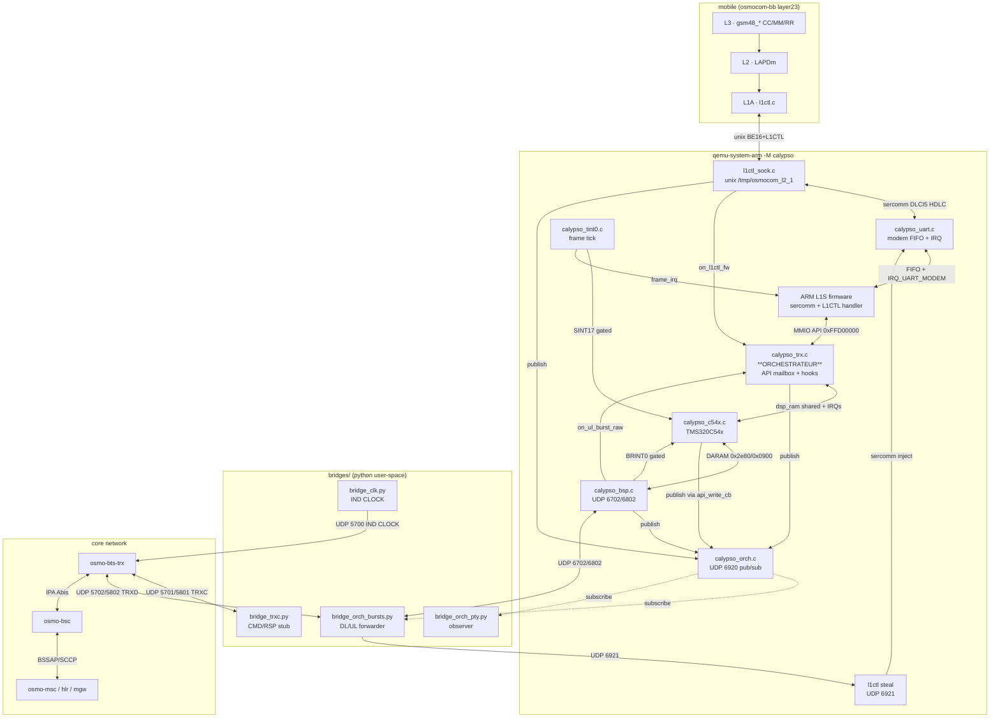
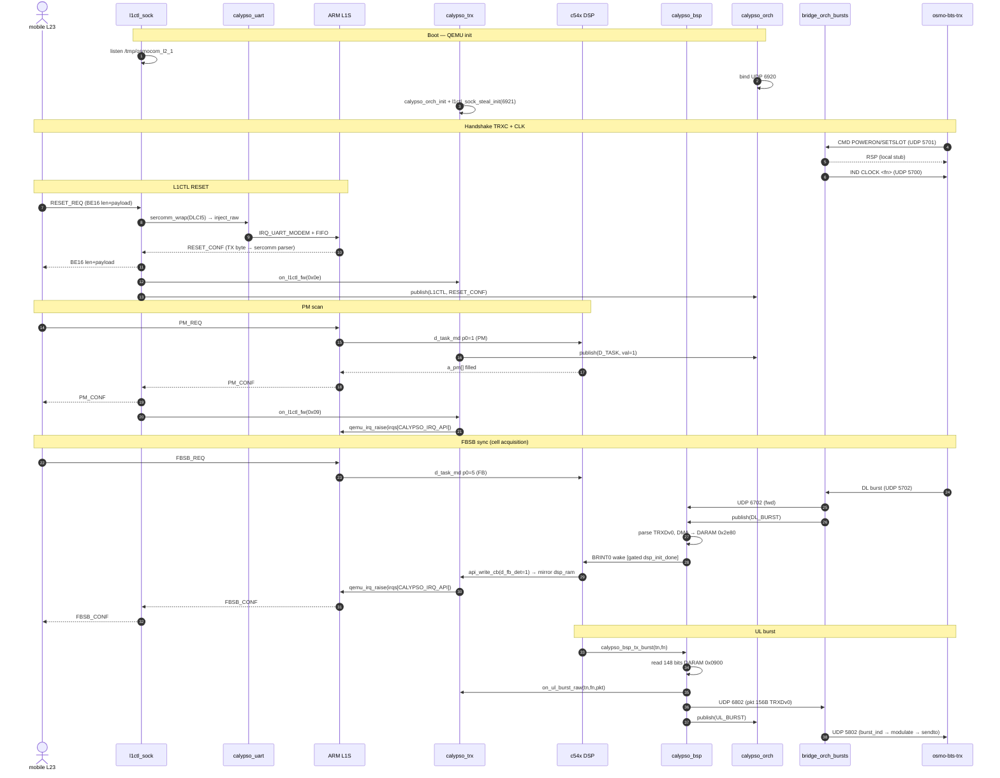
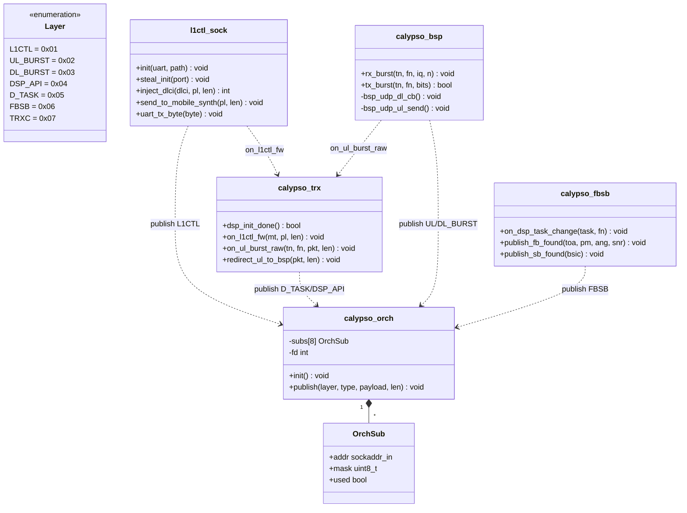

# Calypso QEMU — Architecture & Flow

> ⚠️ **PÉRIMÉ (audit doc↔code 2026-07-01, voir [DOC_CODE_AUDIT.md](../DOC_CODE_AUDIT.md)).** Ce doc décrit un état/une API qui ne correspond plus au code. Vérité-terrain : d_fb_det reste 0, DSP déraille, IMR=0x0000 jamais ré-armé, api_write_cb jamais câblé, pas de bus ORCH. Corrections ci-dessous.
>
> Portée du décalage sur CE doc : le **bus publish/subscribe UDP `calypso_orch` (6920), le path « steal » (6921) et toute la « Section 5 · API publiques (calypso_orch.h) » sont FABRIQUÉS** — ils n'existent nulle part dans l'arbre.
> - `calypso_orch.h` (dans `hw/arm/calypso/`, PAS `include/`) contient **uniquement** `static inline int calypso_orch(void)`, un simple flag d'env `CALYPSO_ORCH` — ce n'est PAS un header d'API pub/sub.
> - Aucun fichier `calypso_orch.c` n'existe ; aucun port `6920`/`6921` (`grep -rn '6920\|6921' hw/arm/calypso/` = 0).
> - Aucune des 9 fonctions déclarées en §5 (`calypso_orch_init/publish`, `l1ctl_sock_steal_init/inject_dlci/send_to_mobile_synth`, `calypso_trx_dsp_init_done/on_l1ctl_fw/on_ul_burst_raw/redirect_ul_to_bsp`) n'existe (`grep -rl` = 0 sur tout l'arbre).
> - Le flux « DSP publie `d_fb_det=1` via `api_write_cb` » ne se produit JAMAIS : `api_write_cb` n'est **jamais assigné** (`grep -rn 'api_write_cb *=' hw/arm/calypso/` = 0). Le seul point de tir est `calypso_c54x.c:3357-3358` (`if (s->api_write_cb) s->api_write_cb(...)`), gardé et jamais atteint. `d_fb_det` reste 0.
> - Les « publish » réels du code (`calypso_rach_publish`, `calypso_fbsb_publish_fb_found`, `calypso_sdcch_ul_publish`) sont des helpers locaux SANS rapport avec un bus UDP.

État post-merge orchestrator. Mobile L23 ↔ QEMU baseband ↔ osmo-bts-trx,
avec calypso_trx comme orchestrateur central et un bus publish/subscribe
UDP pour les bridges Python user-space.
<!-- FAUX (bus pub/sub UDP): calypso_trx n'est pas relié à un bus ORCH; aucun bus UDP 6920 n'existe. Voir bannière. -->

---

## 1. Vue système — composants



> **FAUX dans le diagramme ci-dessus** — nœuds/arêtes inexistants dans le code :
> - `ORCH[calypso_orch.c UDP 6920 pub/sub]` et `STEAL[l1ctl steal UDP 6921]` : aucun fichier/port correspondant.
> - arêtes `TRX/BSP/SOCK -->|publish| ORCH`, `DSP -->|publish via api_write_cb| ORCH`, `ORCH -.subscribe.-> BURSTS/OPTY`, `BURSTS -->|UDP 6921| STEAL`, `STEAL -->|sercomm inject| UART` : toutes fabriquées.

---

## 2. Sequence — L1CTL boot + FBSB cycle



> **Corrections sur la séquence ci-dessus :**
> - `qemu_irq_pulse(IRQ_API)` corrigé en `qemu_irq_raise(irqs[CALYPSO_IRQ_API])` — le code utilise `qemu_irq_raise` sur `s->irqs[CALYPSO_IRQ_API]` (`calypso_trx.c:1060` et `:1809`), il n'y a pas de `qemu_irq_pulse`.
> - Steps FABRIQUÉS (participant `ORCH`, `bind UDP 6920`, `calypso_orch_init + l1ctl_sock_steal_init(6921)`, tous les `publish(...)`) : aucun bus ORCH n'existe.
> - `DSP->>TRX: api_write_cb(d_fb_det=1)` **ne se produit jamais** — `api_write_cb` n'est jamais câblé (`grep -rn 'api_write_cb *=' hw/arm/calypso/` = 0), `d_fb_det` reste 0, le DSP déraille (POST-BOOTSTUB-RET, PC=0x0000) et l'IMR reste 0x0000. Le `FBSB_CONF` qui suit n'est donc jamais émis par cette voie.

---

## 3. Bus orchestrateur — layers & publishers

> **FAUX — section entièrement fabriquée.** La classe `calypso_orch` (init/publish/subs/fd), l'enum `Layer`, et les méthodes `l1ctl_sock.steal_init/inject_dlci/send_to_mobile_synth`, `calypso_trx.dsp_init_done/on_l1ctl_fw/on_ul_burst_raw/redirect_ul_to_bsp`, `calypso_fbsb.on_dsp_task_change/publish_sb_found` n'existent pas (`grep -rl` = 0). Diagramme conservé pour historique uniquement.



---

## 4. Bindings / adresses

| Endpoint | Type | Owner | Rôle |
|---|---|---|---|
| `/tmp/osmocom_l2_1` | unix server | `l1ctl_sock.c` | L1CTL direct mobile↔QEMU |
| ~~UDP `127.0.0.1:6920`~~ | ~~server~~ | ~~`calypso_orch.c`~~ | **FAUX** — pas de `calypso_orch.c`, aucun bind 6920 (grep=0) |
| ~~UDP `127.0.0.1:6921`~~ | ~~server~~ | ~~`l1ctl_sock_steal_init`~~ | **FAUX** — `steal_init` inexistant, aucun bind 6921 (grep=0) |
| UDP `127.0.0.1:6702` | bind | `calypso_bsp.c` | DL burst recv from bridge |
| UDP → `127.0.0.1:6802` | sendto | `calypso_bsp.c` | UL burst to bridge |
| UDP `127.0.0.1:5700` | sendto | `bridge_clk.py` | CLK IND → BTS |
| UDP `127.0.0.1:5701` | bind | `bridge_trxc.py` | TRXC CMD ← BTS |
| UDP `127.0.0.1:5702` | bind | `bridge_orch_bursts.py` | DL burst ← BTS |
| UDP `127.0.0.1:6802` | bind | `bridge_orch_bursts.py` | UL burst ← QEMU BSP |
| UDP → `127.0.0.1:5802` | sendto | `bridge_orch_bursts.py` | UL burst → BTS |
| UDP → `127.0.0.1:6702` | sendto | `bridge_orch_bursts.py` | DL burst → QEMU |

---

## 5. API publiques (calypso_orch.h)

> ⚠️ **SECTION ENTIÈREMENT FABRIQUÉE — FAUX.** Le vrai `hw/arm/calypso/calypso_orch.h` ne contient qu'un flag d'env :
> ```c
> static inline int calypso_orch(void); /* lit getenv("CALYPSO_ORCH") */
> ```
> Aucune des 9 fonctions ci-dessous n'existe dans l'arbre (`grep -rl` = 0 pour chacune). Bloc conservé pour historique, à ne PAS réimplémenter tel quel.

```c
/* Orchestrator bus */
void calypso_orch_init(void);
void calypso_orch_publish(uint8_t layer, uint8_t type,
                          const void *payload, uint16_t len);

/* L1CTL socket helpers */
void l1ctl_sock_steal_init(int port);
int  l1ctl_sock_inject_dlci(uint8_t dlci, const uint8_t *pl, int plen);
void l1ctl_sock_send_to_mobile_synth(const uint8_t *pl, int len);

/* calypso_trx kernel hooks */
bool calypso_trx_dsp_init_done(void);
void calypso_trx_on_l1ctl_fw(uint8_t mt, const uint8_t *pl, int len);
void calypso_trx_on_ul_burst_raw(uint8_t tn, uint32_t fn,
                                 const uint8_t *pkt, int len);
void calypso_trx_redirect_ul_to_bsp(const uint8_t *pkt, int len);
```

---

## 6. DSP wakes — table de gating

| Wake    | Vec | IMR bit | Source                               | Gate                              |
|---------|----:|--------:|--------------------------------------|-----------------------------------|
| SINT17  |  19 |       3 | `calypso_trx.c:calypso_tint0_do_tick`| `dsp_init_done && dsp->idle`      |
| BRINT0  |  21 |       5 | `calypso_bsp.c:calypso_bsp_rx_burst` | `dsp->idle && dsp_init_done`      |
| TINT0   |  20 |       4 | masked — firmware n'arme pas         | inactive                          |

---

## 7. Flow UL mobile → core (vue inverse)


---

## 8. Bridges Python — rôle résumé

> Note : les colonnes « Subscribe » et les ports `6920`/`6921` (steal L1CTL) ci-dessous supposent le bus ORCH et le path steal côté QEMU — **inexistants** (voir bannière). Côté QEMU rien ne publie/écoute sur ces ports.

| Bridge | Bind | Send | Subscribe | Rôle |
|---|---|---|---|---|
| `bridge_clk.py` | — | UDP 5700 | — | IND CLOCK périodique |
| `bridge_trxc.py` | UDP 5701 | UDP peer + 5801 | LAYER_TRXC | CMD stub + RSP orch |
| `bridge_orch_bursts.py` | UDP 5702, 6802 | UDP 6702, 5802, 6921 | UL/DL_BURST | DL/UL forwarder + steal L1CTL |
| `bridge_orch_pty.py` | — (subscriber only) | — | L1CTL + D_TASK + FBSB | observer |
| `orch_client.py` | — | — | — | helper subscribe/parse |
