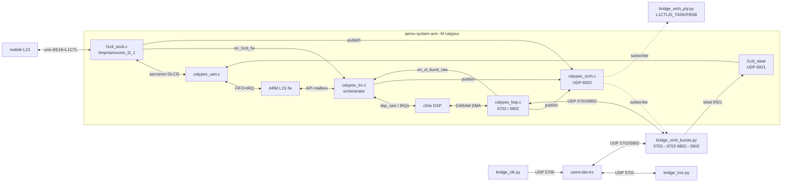
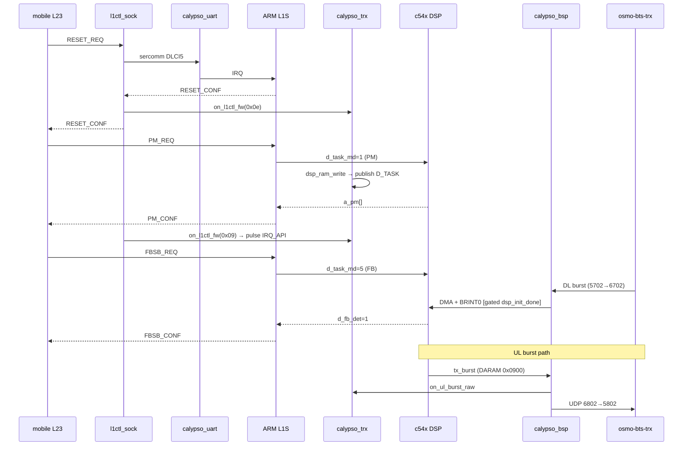

# Calypso QEMU — flow overview

## Components

## L1CTL cycle (PM → FBSB)

## Wake table (DSP)

| Wake    | Vec | IMR bit | Source                               | Gate                           |
|---------|-----|---------|--------------------------------------|--------------------------------|
| SINT17  | 19  | 3       | calypso_trx.c calypso_tint0_do_tick  | `dsp_init_done && idle`        |
| BRINT0  | 21  | 5       | calypso_bsp.c calypso_bsp_rx_burst   | `dsp->idle && dsp_init_done`   |
| TINT0   | 20  | 4       | masked by firmware                   | inactive                       |

## Layers on the orch bus

| Code | Name     | Publisher                         |
|------|----------|-----------------------------------|
| 0x01 | L1CTL    | `l1ctl_sock.c` after send_to_mobile |
| 0x02 | UL_BURST | `calypso_bsp.c` bsp_udp_ul_send   |
| 0x03 | DL_BURST | `calypso_bsp.c` bsp_udp_dl_cb     |
| 0x04 | DSP_API  | `calypso_trx.c` api_write_cb      |
| 0x05 | D_TASK   | `calypso_trx.c` dsp_ram_write     |
| 0x06 | FBSB     | `calypso_fbsb.c` publish_fb/sb    |
| 0x07 | TRXC     | reserved (bridge_trxc future)     |
