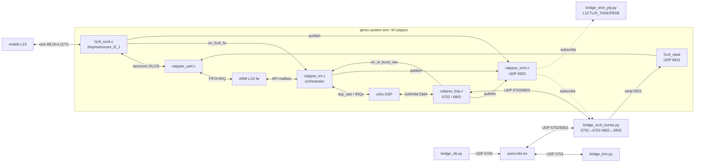
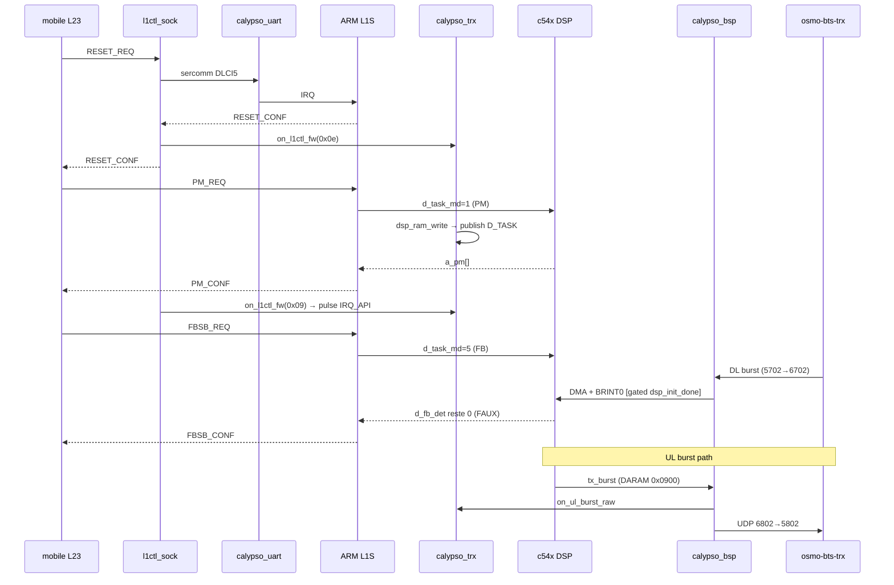

> ⚠️ **PÉRIMÉ (audit doc↔code 2026-07-01, voir [DOC_CODE_AUDIT.md](../DOC_CODE_AUDIT.md)).** Ce doc décrit un état/une API qui ne correspond plus au code. Vérité-terrain : d_fb_det reste 0, DSP déraille, IMR=0x0000 jamais ré-armé, api_write_cb jamais câblé, pas de bus ORCH. Corrections ci-dessous.
>
> Détails vérifiés :
> - **Pas de `calypso_orch.c`** dans l'arbre (seul `calypso_orch.h` existe) et **pas de bus UDP 6920/6921** : les blocs `ORCH`, `STEAL`, `BURSTS` et toutes les arêtes `publish`/`subscribe`/`steal` ci-dessous décrivent un bus qui n'existe pas.
> - **`api_write_cb` jamais assigné** : déclaré `calypso_c54x.h:204`, appelé conditionnellement `if (s->api_write_cb)` à `calypso_c54x.c:3357-3358`, mais aucun `api_write_cb =` nulle part → callback NULL, ne publie rien. (Il vit dans `calypso_c54x.c`, pas `calypso_trx.c`.)
> - **`d_fb_det` reste 0** : le DSP déraille (POST-BOOTSTUB-RET, PC=0x0000), le handshake go-live ARM→DSP ne s'arme jamais.

# Calypso QEMU — flow overview

## Components

> ⚠️ FAUX (audit 2026-07-01) : les nœuds `ORCH` (`calypso_orch.c` / UDP 6920), `STEAL` (`l1ctl_steal` / UDP 6921) et `BURSTS` (`bridge_orch_bursts.py`) **n'existent pas** dans le code — seul `calypso_orch.h` est présent, aucun `calypso_orch.c`, aucun socket 6920/6921. Toutes les arêtes `publish` / `subscribe` / `steal 6921` sont donc du flux imaginaire.

## L1CTL cycle (PM → FBSB)

> ⚠️ FAUX (audit 2026-07-01) : le DSP **n'écrit jamais** `d_fb_det=1`. Vérité-terrain : `d_fb_det` reste 0 sur tout le run, le DSP déraille (POST-BOOTSTUB-RET, PC=0x0000) et IMR=0x0000 n'est jamais ré-armé après le clear boot @0xb37e. Ce diagramme représente le flux *attendu*, pas le flux *réel*.

## Wake table (DSP)

| Wake    | Vec | IMR bit | Source                               | Gate                           |
|---------|-----|---------|--------------------------------------|--------------------------------|
| SINT17  | 19  | 3       | calypso_trx.c calypso_tint0_do_tick  | `dsp_init_done && idle`        |
| BRINT0  | 21  | 5       | calypso_bsp.c calypso_bsp_rx_burst   | `dsp->idle && dsp_init_done`   |
| TINT0   | 20  | 4       | masked by firmware                   | inactive                       |

## Layers on the orch bus

> ⚠️ FAUX (audit 2026-07-01) : il n'y a **pas de bus orch** (`calypso_orch.c` absent, pas de socket 6920). Ce tableau décrit des publishers dont plusieurs ne sont pas câblés — voir annotations.

| Code | Name     | Publisher                         |
|------|----------|-----------------------------------|
| 0x01 | L1CTL    | `l1ctl_sock.c` after send_to_mobile |
| 0x02 | UL_BURST | `calypso_bsp.c` bsp_udp_ul_send   |
| 0x03 | DL_BURST | `calypso_bsp.c` bsp_udp_dl_cb     |
| 0x04 | DSP_API  | ~~`calypso_trx.c` api_write_cb~~ — **FAUX** : `api_write_cb` déclaré `calypso_c54x.h:204`, appelé conditionnellement `calypso_c54x.c:3357-3358`, mais **jamais assigné** (`grep 'api_write_cb ='` = 0) → NULL, ne publie rien. Vit dans `calypso_c54x.c`, pas `calypso_trx.c`. |
| 0x05 | D_TASK   | `calypso_trx.c` dsp_ram_write     |
| 0x06 | FBSB     | ~~`calypso_fbsb.c` publish_fb/sb~~ — **CORRIGÉ** : seul `calypso_fbsb_publish_fb_found` existe (`calypso_fbsb.c:47`) ; `publish_sb_found` (et le reste de la synthèse hôte) supprimé au cleanup 2026-05-28 (`calypso_fbsb.c:4-5`). |
| 0x07 | TRXC     | reserved (bridge_trxc future)     |
