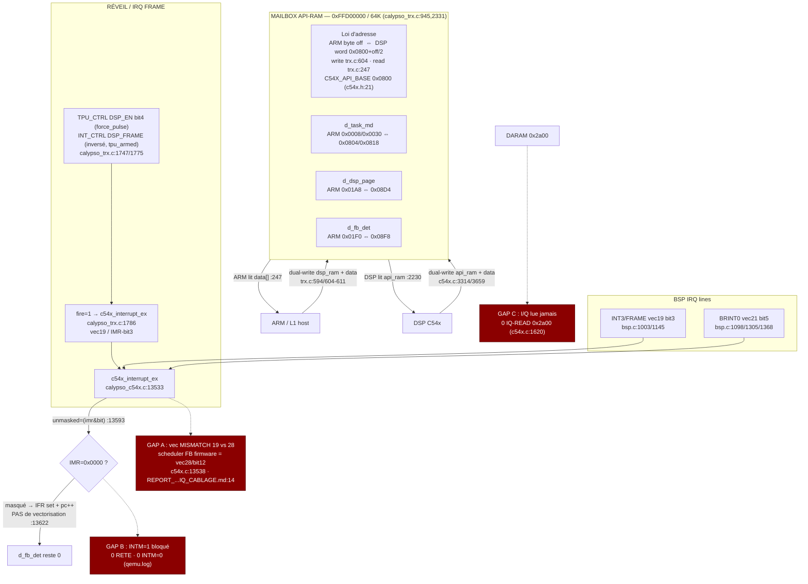
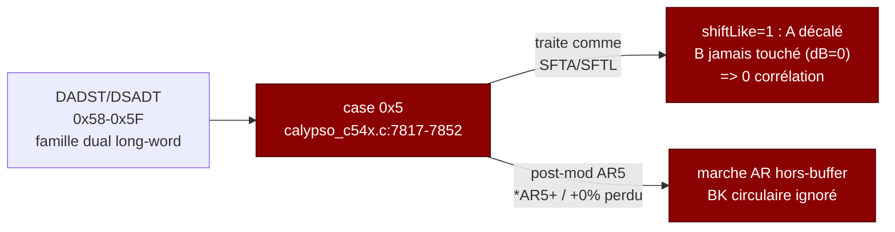

# Schematics — Référence visuelle du câblage DSP C54x / ARM Calypso

> Objectif projet : faire tourner le VRAI DSP TMS320C54x émulé pour qu'il détecte
> FB/FCCH et écrive `d_fb_det != 0`. Contrainte (règle #1) : AUCUN hack / AUCUN poke
> de l'état interne DSP — on ne corrige que le CÂBLAGE de l'émulateur.
>
> Chaque schéma est légendé avec des citations `fichier:ligne`. Les faits sont
> alignés sur l'audit + la synthèse (run live `/root/qemu.log`). Les corrections
> apportées par la synthèse au cours de ce run sont taguées **[CORRIGÉ CE RUN]**.
>
> **Diagnostic terminal (engagé) :** `d_fb_det=0` parce que l'IMR du DSP est mis à
> `0x0000` au boot (`calypso_c54x.c` BOOT-MMR-WR #7, `PC=0xb37e op=0x7700`) et
> jamais ré-armé ⇒ l'IRQ frame livrée de façon fiable (`calypso_trx.c:1786`) est
> masquée en permanence ET mal ciblée sur vec19 au lieu du vec28 du scheduler
> firmware. Le correctif est du câblage d'interruption émulateur
> (`calypso_c54x.c:13547-13565`), PAS un nouveau pipe ni un refactor.

---

## Légende des marqueurs

```
[OK]     chemin câblé et vivant à l'exécution (prouvé dans qemu.log)
[GAP]    rupture fonctionnelle identifiée par l'audit
[DEAD]   code présent mais jamais exécuté dans ce run
[EXP]    levier expérimental gaté par env, OFF par défaut
```

---

## (A) Pipeline bout-en-bout : radio → DSP → ARM

```mermaid
flowchart LR
    OSMO["osmo-trx<br/>(UDP TRXD)"] -->|socket| DRAIN["bsp_drain_cb<br/>timer 5ms<br/>calypso_bsp.c:695"]
    DRAIN --> DELIV["deliver_buffered<br/>calypso_bsp.c:1107"]
    DELIV -->|AFC in-place<br/>apply_phase :1243| AFC["sl.iq post-AFC"]
    AFC -->|"data[0x2a00+woff]=iq<br/>calypso_bsp.c:1259"| DARAM["DARAM I/Q window<br/>0x2a00..0x2b27<br/>len 296 (:795)"]
    AFC -.->|"c54x_bsp_load<br/>bsp_buf :1248"| BSPBUF["bsp_buf (PORTR)"]

    DARAM -.->|"LECTURE JAMAIS FAITE<br/>0 hits IQ-READ :1620"| CORR["Corrélateur FCCH<br/>ROM 0xa04c/0xa070<br/>DADST/DSADT+CMPS"]
    CORR -->|"écrit d_fb_det<br/>data[0x08F8]"| DFB["d_fb_det<br/>(NDB)"]
    DFB -->|"ARM lit 0x01F0<br/>calypso_trx.c:247"| PRIM["prim_fbsb<br/>fbsb FB0_SEARCH"]
    PRIM --> CONF["FBSB_CONF<br/>(vers L1/osmocom)"]

    classDef ok fill:#1b5e20,color:#fff,stroke:#0d3010;
    classDef gap fill:#8b0000,color:#fff,stroke:#4d0000;
    classDef dead fill:#555,color:#ddd,stroke:#222;
    class OSMO,DRAIN,DELIV,AFC,DARAM ok;
    class CORR,DFB gap;
    class BSPBUF dead;
```



**Légende A.** Côté ÉCRITURE **[OK]** : le radio→DARAM est vivant, `delivered=125093`
rafales post-AFC écrites dans `data[0x2a00]` (`calypso_bsp.c:1259`, window par défaut
`daram_addr=0x2a00 len=296` `:795`). Côté LECTURE **[GAP]** : le corrélateur ROM ne
tourne jamais — `0` hit `IQ-READ`/`SPAN-READ` (`calypso_c54x.c:1620/1648`), `0` ref
`2a00` dans tout le log. Donc `d_fb_det(0x01F0)` reste `0x0000` et `fbsb FB0_SEARCH`
garde `fb0_ret=0`. La fenêtre est écrite mais jamais échantillonnée : la cause est
en aval (le DSP ne dispatch jamais la tâche FB), pas un feed manquant. `bsp_buf`/PORTR
est **[DEAD]** ce run (`calypso_bsp.c:1248` chargé mais PORTR jamais consommé).

---

## (B) Orchestration ARM↔DSP : mailbox + réveil + BSP



**Légende B.** Le mailbox **[OK]** : mapping correct et bidirectionnel prouvé au runtime
(ARM poste `d_dsp_page=0x0002`, `d_task_md=0x0001` ; DSP écrirait `d_fb_det`). Loi
d'adresse `ARM_byte → DSP_word 0x0800+off/2` (`calypso_trx.c:604/247`), `api_ram`
alias de `dsp_ram` (`c54x_set_api_ram` `trx.c:2374`), cohérence par dual-write des deux
côtés. Le réveil **[GAP A+B]** : l'IRQ frame arrive en vec19/bit3 (`calypso_trx.c:1786`,
`C54X_INT_FRAME_VEC=19/BIT=3` `calypso_c54x.h:126-127`) mais `IMR=0x0000` ⇒
`unmasked=false` (`c54x.c:13593`) ⇒ branche IDLE-wake masquée `s->pc++` (`c54x.c:13622`),
JAMAIS de vectorisation. Le scheduler FB firmware attend vec28/bit12 (`c54x.c:13538`) :
double rupture (mauvais vecteur + masqué). **[GAP C]** downstream : `0x2a00` jamais lue.

---

## (C) Memory map DSP (data / prog, OVLY, API-RAM, DARAM I/Q)

| Zone | Adresse (DSP word) | Rôle | Référence |
|---|---|---|---|
| Reset vector | `0xFF80` (IPTR=0x1FF boot) | entrée reset ROM | `calypso_c54x.c:13618` |
| Stub RET haut | `0xFFCC` (vec19 sous IPTR=0x1FF) | RET-terminated, boot uniquement | C54X_DECODER_AUDIT.md:76-112 |
| API-RAM base | `0x0800` (`C54X_API_BASE`) | mailbox ARM↔DSP | `calypso_c54x.h:21` |
| d_task_md | `0x0804` / `0x0818` | commande tâche | `calypso_c54x.c:1696` |
| d_task_md (mirror) | `0x058a` | write-page → DARAM | qemu.log task_md(058a) |
| write-page DMA | `0x0584/0585/0586` | commit MCU→DSP | `calypso_trx.c:952-1003` |
| d_dsp_page | `0x08D4` | B_GSM_TASK bit1 | `calypso_bsp.c:986-993` |
| d_fb_det | `0x08F8` | flag détection FB | `calypso_c54x.c:3390` |
| DARAM I/Q window | `0x2a00..0x2b27` (len 296) | entrée corrélateur FCCH | `calypso_bsp.c:795/1259` |
| soft-vector go-live | `0x3f6d` = 0xa4df | trampoline 0x71f4 | `calypso_c54x.c:11898-11929` |
| go-live poll flag | `0x3f70` bit1 (0x0002) | wait-loop 0xa4d4 | `calypso_c54x.c:11945-11955` |

```
       DSP DATA SPACE (mots 16 bits)                DSP PROG SPACE
   ┌───────────────────────────────┐          ┌───────────────────────────┐
   0x0800 ┤ API-RAM (mailbox)       │          0xA04C ┤ handler vec19 (IPTR=0x140)
   0x0804 ┤   d_task_md             │          0xA070 ┤ scheduler FB vec28  ◀── cible
   0x08D4 ┤   d_dsp_page (bit1 GSM) │          0xA4C7 ┤ go-live (ORM #,IMR)
   0x08F8 ┤   d_fb_det   ◀── GOAL   │          0xA4D4 ┤ wait-loop (0x3f70 b1)
   ...    ┤                         │          0xA582 ┤ arme IMR=0x52fd
   0x2A00 ┤ I/Q window (296)  [OK écrit]        0xB37E ┤ STM #0,IMR  (efface IMR!)
   0x2B27 ┤   ...           [GAP jamais lue]     0xFF80 ┤ reset / 0xFFCC RET stub
   0x3F6D ┤ soft-vector 0xa4df      │          └───────────────────────────┘
   0x3F70 ┤ go-live poll (bit1)     │
   ┴───────────────────────────────┘
   OVLY : API-RAM (dsp_ram) aliasée sur DARAM data[] via c54x_set_api_ram (trx.c:2374)
```

**Légende C.** L'espace data porte le mailbox (`0x0800+`), la fenêtre I/Q corrélateur
(`0x2a00`, écrite `delivered=125093` fois `calypso_bsp.c:1259`) et les cellules go-live
(`0x3f70`). L'`api_ram` est un alias de `dsp_ram` (`calypso_trx.c:2374`) : les trois vues
(`dsp_ram` / `dsp->data` / `api_ram`) sont maintenues cohérentes par dual-write. Le
scheduler FB firmware vit en prog `0xA070` (vec28, IPTR=0x140), tandis que l'IRQ livrée
tombe sur vec19 → `0xA04C`, et au boot sur le stub RET `0xFFCC` (IPTR=0x1FF).

---

## (D) Machine à états boot → FB dispatch (où ça bloque)

```mermaid
stateDiagram-v2
    [*] --> Reset : PC=0xFF80 (IPTR=0x1FF)
    Reset --> BootInit : boot ROM
    BootInit --> ClearIMR : PC=0xb37e op=0x7700<br/>STM #0,IMR  IMR 0x3000->0x0000<br/>insn=1047
    ClearIMR --> RelocIPTR : PMST-WR val=0x0038<br/>IPTR relocalisé PC=0xb38f insn=1874
    RelocIPTR --> BootStack : PC=0xb382 SP 0x1100->0x5ac8
    BootStack --> Trampoline : 0x71f4 LD *(0x3f6d),A ; BACC A<br/>soft-vector=0xa4df
    Trampoline --> WaitLoop : 0xa4d4-0xa4e2<br/>teste data[0x3f70] bit1<br/>INTM=1  IMR=0x0000

    WaitLoop --> WaitLoop : bit1=0 (lit 0x0000)<br/>BLOCAGE ICI
    WaitLoop --> GoLive : bit1=1 (jamais atteint)
    GoLive --> ArmIMR : 0xa4c7 ORM #,IMR / 0xa582<br/>IMR=0x52fd (bit12)
    ArmIMR --> FBDispatch : vec28 scheduler<br/>corrélateur -> d_fb_det
    FBDispatch --> [*]

    note right of WaitLoop
      BLOCAGE (audit finding #3)
      bit1 setter ~0xde9c gaté TC sur
      cellules 0x0314/0x0318 (ARM API)
      ARM n'écrit que val=0x0000 fn=0
      (HS-ARM-GATE trx.c:3053-3070)
      => DE-BR data[0x3f70]=0x0001 TC=0
         jamais 0x0002 ; F70-SETBIT1 count=0
    end note
```

**Légende D.** Le boot efface l'IMR à `0x0000` (`STM #0,IMR` `PC=0xb37e op=0x7700`
insn=1047) **[CORRIGÉ CE RUN : IMR reste 0x0000 tout le run, jamais ré-armé — 0 ligne
`INTM=0`, 0 RETE]**. **[CORRIGÉ CE RUN]** contrairement à l'audit finding #1, l'IPTR EST
relocalisé tôt (`PMST-WR val=0x0038` `PC=0xb38f insn=1874`), donc le stub RET `0xFFCC`
n'est touché que pendant les ~1874 premières insns. Le DSP entre la wait-loop `0xa4d4`
et teste `data[0x3f70] bit1` (`calypso_c54x.c:11945-11955`) : il lit toujours `0x0000`
et **BLOQUE**. Cause : le setter bit1 (~`0xde9c`) est gaté TC sur les cellules API
`0x0314/0x0318`, mais l'ARM n'y écrit que `val=0x0000` à `fn=0` (`HS-ARM-GATE`
`calypso_trx.c:3053-3070`) ⇒ `DE-BR data[0x3f70]=0x0001 TC=0`, jamais `0x0002`. Donc
go-live `0xa4c7`/`0xa582` (qui armerait `IMR=0x52fd`) n'est jamais atteint.

---

## (E) Vignette : boucle interne corrélateur & bug `case 0x5`

```
Corrélateur FCCH — 1 groupe ×8 taps  (ROM 0xa077..0xa09b)
────────────────────────────────────────────────────────────────────────
 PC      op     instr              routage handler            état
 0xa077  5a85   DADST *AR5,A   ──▶  case 0x5 (c54x.c:7817)     [BUG] → SFTA/SFTL
 0xa078  5f95   DSADT *AR5+,B  ──▶  case 0x5                   [BUG] *AR5+ post-mod perdu
 0xa079  8e94   CMPS A,*AR4+   ──▶  case 0x8 (hi8 0x8E)        [OK] +resolve_smem
 0xa07a  8f93   CMPS B,*AR3+   ──▶  case 0x8 (hi8 0x8F)        [OK] +resolve_smem
   … ×8 groupes (DADST/DSADT alternent dst A/B) …
 0xa09b  5fd5   DSADT *AR5+0%,B ─▶  case 0x5                   [BUG] BK circulaire ignoré
────────────────────────────────────────────────────────────────────────
```



**Légende E.** La famille dual long-word DADST/DSADT (opcodes `0x58-0x5F`) est
mal-routée par `case 0x5` (`calypso_c54x.c:7817-7852`) qui la traite en SFTA/SFTL :
l'accumulateur `A` n'est que décalé (`shiftLike=1`), `B` jamais touché (`dB=0`) ⇒ **0
corrélation calculée**, et le post-mod `*AR5+`/`+0%` (circulaire, `BK`) est perdu ⇒
marche AR hors-buffer (cf. `doc/FB_CORRELATOR_PIPELINE.md:46-116`, sonde SHADOW-DADST
run 2026-06-22, 40/40 échantillons). Note : ce bug est en AVAL du blocage principal —
le corrélateur ne tourne même pas ce run (IMR=0 / DSP idle), donc `case 0x5` ne se
déclenche pas encore ; il deviendra bloquant dès que la vectorisation FB sera câblée.

---

## Résumé des GAP (alignés audit + synthèse)

| # | GAP | Marqueur | Site du correctif | Preuve |
|---|---|---|---|---|
| A | IRQ frame livrée vec19/bit3 au lieu de vec28/bit12 | [GAP] | `calypso_c54x.c:13547-13565` (remap EXP) / `calypso_trx.c:1786` | REPORT_...IQ_CABLAGE.md:14 |
| B | IMR=0x0000 tout le run ⇒ INTM=1 jamais levé | [GAP] | reach go-live 0xa582 (arme IMR=0x52fd) | qemu.log 0×`INTM=0`, 0×RETE |
| C | Fenêtre I/Q 0x2a00 écrite mais jamais lue | [GAP downstream] | se débloque quand corrélateur tourne | qemu.log 0 hit `2a00` |
| D | Handshake go-live ARM→DSP jamais asserté (val=0x0000) | [GAP faithful] | `calypso_trx.c:3053-3070` + notify `c54x.c:3355` | qemu.log HS-ARM-GATE |
| E | DADST/DSADT mal-routés `case 0x5` | [BUG latent] | `calypso_c54x.c:7817-7852` | FB_CORRELATOR_PIPELINE.md:52-68 |

**Lever principal (le plus proche causalement) :** `CALYPSO_DSP_FRAME_VEC28`
(`calypso_c54x.c:13554-13565`) — retarget vec19→vec28/bit12 + force-vectorise quand
`d_dsp_page bit1` posté (satisfait dès fn≈1206). OFF par défaut ce run
(`VEC28-FORCE count=0`). Une seule vectorisation atteint go-live `0xa582` qui arme
`IMR=0x52fd` lui-même — ensuite tout se vectorise seul. Aucun poke IMR/table/d_fb_det.

**Alternative plus fidèle (finding #3) :** câbler le notify `api_write_cb`
(`calypso_c54x.c:3355`, non-enregistré/NULL) pour que l'ARM apprenne la fin de boot DSP
et écrive l'enable non-nul dans `0x0314/0x0318` → le DSP arme l'IMR lui-même, sans
bypass. Verdict refactor : **ORTHOGONAL** — nettoyage, pas le correctif, pas un
prérequis. Un module `calypso_dspmb.c` (une entrée de livraison INT3, une DMA
write-page, un feed `c54x_bsp_load`) réduirait le risque de régression mais ne bouge
pas `d_fb_det` par lui-même.
