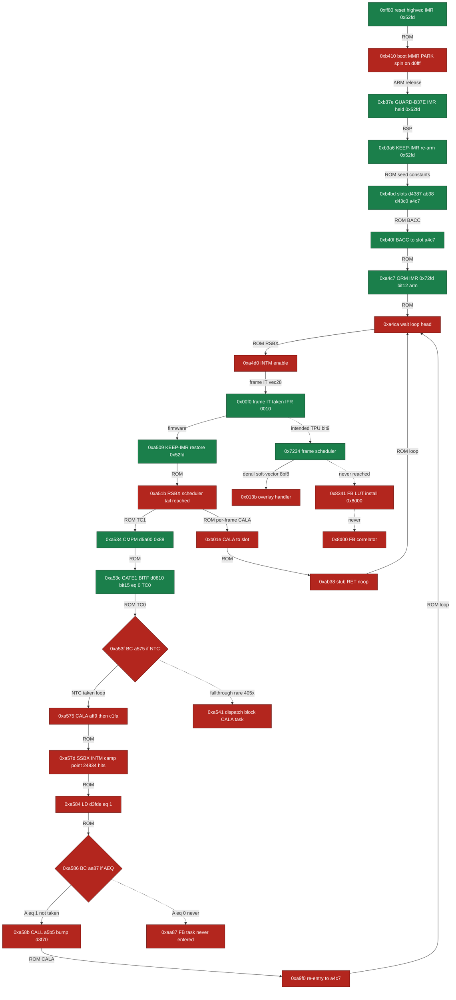

# Calypso — Chemin boot → go-live → L1 → corrélateur FB (tracé, cité)

> Trace live osmo-operator-1, tout cité (log insn/PC, code file:line, ROM opcode). 24 étapes.

## Chemin ordonné

| # | PC | Action | Driver | Atteint | Réf |
|---|-----|--------|--------|---------|-----|
| 1 | `0xff80` | Reset/high-vector entry. INTM latched=1, IMR=0x52fd (reset seed presen | ROM | **YES** | qemu_live.log:48-51 HIGHVEC-ENTRY #1 0xff80 insn=0; BRANCH-TRACE tgt=0xb410 |
| 2 | `0xb410` | Boot MMR init; early PARK spin b41c/b424/b427 on data[0x0fff]=0x0001 u | ROM | **LOOPS** | qemu_live.log:57-84 BOOT-MMR-WR; :820 PARK pc=0xb427 insn=2000; :965 l1ctl RESET |
| 3 | `0xb37e` | STM #0,IMR (op 7700) would CLEAR IMR to 0. GUARD-B37E suppresses the w | BSP | **YES** | qemu_live.log:1015-1018 IMR-DYN PC=0xb37e writes=0x0000; GUARD-B37E ignore, IMR  |
| 4 | `0xb3a6` | Second IMR touch op 68f8 sets 0x52fd->0x4050; KEEP-IMR @0xb3a9 immedia | firmware | **YES** | qemu_live.log:1312-1314 IMR-ARM PC=0xb3a6; KEEP-IMR re-arme @0xb3a9 insn=3076 |
| 5 | `0xb4bd` | ROM boot table-init seeds dispatch slots as CONSTANTS: data[0x4387]<-0 | ROM | **YES** | qemu_live.log:1114/1118 SLOT4387-WR ab38 + DISPPTR-WR data[0x43c0]->0xa4c7 PC=0x |
| 6 | `0xb40f` | Terminal dispatcher: AR7=0x43c0 (post LDK8 fix), LD *AR7=0xa4c7, BACC  | ROM | **YES** | qemu_live.log:1448-1455 TERMINAL-DISP data[AR7]=0xa4c7; BACC-DISP #1 handler=0xa |
| 7 | `0xa4c7` | THE ARM: ORM #0x3000,IMR (op 69f8) 0x52fd->0x72fd, sets bit12/vec28 fr | ROM | **YES** | qemu_live.log:1458-1459 IMR-ARM 0x52fd->0x72fd (b12/vec28 b5/vec21) PC=0xa4c7 in |
| 8 | `0xa4ca` | Go-live wait-loop head: a4cb CALL aad5 ready-scan, a4cd BC a4d4 (rare, | ROM | **LOOPS** | qemu_live.log:1462 ENTRY-A4CA #1; :2712 INTM-TRANS 1->0 PC=0xa4d0 insn=34063; a4 |
| 9 | `0x00d0` | vec20 TINT0 handler serviced; then vec28 frame-IT @0x00f0 TAKEN: INTM  | TINT0 | **YES** | qemu_live.log:1206 vec20; :1215 vec28 @0x00f0 731e 3fcf f880 7234; :2291 INTM-TR |
| 10 | `0xa509` | Per-frame scheduler tail: a509 STM IMR=0x0010 (would strip bits), a50b | firmware | **LOOPS** | qemu_live.log:2432-2437 IMR-DYN PC=0xa509 writes=0x0010; KEEP-IMR @0xa50b insn=3 |
| 11 | `0xa51b` | Frame-scheduler tail RSBX INTM 1->0 — steady-state loop entry. THIS is | ROM | **LOOPS** | qemu_live.log:2454 INTM-TRANS 1->0 PC=0xa51b IMR=0x52fd insn=33844; ROM a51b=0xf |
| 12 | `0xa534` | CMPM data[0x5a00],#0x0088 -> queue head matches -> TC=1; a537 BC 0xa53 | ROM | **YES** | qemu_live.log CYCLE-TRACE a537 TC=1 d[5a00]=0x0088 insn=33931; ROM a534=60f8/5a0 |
| 13 | `0xa53c` | GATE-1: BITF data[0x0810] & 0x8000 tests bit15 of d_ctrl_system (ARM g | ROM | **YES** | qemu_live.log CYCLE-TRACE a53c AR1=0x0800 data[0x0810]=0x0000 insn=33932; =0x000 |
| 14 | `0xa53f` | PIVOT: BC 0xa575 if NTC. TC=0 -> BRANCH TAKEN to a575, SKIPPING dispat | ROM | **LOOPS** | qemu_live.log CYCLE-TRACE a53f BC a575 if NTC; 19596 TC=0 skip vs 405 TC=1 dispa |
| 15 | `0xa575` | LD d[0x4368]=0xaff9; a577 CALA 0xaff9; a57a LD d[0x3fd4]=0xc1fa; a57c  | ROM | **LOOPS** | qemu_live.log CALA-WIDE pc=0xa577 -> 0xaff9 insn=33935; pc=0xa57c -> 0xc1fa insn |
| 16 | `0xa57d` | SSBX INTM — disable IT. THE LOOP INTM-set point (24835 hits). Housekee | ROM | **LOOPS** | qemu_live.log INTM-TRANS 0->1 PC=0xa57d op=0xf7bb IMR=0x52fd insn=34018 (24834 h |
| 17 | `0xa584` | LD data[0x3fde] -> A = 0x000001 (FB task-pending flag, pinned at 1, ne | ROM | **LOOPS** | qemu_live.log SM-TRACE pc=0xa586 A=0x000001 insn=34023; ROM a584=10f8/3fde |
| 18 | `0xa586` | GATE-2: BC 0xaa87 if AEQ (A==0) — FB task at 0xaa87 dispatched only if | ROM | **NO** | qemu_live.log SM-TRACE pc=0xa586 op=0xf944 A=0x000001 insn=34023; pc=0xaa87 coun |
| 19 | `0xa58b` | CALL 0xa5b5 housekeeping stub: a5bd bumps d[0x3f70] 0x0001->0x0002, wr | ROM | **LOOPS** | qemu_live.log F70-SETBIT1 PC=0xa5bd insn=34038; HANDLER-PATH PC=0xa9ea d[0x3f70] |
| 20 | `0xb01e` | Per-frame CALA (op f4e3) fires each frame -> target=0xab38, the seeded | ROM | **LOOPS** | qemu_live.log CALA-WIDE pc=0xb01e -> target=0xab38 insn=33958 +26 identical |
| 21 | `0xab38` | Dispatch STUB executes: op=0xfc00 RET, a bare return, does nothing. FB | ROM | **YES** | qemu_live.log:54930 pc=0xab38 op=0xfc00 RET; classified RET/noop calypso_c54x.c: |
| 22 | `0x7234` | INTENDED native root (fails): frame scheduler 0x7234 (via vec28) shoul | ROM | **NO** | qemu_live.log:2293 HANDLER-PATH PC=0x7234 (47 hits) -> :2296 OVLY-TRACE pc=0x013 |
| 23 | `0x8341` | Native FB dispatcher (LUT slot data[(DP<<7)|0x07] -> FB handler -> ins | ROM | **NO** | grep '0x8341' qemu_live.log = 0; grep '8d00' = 0 hits; FBDET-WR data[0x08F8]=0 h |
| 24 | `0x8d00` | FB correlator entry. NEVER REACHED. No computed transfer (CALA/BACC ov | ROM | **NO** | qemu_live.log CALA-WIDE DANS-CORRELATEUR count=0; targets only aff9/ab38/a4c7/00 |

## Point de divergence

The live path diverges at the terminal computed dispatch: the BACC at 0xb40f and the per-frame CALA at 0xb01e both resolve their dispatch slot (data[0x43c0]=0xa4c7, data[0x4387]=0xab38) to the boot-seeded CONSTANTS 0xa4c7 (go-live arm) / 0xab38 (idle RET stub) — NEVER to the FB handler 0x8d00. Deciding cell/condition: 0x8d00 is installed into a slot ONLY by the native FB LUT at 0x8341, and 0x8341 is unreachable because the frame scheduler 0x7234 DERAILS to overlay handler 0x013b via soft-vector data[0x013b]=0x8bf8 (written PC=0x7213) instead of falling through to 0x8341. Log proof: qemu_live.log:2293 HANDLER-PATH PC=0x7234 (47 hits) -> :2296 OVLY-TRACE pc=0x013b op=0x8bf8; grep '0x8341'=0, grep '8d00'=0. In the steady loop this surfaces as the a53f PIVOT (ROM a53f=f820/a575: BC 0xa575 if NTC TAKEN because GATE-1 BITF data[0x0810]&0x8000=0, insn=33932) which skips the dispatch block, and GATE-2 a586 (ROM a586=f944/aa87: BC 0xaa87 if AEQ NOT taken because d[0x3fde]=1, insn=34023). Because the slot is a static constant and never re-armed per burst, the DSP camps SSBX@0xa57d (qemu_live.log INTM-TRANS 0->1 PC=0xa57d insn=34018, 24834 hits). Reference divergence anchor: insn=33958 CALA-WIDE pc=0xb01e -> target=0xab38 vs required target 0x8d00 (calypso_c54x.c:2556-2568 terminal dispatcher, :4537-4541 intended 0x8341->0x8d00 chain).

## Rôle TPU (le signal dynamique manquant)

Per RX burst window (the FB/SB search window opened by l1s at the FB frame), the TPU should DYNAMICALLY pilot two things that are currently static boot constants: (1) raise/toggle IMR bit9 — the burst/DSP-block interrupt that steers the frame scheduler through 0x7234 -> 0x8341 (the FB LUT path) instead of letting d_dsp_page garbage derail it to the 0x013b overlay; and (2) drive the dispatch-slot install so the computed BACC/CALA (0xb40f terminal dispatcher, 0xb01e per-frame CALA) resolves data[0x43c0]/data[0x4387] to the FB handler 0x8d00 for that one frame, then releases it. Today the IMR bit9 toggle and the slot contents are frozen at boot-seeded values (0xa4c7/0xab38, PC=0xb4bd/0xbb00) and no TPU AT-event at the burst boundary flips them, so GATE-1 data[0x0810] bit15 stays 0 and the FB-task pending cell d[0x3fde] stays 1 — the correlator is never selected. The TPU window edge is the dynamic signal that must gate both the interrupt and the slot install per-burst, exactly the dynamic (not static-pin) mechanism required.

## Fix le plus central

Wire a TPU AT-event at the FB/SB burst-window boundary that, for that frame only, (a) raises IMR bit9 so the frame scheduler takes 0x7234 -> 0x8341 rather than derailing to the 0x013b overlay, and (b) writes the FB handler address 0x8d00 into the active dispatch slot data[0x43c0] (replacing the static 0xa4c7/0xab38 constant) so the computed BACC at 0xb40f / CALA at 0xb01e lands in the correlator. This single per-burst TPU-driven dispatch-install+interrupt is the most central fix: it is dynamic and TPU/BSP-piloted (not a static IMR pin), and it directly converts the seeded-constant dispatch into the FB LUT path that 0x8341 would have installed.

## Diagramme du chemin

