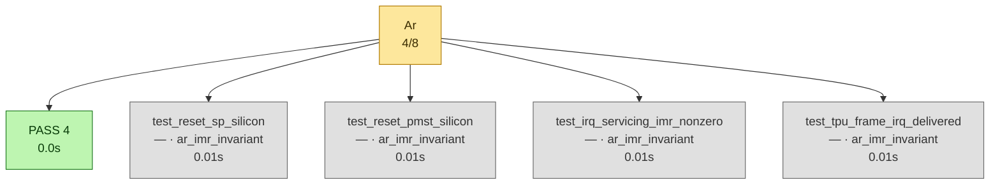
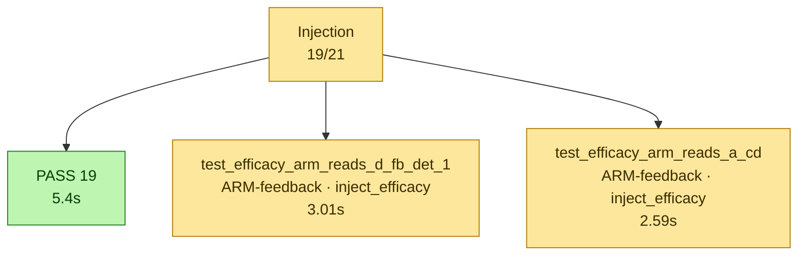
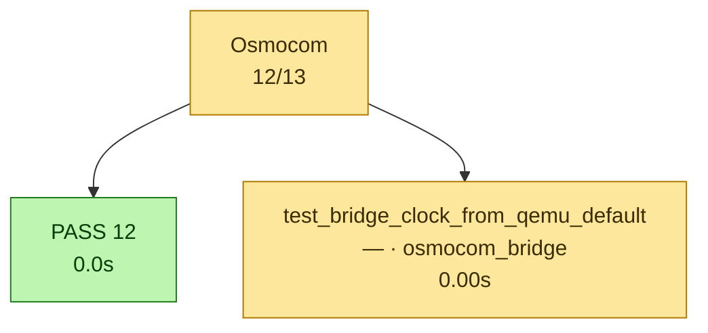
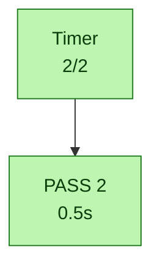

```mermaid
graph LR
  classDef pass    fill:#bef5b1,stroke:#1f7a1f,color:#0a3d0a;
  classDef partial fill:#fde79c,stroke:#b07a00,color:#3a2c00;
  classDef fail    fill:#fbb4b4,stroke:#a31a1a,color:#5a0000;
  classDef skip    fill:#e0e0e0,stroke:#6a6a6a,color:#333;
  classDef brk  fill:#ff5252,stroke:#990000,color:#fff,stroke-width:3px;
  P_Infra["Infra<br/>5/5"]
  class P_Infra pass;
  P_GDB_introspect["GDB-introspect<br/>8/8"]
  class P_GDB_introspect pass;
  P_Infra --> P_GDB_introspect
  P_Monitor_extended["Monitor-extended<br/>9/9"]
  class P_Monitor_extended pass;
  P_GDB_introspect --> P_Monitor_extended
  P_Firmware_state["Firmware-state<br/>5/5"]
  class P_Firmware_state pass;
  P_Monitor_extended --> P_Firmware_state
  P_Osmocon["Osmocon<br/>2/3"]
  class P_Osmocon partial;
  P_Firmware_state --> P_Osmocon
  P_DSP["DSP<br/>5/20"]
  class P_DSP partial;
  P_Osmocon --> P_DSP
  P_L1_data["L1-data<br/>1/7"]
  class P_L1_data partial;
  P_DSP --> P_L1_data
  P_L1_ctrl["L1-ctrl<br/>1/8"]
  class P_L1_ctrl partial;
  P_L1_data --> P_L1_ctrl
  P_Timers["Timers<br/>7/9"]
  class P_Timers partial;
  P_L1_ctrl --> P_Timers
  P_Drift["Drift<br/>4/10"]
  class P_Drift partial;
  P_Timers --> P_Drift
  P_NDB["NDB<br/>19/19"]
  class P_NDB pass;
  P_Drift --> P_NDB
  P_ARM_feedback["ARM-feedback<br/>0/2"]
  class P_ARM_feedback fail;
  P_NDB --> P_ARM_feedback
  P_ARM_feedback -.->|🛑| BREAK_ARM_feedback["BREAK HERE<br/>ARM-feedback 0% pass"]
  class BREAK_ARM_feedback brk;
  P_IrDA_channel["IrDA-channel<br/>3/8"]
  class P_IrDA_channel partial;
  P_ARM_feedback --> P_IrDA_channel
  P_L3_MM["L3-MM<br/>0/5"]
  class P_L3_MM fail;
  P_IrDA_channel --> P_L3_MM
  P_Mgmt["Mgmt<br/>3/3"]
  class P_Mgmt pass;
  P_L3_MM --> P_Mgmt
  P_Net["Net<br/>2/2"]
  class P_Net pass;
  P_Mgmt --> P_Net
  P_FS["FS<br/>3/3"]
  class P_FS pass;
  P_Net --> P_FS
  P_Log_grep["Log-grep<br/>19/30"]
  class P_Log_grep partial;
  P_FS --> P_Log_grep
  P_Summary["Summary<br/>1/1"]
  class P_Summary pass;
  P_Log_grep --> P_Summary
```

# Calypso test report — 2026-07-03T16:20:59

> Auto-generated by `tests/conftest.py::pytest_sessionfinish`.
> Pasteable directly in a GitHub issue/PR (Mermaid blocks render natively).

## Status global

> [!TIP]
> ✅ **ALL PASS** — 119/232 (51 %)

| métrique | valeur | interprétation |
|---|---:|---|
| pct brut       | 51 % | `passed / total` (inclut xfail+skip — minore) |
| **pct fonctionnel** | **100 %** | `passed / (passed+failed)` — vrai taux des tests qui prétendent valider |
| pct actionnable | 51 % | `(passed+failed) / total` — non-xfailed/non-skipped |

| résultat | nombre |
|---|---:|
| ✅ passed | 119 |
| ❌ failed | 0 |
| ⏭️ skipped | 83 |
| ⚠️ xfailed | 30 |
| **total** | **232** |


## Variables d'environnement du run

Toutes les variables Calypso/pipeline manipulées par `run.sh` (extraites du
script + os.environ). `env` = passée explicitement au lancement ; `default` =
valeur fallback de `run.sh`.

_Aucune variable Calypso/pipeline détectée._


## Pipeline — où ça casse

Le pipeline ci-dessous trace le flux logique GSM Calypso, étape par étape.
Chaque étape est colorée selon le ratio de tests qui passent. **Si une étape
est rouge (0% pass), c'est le premier blocker** — tout ce qui vient après
ne peut pas être validé tant qu'elle n'est pas verte.



➡️ **Première rupture (linéaire) : `ARM-feedback`** (0/2 tests passent).

Les étapes jusqu'à `NDB` sont OK ; le bug à investiguer côté pipeline linéaire est dans la transition `NDB` → `ARM-feedback`.

## Blockers

_Aucun test en échec._

## Couches — ce qui marche, ce qui casse

### ✅ `Infra` — 5/5
Tous les tests passent dans cette couche.

### ✅ `GDB-introspect` — 8/8
Tous les tests passent dans cette couche.

### ✅ `Monitor-extended` — 9/9
Tous les tests passent dans cette couche.

### ✅ `Firmware-state` — 5/5
Tous les tests passent dans cette couche.

### 🟡 `Osmocon` — 2/3
⏭️ **Skipped :** `test_osmocon_no_recent_lost_spam`
⚠️ **xfail :** `test_osmocon_no_recent_lost_spam`

### 🟡 `DSP` — 5/20
⏭️ **Skipped :** `test_dsp_throughput_5x`, `test_fb0_att_nonzero`, `test_synth_zero_path_active`, `test_c54x_interrupt_ex_called_nonzero`, `test_isr_entered_implies_rete`, `test_no_pending_irq_gated`, `test_rxdoneflag_no_longer_blocks`, `test_intm_reaches_zero`, `test_dsp_throughput_above_threshold`, `test_d_fb_det_pattern_unchanged`, `test_bsp_daram_write_distribution`, `test_d_fb_det_data_no_longer_zero`, `test_interrupt_ex_called_counter_exposed`, `test_isr_entered_matches_rete`, `test_no_pending_irq_gating`
⚠️ **xfail :** `test_fb0_att_nonzero`, `test_synth_zero_path_active`, `test_c54x_interrupt_ex_called_nonzero`, `test_isr_entered_implies_rete`, `test_no_pending_irq_gated`, `test_rxdoneflag_no_longer_blocks`, `test_intm_reaches_zero`, `test_interrupt_ex_called_counter_exposed`, `test_isr_entered_matches_rete`, `test_no_pending_irq_gating`

### 🟡 `L1-data` — 1/7
⏭️ **Skipped :** `test_ar3_init_source_identified`, `test_ar4_init_source_identified`, `test_bsp_dma_target_matches_correlator_read_zone`, `test_no_d_fb_det_wr_site_anomaly`, `test_bridge_fn_drift_under_threshold`, `test_bridge_dl_lookahead_respected`
⚠️ **xfail :** `test_no_d_fb_det_wr_site_anomaly`, `test_bridge_fn_drift_under_threshold`

### 🟡 `L1-ctrl` — 1/8
⏭️ **Skipped :** `test_l1ctl_data_ind_received`, `test_neigh_pm_req_response_unchanged`, `test_l1ctl_data_ind_received`, `test_a_cd_writes_nonzero`, `test_a_cd_write_pc_includes_ccch_demod`, `test_l1ctl_data_ind_rate_vs_alc`, `test_rach_attempted`
⚠️ **xfail :** `test_l1ctl_data_ind_received`, `test_neigh_pm_req_response_unchanged`, `test_l1ctl_data_ind_received`, `test_a_cd_write_pc_includes_ccch_demod`, `test_rach_attempted`

### 🟡 `Timers` — 7/9
⏭️ **Skipped :** `test_frame_irq_per_tdma_ratio`, `test_kick_realtime_cadence`

### 🟡 `Drift` — 4/10
⏭️ **Skipped :** `test_qemu_insn_rate_cv_below_0_4`, `test_qemu_insn_rate_p1_above_1m`, `test_bridge_qfn_tracks_qemu_fn`, `test_bridge_qfn_advances_steadily`, `test_log_still_growing[bridge-/root/bridge.py.log-10]`, `test_no_long_gap[bridge-/root/bridge.py.log-10.0]`

### ✅ `NDB` — 19/19
Tous les tests passent dans cette couche.

### 🛑 `ARM-feedback` — 0/2
⏭️ **Skipped :** `test_efficacy_arm_reads_d_fb_det_1`, `test_efficacy_arm_reads_a_cd`
⚠️ **xfail :** `test_efficacy_arm_reads_d_fb_det_1`, `test_efficacy_arm_reads_a_cd`

### 🟡 `IrDA-channel` — 3/8
⏭️ **Skipped :** `test_irda_boot_marker_present`, `test_irda_channel_produces_bytes`, `test_irda_log_has_timestamp_prefix`, `test_irda_capture_process_alive`, `test_irda_throughput_below_saturation`
⚠️ **xfail :** `test_irda_boot_marker_present`, `test_irda_channel_produces_bytes`, `test_irda_capture_process_alive`

### 🛑 `L3-MM` — 0/5
⏭️ **Skipped :** `test_rach_emitted`, `test_immediate_assignment_decoded`, `test_rr_sdcch_established`, `test_location_updating_request_sent`, `test_location_updating_accept_received`
⚠️ **xfail :** `test_rach_emitted`, `test_immediate_assignment_decoded`, `test_rr_sdcch_established`, `test_location_updating_request_sent`, `test_location_updating_accept_received`

### ✅ `Mgmt` — 3/3
Tous les tests passent dans cette couche.

### ✅ `Net` — 2/2
Tous les tests passent dans cette couche.

### ✅ `FS` — 3/3
Tous les tests passent dans cette couche.

### 🟡 `Log-grep` — 19/30
⏭️ **Skipped :** `test_grep_qemu_task24_dispatched`, `test_grep_bridge_dl_bursts_received`, `test_grep_bridge_fb_pattern_dominant`, `test_grep_bridge_no_clock_skew_shutdown`, `test_grep_fwirda_log_present_or_skip`, `test_grep_fwirda_boot_marker`, `test_blocker_bridge_no_bts_shutdown`, `test_blocker_bridge_no_rach_parity`, `test_blocker_bridge_no_socket_error`, `test_blocker_fwirda_no_panic`, `test_grep_qemu_a_cd_wr_vs_task24`
⚠️ **xfail :** `test_grep_qemu_task24_dispatched`

### ✅ `Summary` — 1/1
Tous les tests passent dans cette couche.

### 🟡 `—` — 19/57
⏭️ **Skipped :** `test_reset_sp_silicon`, `test_reset_pmst_silicon`, `test_irq_servicing_imr_nonzero`, `test_tpu_frame_irq_delivered`, `test_bridge_clock_from_qemu_default`, `test_mode_executed[full]`, `test_mode_executed[shunt]`, `test_mode_executed[shunt-ipc]`, `test_mode_executed[bridge]`, `test_mode_executed[bare]`, `test_mode_invariant[full-bts_ok->-0-osmo-bts-trx doit \xeatre online]`, `test_mode_invariant[full-ipc_ok->-0-calypso-ipc-device doit avoir handshake-\xe9]`, `test_mode_invariant[full-err_q-==-0-qemu.log sans erreur]`, `test_mode_invariant[shunt-shunt_latch->-0-ARM doit poser au moins une t\xe2che (sinon firmware boot fail)]`, `test_mode_invariant[shunt-shunt_disp->-0-le mock doit dispatch au moins une fois (sinon frame_irq hook cass\xe9)]`, `test_mode_invariant[shunt-err_q-==-0-qemu.log sans erreur]`, `test_mode_invariant[shunt-bts_ok-==-0-BTS doit \xeatre skipped en shunt mode]`, `test_mode_invariant[shunt-ipc_ok-==-0-IPC doit \xeatre skipped en shunt mode]`, `test_mode_invariant[shunt-ipc-shunt_latch->-0-ARM doit poser au moins une t\xe2che]`, `test_mode_invariant[shunt-ipc-shunt_disp->-0-le mock doit dispatch]`, `test_mode_invariant[shunt-ipc-bts_ok->-0-BTS alive en shunt-ipc (radio chain cosmetic)]`, `test_mode_invariant[shunt-ipc-ipc_ok->-0-IPC handshake (devrait passer avec cfg 1-chan)]`, `test_mode_invariant[bridge-bts_ok->-0-BTS alive avec bridge.py legacy]`, `test_mode_invariant[bridge-ipc_ok-==-0-IPC skipped en bridge mode (mutex)]`, `test_mode_invariant[bare-bts_ok-==-0-pas de BTS en bare]`, `test_mode_invariant[bare-ipc_ok-==-0-pas d'IPC en bare]`, `test_mode_invariant[bare-rr_est-==-0-pas de mobile en bare]`, `test_payload_coverage[FB_detect]`, `test_payload_coverage[SB_decode]`, `test_payload_coverage[Mock_LATCH]`, `test_payload_coverage[Mock_DISP]`, `test_payload_coverage[RR_EST_REQ]`, `test_payload_coverage[BTS_alive]`, `test_payload_coverage[IPC_handsh]`, `test_timer_runtime_period[kick]`, `test_timer_runtime_period[bridge_clk_ind]`, `test_timer_runtime_period[bts_clk_ind]`, `test_timer_runtime_period[bsp_burst]`
⚠️ **xfail :** `test_bridge_clock_from_qemu_default`

### 🟡 `unmarked` — 3/18
⏭️ **Skipped :** `test_verdict_shunt_works`, `test_verdict_shunt_silent`, `test_verdict_bts_dead`, `test_verdict_ipc_chan_mismatch`, `test_bissection_fbsb_shunt_vs_full`, `test_bridge_vs_ipc_radio_chain`, `test_lost_frames_consistency`, `test_errors_quiet`, `test_verdict_dsp_wall_confirmed`, `test_verdict_arm_bug`, `test_verdict_pipeline_works`, `test_verdict_radio_chain_broken`, `test_verdict_instability`, `test_verdict_bridge_vs_ipc`, `test_zz_final_report`


## Diagramme détaillé — un graphe par catégorie

Chaque catégorie est rendue dans un graphe séparé pour lisibilité (un seul
gros graphe avec subgraphs imbriqués devient illisible >50 tests). Les
catégories sont indépendantes côté layout — pas de chaîne causale entre
elles dans le détail (voir le pipeline plus haut pour ça).

### 🟡 `Ar` — 4/8



### 🟡 `Injection` — 19/21



### 🟡 `Milestone` — 3/21

```mermaid
flowchart TB
  classDef pass    fill:#bef5b1,stroke:#1f7a1f,color:#0a3d0a;
  classDef partial fill:#fde79c,stroke:#b07a00,color:#3a2c00;
  classDef fail    fill:#fbb4b4,stroke:#a31a1a,color:#5a0000;
  classDef skip    fill:#e0e0e0,stroke:#6a6a6a,color:#333;
  classDef xfail   fill:#fde79c,stroke:#b07a00,color:#3a2c00;
  C_Milestone["Milestone<br/>3/21"]
  C_Milestone --> T_009_pass_grp_Milestone["PASS 3<br/>30.3s"]
  C_Milestone --> T_010_test_dsp_throughput_5x["test_dsp_throughput_5x<br/>DSP · milestone_dsp_decoder<br/>0.01s"]
  C_Milestone --> T_011_test_fb0_att_nonzero["test_fb0_att_nonzero<br/>DSP · milestone_fb_det<br/>0.00s"]
  C_Milestone --> T_012_test_synth_zero_path_active["test_synth_zero_path_active<br/>DSP · milestone_fb_det<br/>0.01s"]
  C_Milestone --> T_013_test_c54x_interrupt_ex_called_nonzero["test_c54x_interrupt_ex_called_nonzero<br/>DSP · milestone_irq<br/>0.00s"]
  C_Milestone --> T_014_test_isr_entered_implies_rete["test_isr_entered_implies_rete<br/>DSP · milestone_irq<br/>0.00s"]
  C_Milestone --> T_015_test_no_pending_irq_gated["test_no_pending_irq_gated<br/>DSP · milestone_irq<br/>0.00s"]
  C_Milestone --> T_016_test_rxdoneflag_no_longer_blocks["test_rxdoneflag_no_longer_blocks<br/>DSP · milestone_dsp_decoder<br/>0.00s"]
  C_Milestone --> T_017_test_ar3_init_source_identified["test_ar3_init_source_identified<br/>L1-data · milestone_bsp_dma<br/>0.01s"]
  C_Milestone --> T_018_test_ar4_init_source_identified["test_ar4_init_source_identified<br/>L1-data · milestone_bsp_dma<br/>0.01s"]
  C_Milestone --> T_019_test_bsp_dma_target_matches_correlator_read_zone["test_bsp_dma_target_matches_correlator<br/>L1-data · milestone_bsp_dma<br/>0.01s"]
  C_Milestone --> T_020_test_no_d_fb_det_wr_site_anomaly["test_no_d_fb_det_wr_site_anomaly<br/>L1-data · milestone_bsp_dma<br/>0.01s"]
  C_Milestone --> T_021_test_l1ctl_data_ind_received["test_l1ctl_data_ind_received<br/>L1-ctrl · milestone_l1ctl<br/>0.02s"]
  C_Milestone --> T_022_test_neigh_pm_req_response_unchanged["test_neigh_pm_req_response_unchanged<br/>L1-ctrl · milestone_l1ctl<br/>0.00s"]
  C_Milestone --> T_023_test_rach_emitted["test_rach_emitted<br/>L3-MM · milestone_mm_lu<br/>0.00s"]
  C_Milestone --> T_024_test_immediate_assignment_decoded["test_immediate_assignment_decoded<br/>L3-MM · milestone_mm_lu<br/>0.00s"]
  C_Milestone --> T_025_test_rr_sdcch_established["test_rr_sdcch_established<br/>L3-MM · milestone_mm_lu<br/>0.00s"]
  C_Milestone --> T_026_test_location_updating_request_sent["test_location_updating_request_sent<br/>L3-MM · milestone_mm_lu<br/>0.00s"]
  C_Milestone --> T_027_test_location_updating_accept_received["test_location_updating_accept_received<br/>L3-MM · milestone_mm_lu<br/>0.00s"]
  class C_Milestone partial;
  class T_009_pass_grp_Milestone pass;
  class T_010_test_dsp_throughput_5x skip;
  class T_011_test_fb0_att_nonzero xfail;
  class T_012_test_synth_zero_path_active xfail;
  class T_013_test_c54x_interrupt_ex_called_nonzero xfail;
  class T_014_test_isr_entered_implies_rete xfail;
  class T_015_test_no_pending_irq_gated xfail;
  class T_016_test_rxdoneflag_no_longer_blocks xfail;
  class T_017_test_ar3_init_source_identified skip;
  class T_018_test_ar4_init_source_identified skip;
  class T_019_test_bsp_dma_target_matches_correlator_read_zone skip;
  class T_020_test_no_d_fb_det_wr_site_anomaly xfail;
  class T_021_test_l1ctl_data_ind_received xfail;
  class T_022_test_neigh_pm_req_response_unchanged xfail;
  class T_023_test_rach_emitted xfail;
  class T_024_test_immediate_assignment_decoded xfail;
  class T_025_test_rr_sdcch_established xfail;
  class T_026_test_location_updating_request_sent xfail;
  class T_027_test_location_updating_accept_received xfail;
```



### 🟡 `Osmocom` — 12/13



### 🟡 `Other` — 3/18

```mermaid
flowchart TB
  classDef pass    fill:#bef5b1,stroke:#1f7a1f,color:#0a3d0a;
  classDef partial fill:#fde79c,stroke:#b07a00,color:#3a2c00;
  classDef fail    fill:#fbb4b4,stroke:#a31a1a,color:#5a0000;
  classDef skip    fill:#e0e0e0,stroke:#6a6a6a,color:#333;
  classDef xfail   fill:#fde79c,stroke:#b07a00,color:#3a2c00;
  C_Other["Other<br/>3/18"]
  C_Other --> T_030_pass_grp_Other["PASS 3<br/>0.0s"]
  C_Other --> T_031_test_verdict_shunt_works["test_verdict_shunt_works<br/>unmarked · <br/>0.00s"]
  C_Other --> T_032_test_verdict_shunt_silent["test_verdict_shunt_silent<br/>unmarked · <br/>0.00s"]
  C_Other --> T_033_test_verdict_bts_dead["test_verdict_bts_dead<br/>unmarked · <br/>0.00s"]
  C_Other --> T_034_test_verdict_ipc_chan_mismatch["test_verdict_ipc_chan_mismatch<br/>unmarked · <br/>0.00s"]
  C_Other --> T_035_test_bissection_fbsb_shunt_vs_full["test_bissection_fbsb_shunt_vs_full<br/>unmarked · <br/>0.00s"]
  C_Other --> T_036_test_bridge_vs_ipc_radio_chain["test_bridge_vs_ipc_radio_chain<br/>unmarked · <br/>0.00s"]
  C_Other --> T_037_test_lost_frames_consistency["test_lost_frames_consistency<br/>unmarked · <br/>0.00s"]
  C_Other --> T_038_test_errors_quiet["test_errors_quiet<br/>unmarked · <br/>0.00s"]
  C_Other --> T_039_test_verdict_dsp_wall_confirmed["test_verdict_dsp_wall_confirmed<br/>unmarked · <br/>0.00s"]
  C_Other --> T_040_test_verdict_arm_bug["test_verdict_arm_bug<br/>unmarked · <br/>0.00s"]
  C_Other --> T_041_test_verdict_pipeline_works["test_verdict_pipeline_works<br/>unmarked · <br/>0.00s"]
  C_Other --> T_042_test_verdict_radio_chain_broken["test_verdict_radio_chain_broken<br/>unmarked · <br/>0.00s"]
  C_Other --> T_043_test_verdict_instability["test_verdict_instability<br/>unmarked · <br/>0.00s"]
  C_Other --> T_044_test_verdict_bridge_vs_ipc["test_verdict_bridge_vs_ipc<br/>unmarked · <br/>0.00s"]
  C_Other --> T_045_test_zz_final_report["test_zz_final_report<br/>unmarked · <br/>0.00s"]
  class C_Other partial;
  class T_030_pass_grp_Other pass;
  class T_031_test_verdict_shunt_works skip;
  class T_032_test_verdict_shunt_silent skip;
  class T_033_test_verdict_bts_dead skip;
  class T_034_test_verdict_ipc_chan_mismatch skip;
  class T_035_test_bissection_fbsb_shunt_vs_full skip;
  class T_036_test_bridge_vs_ipc_radio_chain skip;
  class T_037_test_lost_frames_consistency skip;
  class T_038_test_errors_quiet skip;
  class T_039_test_verdict_dsp_wall_confirmed skip;
  class T_040_test_verdict_arm_bug skip;
  class T_041_test_verdict_pipeline_works skip;
  class T_042_test_verdict_radio_chain_broken skip;
  class T_043_test_verdict_instability skip;
  class T_044_test_verdict_bridge_vs_ipc skip;
  class T_045_test_zz_final_report skip;
```



### 🟡 `Parametrize` — 1/34

```mermaid
flowchart TB
  classDef pass    fill:#bef5b1,stroke:#1f7a1f,color:#0a3d0a;
  classDef partial fill:#fde79c,stroke:#b07a00,color:#3a2c00;
  classDef fail    fill:#fbb4b4,stroke:#a31a1a,color:#5a0000;
  classDef skip    fill:#e0e0e0,stroke:#6a6a6a,color:#333;
  classDef xfail   fill:#fde79c,stroke:#b07a00,color:#3a2c00;
  C_Parametrize["Parametrize<br/>1/34"]
  C_Parametrize --> T_046_pass_grp_Parametrize["PASS 1<br/>0.1s"]
  C_Parametrize --> T_047_test_mode_executed_full_["test_mode_executed(full)<br/>— · parametrize<br/>0.00s"]
  C_Parametrize --> T_048_test_mode_executed_shunt_["test_mode_executed(shunt)<br/>— · parametrize<br/>0.00s"]
  C_Parametrize --> T_049_test_mode_executed_shunt_ipc_["test_mode_executed(shunt-ipc)<br/>— · parametrize<br/>0.00s"]
  C_Parametrize --> T_050_test_mode_executed_bridge_["test_mode_executed(bridge)<br/>— · parametrize<br/>0.00s"]
  C_Parametrize --> T_051_test_mode_executed_bare_["test_mode_executed(bare)<br/>— · parametrize<br/>0.00s"]
  C_Parametrize --> T_052_test_mode_invariant_full_bts_ok___0_osmo_bts_trx["test_mode_invariant(full-bts_ok->-0-os<br/>— · parametrize<br/>0.00s"]
  C_Parametrize --> T_053_test_mode_invariant_full_ipc_ok___0_calypso_ipc_["test_mode_invariant(full-ipc_ok->-0-ca<br/>— · parametrize<br/>0.00s"]
  C_Parametrize --> T_054_test_mode_invariant_full_err_q____0_qemu_log_san["test_mode_invariant(full-err_q-==-0-qe<br/>— · parametrize<br/>0.00s"]
  C_Parametrize --> T_055_test_mode_invariant_shunt_shunt_latch___0_ARM_do["test_mode_invariant(shunt-shunt_latch-<br/>— · parametrize<br/>0.00s"]
  C_Parametrize --> T_056_test_mode_invariant_shunt_shunt_disp___0_le_mock["test_mode_invariant(shunt-shunt_disp-><br/>— · parametrize<br/>0.00s"]
  C_Parametrize --> T_057_test_mode_invariant_shunt_err_q____0_qemu_log_sa["test_mode_invariant(shunt-err_q-==-0-q<br/>— · parametrize<br/>0.00s"]
  C_Parametrize --> T_058_test_mode_invariant_shunt_bts_ok____0_BTS_doit__["test_mode_invariant(shunt-bts_ok-==-0-<br/>— · parametrize<br/>0.00s"]
  C_Parametrize --> T_059_test_mode_invariant_shunt_ipc_ok____0_IPC_doit__["test_mode_invariant(shunt-ipc_ok-==-0-<br/>— · parametrize<br/>0.00s"]
  C_Parametrize --> T_060_test_mode_invariant_shunt_ipc_shunt_latch___0_AR["test_mode_invariant(shunt-ipc-shunt_la<br/>— · parametrize<br/>0.00s"]
  C_Parametrize --> T_061_test_mode_invariant_shunt_ipc_shunt_disp___0_le_["test_mode_invariant(shunt-ipc-shunt_di<br/>— · parametrize<br/>0.00s"]
  C_Parametrize --> T_062_test_mode_invariant_shunt_ipc_bts_ok___0_BTS_ali["test_mode_invariant(shunt-ipc-bts_ok-><br/>— · parametrize<br/>0.00s"]
  C_Parametrize --> T_063_test_mode_invariant_shunt_ipc_ipc_ok___0_IPC_han["test_mode_invariant(shunt-ipc-ipc_ok-><br/>— · parametrize<br/>0.00s"]
  C_Parametrize --> T_064_test_mode_invariant_bridge_bts_ok___0_BTS_alive_["test_mode_invariant(bridge-bts_ok->-0-<br/>— · parametrize<br/>0.00s"]
  C_Parametrize --> T_065_test_mode_invariant_bridge_ipc_ok____0_IPC_skipp["test_mode_invariant(bridge-ipc_ok-==-0<br/>— · parametrize<br/>0.00s"]
  C_Parametrize --> T_066_test_mode_invariant_bare_bts_ok____0_pas_de_BTS_["test_mode_invariant(bare-bts_ok-==-0-p<br/>— · parametrize<br/>0.00s"]
  C_Parametrize --> T_067_test_mode_invariant_bare_ipc_ok____0_pas_d_IPC_e["test_mode_invariant(bare-ipc_ok-==-0-p<br/>— · parametrize<br/>0.00s"]
  C_Parametrize --> T_068_test_mode_invariant_bare_rr_est____0_pas_de_mobi["test_mode_invariant(bare-rr_est-==-0-p<br/>— · parametrize<br/>0.00s"]
  C_Parametrize --> T_069_test_payload_coverage_FB_detect_["test_payload_coverage(FB_detect)<br/>— · parametrize<br/>0.00s"]
  C_Parametrize --> T_070_test_payload_coverage_SB_decode_["test_payload_coverage(SB_decode)<br/>— · parametrize<br/>0.00s"]
  C_Parametrize --> T_071_test_payload_coverage_Mock_LATCH_["test_payload_coverage(Mock_LATCH)<br/>— · parametrize<br/>0.00s"]
  C_Parametrize --> T_072_test_payload_coverage_Mock_DISP_["test_payload_coverage(Mock_DISP)<br/>— · parametrize<br/>0.00s"]
  C_Parametrize --> T_073_test_payload_coverage_RR_EST_REQ_["test_payload_coverage(RR_EST_REQ)<br/>— · parametrize<br/>0.00s"]
  C_Parametrize --> T_074_test_payload_coverage_BTS_alive_["test_payload_coverage(BTS_alive)<br/>— · parametrize<br/>0.00s"]
  C_Parametrize --> T_075_test_payload_coverage_IPC_handsh_["test_payload_coverage(IPC_handsh)<br/>— · parametrize<br/>0.00s"]
  C_Parametrize --> T_076_test_timer_runtime_period_kick_["test_timer_runtime_period(kick)<br/>— · parametrize<br/>0.10s"]
  C_Parametrize --> T_077_test_timer_runtime_period_bridge_clk_ind_["test_timer_runtime_period(bridge_clk_i<br/>— · parametrize<br/>0.00s"]
  C_Parametrize --> T_078_test_timer_runtime_period_bts_clk_ind_["test_timer_runtime_period(bts_clk_ind)<br/>— · parametrize<br/>0.00s"]
  C_Parametrize --> T_079_test_timer_runtime_period_bsp_burst_["test_timer_runtime_period(bsp_burst)<br/>— · parametrize<br/>0.10s"]
  class C_Parametrize partial;
  class T_046_pass_grp_Parametrize pass;
  class T_047_test_mode_executed_full_ skip;
  class T_048_test_mode_executed_shunt_ skip;
  class T_049_test_mode_executed_shunt_ipc_ skip;
  class T_050_test_mode_executed_bridge_ skip;
  class T_051_test_mode_executed_bare_ skip;
  class T_052_test_mode_invariant_full_bts_ok___0_osmo_bts_trx skip;
  class T_053_test_mode_invariant_full_ipc_ok___0_calypso_ipc_ skip;
  class T_054_test_mode_invariant_full_err_q____0_qemu_log_san skip;
  class T_055_test_mode_invariant_shunt_shunt_latch___0_ARM_do skip;
  class T_056_test_mode_invariant_shunt_shunt_disp___0_le_mock skip;
  class T_057_test_mode_invariant_shunt_err_q____0_qemu_log_sa skip;
  class T_058_test_mode_invariant_shunt_bts_ok____0_BTS_doit__ skip;
  class T_059_test_mode_invariant_shunt_ipc_ok____0_IPC_doit__ skip;
  class T_060_test_mode_invariant_shunt_ipc_shunt_latch___0_AR skip;
  class T_061_test_mode_invariant_shunt_ipc_shunt_disp___0_le_ skip;
  class T_062_test_mode_invariant_shunt_ipc_bts_ok___0_BTS_ali skip;
  class T_063_test_mode_invariant_shunt_ipc_ipc_ok___0_IPC_han skip;
  class T_064_test_mode_invariant_bridge_bts_ok___0_BTS_alive_ skip;
  class T_065_test_mode_invariant_bridge_ipc_ok____0_IPC_skipp skip;
  class T_066_test_mode_invariant_bare_bts_ok____0_pas_de_BTS_ skip;
  class T_067_test_mode_invariant_bare_ipc_ok____0_pas_d_IPC_e skip;
  class T_068_test_mode_invariant_bare_rr_est____0_pas_de_mobi skip;
  class T_069_test_payload_coverage_FB_detect_ skip;
  class T_070_test_payload_coverage_SB_decode_ skip;
  class T_071_test_payload_coverage_Mock_LATCH_ skip;
  class T_072_test_payload_coverage_Mock_DISP_ skip;
  class T_073_test_payload_coverage_RR_EST_REQ_ skip;
  class T_074_test_payload_coverage_BTS_alive_ skip;
  class T_075_test_payload_coverage_IPC_handsh_ skip;
  class T_076_test_timer_runtime_period_kick_ skip;
  class T_077_test_timer_runtime_period_bridge_clk_ind_ skip;
  class T_078_test_timer_runtime_period_bts_clk_ind_ skip;
  class T_079_test_timer_runtime_period_bsp_burst_ skip;
```



### 🟡 `Runtime` — 64/96

```mermaid
flowchart TB
  classDef pass    fill:#bef5b1,stroke:#1f7a1f,color:#0a3d0a;
  classDef partial fill:#fde79c,stroke:#b07a00,color:#3a2c00;
  classDef fail    fill:#fbb4b4,stroke:#a31a1a,color:#5a0000;
  classDef skip    fill:#e0e0e0,stroke:#6a6a6a,color:#333;
  classDef xfail   fill:#fde79c,stroke:#b07a00,color:#3a2c00;
  C_Runtime["Runtime<br/>64/96"]
  C_Runtime --> T_080_pass_grp_Runtime["PASS 64<br/>75.9s"]
  C_Runtime --> T_081_test_osmocon_no_recent_lost_spam["test_osmocon_no_recent_lost_spam<br/>Osmocon · runtime_osmocon<br/>0.03s"]
  C_Runtime --> T_082_test_irda_boot_marker_present["test_irda_boot_marker_present<br/>IrDA-channel · runtime_irda<br/>0.00s"]
  C_Runtime --> T_083_test_irda_channel_produces_bytes["test_irda_channel_produces_bytes<br/>IrDA-channel · runtime_irda<br/>5.03s"]
  C_Runtime --> T_084_test_irda_log_has_timestamp_prefix["test_irda_log_has_timestamp_prefix<br/>IrDA-channel · runtime_irda<br/>0.00s"]
  C_Runtime --> T_085_test_irda_capture_process_alive["test_irda_capture_process_alive<br/>IrDA-channel · runtime_irda<br/>0.00s"]
  C_Runtime --> T_086_test_irda_throughput_below_saturation["test_irda_throughput_below_saturation<br/>IrDA-channel · runtime_irda<br/>10.07s"]
  C_Runtime --> T_087_test_grep_qemu_task24_dispatched["test_grep_qemu_task24_dispatched<br/>Log-grep · runtime_log_grep<br/>0.01s"]
  C_Runtime --> T_088_test_grep_bridge_dl_bursts_received["test_grep_bridge_dl_bursts_received<br/>Log-grep · runtime_log_grep<br/>0.00s"]
  C_Runtime --> T_089_test_grep_bridge_fb_pattern_dominant["test_grep_bridge_fb_pattern_dominant<br/>Log-grep · runtime_log_grep<br/>0.00s"]
  C_Runtime --> T_090_test_grep_bridge_no_clock_skew_shutdown["test_grep_bridge_no_clock_skew_shutdow<br/>Log-grep · runtime_log_grep<br/>0.00s"]
  C_Runtime --> T_091_test_grep_fwirda_log_present_or_skip["test_grep_fwirda_log_present_or_skip<br/>Log-grep · runtime_log_grep<br/>0.00s"]
  C_Runtime --> T_092_test_grep_fwirda_boot_marker["test_grep_fwirda_boot_marker<br/>Log-grep · runtime_log_grep<br/>0.00s"]
  C_Runtime --> T_093_test_blocker_bridge_no_bts_shutdown["test_blocker_bridge_no_bts_shutdown<br/>Log-grep · runtime_log_grep<br/>0.00s"]
  C_Runtime --> T_094_test_blocker_bridge_no_rach_parity["test_blocker_bridge_no_rach_parity<br/>Log-grep · runtime_log_grep<br/>0.00s"]
  C_Runtime --> T_095_test_blocker_bridge_no_socket_error["test_blocker_bridge_no_socket_error<br/>Log-grep · runtime_log_grep<br/>0.00s"]
  C_Runtime --> T_096_test_blocker_fwirda_no_panic["test_blocker_fwirda_no_panic<br/>Log-grep · runtime_log_grep<br/>0.00s"]
  C_Runtime --> T_097_test_grep_qemu_a_cd_wr_vs_task24["test_grep_qemu_a_cd_wr_vs_task24<br/>Log-grep · runtime_log_grep<br/>0.02s"]
  C_Runtime --> T_098_test_intm_reaches_zero["test_intm_reaches_zero<br/>DSP · runtime_dsp<br/>0.02s"]
  C_Runtime --> T_099_test_dsp_throughput_above_threshold["test_dsp_throughput_above_threshold<br/>DSP · runtime_dsp<br/>0.02s"]
  C_Runtime --> T_100_test_d_fb_det_pattern_unchanged["test_d_fb_det_pattern_unchanged<br/>DSP · runtime_dsp<br/>0.03s"]
  C_Runtime --> T_101_test_bsp_daram_write_distribution["test_bsp_daram_write_distribution<br/>DSP · runtime_dsp<br/>0.02s"]
  C_Runtime --> T_102_test_d_fb_det_data_no_longer_zero["test_d_fb_det_data_no_longer_zero<br/>DSP · runtime_dsp<br/>0.01s"]
  C_Runtime --> T_103_test_interrupt_ex_called_counter_exposed["test_interrupt_ex_called_counter_expos<br/>DSP · runtime_irq<br/>0.00s"]
  C_Runtime --> T_104_test_isr_entered_matches_rete["test_isr_entered_matches_rete<br/>DSP · runtime_irq<br/>0.00s"]
  C_Runtime --> T_105_test_no_pending_irq_gating["test_no_pending_irq_gating<br/>DSP · runtime_irq<br/>0.00s"]
  C_Runtime --> T_106_test_bridge_fn_drift_under_threshold["test_bridge_fn_drift_under_threshold<br/>L1-data · runtime_bridge<br/>0.00s"]
  C_Runtime --> T_107_test_bridge_dl_lookahead_respected["test_bridge_dl_lookahead_respected<br/>L1-data · runtime_bridge<br/>0.00s"]
  C_Runtime --> T_108_test_l1ctl_data_ind_received["test_l1ctl_data_ind_received<br/>L1-ctrl · runtime_l1ctl<br/>0.01s"]
  C_Runtime --> T_109_test_a_cd_writes_nonzero["test_a_cd_writes_nonzero<br/>L1-ctrl · runtime_l1ctl<br/>0.01s"]
  C_Runtime --> T_110_test_a_cd_write_pc_includes_ccch_demod["test_a_cd_write_pc_includes_ccch_demod<br/>L1-ctrl · runtime_l1ctl<br/>0.02s"]
  C_Runtime --> T_111_test_l1ctl_data_ind_rate_vs_alc["test_l1ctl_data_ind_rate_vs_alc<br/>L1-ctrl · runtime_l1ctl<br/>0.02s"]
  C_Runtime --> T_112_test_rach_attempted["test_rach_attempted<br/>L1-ctrl · runtime_l1ctl<br/>0.00s"]
  class C_Runtime partial;
  class T_080_pass_grp_Runtime pass;
  class T_081_test_osmocon_no_recent_lost_spam xfail;
  class T_082_test_irda_boot_marker_present xfail;
  class T_083_test_irda_channel_produces_bytes xfail;
  class T_084_test_irda_log_has_timestamp_prefix skip;
  class T_085_test_irda_capture_process_alive xfail;
  class T_086_test_irda_throughput_below_saturation skip;
  class T_087_test_grep_qemu_task24_dispatched xfail;
  class T_088_test_grep_bridge_dl_bursts_received skip;
  class T_089_test_grep_bridge_fb_pattern_dominant skip;
  class T_090_test_grep_bridge_no_clock_skew_shutdown skip;
  class T_091_test_grep_fwirda_log_present_or_skip skip;
  class T_092_test_grep_fwirda_boot_marker skip;
  class T_093_test_blocker_bridge_no_bts_shutdown skip;
  class T_094_test_blocker_bridge_no_rach_parity skip;
  class T_095_test_blocker_bridge_no_socket_error skip;
  class T_096_test_blocker_fwirda_no_panic skip;
  class T_097_test_grep_qemu_a_cd_wr_vs_task24 skip;
  class T_098_test_intm_reaches_zero xfail;
  class T_099_test_dsp_throughput_above_threshold skip;
  class T_100_test_d_fb_det_pattern_unchanged skip;
  class T_101_test_bsp_daram_write_distribution skip;
  class T_102_test_d_fb_det_data_no_longer_zero skip;
  class T_103_test_interrupt_ex_called_counter_exposed xfail;
  class T_104_test_isr_entered_matches_rete xfail;
  class T_105_test_no_pending_irq_gating xfail;
  class T_106_test_bridge_fn_drift_under_threshold xfail;
  class T_107_test_bridge_dl_lookahead_respected skip;
  class T_108_test_l1ctl_data_ind_received xfail;
  class T_109_test_a_cd_writes_nonzero skip;
  class T_110_test_a_cd_write_pc_includes_ccch_demod xfail;
  class T_111_test_l1ctl_data_ind_rate_vs_alc skip;
  class T_112_test_rach_attempted xfail;
```



### ✅ `Timer` — 2/2



### 🟡 `Timing` — 11/19

```mermaid
flowchart TB
  classDef pass    fill:#bef5b1,stroke:#1f7a1f,color:#0a3d0a;
  classDef partial fill:#fde79c,stroke:#b07a00,color:#3a2c00;
  classDef fail    fill:#fbb4b4,stroke:#a31a1a,color:#5a0000;
  classDef skip    fill:#e0e0e0,stroke:#6a6a6a,color:#333;
  classDef xfail   fill:#fde79c,stroke:#b07a00,color:#3a2c00;
  C_Timing["Timing<br/>11/19"]
  C_Timing --> T_114_pass_grp_Timing["PASS 11<br/>0.1s"]
  C_Timing --> T_115_test_qemu_insn_rate_cv_below_0_4["test_qemu_insn_rate_cv_below_0_4<br/>Drift · drift<br/>0.10s"]
  C_Timing --> T_116_test_qemu_insn_rate_p1_above_1m["test_qemu_insn_rate_p1_above_1m<br/>Drift · drift<br/>0.06s"]
  C_Timing --> T_117_test_bridge_qfn_tracks_qemu_fn["test_bridge_qfn_tracks_qemu_fn<br/>Drift · drift<br/>0.04s"]
  C_Timing --> T_118_test_bridge_qfn_advances_steadily["test_bridge_qfn_advances_steadily<br/>Drift · drift<br/>0.00s"]
  C_Timing --> T_119_test_log_still_growing_bridge__root_bridge_py_lo["test_log_still_growing(bridge-/root/br<br/>Drift · drift<br/>0.00s"]
  C_Timing --> T_120_test_no_long_gap_bridge__root_bridge_py_log_10_0["test_no_long_gap(bridge-/root/bridge.p<br/>Drift · drift<br/>0.00s"]
  C_Timing --> T_121_test_frame_irq_per_tdma_ratio["test_frame_irq_per_tdma_ratio<br/>Timers · timer_invariant<br/>0.05s"]
  C_Timing --> T_122_test_kick_realtime_cadence["test_kick_realtime_cadence<br/>Timers · timer_invariant<br/>0.04s"]
  class C_Timing partial;
  class T_114_pass_grp_Timing pass;
  class T_115_test_qemu_insn_rate_cv_below_0_4 skip;
  class T_116_test_qemu_insn_rate_p1_above_1m skip;
  class T_117_test_bridge_qfn_tracks_qemu_fn skip;
  class T_118_test_bridge_qfn_advances_steadily skip;
  class T_119_test_log_still_growing_bridge__root_bridge_py_lo skip;
  class T_120_test_no_long_gap_bridge__root_bridge_py_log_10_0 skip;
  class T_121_test_frame_irq_per_tdma_ratio skip;
  class T_122_test_kick_realtime_cadence skip;
```




## Skipped / xfailed

### 113 skipped
- `test_reset_sp_silicon` — ar_imr_invariant
- `test_reset_pmst_silicon` — ar_imr_invariant
- `test_irq_servicing_imr_nonzero` — ar_imr_invariant
- `test_tpu_frame_irq_delivered` — ar_imr_invariant
- `test_dsp_throughput_5x` — milestone_dsp_decoder
- `test_ar3_init_source_identified` — milestone_bsp_dma
- `test_ar4_init_source_identified` — milestone_bsp_dma
- `test_bsp_dma_target_matches_correlator_read_zone` — milestone_bsp_dma
- `test_no_d_fb_det_wr_site_anomaly` — milestone_bsp_dma
- `test_fb0_att_nonzero` — milestone_fb_det
- `test_synth_zero_path_active` — milestone_fb_det
- `test_c54x_interrupt_ex_called_nonzero` — milestone_irq
- `test_isr_entered_implies_rete` — milestone_irq
- `test_no_pending_irq_gated` — milestone_irq
- `test_l1ctl_data_ind_received` — milestone_l1ctl
- `test_neigh_pm_req_response_unchanged` — milestone_l1ctl
- `test_rach_emitted` — milestone_mm_lu
- `test_immediate_assignment_decoded` — milestone_mm_lu
- `test_rr_sdcch_established` — milestone_mm_lu
- `test_location_updating_request_sent` — milestone_mm_lu
- `test_location_updating_accept_received` — milestone_mm_lu
- `test_rxdoneflag_no_longer_blocks` — milestone_dsp_decoder
- `test_osmocon_no_recent_lost_spam` — runtime_osmocon,xfail
- `test_efficacy_arm_reads_d_fb_det_1` — inject_efficacy,inject_frames
- `test_efficacy_arm_reads_a_cd` — inject_efficacy,inject_frames
- `test_irda_boot_marker_present` — runtime_irda
- `test_irda_channel_produces_bytes` — runtime_irda
- `test_irda_log_has_timestamp_prefix` — runtime_irda
- `test_irda_capture_process_alive` — runtime_irda
- `test_irda_throughput_below_saturation` — runtime_irda
- `test_qemu_insn_rate_cv_below_0_4` — drift
- `test_qemu_insn_rate_p1_above_1m` — drift
- `test_bridge_qfn_tracks_qemu_fn` — drift
- `test_bridge_qfn_advances_steadily` — drift
- `test_log_still_growing[bridge-/root/bridge.py.log-10]` — drift,parametrize
- `test_no_long_gap[bridge-/root/bridge.py.log-10.0]` — drift,parametrize
- `test_grep_qemu_task24_dispatched` — runtime_log_grep
- `test_grep_bridge_dl_bursts_received` — runtime_log_grep
- `test_grep_bridge_fb_pattern_dominant` — runtime_log_grep
- `test_grep_bridge_no_clock_skew_shutdown` — runtime_log_grep
- `test_grep_fwirda_log_present_or_skip` — runtime_log_grep
- `test_grep_fwirda_boot_marker` — runtime_log_grep
- `test_blocker_bridge_no_bts_shutdown` — runtime_log_grep
- `test_blocker_bridge_no_rach_parity` — runtime_log_grep
- `test_blocker_bridge_no_socket_error` — runtime_log_grep
- `test_blocker_fwirda_no_panic` — runtime_log_grep
- `test_grep_qemu_a_cd_wr_vs_task24` — runtime_log_grep
- `test_verdict_shunt_works` — no-marker
- `test_verdict_shunt_silent` — no-marker
- `test_verdict_bts_dead` — no-marker
- `test_verdict_ipc_chan_mismatch` — no-marker
- `test_bridge_clock_from_qemu_default` — osmocom_bridge,osmocom_divergent
- `test_mode_executed[full]` — parametrize
- `test_mode_executed[shunt]` — parametrize
- `test_mode_executed[shunt-ipc]` — parametrize
- `test_mode_executed[bridge]` — parametrize
- `test_mode_executed[bare]` — parametrize
- `test_mode_invariant[full-bts_ok->-0-osmo-bts-trx doit \xeatre online]` — parametrize
- `test_mode_invariant[full-ipc_ok->-0-calypso-ipc-device doit avoir handshake-\xe9]` — parametrize
- `test_mode_invariant[full-err_q-==-0-qemu.log sans erreur]` — parametrize
- `test_mode_invariant[shunt-shunt_latch->-0-ARM doit poser au moins une t\xe2che (sinon firmware boot fail)]` — parametrize
- `test_mode_invariant[shunt-shunt_disp->-0-le mock doit dispatch au moins une fois (sinon frame_irq hook cass\xe9)]` — parametrize
- `test_mode_invariant[shunt-err_q-==-0-qemu.log sans erreur]` — parametrize
- `test_mode_invariant[shunt-bts_ok-==-0-BTS doit \xeatre skipped en shunt mode]` — parametrize
- `test_mode_invariant[shunt-ipc_ok-==-0-IPC doit \xeatre skipped en shunt mode]` — parametrize
- `test_mode_invariant[shunt-ipc-shunt_latch->-0-ARM doit poser au moins une t\xe2che]` — parametrize
- `test_mode_invariant[shunt-ipc-shunt_disp->-0-le mock doit dispatch]` — parametrize
- `test_mode_invariant[shunt-ipc-bts_ok->-0-BTS alive en shunt-ipc (radio chain cosmetic)]` — parametrize
- `test_mode_invariant[shunt-ipc-ipc_ok->-0-IPC handshake (devrait passer avec cfg 1-chan)]` — parametrize
- `test_mode_invariant[bridge-bts_ok->-0-BTS alive avec bridge.py legacy]` — parametrize
- `test_mode_invariant[bridge-ipc_ok-==-0-IPC skipped en bridge mode (mutex)]` — parametrize
- `test_mode_invariant[bare-bts_ok-==-0-pas de BTS en bare]` — parametrize
- `test_mode_invariant[bare-ipc_ok-==-0-pas d'IPC en bare]` — parametrize
- `test_mode_invariant[bare-rr_est-==-0-pas de mobile en bare]` — parametrize
- `test_bissection_fbsb_shunt_vs_full` — no-marker
- `test_bridge_vs_ipc_radio_chain` — no-marker
- `test_lost_frames_consistency` — no-marker
- `test_errors_quiet` — no-marker
- `test_verdict_dsp_wall_confirmed` — no-marker
- `test_verdict_arm_bug` — no-marker
- `test_verdict_pipeline_works` — no-marker
- `test_verdict_radio_chain_broken` — no-marker
- `test_verdict_instability` — no-marker
- `test_verdict_bridge_vs_ipc` — no-marker
- `test_payload_coverage[FB_detect]` — parametrize
- `test_payload_coverage[SB_decode]` — parametrize
- `test_payload_coverage[Mock_LATCH]` — parametrize
- `test_payload_coverage[Mock_DISP]` — parametrize
- `test_payload_coverage[RR_EST_REQ]` — parametrize
- `test_payload_coverage[BTS_alive]` — parametrize
- `test_payload_coverage[IPC_handsh]` — parametrize
- `test_zz_final_report` — no-marker
- `test_intm_reaches_zero` — runtime_dsp
- `test_dsp_throughput_above_threshold` — runtime_dsp
- `test_d_fb_det_pattern_unchanged` — runtime_dsp
- `test_bsp_daram_write_distribution` — runtime_dsp
- `test_d_fb_det_data_no_longer_zero` — runtime_dsp
- `test_bridge_fn_drift_under_threshold` — runtime_bridge
- `test_bridge_dl_lookahead_respected` — runtime_bridge
- `test_l1ctl_data_ind_received` — runtime_l1ctl
- `test_a_cd_writes_nonzero` — runtime_l1ctl
- `test_a_cd_write_pc_includes_ccch_demod` — runtime_l1ctl
- `test_l1ctl_data_ind_rate_vs_alc` — runtime_l1ctl
- `test_rach_attempted` — runtime_l1ctl
- `test_interrupt_ex_called_counter_exposed` — runtime_irq
- `test_isr_entered_matches_rete` — runtime_irq
- `test_no_pending_irq_gating` — runtime_irq
- `test_frame_irq_per_tdma_ratio` — timer_invariant
- `test_kick_realtime_cadence` — timer_invariant
- `test_timer_runtime_period[kick]` — parametrize,timer_audit
- `test_timer_runtime_period[bridge_clk_ind]` — parametrize,timer_audit
- `test_timer_runtime_period[bts_clk_ind]` — parametrize,timer_audit
- `test_timer_runtime_period[bsp_burst]` — parametrize,timer_audit

### 30 xfailed
- `test_no_d_fb_det_wr_site_anomaly` — milestone_bsp_dma
- `test_fb0_att_nonzero` — milestone_fb_det
- `test_synth_zero_path_active` — milestone_fb_det
- `test_c54x_interrupt_ex_called_nonzero` — milestone_irq
- `test_isr_entered_implies_rete` — milestone_irq
- `test_no_pending_irq_gated` — milestone_irq
- `test_l1ctl_data_ind_received` — milestone_l1ctl
- `test_neigh_pm_req_response_unchanged` — milestone_l1ctl
- `test_rach_emitted` — milestone_mm_lu
- `test_immediate_assignment_decoded` — milestone_mm_lu
- `test_rr_sdcch_established` — milestone_mm_lu
- `test_location_updating_request_sent` — milestone_mm_lu
- `test_location_updating_accept_received` — milestone_mm_lu
- `test_rxdoneflag_no_longer_blocks` — milestone_dsp_decoder
- `test_osmocon_no_recent_lost_spam` — runtime_osmocon,xfail
- `test_efficacy_arm_reads_d_fb_det_1` — inject_efficacy,inject_frames
- `test_efficacy_arm_reads_a_cd` — inject_efficacy,inject_frames
- `test_irda_boot_marker_present` — runtime_irda
- `test_irda_channel_produces_bytes` — runtime_irda
- `test_irda_capture_process_alive` — runtime_irda
- `test_grep_qemu_task24_dispatched` — runtime_log_grep
- `test_bridge_clock_from_qemu_default` — osmocom_bridge,osmocom_divergent
- `test_intm_reaches_zero` — runtime_dsp
- `test_bridge_fn_drift_under_threshold` — runtime_bridge
- `test_l1ctl_data_ind_received` — runtime_l1ctl
- `test_a_cd_write_pc_includes_ccch_demod` — runtime_l1ctl
- `test_rach_attempted` — runtime_l1ctl
- `test_interrupt_ex_called_counter_exposed` — runtime_irq
- `test_isr_entered_matches_rete` — runtime_irq
- `test_no_pending_irq_gating` — runtime_irq

## Catalogue des tests

Liste exhaustive des tests exécutés ce run, groupés par marker pytest.
Source : nodeids pytest + outcome. Pour chaque test, le statut, la durée
et le fichier source.

### `ar_imr_invariant` — 4/8

| Status | Test | Durée | Fichier |
|---|---|---:|---|
| ✅ passed | `test_ar2_zero_categorization` | 0.01s | `test_ar_imr_inth_invariants.py` |
| ✅ passed | `test_imr_not_persistently_zero` | 0.01s | `test_ar_imr_inth_invariants.py` |
| ✅ passed | `test_no_bootstub_entry` | 0.01s | `test_ar_imr_inth_invariants.py` |
| ✅ passed | `test_rsbx_intm_reached_or_flag_nmi` | 0.01s | `test_ar_imr_inth_invariants.py` |
| ⏭️ skipped | `test_irq_servicing_imr_nonzero` | 0.01s | `test_ar_imr_inth_invariants.py` |
| ⏭️ skipped | `test_reset_pmst_silicon` | 0.01s | `test_ar_imr_inth_invariants.py` |
| ⏭️ skipped | `test_reset_sp_silicon` | 0.01s | `test_ar_imr_inth_invariants.py` |
| ⏭️ skipped | `test_tpu_frame_irq_delivered` | 0.01s | `test_ar_imr_inth_invariants.py` |

### `drift` — 4/10

| Status | Test | Durée | Fichier |
|---|---|---:|---|
| ✅ passed | `test_log_start_within_10s` | 0.04s | `test_layer_drift.py` |
| ✅ passed | `test_log_still_growing[osmocon-/root/osmocon.log-1]` | 0.02s | `test_layer_drift.py` |
| ✅ passed | `test_log_still_growing[qemu-/root/qemu.log-1000]` | 0.04s | `test_layer_drift.py` |
| ✅ passed | `test_no_long_gap[qemu-/root/qemu.log-5.0]` | 0.04s | `test_layer_drift.py` |
| ⏭️ skipped | `test_bridge_qfn_advances_steadily` | 0.00s | `test_layer_drift.py` |
| ⏭️ skipped | `test_bridge_qfn_tracks_qemu_fn` | 0.04s | `test_layer_drift.py` |
| ⏭️ skipped | `test_log_still_growing[bridge-/root/bridge.py.log-10]` | 0.00s | `test_layer_drift.py` |
| ⏭️ skipped | `test_no_long_gap[bridge-/root/bridge.py.log-10.0]` | 0.00s | `test_layer_drift.py` |
| ⏭️ skipped | `test_qemu_insn_rate_cv_below_0_4` | 0.10s | `test_layer_drift.py` |
| ⏭️ skipped | `test_qemu_insn_rate_p1_above_1m` | 0.06s | `test_layer_drift.py` |

### `inject_efficacy` — 0/2

| Status | Test | Durée | Fichier |
|---|---|---:|---|
| ⚠️ xfail | `test_efficacy_arm_reads_a_cd` | 2.59s | `test_inject_frames.py` |
| ⚠️ xfail | `test_efficacy_arm_reads_d_fb_det_1` | 3.01s | `test_inject_frames.py` |

### `inject_frames` — 19/21

| Status | Test | Durée | Fichier |
|---|---|---:|---|
| ✅ passed | `test_clear_ndb` | 0.33s | `test_inject_frames.py` |
| ✅ passed | `test_inject_a_cd_invalid_length` | 0.00s | `test_inject_frames.py` |
| ✅ passed | `test_inject_a_cd_pattern_23B` | 0.37s | `test_inject_frames.py` |
| ✅ passed | `test_inject_a_cd_pattern_30B` | 0.38s | `test_inject_frames.py` |
| ✅ passed | `test_inject_d_burst[0]` | 0.08s | `test_inject_frames.py` |
| ✅ passed | `test_inject_d_burst[1]` | 0.08s | `test_inject_frames.py` |
| ✅ passed | `test_inject_d_task[24-0]` | 0.08s | `test_inject_frames.py` |
| ✅ passed | `test_inject_d_task[28-1]` | 0.08s | `test_inject_frames.py` |
| ✅ passed | `test_inject_d_task[5-0]` | 0.08s | `test_inject_frames.py` |
| ✅ passed | `test_inject_d_task[6-1]` | 0.08s | `test_inject_frames.py` |
| ✅ passed | `test_inject_fbsb_fb_found` | 0.71s | `test_inject_frames.py` |
| ✅ passed | `test_inject_fbsb_sb_found` | 0.58s | `test_inject_frames.py` |
| ✅ passed | `test_inject_si[1]` | 0.37s | `test_inject_frames.py` |
| ✅ passed | `test_inject_si[2]` | 0.37s | `test_inject_frames.py` |
| ✅ passed | `test_inject_si[3]` | 0.37s | `test_inject_frames.py` |
| ✅ passed | `test_inject_si[4]` | 0.37s | `test_inject_frames.py` |
| ✅ passed | `test_inject_si[5]` | 0.37s | `test_inject_frames.py` |
| ✅ passed | `test_inject_si[6]` | 0.37s | `test_inject_frames.py` |
| ✅ passed | `test_probe_ndb` | 0.29s | `test_inject_frames.py` |
| ⚠️ xfail | `test_efficacy_arm_reads_a_cd` | 2.59s | `test_inject_frames.py` |
| ⚠️ xfail | `test_efficacy_arm_reads_d_fb_det_1` | 3.01s | `test_inject_frames.py` |

### `milestone_bsp_dma` — 0/4

| Status | Test | Durée | Fichier |
|---|---|---:|---|
| ⏭️ skipped | `test_ar3_init_source_identified` | 0.01s | `test_calypso_milestones.py` |
| ⏭️ skipped | `test_ar4_init_source_identified` | 0.01s | `test_calypso_milestones.py` |
| ⏭️ skipped | `test_bsp_dma_target_matches_correlator_read_zone` | 0.01s | `test_calypso_milestones.py` |
| ⚠️ xfail | `test_no_d_fb_det_wr_site_anomaly` | 0.01s | `test_calypso_milestones.py` |

### `milestone_dsp_decoder` — 3/5

| Status | Test | Durée | Fichier |
|---|---|---:|---|
| ✅ passed | `test_intm_dwell_no_regression` | 30.34s | `test_calypso_milestones.py` |
| ✅ passed | `test_popm_decoder_active` | 0.00s | `test_calypso_milestones.py` |
| ✅ passed | `test_tier_a_decoder_fixes_present` | 0.00s | `test_calypso_milestones.py` |
| ⏭️ skipped | `test_dsp_throughput_5x` | 0.01s | `test_calypso_milestones.py` |
| ⚠️ xfail | `test_rxdoneflag_no_longer_blocks` | 0.00s | `test_calypso_milestones.py` |

### `milestone_fb_det` — 0/2

| Status | Test | Durée | Fichier |
|---|---|---:|---|
| ⚠️ xfail | `test_fb0_att_nonzero` | 0.00s | `test_calypso_milestones.py` |
| ⚠️ xfail | `test_synth_zero_path_active` | 0.01s | `test_calypso_milestones.py` |

### `milestone_irq` — 0/3

| Status | Test | Durée | Fichier |
|---|---|---:|---|
| ⚠️ xfail | `test_c54x_interrupt_ex_called_nonzero` | 0.00s | `test_calypso_milestones.py` |
| ⚠️ xfail | `test_isr_entered_implies_rete` | 0.00s | `test_calypso_milestones.py` |
| ⚠️ xfail | `test_no_pending_irq_gated` | 0.00s | `test_calypso_milestones.py` |

### `milestone_l1ctl` — 0/2

| Status | Test | Durée | Fichier |
|---|---|---:|---|
| ⚠️ xfail | `test_l1ctl_data_ind_received` | 0.02s | `test_calypso_milestones.py` |
| ⚠️ xfail | `test_neigh_pm_req_response_unchanged` | 0.00s | `test_calypso_milestones.py` |

### `milestone_mm_lu` — 0/5

| Status | Test | Durée | Fichier |
|---|---|---:|---|
| ⚠️ xfail | `test_immediate_assignment_decoded` | 0.00s | `test_calypso_milestones.py` |
| ⚠️ xfail | `test_location_updating_accept_received` | 0.00s | `test_calypso_milestones.py` |
| ⚠️ xfail | `test_location_updating_request_sent` | 0.00s | `test_calypso_milestones.py` |
| ⚠️ xfail | `test_rach_emitted` | 0.00s | `test_calypso_milestones.py` |
| ⚠️ xfail | `test_rr_sdcch_established` | 0.00s | `test_calypso_milestones.py` |

### `osmocom_bridge` — 0/1

| Status | Test | Durée | Fichier |
|---|---|---:|---|
| ⚠️ xfail | `test_bridge_clock_from_qemu_default` | 0.00s | `test_osmocom_workflow.py` |

### `osmocom_clock` — 9/9

| Status | Test | Durée | Fichier |
|---|---|---:|---|
| ✅ passed | `test_bsp_drain_timer_on_virtual_clock` | 0.00s | `test_osmocom_workflow.py` |
| ✅ passed | `test_runtime_bts_no_fn_skew_messages` | 0.00s | `test_osmocom_workflow.py` |
| ✅ passed | `test_tdma_tick_on_virtual_clock` | 0.00s | `test_osmocom_workflow.py` |
| ✅ passed | `test_timer_physical_param[BSP_DRAIN_PERIOD_MS]` | 0.00s | `test_timer_physical_audit.py` |
| ✅ passed | `test_timer_physical_param[GSM_HYPERFRAME]` | 0.00s | `test_timer_physical_audit.py` |
| ✅ passed | `test_timer_physical_param[GSM_TDMA_NS]` | 0.00s | `test_timer_physical_audit.py` |
| ✅ passed | `test_timer_physical_param[TINT0_PERIOD_NS]` | 0.00s | `test_timer_physical_audit.py` |
| ✅ passed | `test_timer_physical_param[WT_DELAY_NS]` | 0.00s | `test_timer_physical_audit.py` |
| ✅ passed | `test_tint0_on_virtual_clock` | 0.00s | `test_osmocom_workflow.py` |

### `osmocom_compliant` — 7/7

| Status | Test | Durée | Fichier |
|---|---|---:|---|
| ✅ passed | `test_bsp_drain_timer_on_virtual_clock` | 0.00s | `test_osmocom_workflow.py` |
| ✅ passed | `test_runtime_bts_no_fn_skew_messages` | 0.00s | `test_osmocom_workflow.py` |
| ✅ passed | `test_sim_dtx_write_clears_it_tx` | 0.00s | `test_osmocom_workflow.py` |
| ✅ passed | `test_sim_it_read_clear_mask_per_firmware_spec` | 0.00s | `test_osmocom_workflow.py` |
| ✅ passed | `test_sim_rx_is_level_sensitive` | 0.00s | `test_osmocom_workflow.py` |
| ✅ passed | `test_tdma_tick_on_virtual_clock` | 0.00s | `test_osmocom_workflow.py` |
| ✅ passed | `test_tint0_on_virtual_clock` | 0.00s | `test_osmocom_workflow.py` |

### `osmocom_divergent` — 0/1

| Status | Test | Durée | Fichier |
|---|---|---:|---|
| ⚠️ xfail | `test_bridge_clock_from_qemu_default` | 0.00s | `test_osmocom_workflow.py` |

### `osmocom_sim` — 3/3

| Status | Test | Durée | Fichier |
|---|---|---:|---|
| ✅ passed | `test_sim_dtx_write_clears_it_tx` | 0.00s | `test_osmocom_workflow.py` |
| ✅ passed | `test_sim_it_read_clear_mask_per_firmware_spec` | 0.00s | `test_osmocom_workflow.py` |
| ✅ passed | `test_sim_rx_is_level_sensitive` | 0.00s | `test_osmocom_workflow.py` |

### `parametrize` — 21/56

| Status | Test | Durée | Fichier |
|---|---|---:|---|
| ✅ passed | `test_inject_d_burst[0]` | 0.08s | `test_inject_frames.py` |
| ✅ passed | `test_inject_d_burst[1]` | 0.08s | `test_inject_frames.py` |
| ✅ passed | `test_inject_d_task[24-0]` | 0.08s | `test_inject_frames.py` |
| ✅ passed | `test_inject_d_task[28-1]` | 0.08s | `test_inject_frames.py` |
| ✅ passed | `test_inject_d_task[5-0]` | 0.08s | `test_inject_frames.py` |
| ✅ passed | `test_inject_d_task[6-1]` | 0.08s | `test_inject_frames.py` |
| ✅ passed | `test_inject_si[1]` | 0.37s | `test_inject_frames.py` |
| ✅ passed | `test_inject_si[2]` | 0.37s | `test_inject_frames.py` |
| ✅ passed | `test_inject_si[3]` | 0.37s | `test_inject_frames.py` |
| ✅ passed | `test_inject_si[4]` | 0.37s | `test_inject_frames.py` |
| ✅ passed | `test_inject_si[5]` | 0.37s | `test_inject_frames.py` |
| ✅ passed | `test_inject_si[6]` | 0.37s | `test_inject_frames.py` |
| ✅ passed | `test_log_still_growing[osmocon-/root/osmocon.log-1]` | 0.02s | `test_layer_drift.py` |
| ✅ passed | `test_log_still_growing[qemu-/root/qemu.log-1000]` | 0.04s | `test_layer_drift.py` |
| ✅ passed | `test_no_long_gap[qemu-/root/qemu.log-5.0]` | 0.04s | `test_layer_drift.py` |
| ✅ passed | `test_timer_physical_param[BSP_DRAIN_PERIOD_MS]` | 0.00s | `test_timer_physical_audit.py` |
| ✅ passed | `test_timer_physical_param[GSM_HYPERFRAME]` | 0.00s | `test_timer_physical_audit.py` |
| ✅ passed | `test_timer_physical_param[GSM_TDMA_NS]` | 0.00s | `test_timer_physical_audit.py` |
| ✅ passed | `test_timer_physical_param[TINT0_PERIOD_NS]` | 0.00s | `test_timer_physical_audit.py` |
| ✅ passed | `test_timer_physical_param[WT_DELAY_NS]` | 0.00s | `test_timer_physical_audit.py` |
| ✅ passed | `test_timer_runtime_period[tdma_tick]` | 0.10s | `test_timer_physical_audit.py` |
| ⏭️ skipped | `test_log_still_growing[bridge-/root/bridge.py.log-10]` | 0.00s | `test_layer_drift.py` |
| ⏭️ skipped | `test_mode_executed[bare]` | 0.00s | `test_run_all_modes.py` |
| ⏭️ skipped | `test_mode_executed[bridge]` | 0.00s | `test_run_all_modes.py` |
| ⏭️ skipped | `test_mode_executed[full]` | 0.00s | `test_run_all_modes.py` |
| ⏭️ skipped | `test_mode_executed[shunt-ipc]` | 0.00s | `test_run_all_modes.py` |
| ⏭️ skipped | `test_mode_executed[shunt]` | 0.00s | `test_run_all_modes.py` |
| ⏭️ skipped | `test_mode_invariant[bare-bts_ok-==-0-pas de BTS en bare]` | 0.00s | `test_run_all_modes.py` |
| ⏭️ skipped | `test_mode_invariant[bare-ipc_ok-==-0-pas d'IPC en bare]` | 0.00s | `test_run_all_modes.py` |
| ⏭️ skipped | `test_mode_invariant[bare-rr_est-==-0-pas de mobile en bare]` | 0.00s | `test_run_all_modes.py` |
| ⏭️ skipped | `test_mode_invariant[bridge-bts_ok->-0-BTS alive avec bridge.py legacy]` | 0.00s | `test_run_all_modes.py` |
| ⏭️ skipped | `test_mode_invariant[bridge-ipc_ok-==-0-IPC skipped en bridge mode (mutex)]` | 0.00s | `test_run_all_modes.py` |
| ⏭️ skipped | `test_mode_invariant[full-bts_ok->-0-osmo-bts-trx doit \xeatre online]` | 0.00s | `test_run_all_modes.py` |
| ⏭️ skipped | `test_mode_invariant[full-err_q-==-0-qemu.log sans erreur]` | 0.00s | `test_run_all_modes.py` |
| ⏭️ skipped | `test_mode_invariant[full-ipc_ok->-0-calypso-ipc-device doit avoir handshake-\xe9]` | 0.00s | `test_run_all_modes.py` |
| ⏭️ skipped | `test_mode_invariant[shunt-bts_ok-==-0-BTS doit \xeatre skipped en shunt mode]` | 0.00s | `test_run_all_modes.py` |
| ⏭️ skipped | `test_mode_invariant[shunt-err_q-==-0-qemu.log sans erreur]` | 0.00s | `test_run_all_modes.py` |
| ⏭️ skipped | `test_mode_invariant[shunt-ipc-bts_ok->-0-BTS alive en shunt-ipc (radio chain cosmetic)]` | 0.00s | `test_run_all_modes.py` |
| ⏭️ skipped | `test_mode_invariant[shunt-ipc-ipc_ok->-0-IPC handshake (devrait passer avec cfg 1-chan)]` | 0.00s | `test_run_all_modes.py` |
| ⏭️ skipped | `test_mode_invariant[shunt-ipc-shunt_disp->-0-le mock doit dispatch]` | 0.00s | `test_run_all_modes.py` |
| ⏭️ skipped | `test_mode_invariant[shunt-ipc-shunt_latch->-0-ARM doit poser au moins une t\xe2che]` | 0.00s | `test_run_all_modes.py` |
| ⏭️ skipped | `test_mode_invariant[shunt-ipc_ok-==-0-IPC doit \xeatre skipped en shunt mode]` | 0.00s | `test_run_all_modes.py` |
| ⏭️ skipped | `test_mode_invariant[shunt-shunt_disp->-0-le mock doit dispatch au moins une fois (sinon frame_irq hook cass\xe9)]` | 0.00s | `test_run_all_modes.py` |
| ⏭️ skipped | `test_mode_invariant[shunt-shunt_latch->-0-ARM doit poser au moins une t\xe2che (sinon firmware boot fail)]` | 0.00s | `test_run_all_modes.py` |
| ⏭️ skipped | `test_no_long_gap[bridge-/root/bridge.py.log-10.0]` | 0.00s | `test_layer_drift.py` |
| ⏭️ skipped | `test_payload_coverage[BTS_alive]` | 0.00s | `test_run_all_modes.py` |
| ⏭️ skipped | `test_payload_coverage[FB_detect]` | 0.00s | `test_run_all_modes.py` |
| ⏭️ skipped | `test_payload_coverage[IPC_handsh]` | 0.00s | `test_run_all_modes.py` |
| ⏭️ skipped | `test_payload_coverage[Mock_DISP]` | 0.00s | `test_run_all_modes.py` |
| ⏭️ skipped | `test_payload_coverage[Mock_LATCH]` | 0.00s | `test_run_all_modes.py` |
| ⏭️ skipped | `test_payload_coverage[RR_EST_REQ]` | 0.00s | `test_run_all_modes.py` |
| ⏭️ skipped | `test_payload_coverage[SB_decode]` | 0.00s | `test_run_all_modes.py` |
| ⏭️ skipped | `test_timer_runtime_period[bridge_clk_ind]` | 0.00s | `test_timer_physical_audit.py` |
| ⏭️ skipped | `test_timer_runtime_period[bsp_burst]` | 0.10s | `test_timer_physical_audit.py` |
| ⏭️ skipped | `test_timer_runtime_period[bts_clk_ind]` | 0.00s | `test_timer_physical_audit.py` |
| ⏭️ skipped | `test_timer_runtime_period[kick]` | 0.10s | `test_timer_physical_audit.py` |

### `runtime_bridge` — 1/3

| Status | Test | Durée | Fichier |
|---|---|---:|---|
| ✅ passed | `test_bridge_log_shows_traffic` | 0.00s | `test_run_observability.py` |
| ⏭️ skipped | `test_bridge_dl_lookahead_respected` | 0.00s | `test_run_observability.py` |
| ⚠️ xfail | `test_bridge_fn_drift_under_threshold` | 0.00s | `test_run_observability.py` |

### `runtime_dsp` — 2/7

| Status | Test | Durée | Fichier |
|---|---|---:|---|
| ✅ passed | `test_no_enter_7740_dwell` | 0.03s | `test_run_observability.py` |
| ✅ passed | `test_no_wait_a21a_on_window` | 0.01s | `test_run_observability.py` |
| ⏭️ skipped | `test_bsp_daram_write_distribution` | 0.02s | `test_run_observability.py` |
| ⏭️ skipped | `test_d_fb_det_data_no_longer_zero` | 0.01s | `test_run_observability.py` |
| ⏭️ skipped | `test_d_fb_det_pattern_unchanged` | 0.03s | `test_run_observability.py` |
| ⏭️ skipped | `test_dsp_throughput_above_threshold` | 0.02s | `test_run_observability.py` |
| ⚠️ xfail | `test_intm_reaches_zero` | 0.02s | `test_run_observability.py` |

### `runtime_firmware` — 5/5

| Status | Test | Durée | Fichier |
|---|---|---:|---|
| ✅ passed | `test_bridge_has_dl_bursts` | 0.00s | `test_firmware_state.py` |
| ✅ passed | `test_pc_advances` | 0.15s | `test_firmware_state.py` |
| ✅ passed | `test_pc_not_in_known_busy_loop` | 0.00s | `test_firmware_state.py` |
| ✅ passed | `test_qemu_monitor_responsive` | 0.00s | `test_firmware_state.py` |
| ✅ passed | `test_rxdoneflag_addr_resolvable` | 0.00s | `test_firmware_state.py` |

### `runtime_fs` — 3/3

| Status | Test | Durée | Fichier |
|---|---|---:|---|
| ✅ passed | `test_container_disk_space_above_min` | 0.00s | `test_runtime_net_fs.py` |
| ✅ passed | `test_qemu_fd_usage_below_limit` | 0.01s | `test_runtime_net_fs.py` |
| ✅ passed | `test_qemu_log_disk_size_under_2gb` | 0.00s | `test_runtime_net_fs.py` |

### `runtime_gdb` — 8/8

| Status | Test | Durée | Fichier |
|---|---|---:|---|
| ✅ passed | `test_gdb_handshake_succeeds` | 0.00s | `test_gdb_stub.py` |
| ✅ passed | `test_gdb_query_supported` | 0.00s | `test_gdb_stub.py` |
| ✅ passed | `test_gdb_read_arm_registers` | 0.00s | `test_gdb_stub.py` |
| ✅ passed | `test_gdb_read_dsp_daram_xfail` | 0.00s | `test_gdb_stub.py` |
| ✅ passed | `test_gdb_read_memory_at_dsp_api_base` | 0.00s | `test_gdb_stub.py` |
| ✅ passed | `test_gdb_read_pc_nonzero` | 0.00s | `test_gdb_stub.py` |
| ✅ passed | `test_gdb_stub_reachable` | 0.01s | `test_gdb_stub.py` |
| ✅ passed | `test_gdb_stub_survives_3_quick_reconnects` | 0.31s | `test_gdb_stub.py` |

### `runtime_health` — 5/5

| Status | Test | Durée | Fichier |
|---|---|---:|---|
| ✅ passed | `test_all_expected_processes_present` | 0.01s | `test_run_observability.py` |
| ✅ passed | `test_mobile_pcap_growing` | 10.01s | `test_run_observability.py` |
| ✅ passed | `test_no_zombie_or_defunct` | 0.01s | `test_run_observability.py` |
| ✅ passed | `test_qemu_log_is_fresh` | 3.01s | `test_run_observability.py` |
| ✅ passed | `test_volumes_mounted` | 0.01s | `test_run_observability.py` |

### `runtime_irda` — 3/8

| Status | Test | Durée | Fichier |
|---|---|---:|---|
| ✅ passed | `test_irda_does_not_break_uart_modem` | 0.01s | `test_irda_channel.py` |
| ✅ passed | `test_irda_pty_exists` | 0.02s | `test_irda_channel.py` |
| ✅ passed | `test_irda_pty_readable` | 0.03s | `test_irda_channel.py` |
| ⚠️ xfail | `test_irda_boot_marker_present` | 0.00s | `test_irda_channel.py` |
| ⚠️ xfail | `test_irda_capture_process_alive` | 0.00s | `test_irda_channel.py` |
| ⚠️ xfail | `test_irda_channel_produces_bytes` | 5.03s | `test_irda_channel.py` |
| ⏭️ skipped | `test_irda_log_has_timestamp_prefix` | 0.00s | `test_irda_channel.py` |
| ⏭️ skipped | `test_irda_throughput_below_saturation` | 10.07s | `test_irda_channel.py` |

### `runtime_irq` — 0/3

| Status | Test | Durée | Fichier |
|---|---|---:|---|
| ⚠️ xfail | `test_interrupt_ex_called_counter_exposed` | 0.00s | `test_run_observability.py` |
| ⚠️ xfail | `test_isr_entered_matches_rete` | 0.00s | `test_run_observability.py` |
| ⚠️ xfail | `test_no_pending_irq_gating` | 0.00s | `test_run_observability.py` |

### `runtime_l1ctl` — 1/6

| Status | Test | Durée | Fichier |
|---|---|---:|---|
| ✅ passed | `test_neigh_pm_req_loop_alive` | 0.15s | `test_run_observability.py` |
| ⚠️ xfail | `test_a_cd_write_pc_includes_ccch_demod` | 0.02s | `test_run_observability.py` |
| ⏭️ skipped | `test_a_cd_writes_nonzero` | 0.01s | `test_run_observability.py` |
| ⏭️ skipped | `test_l1ctl_data_ind_rate_vs_alc` | 0.02s | `test_run_observability.py` |
| ⚠️ xfail | `test_l1ctl_data_ind_received` | 0.01s | `test_run_observability.py` |
| ⚠️ xfail | `test_rach_attempted` | 0.00s | `test_run_observability.py` |

### `runtime_log_grep` — 19/30

| Status | Test | Durée | Fichier |
|---|---|---:|---|
| ✅ passed | `test_blocker_mobile_no_crash` | 0.01s | `test_log_grep.py` |
| ✅ passed | `test_blocker_mobile_no_vty_bind_error` | 0.01s | `test_log_grep.py` |
| ✅ passed | `test_blocker_no_out_of_memory` | 0.00s | `test_log_grep.py` |
| ✅ passed | `test_blocker_osmocon_no_connection_refused` | 0.00s | `test_log_grep.py` |
| ✅ passed | `test_blocker_osmocon_no_layer2_socket_failed` | 0.00s | `test_log_grep.py` |
| ✅ passed | `test_blocker_osmocon_no_pty_error` | 0.01s | `test_log_grep.py` |
| ✅ passed | `test_blocker_qemu_no_assert_failed` | 0.02s | `test_log_grep.py` |
| ✅ passed | `test_blocker_qemu_no_long_wait_a21a` | 0.01s | `test_log_grep.py` |
| ✅ passed | `test_blocker_qemu_no_panic` | 0.02s | `test_log_grep.py` |
| ✅ passed | `test_blocker_qemu_no_qemu_abort` | 0.02s | `test_log_grep.py` |
| ✅ passed | `test_blocker_qemu_no_runaway_dsp` | 0.00s | `test_log_grep.py` |
| ✅ passed | `test_grep_mobile_alive_signal` | 0.01s | `test_log_grep.py` |
| ✅ passed | `test_grep_osmocon_l1ctl_fbsb_req_attempted` | 0.00s | `test_log_grep.py` |
| ✅ passed | `test_grep_osmocon_l1ctl_reset_req` | 0.00s | `test_log_grep.py` |
| ✅ passed | `test_grep_osmocon_lost_ratio_acceptable` | 0.01s | `test_log_grep.py` |
| ✅ passed | `test_grep_qemu_bsp_dma_active` | 0.01s | `test_log_grep.py` |
| ✅ passed | `test_grep_qemu_dsp_booted` | 0.02s | `test_log_grep.py` |
| ✅ passed | `test_grep_qemu_log_exists_and_nonempty` | 0.00s | `test_log_grep.py` |
| ✅ passed | `test_grep_qemu_no_sp_catastrophe_recent` | 0.00s | `test_log_grep.py` |
| ⏭️ skipped | `test_blocker_bridge_no_bts_shutdown` | 0.00s | `test_log_grep.py` |
| ⏭️ skipped | `test_blocker_bridge_no_rach_parity` | 0.00s | `test_log_grep.py` |
| ⏭️ skipped | `test_blocker_bridge_no_socket_error` | 0.00s | `test_log_grep.py` |
| ⏭️ skipped | `test_blocker_fwirda_no_panic` | 0.00s | `test_log_grep.py` |
| ⏭️ skipped | `test_grep_bridge_dl_bursts_received` | 0.00s | `test_log_grep.py` |
| ⏭️ skipped | `test_grep_bridge_fb_pattern_dominant` | 0.00s | `test_log_grep.py` |
| ⏭️ skipped | `test_grep_bridge_no_clock_skew_shutdown` | 0.00s | `test_log_grep.py` |
| ⏭️ skipped | `test_grep_fwirda_boot_marker` | 0.00s | `test_log_grep.py` |
| ⏭️ skipped | `test_grep_fwirda_log_present_or_skip` | 0.00s | `test_log_grep.py` |
| ⏭️ skipped | `test_grep_qemu_a_cd_wr_vs_task24` | 0.02s | `test_log_grep.py` |
| ⚠️ xfail | `test_grep_qemu_task24_dispatched` | 0.01s | `test_log_grep.py` |

### `runtime_monitor` — 9/9

| Status | Test | Durée | Fichier |
|---|---|---:|---|
| ✅ passed | `test_monitor_info_chardev_lists_serial` | 3.00s | `test_qemu_introspection.py` |
| ✅ passed | `test_monitor_info_irq_listed` | 3.00s | `test_qemu_introspection.py` |
| ✅ passed | `test_monitor_info_mtree_has_uart_irda` | 3.00s | `test_qemu_introspection.py` |
| ✅ passed | `test_monitor_info_mtree_has_uart_modem` | 3.00s | `test_qemu_introspection.py` |
| ✅ passed | `test_monitor_info_qom_tree_has_calypso_or_arm` | 3.00s | `test_qemu_introspection.py` |
| ✅ passed | `test_monitor_info_qtree_has_calypso` | 3.00s | `test_qemu_introspection.py` |
| ✅ passed | `test_monitor_info_registers_arm` | 3.00s | `test_qemu_introspection.py` |
| ✅ passed | `test_monitor_info_status_is_running` | 3.00s | `test_qemu_introspection.py` |
| ✅ passed | `test_monitor_socket_reachable` | 3.00s | `test_qemu_introspection.py` |

### `runtime_net` — 2/2

| Status | Test | Durée | Fichier |
|---|---|---:|---|
| ✅ passed | `test_no_unexpected_high_ports` | 0.01s | `test_runtime_net_fs.py` |
| ✅ passed | `test_qemu_ports_listening` | 0.02s | `test_runtime_net_fs.py` |

### `runtime_osmocon` — 2/3

| Status | Test | Durée | Fichier |
|---|---|---:|---|
| ✅ passed | `test_osmocon_past_romload` | 0.12s | `test_firmware_state.py` |
| ✅ passed | `test_osmocon_started_download` | 0.02s | `test_firmware_state.py` |
| ⚠️ xfail | `test_osmocon_no_recent_lost_spam` | 0.03s | `test_firmware_state.py` |

### `runtime_summary` — 1/1

| Status | Test | Durée | Fichier |
|---|---|---:|---|
| ✅ passed | `test_run_summary_snapshot` | 30.20s | `test_run_observability.py` |

### `runtime_vty` — 3/3

| Status | Test | Durée | Fichier |
|---|---|---:|---|
| ✅ passed | `test_mobile_imsi_loaded` | 1.51s | `test_run_observability.py` |
| ✅ passed | `test_mobile_mm_state_is_null_or_idle` | 1.52s | `test_run_observability.py` |
| ✅ passed | `test_mobile_vty_reachable` | 1.51s | `test_run_observability.py` |

### `skipif` — 1/1

| Status | Test | Durée | Fichier |
|---|---|---:|---|
| ✅ passed | `test_runtime_bts_no_fn_skew_messages` | 0.00s | `test_osmocom_workflow.py` |

### `timer_audit` — 6/10

| Status | Test | Durée | Fichier |
|---|---|---:|---|
| ✅ passed | `test_timer_physical_param[BSP_DRAIN_PERIOD_MS]` | 0.00s | `test_timer_physical_audit.py` |
| ✅ passed | `test_timer_physical_param[GSM_HYPERFRAME]` | 0.00s | `test_timer_physical_audit.py` |
| ✅ passed | `test_timer_physical_param[GSM_TDMA_NS]` | 0.00s | `test_timer_physical_audit.py` |
| ✅ passed | `test_timer_physical_param[TINT0_PERIOD_NS]` | 0.00s | `test_timer_physical_audit.py` |
| ✅ passed | `test_timer_physical_param[WT_DELAY_NS]` | 0.00s | `test_timer_physical_audit.py` |
| ✅ passed | `test_timer_runtime_period[tdma_tick]` | 0.10s | `test_timer_physical_audit.py` |
| ⏭️ skipped | `test_timer_runtime_period[bridge_clk_ind]` | 0.00s | `test_timer_physical_audit.py` |
| ⏭️ skipped | `test_timer_runtime_period[bsp_burst]` | 0.10s | `test_timer_physical_audit.py` |
| ⏭️ skipped | `test_timer_runtime_period[bts_clk_ind]` | 0.00s | `test_timer_physical_audit.py` |
| ⏭️ skipped | `test_timer_runtime_period[kick]` | 0.10s | `test_timer_physical_audit.py` |

### `timer_graph` — 2/2

| Status | Test | Durée | Fichier |
|---|---|---:|---|
| ✅ passed | `test_timer_drift_summary_table` | 0.26s | `test_timer_physical_audit.py` |
| ✅ passed | `test_timer_temporal_graphs_emit_mermaid` | 0.29s | `test_timer_physical_audit.py` |

### `timer_invariant` — 7/9

| Status | Test | Durée | Fichier |
|---|---|---:|---|
| ✅ passed | `test_dsp_budget_saturation_signal` | 0.00s | `test_timer_invariants.py` |
| ✅ passed | `test_dsp_n_exec_within_budget` | 0.00s | `test_timer_invariants.py` |
| ✅ passed | `test_log_timeline_csv_no_dead_bucket` | 0.00s | `test_timer_invariants.py` |
| ✅ passed | `test_log_timeline_csv_produced` | 0.00s | `test_timer_invariants.py` |
| ✅ passed | `test_log_timeline_csv_steady_qemu_rate` | 0.00s | `test_timer_invariants.py` |
| ✅ passed | `test_tdma_log_present` | 0.00s | `test_timer_invariants.py` |
| ✅ passed | `test_tdma_period_virtual_close_to_target` | 0.00s | `test_timer_invariants.py` |
| ⏭️ skipped | `test_frame_irq_per_tdma_ratio` | 0.05s | `test_timer_invariants.py` |
| ⏭️ skipped | `test_kick_realtime_cadence` | 0.04s | `test_timer_invariants.py` |

### `unmarked` — 3/18

| Status | Test | Durée | Fichier |
|---|---|---:|---|
| ✅ passed | `test_verdict_instability` | 0.00s | `test_mode_verdict.py` |
| ✅ passed | `test_verdict_mobile_stuck_gsm322` | 0.00s | `test_mode_verdict.py` |
| ✅ passed | `test_zz_per_mode_report` | 0.00s | `test_mode_verdict.py` |
| ⏭️ skipped | `test_bissection_fbsb_shunt_vs_full` | 0.00s | `test_run_all_modes.py` |
| ⏭️ skipped | `test_bridge_vs_ipc_radio_chain` | 0.00s | `test_run_all_modes.py` |
| ⏭️ skipped | `test_errors_quiet` | 0.00s | `test_run_all_modes.py` |
| ⏭️ skipped | `test_lost_frames_consistency` | 0.00s | `test_run_all_modes.py` |
| ⏭️ skipped | `test_verdict_arm_bug` | 0.00s | `test_run_all_modes.py` |
| ⏭️ skipped | `test_verdict_bridge_vs_ipc` | 0.00s | `test_run_all_modes.py` |
| ⏭️ skipped | `test_verdict_bts_dead` | 0.00s | `test_mode_verdict.py` |
| ⏭️ skipped | `test_verdict_dsp_wall_confirmed` | 0.00s | `test_run_all_modes.py` |
| ⏭️ skipped | `test_verdict_instability` | 0.00s | `test_run_all_modes.py` |
| ⏭️ skipped | `test_verdict_ipc_chan_mismatch` | 0.00s | `test_mode_verdict.py` |
| ⏭️ skipped | `test_verdict_pipeline_works` | 0.00s | `test_run_all_modes.py` |
| ⏭️ skipped | `test_verdict_radio_chain_broken` | 0.00s | `test_run_all_modes.py` |
| ⏭️ skipped | `test_verdict_shunt_silent` | 0.00s | `test_mode_verdict.py` |
| ⏭️ skipped | `test_verdict_shunt_works` | 0.00s | `test_mode_verdict.py` |
| ⏭️ skipped | `test_zz_final_report` | 0.00s | `test_run_all_modes.py` |

### `xfail` — 0/1

| Status | Test | Durée | Fichier |
|---|---|---:|---|
| ⚠️ xfail | `test_osmocon_no_recent_lost_spam` | 0.03s | `test_firmware_state.py` |


## Cadence des logs et timers dans le temps

Compte des événements par bucket 10s wall, généré par
`log_timeline.py` sur les logs préfixés `<epoch_sec> +<rel_sec>s` par
`run.sh`. Source : `log_timeline.csv` dans ce dossier. Le plot est produit
côté RStudio/Quarto via le chunk R ci-dessous (no-op en markdown GitHub —
ouvrir le `.qmd` dans RStudio ou lancer `quarto render` pour le rendu).

```{r log-timeline, fig.cap="Cadence logs (sources) + timers (dé-thinned vs nominal GSM)", fig.width=12, fig.height=9, echo=FALSE, message=FALSE, warning=FALSE}
if (!requireNamespace("ggplot2", quietly=TRUE) ||
    !requireNamespace("tidyr",  quietly=TRUE)) {
  message("ggplot2/tidyr absent — `install.packages(c('ggplot2','tidyr'))` dans RStudio")
} else {
  library(ggplot2); library(tidyr)
  df <- read.csv("log_timeline.csv")

  # Plot 1 — log volume per source (events/s)
  src_cols <- c("qemu", "bridge", "osmocon", "mobile")
  p1_data <- pivot_longer(df[, c("t_rel", src_cols)], cols=-t_rel,
                          names_to="source", values_to="events")
  p1_data$rate <- p1_data$events / 10
  p1 <- ggplot(p1_data, aes(t_rel, rate, color=source)) +
    geom_line(linewidth=0.6) + scale_y_log10() +
    labs(title="Cadence brute des logs (events/s)",
         x="t_rel (s)", y="events / s (log scale)") +
    theme_minimal()

  # Plot 2 — timer rates dé-thinned vs nominal GSM
  # tdma & frame_irq loggués 1/1000 ; kick 1/200
  thinning <- c(tdma=1000, frame_irq=1000, kick=200)
  nominal  <- c(tdma=216.7, frame_irq=216.7, kick=200.0)
  tcols <- c("tdma", "frame_irq", "kick")
  p2_data <- pivot_longer(df[, c("t_rel", tcols)], cols=-t_rel,
                          names_to="timer", values_to="events")
  p2_data$rate <- (p2_data$events / 10) *
                  thinning[p2_data$timer]
  nom_df <- data.frame(timer=tcols, nominal=as.numeric(nominal[tcols]))
  p2 <- ggplot(p2_data, aes(t_rel, rate, color=timer)) +
    geom_line(linewidth=0.8) +
    geom_hline(data=nom_df, aes(yintercept=nominal, color=timer),
               linetype="dashed", alpha=0.6) +
    scale_y_log10() +
    labs(title="Timers QEMU : mesurée (lignes) vs nominale (pointillés)",
         subtitle="dé-thinned ×1000 (tdma/frame_irq) ×200 (kick)",
         x="t_rel (s)", y="timer events / s (log scale)") +
    theme_minimal()

  # Plot 3 — DSP signals
  dsp_cols <- c("fb_det_hit", "stack_in_ndb")
  p3_data <- pivot_longer(df[, c("t_rel", dsp_cols)], cols=-t_rel,
                          names_to="signal", values_to="events")
  p3_data$rate <- p3_data$events / 10
  p3 <- ggplot(p3_data, aes(t_rel, rate, color=signal)) +
    geom_line(linewidth=0.6) + scale_y_log10() +
    labs(title="DSP signals (fb-det convergence + stack runaway)",
         x="t_rel (s)", y="events / s (log scale)") +
    theme_minimal()

  # Stack vertical
  if (requireNamespace("patchwork", quietly=TRUE)) {
    library(patchwork); print(p1 / p2 / p3)
  } else {
    print(p1); print(p2); print(p3)
  }
}
```

<details>
<summary>Table brute par bucket 10s — cliquer pour déplier</summary>

```

```

</details>

## Résultats bruts pytest

<details>
<summary>Cliquer pour déplier — sortie verbatim type <code>pytest -v</code></summary>

```
SKIPPED  test_ar_imr_inth_invariants.py::test_reset_sp_silicon (0.013s)
SKIPPED  test_ar_imr_inth_invariants.py::test_reset_pmst_silicon (0.012s)
PASSED   test_ar_imr_inth_invariants.py::test_ar2_zero_categorization (0.008s)
PASSED   test_ar_imr_inth_invariants.py::test_imr_not_persistently_zero (0.011s)
SKIPPED  test_ar_imr_inth_invariants.py::test_irq_servicing_imr_nonzero (0.011s)
PASSED   test_ar_imr_inth_invariants.py::test_rsbx_intm_reached_or_flag_nmi (0.010s)
PASSED   test_ar_imr_inth_invariants.py::test_no_bootstub_entry (0.012s)
SKIPPED  test_ar_imr_inth_invariants.py::test_tpu_frame_irq_delivered (0.011s)
PASSED   test_calypso_milestones.py::test_popm_decoder_active (0.001s)
PASSED   test_calypso_milestones.py::test_tier_a_decoder_fixes_present (0.002s)
PASSED   test_calypso_milestones.py::test_intm_dwell_no_regression (30.341s)
SKIPPED  test_calypso_milestones.py::test_dsp_throughput_5x (0.009s)
SKIPPED  test_calypso_milestones.py::test_ar3_init_source_identified (0.009s)
SKIPPED  test_calypso_milestones.py::test_ar4_init_source_identified (0.006s)
SKIPPED  test_calypso_milestones.py::test_bsp_dma_target_matches_correlator_read_zone (0.009s)
XFAIL    test_calypso_milestones.py::test_no_d_fb_det_wr_site_anomaly (0.011s)
XFAIL    test_calypso_milestones.py::test_fb0_att_nonzero (0.000s)
XFAIL    test_calypso_milestones.py::test_synth_zero_path_active (0.008s)
XFAIL    test_calypso_milestones.py::test_c54x_interrupt_ex_called_nonzero (0.000s)
XFAIL    test_calypso_milestones.py::test_isr_entered_implies_rete (0.000s)
XFAIL    test_calypso_milestones.py::test_no_pending_irq_gated (0.000s)
XFAIL    test_calypso_milestones.py::test_l1ctl_data_ind_received (0.023s)
XFAIL    test_calypso_milestones.py::test_neigh_pm_req_response_unchanged (0.000s)
XFAIL    test_calypso_milestones.py::test_rach_emitted (0.000s)
XFAIL    test_calypso_milestones.py::test_immediate_assignment_decoded (0.000s)
XFAIL    test_calypso_milestones.py::test_rr_sdcch_established (0.000s)
XFAIL    test_calypso_milestones.py::test_location_updating_request_sent (0.000s)
XFAIL    test_calypso_milestones.py::test_location_updating_accept_received (0.000s)
XFAIL    test_calypso_milestones.py::test_rxdoneflag_no_longer_blocks (0.000s)
PASSED   test_firmware_state.py::test_qemu_monitor_responsive (0.005s)
PASSED   test_firmware_state.py::test_pc_advances (0.149s)
PASSED   test_firmware_state.py::test_pc_not_in_known_busy_loop (0.005s)
PASSED   test_firmware_state.py::test_rxdoneflag_addr_resolvable (0.003s)
PASSED   test_firmware_state.py::test_osmocon_started_download (0.024s)
PASSED   test_firmware_state.py::test_osmocon_past_romload (0.125s)
XFAIL    test_firmware_state.py::test_osmocon_no_recent_lost_spam (0.029s)
PASSED   test_firmware_state.py::test_bridge_has_dl_bursts (0.004s)
PASSED   test_gdb_stub.py::test_gdb_stub_reachable (0.011s)
PASSED   test_gdb_stub.py::test_gdb_handshake_succeeds (0.001s)
PASSED   test_gdb_stub.py::test_gdb_query_supported (0.000s)
PASSED   test_gdb_stub.py::test_gdb_read_arm_registers (0.001s)
PASSED   test_gdb_stub.py::test_gdb_read_pc_nonzero (0.001s)
PASSED   test_gdb_stub.py::test_gdb_read_memory_at_dsp_api_base (0.001s)
PASSED   test_gdb_stub.py::test_gdb_stub_survives_3_quick_reconnects (0.310s)
PASSED   test_gdb_stub.py::test_gdb_read_dsp_daram_xfail (0.001s)
PASSED   test_inject_frames.py::test_probe_ndb (0.291s)
PASSED   test_inject_frames.py::test_clear_ndb (0.331s)
PASSED   test_inject_frames.py::test_inject_fbsb_fb_found (0.712s)
PASSED   test_inject_frames.py::test_inject_fbsb_sb_found (0.579s)
PASSED   test_inject_frames.py::test_inject_si[1] (0.374s)
PASSED   test_inject_frames.py::test_inject_si[2] (0.368s)
PASSED   test_inject_frames.py::test_inject_si[3] (0.368s)
PASSED   test_inject_frames.py::test_inject_si[4] (0.369s)
PASSED   test_inject_frames.py::test_inject_si[5] (0.372s)
PASSED   test_inject_frames.py::test_inject_si[6] (0.370s)
PASSED   test_inject_frames.py::test_inject_a_cd_pattern_23B (0.372s)
PASSED   test_inject_frames.py::test_inject_a_cd_pattern_30B (0.377s)
PASSED   test_inject_frames.py::test_inject_a_cd_invalid_length (0.000s)
PASSED   test_inject_frames.py::test_inject_d_task[5-0] (0.082s)
PASSED   test_inject_frames.py::test_inject_d_task[6-1] (0.081s)
PASSED   test_inject_frames.py::test_inject_d_task[24-0] (0.082s)
PASSED   test_inject_frames.py::test_inject_d_task[28-1] (0.082s)
PASSED   test_inject_frames.py::test_inject_d_burst[0] (0.084s)
PASSED   test_inject_frames.py::test_inject_d_burst[1] (0.082s)
XFAIL    test_inject_frames.py::test_efficacy_arm_reads_d_fb_det_1 (3.011s)
XFAIL    test_inject_frames.py::test_efficacy_arm_reads_a_cd (2.589s)
PASSED   test_irda_channel.py::test_irda_pty_exists (0.022s)
PASSED   test_irda_channel.py::test_irda_pty_readable (0.027s)
XFAIL    test_irda_channel.py::test_irda_boot_marker_present (0.000s)
XFAIL    test_irda_channel.py::test_irda_channel_produces_bytes (5.028s)
PASSED   test_irda_channel.py::test_irda_does_not_break_uart_modem (0.014s)
SKIPPED  test_irda_channel.py::test_irda_log_has_timestamp_prefix (0.000s)
XFAIL    test_irda_channel.py::test_irda_capture_process_alive (0.002s)
SKIPPED  test_irda_channel.py::test_irda_throughput_below_saturation (10.068s)
SKIPPED  test_layer_drift.py::test_qemu_insn_rate_cv_below_0_4 (0.102s)
SKIPPED  test_layer_drift.py::test_qemu_insn_rate_p1_above_1m (0.059s)
SKIPPED  test_layer_drift.py::test_bridge_qfn_tracks_qemu_fn (0.037s)
SKIPPED  test_layer_drift.py::test_bridge_qfn_advances_steadily (0.000s)
PASSED   test_layer_drift.py::test_log_still_growing[qemu-/root/qemu.log-1000] (0.043s)
SKIPPED  test_layer_drift.py::test_log_still_growing[bridge-/root/bridge.py.log-10] (0.000s)
PASSED   test_layer_drift.py::test_log_still_growing[osmocon-/root/osmocon.log-1] (0.019s)
PASSED   test_layer_drift.py::test_log_start_within_10s (0.040s)
PASSED   test_layer_drift.py::test_no_long_gap[qemu-/root/qemu.log-5.0] (0.041s)
SKIPPED  test_layer_drift.py::test_no_long_gap[bridge-/root/bridge.py.log-10.0] (0.000s)
PASSED   test_log_grep.py::test_grep_qemu_log_exists_and_nonempty (0.000s)
PASSED   test_log_grep.py::test_grep_qemu_dsp_booted (0.018s)
PASSED   test_log_grep.py::test_grep_qemu_bsp_dma_active (0.012s)
XFAIL    test_log_grep.py::test_grep_qemu_task24_dispatched (0.011s)
PASSED   test_log_grep.py::test_grep_qemu_no_sp_catastrophe_recent (0.003s)
SKIPPED  test_log_grep.py::test_grep_bridge_dl_bursts_received (0.000s)
SKIPPED  test_log_grep.py::test_grep_bridge_fb_pattern_dominant (0.000s)
SKIPPED  test_log_grep.py::test_grep_bridge_no_clock_skew_shutdown (0.000s)
PASSED   test_log_grep.py::test_grep_osmocon_l1ctl_reset_req (0.005s)
PASSED   test_log_grep.py::test_grep_osmocon_l1ctl_fbsb_req_attempted (0.004s)
PASSED   test_log_grep.py::test_grep_osmocon_lost_ratio_acceptable (0.010s)
PASSED   test_log_grep.py::test_grep_mobile_alive_signal (0.006s)
SKIPPED  test_log_grep.py::test_grep_fwirda_log_present_or_skip (0.000s)
SKIPPED  test_log_grep.py::test_grep_fwirda_boot_marker (0.000s)
PASSED   test_log_grep.py::test_blocker_qemu_no_qemu_abort (0.018s)
PASSED   test_log_grep.py::test_blocker_qemu_no_panic (0.017s)
PASSED   test_log_grep.py::test_blocker_qemu_no_runaway_dsp (0.003s)
PASSED   test_log_grep.py::test_blocker_qemu_no_long_wait_a21a (0.007s)
PASSED   test_log_grep.py::test_blocker_qemu_no_assert_failed (0.020s)
PASSED   test_log_grep.py::test_blocker_osmocon_no_layer2_socket_failed (0.005s)
PASSED   test_log_grep.py::test_blocker_osmocon_no_connection_refused (0.004s)
PASSED   test_log_grep.py::test_blocker_osmocon_no_pty_error (0.005s)
SKIPPED  test_log_grep.py::test_blocker_bridge_no_bts_shutdown (0.000s)
SKIPPED  test_log_grep.py::test_blocker_bridge_no_rach_parity (0.000s)
SKIPPED  test_log_grep.py::test_blocker_bridge_no_socket_error (0.000s)
PASSED   test_log_grep.py::test_blocker_mobile_no_crash (0.008s)
PASSED   test_log_grep.py::test_blocker_mobile_no_vty_bind_error (0.007s)
SKIPPED  test_log_grep.py::test_blocker_fwirda_no_panic (0.000s)
PASSED   test_log_grep.py::test_blocker_no_out_of_memory (0.002s)
SKIPPED  test_log_grep.py::test_grep_qemu_a_cd_wr_vs_task24 (0.016s)
SKIPPED  test_mode_verdict.py::test_verdict_shunt_works (0.000s)
SKIPPED  test_mode_verdict.py::test_verdict_shunt_silent (0.000s)
SKIPPED  test_mode_verdict.py::test_verdict_bts_dead (0.000s)
SKIPPED  test_mode_verdict.py::test_verdict_ipc_chan_mismatch (0.000s)
PASSED   test_mode_verdict.py::test_verdict_mobile_stuck_gsm322 (0.000s)
PASSED   test_mode_verdict.py::test_verdict_instability (0.000s)
PASSED   test_mode_verdict.py::test_zz_per_mode_report (0.000s)
PASSED   test_osmocom_workflow.py::test_sim_it_read_clear_mask_per_firmware_spec (0.000s)
PASSED   test_osmocom_workflow.py::test_sim_dtx_write_clears_it_tx (0.000s)
PASSED   test_osmocom_workflow.py::test_sim_rx_is_level_sensitive (0.000s)
PASSED   test_osmocom_workflow.py::test_bsp_drain_timer_on_virtual_clock (0.000s)
PASSED   test_osmocom_workflow.py::test_tint0_on_virtual_clock (0.000s)
PASSED   test_osmocom_workflow.py::test_tdma_tick_on_virtual_clock (0.000s)
XFAIL    test_osmocom_workflow.py::test_bridge_clock_from_qemu_default (0.000s)
PASSED   test_osmocom_workflow.py::test_runtime_bts_no_fn_skew_messages (0.000s)
PASSED   test_qemu_introspection.py::test_monitor_socket_reachable (3.003s)
PASSED   test_qemu_introspection.py::test_monitor_info_status_is_running (3.004s)
PASSED   test_qemu_introspection.py::test_monitor_info_chardev_lists_serial (3.003s)
PASSED   test_qemu_introspection.py::test_monitor_info_qtree_has_calypso (3.003s)
PASSED   test_qemu_introspection.py::test_monitor_info_mtree_has_uart_irda (3.004s)
PASSED   test_qemu_introspection.py::test_monitor_info_mtree_has_uart_modem (3.003s)
PASSED   test_qemu_introspection.py::test_monitor_info_qom_tree_has_calypso_or_arm (3.004s)
PASSED   test_qemu_introspection.py::test_monitor_info_registers_arm (3.003s)
PASSED   test_qemu_introspection.py::test_monitor_info_irq_listed (3.003s)
SKIPPED  test_run_all_modes.py::test_mode_executed[full] (0.000s)
SKIPPED  test_run_all_modes.py::test_mode_executed[shunt] (0.000s)
SKIPPED  test_run_all_modes.py::test_mode_executed[shunt-ipc] (0.000s)
SKIPPED  test_run_all_modes.py::test_mode_executed[bridge] (0.000s)
SKIPPED  test_run_all_modes.py::test_mode_executed[bare] (0.000s)
SKIPPED  test_run_all_modes.py::test_mode_invariant[full-bts_ok->-0-osmo-bts-trx doit \xeatre online] (0.000s)
SKIPPED  test_run_all_modes.py::test_mode_invariant[full-ipc_ok->-0-calypso-ipc-device doit avoir handshake-\xe9] (0.000s)
SKIPPED  test_run_all_modes.py::test_mode_invariant[full-err_q-==-0-qemu.log sans erreur] (0.000s)
SKIPPED  test_run_all_modes.py::test_mode_invariant[shunt-shunt_latch->-0-ARM doit poser au moins une t\xe2che (sinon firmware boot fail)] (0.000s)
SKIPPED  test_run_all_modes.py::test_mode_invariant[shunt-shunt_disp->-0-le mock doit dispatch au moins une fois (sinon frame_irq hook cass\xe9)] (0.000s)
SKIPPED  test_run_all_modes.py::test_mode_invariant[shunt-err_q-==-0-qemu.log sans erreur] (0.000s)
SKIPPED  test_run_all_modes.py::test_mode_invariant[shunt-bts_ok-==-0-BTS doit \xeatre skipped en shunt mode] (0.000s)
SKIPPED  test_run_all_modes.py::test_mode_invariant[shunt-ipc_ok-==-0-IPC doit \xeatre skipped en shunt mode] (0.000s)
SKIPPED  test_run_all_modes.py::test_mode_invariant[shunt-ipc-shunt_latch->-0-ARM doit poser au moins une t\xe2che] (0.000s)
SKIPPED  test_run_all_modes.py::test_mode_invariant[shunt-ipc-shunt_disp->-0-le mock doit dispatch] (0.000s)
SKIPPED  test_run_all_modes.py::test_mode_invariant[shunt-ipc-bts_ok->-0-BTS alive en shunt-ipc (radio chain cosmetic)] (0.000s)
SKIPPED  test_run_all_modes.py::test_mode_invariant[shunt-ipc-ipc_ok->-0-IPC handshake (devrait passer avec cfg 1-chan)] (0.000s)
SKIPPED  test_run_all_modes.py::test_mode_invariant[bridge-bts_ok->-0-BTS alive avec bridge.py legacy] (0.000s)
SKIPPED  test_run_all_modes.py::test_mode_invariant[bridge-ipc_ok-==-0-IPC skipped en bridge mode (mutex)] (0.000s)
SKIPPED  test_run_all_modes.py::test_mode_invariant[bare-bts_ok-==-0-pas de BTS en bare] (0.000s)
SKIPPED  test_run_all_modes.py::test_mode_invariant[bare-ipc_ok-==-0-pas d'IPC en bare] (0.000s)
SKIPPED  test_run_all_modes.py::test_mode_invariant[bare-rr_est-==-0-pas de mobile en bare] (0.000s)
SKIPPED  test_run_all_modes.py::test_bissection_fbsb_shunt_vs_full (0.000s)
SKIPPED  test_run_all_modes.py::test_bridge_vs_ipc_radio_chain (0.000s)
SKIPPED  test_run_all_modes.py::test_lost_frames_consistency (0.000s)
SKIPPED  test_run_all_modes.py::test_errors_quiet (0.000s)
SKIPPED  test_run_all_modes.py::test_verdict_dsp_wall_confirmed (0.000s)
SKIPPED  test_run_all_modes.py::test_verdict_arm_bug (0.000s)
SKIPPED  test_run_all_modes.py::test_verdict_pipeline_works (0.000s)
SKIPPED  test_run_all_modes.py::test_verdict_radio_chain_broken (0.000s)
SKIPPED  test_run_all_modes.py::test_verdict_instability (0.000s)
SKIPPED  test_run_all_modes.py::test_verdict_bridge_vs_ipc (0.000s)
SKIPPED  test_run_all_modes.py::test_payload_coverage[FB_detect] (0.000s)
SKIPPED  test_run_all_modes.py::test_payload_coverage[SB_decode] (0.000s)
SKIPPED  test_run_all_modes.py::test_payload_coverage[Mock_LATCH] (0.000s)
SKIPPED  test_run_all_modes.py::test_payload_coverage[Mock_DISP] (0.000s)
SKIPPED  test_run_all_modes.py::test_payload_coverage[RR_EST_REQ] (0.000s)
SKIPPED  test_run_all_modes.py::test_payload_coverage[BTS_alive] (0.000s)
SKIPPED  test_run_all_modes.py::test_payload_coverage[IPC_handsh] (0.000s)
SKIPPED  test_run_all_modes.py::test_zz_final_report (0.000s)
PASSED   test_run_observability.py::test_all_expected_processes_present (0.007s)
PASSED   test_run_observability.py::test_no_zombie_or_defunct (0.009s)
PASSED   test_run_observability.py::test_qemu_log_is_fresh (3.008s)
PASSED   test_run_observability.py::test_mobile_pcap_growing (10.012s)
PASSED   test_run_observability.py::test_volumes_mounted (0.010s)
PASSED   test_run_observability.py::test_no_wait_a21a_on_window (0.012s)
PASSED   test_run_observability.py::test_no_enter_7740_dwell (0.031s)
XFAIL    test_run_observability.py::test_intm_reaches_zero (0.018s)
SKIPPED  test_run_observability.py::test_dsp_throughput_above_threshold (0.018s)
SKIPPED  test_run_observability.py::test_d_fb_det_pattern_unchanged (0.029s)
SKIPPED  test_run_observability.py::test_bsp_daram_write_distribution (0.016s)
SKIPPED  test_run_observability.py::test_d_fb_det_data_no_longer_zero (0.009s)
PASSED   test_run_observability.py::test_bridge_log_shows_traffic (0.002s)
XFAIL    test_run_observability.py::test_bridge_fn_drift_under_threshold (0.000s)
SKIPPED  test_run_observability.py::test_bridge_dl_lookahead_respected (0.001s)
PASSED   test_run_observability.py::test_neigh_pm_req_loop_alive (0.149s)
XFAIL    test_run_observability.py::test_l1ctl_data_ind_received (0.014s)
SKIPPED  test_run_observability.py::test_a_cd_writes_nonzero (0.009s)
XFAIL    test_run_observability.py::test_a_cd_write_pc_includes_ccch_demod (0.025s)
SKIPPED  test_run_observability.py::test_l1ctl_data_ind_rate_vs_alc (0.019s)
XFAIL    test_run_observability.py::test_rach_attempted (0.000s)
PASSED   test_run_observability.py::test_mobile_vty_reachable (1.510s)
PASSED   test_run_observability.py::test_mobile_imsi_loaded (1.514s)
PASSED   test_run_observability.py::test_mobile_mm_state_is_null_or_idle (1.516s)
XFAIL    test_run_observability.py::test_interrupt_ex_called_counter_exposed (0.003s)
XFAIL    test_run_observability.py::test_isr_entered_matches_rete (0.003s)
XFAIL    test_run_observability.py::test_no_pending_irq_gating (0.003s)
PASSED   test_run_observability.py::test_run_summary_snapshot (30.201s)
PASSED   test_runtime_net_fs.py::test_qemu_ports_listening (0.017s)
PASSED   test_runtime_net_fs.py::test_no_unexpected_high_ports (0.013s)
PASSED   test_runtime_net_fs.py::test_qemu_fd_usage_below_limit (0.007s)
PASSED   test_runtime_net_fs.py::test_qemu_log_disk_size_under_2gb (0.002s)
PASSED   test_runtime_net_fs.py::test_container_disk_space_above_min (0.002s)
PASSED   test_timer_invariants.py::test_tdma_log_present (0.000s)
PASSED   test_timer_invariants.py::test_dsp_n_exec_within_budget (0.000s)
PASSED   test_timer_invariants.py::test_dsp_budget_saturation_signal (0.000s)
PASSED   test_timer_invariants.py::test_tdma_period_virtual_close_to_target (0.000s)
SKIPPED  test_timer_invariants.py::test_frame_irq_per_tdma_ratio (0.047s)
SKIPPED  test_timer_invariants.py::test_kick_realtime_cadence (0.042s)
PASSED   test_timer_invariants.py::test_log_timeline_csv_produced (0.000s)
PASSED   test_timer_invariants.py::test_log_timeline_csv_no_dead_bucket (0.000s)
PASSED   test_timer_invariants.py::test_log_timeline_csv_steady_qemu_rate (0.000s)
PASSED   test_timer_physical_audit.py::test_timer_physical_param[TINT0_PERIOD_NS] (0.000s)
PASSED   test_timer_physical_audit.py::test_timer_physical_param[GSM_TDMA_NS] (0.000s)
PASSED   test_timer_physical_audit.py::test_timer_physical_param[GSM_HYPERFRAME] (0.000s)
PASSED   test_timer_physical_audit.py::test_timer_physical_param[BSP_DRAIN_PERIOD_MS] (0.000s)
PASSED   test_timer_physical_audit.py::test_timer_physical_param[WT_DELAY_NS] (0.000s)
PASSED   test_timer_physical_audit.py::test_timer_runtime_period[tdma_tick] (0.100s)
SKIPPED  test_timer_physical_audit.py::test_timer_runtime_period[kick] (0.099s)
SKIPPED  test_timer_physical_audit.py::test_timer_runtime_period[bridge_clk_ind] (0.000s)
SKIPPED  test_timer_physical_audit.py::test_timer_runtime_period[bts_clk_ind] (0.000s)
SKIPPED  test_timer_physical_audit.py::test_timer_runtime_period[bsp_burst] (0.103s)
PASSED   test_timer_physical_audit.py::test_timer_temporal_graphs_emit_mermaid (0.285s)
PASSED   test_timer_physical_audit.py::test_timer_drift_summary_table (0.262s)

============================================================
119 passed, 83 skipped, 30 xfailed in 134.01s
```

</details>

## Plan IrDA debug channel (Phase 2)

Statut auto-détecté depuis l'état du run.

| Phase | Objectif | Statut | Action / notes |
|---|---|---|---|
| **Phase 0** | Reconnaissance UART_IRDA mapped + fw driver | ✅ done | QEMU `calypso_soc.c:231-247`, fw `compal_e88/init.c:105` |
| **Phase 0.5** | Smoke test cons_puts boot marker | 🔧 à faire | ajouter `cons_puts("=== fw-irda boot OK ===\r\n")` après `cons_bind_uart(UART_IRDA)` |
| **Phase 1** | QEMU side mapping chardev → UART_IRDA | ⏸️ caduc | déjà en place via `-serial pty -serial pty` + `serial_hd(1)` |
| **Phase 2** | Firmware side wrapper IrDA | ⏸️ caduc | déjà en place via driver osmocom-bb existant |
| **Phase 3** | Capture host `irda_capture.py` → `/tmp/fw-irda.log` | ✅ | `python3 tools/irda_capture.py /dev/pts/3 &` (auto-lancé par run.sh à terme) |
| **Phase 4** | Tests integration (`test_irda_channel.py`, marker runtime_irda) | ✅ | 8 tests gradés selon état (boot/produces/throughput/...) |
| **Phase 5** | Instrumentation fw `cons_puts(UART_IRDA, ...)` dans hot path | 🔧 à faire | diagnostiquer le mur `task=24 → DATA_IND=0` — events `EVT_TASK24_*` |
| **Phase 6** | Plot Quarto stacked area des events fw | 🔧 manuel | extension R chunk dans `log_timeline.csv` parser fw-irda events |

_Détection auto basée sur : `/tmp/fw-irda.log` (absent, 0 bytes), `irda_capture.pid` (oui), boot marker (absent)._

Réf. `PLAN_CLAUDE_CODE_20260516_IRDA_DEBUG_CHANNEL.md`.

## Chapitre — Blockers détaillés

Pour chaque test en échec : catégorie, couche, marker, message d'assertion,
audit Python dynamique (greps des keywords du message contre tous les logs
container), et stack trace complet dépliable.

_Aucun test en échec — pas de chapitre à générer._


## Annexe — Audit indépendant (`abstract.py`)

Re-compute peer-level produit par `abstract.py` (script racine du repo) à
partir de `results.json` + `log_timeline.csv` du dossier de run. Ne fait pas
confiance au markdown généré — donne une 2ème lecture indépendante des
mêmes données.

<details markdown="1"><summary>Déplier — audit `abstract.py`</summary>

_`abstract.py` introuvable à la racine du repo._


</details>

## Annexe — Diag snapshot (état runtime au moment des tests)

Snapshot rapide produit par `make_diag.sh` au cours de la session pytest.
Pour un bundle complet (tar.gz avec tous les logs filtrés + dumps DSP), utiliser
`./make_diag_bundle.sh`.

<details markdown="1"><summary>Déplier — diag snapshot</summary>

_diag : `make_diag.sh` introuvable à la racine du repo._


</details>

## Annexe — Bundle make_diag_bundle.sh

Bundle généré pendant la session via `make_diag_bundle.sh` (inventaire + digests
texte embarqués). Les logs bruts (qemu_diag, bridge, osmocon, etc.) sont listés
seulement — récupérer le tar.gz pour les contenus complets.

<details markdown="1"><summary>Déplier — bundle make_diag_bundle.sh</summary>

_`make_diag_bundle.sh` introuvable à la racine du repo._


</details>

## Annexe — Détail complet de tous les tests

<details markdown="1"><summary>Déplier — table complète de tous les tests</summary>

### Ar / — — 4/8

| | Test | Markers | Durée | Erreur / raison (si non-pass) |
|---|---|---|---:|---|
| ✅ | `test_ar2_zero_categorization` | ar_imr_invariant | 0.01s |  |
| ✅ | `test_imr_not_persistently_zero` | ar_imr_invariant | 0.01s |  |
| ✅ | `test_no_bootstub_entry` | ar_imr_invariant | 0.01s |  |
| ✅ | `test_rsbx_intm_reached_or_flag_nmi` | ar_imr_invariant | 0.01s |  |
| ⏭️ | `test_irq_servicing_imr_nonzero` | ar_imr_invariant | 0.01s | ('/opt/GSM/qemu-calypso/tests/test_ar_imr_inth_invariants.py', 192, 'Skipped: No IRQ # events — TPU/BRINT0 ne fire pas. Vérifier pipeline ARM dispatch.') |
| ⏭️ | `test_reset_pmst_silicon` | ar_imr_invariant | 0.01s | ('/opt/GSM/qemu-calypso/tests/test_ar_imr_inth_invariants.py', 118, 'Skipped: No Reset: line in log') |
| ⏭️ | `test_reset_sp_silicon` | ar_imr_invariant | 0.01s | ('/opt/GSM/qemu-calypso/tests/test_ar_imr_inth_invariants.py', 105, 'Skipped: No Reset: line in log') |
| ⏭️ | `test_tpu_frame_irq_delivered` | ar_imr_invariant | 0.01s | ('/opt/GSM/qemu-calypso/tests/test_ar_imr_inth_invariants.py', 249, 'Skipped: 0 IRQ vec=19 (INT3 FRAME) — TPU ne fire pas. Diagnostique : bridge CLK_IND ? ARM init TPU ? Pas un fail (peut être déclenc |

### Injection / ARM-feedback — 0/2

| | Test | Markers | Durée | Erreur / raison (si non-pass) |
|---|---|---|---:|---|
| ⚠️ | `test_efficacy_arm_reads_a_cd` | inject_efficacy,inject_frames | 2.59s | E   _pytest.outcomes.XFailed: ARM L1 prim_rx_nb didn't read a_cd[] during window |
| ⚠️ | `test_efficacy_arm_reads_d_fb_det_1` | inject_efficacy,inject_frames | 3.01s | E   TimeoutError: timed out |

### Injection / NDB — 19/19

| | Test | Markers | Durée | Erreur / raison (si non-pass) |
|---|---|---|---:|---|
| ✅ | `test_clear_ndb` | inject_frames | 0.33s |  |
| ✅ | `test_inject_a_cd_invalid_length` | inject_frames | 0.00s |  |
| ✅ | `test_inject_a_cd_pattern_23B` | inject_frames | 0.37s |  |
| ✅ | `test_inject_a_cd_pattern_30B` | inject_frames | 0.38s |  |
| ✅ | `test_inject_d_burst[0]` | inject_frames,parametrize | 0.08s |  |
| ✅ | `test_inject_d_burst[1]` | inject_frames,parametrize | 0.08s |  |
| ✅ | `test_inject_d_task[24-0]` | inject_frames,parametrize | 0.08s |  |
| ✅ | `test_inject_d_task[28-1]` | inject_frames,parametrize | 0.08s |  |
| ✅ | `test_inject_d_task[5-0]` | inject_frames,parametrize | 0.08s |  |
| ✅ | `test_inject_d_task[6-1]` | inject_frames,parametrize | 0.08s |  |
| ✅ | `test_inject_fbsb_fb_found` | inject_frames | 0.71s |  |
| ✅ | `test_inject_fbsb_sb_found` | inject_frames | 0.58s |  |
| ✅ | `test_inject_si[1]` | inject_frames,parametrize | 0.37s |  |
| ✅ | `test_inject_si[2]` | inject_frames,parametrize | 0.37s |  |
| ✅ | `test_inject_si[3]` | inject_frames,parametrize | 0.37s |  |
| ✅ | `test_inject_si[4]` | inject_frames,parametrize | 0.37s |  |
| ✅ | `test_inject_si[5]` | inject_frames,parametrize | 0.37s |  |
| ✅ | `test_inject_si[6]` | inject_frames,parametrize | 0.37s |  |
| ✅ | `test_probe_ndb` | inject_frames | 0.29s |  |

### Milestone / DSP — 3/10

| | Test | Markers | Durée | Erreur / raison (si non-pass) |
|---|---|---|---:|---|
| ✅ | `test_intm_dwell_no_regression` | milestone_dsp_decoder | 30.34s |  |
| ✅ | `test_popm_decoder_active` | milestone_dsp_decoder | 0.00s |  |
| ✅ | `test_tier_a_decoder_fixes_present` | milestone_dsp_decoder | 0.00s |  |
| ⚠️ | `test_c54x_interrupt_ex_called_nonzero` | milestone_irq | 0.00s | E   _pytest.outcomes.XFailed: TODO: ajouter compteur + exposition monitor |
| ⏭️ | `test_dsp_throughput_5x` | milestone_dsp_decoder | 0.01s | ('/opt/GSM/qemu-calypso/tests/test_calypso_milestones.py', 333, 'Skipped: Pas de INSN-COUNT-STATS dans qemu.log — QEMU pas rebuildé') |
| ⚠️ | `test_fb0_att_nonzero` | milestone_fb_det | 0.00s | E   _pytest.outcomes.XFailed: Compute converge mais fb0_att=0 — seuil de décision FB-det non franchi. Investiguer la comparaison A vs threshold dans le firmware DSP. |
| ⚠️ | `test_isr_entered_implies_rete` | milestone_irq | 0.00s | E   _pytest.outcomes.XFailed: Dépend des deux compteurs ci-dessus |
| ⚠️ | `test_no_pending_irq_gated` | milestone_irq | 0.00s | E   _pytest.outcomes.XFailed: TODO: probe sur pending_replay_block |
| ⚠️ | `test_rxdoneflag_no_longer_blocks` | milestone_dsp_decoder | 0.00s | E   _pytest.outcomes.XFailed: Régression historique — non actif aujourd'hui |
| ⚠️ | `test_synth_zero_path_active` | milestone_fb_det | 0.01s | E   _pytest.outcomes.XFailed: Vrai demod CCCH pas convergent |

### Milestone / L1-ctrl — 0/2

| | Test | Markers | Durée | Erreur / raison (si non-pass) |
|---|---|---|---:|---|
| ⚠️ | `test_l1ctl_data_ind_received` | milestone_l1ctl | 0.02s | E   _pytest.outcomes.XFailed: task=24 (ALLC) fire 0× — conditions amont CCCH pas réunies, DATA_IND non interprétable |
| ⚠️ | `test_neigh_pm_req_response_unchanged` | milestone_l1ctl | 0.00s | E   _pytest.outcomes.XFailed: TODO: parse pcap mobile-gsmtap.pcap pour confirmer |

### Milestone / L1-data — 0/4

| | Test | Markers | Durée | Erreur / raison (si non-pass) |
|---|---|---|---:|---|
| ⏭️ | `test_ar3_init_source_identified` | milestone_bsp_dma | 0.01s | ('/opt/GSM/qemu-calypso/tests/test_calypso_milestones.py', 368, "Skipped: Source littérale (i) candidate : 8 sites avec lk=0x0000\nPremiers: [('PROM0', 41801, '0000'), ('PROM0', 42046, '0000'), ('PROM |
| ⏭️ | `test_ar4_init_source_identified` | milestone_bsp_dma | 0.01s | ('/opt/GSM/qemu-calypso/tests/test_calypso_milestones.py', 387, "Skipped: Source littérale (i) candidate AR4 : 18 sites avec lk≈0x2bc0\nPremiers: [('PROM0', 35269, '2bc0'), ('PROM0', 35331, '2bc0'), ( |
| ⏭️ | `test_bsp_dma_target_matches_correlator_read_zone` | milestone_bsp_dma | 0.01s | ('/opt/GSM/qemu-calypso/tests/test_calypso_milestones.py', 416, 'Skipped: Pas de DARAM-WR-STATS dans qemu.log — QEMU pas rebuildé') |
| ⚠️ | `test_no_d_fb_det_wr_site_anomaly` | milestone_bsp_dma | 0.01s | E   _pytest.outcomes.XFailed: D_FB_DET-WR-SITE 0 hits — PC=0x8f51 jamais atteint car IMR bit12(vec28) jamais armé nativement (dispatcher data[0x4387] bloqué sur stub 0xab38, cf STATUS_2026-07-01.md ad |

### Milestone / L3-MM — 0/5

| | Test | Markers | Durée | Erreur / raison (si non-pass) |
|---|---|---|---:|---|
| ⚠️ | `test_immediate_assignment_decoded` | milestone_mm_lu | 0.00s | E   _pytest.outcomes.XFailed: Dépend de CCCH demod réel |
| ⚠️ | `test_location_updating_accept_received` | milestone_mm_lu | 0.00s | E   _pytest.outcomes.XFailed: Objectif final |
| ⚠️ | `test_location_updating_request_sent` | milestone_mm_lu | 0.00s | E   _pytest.outcomes.XFailed |
| ⚠️ | `test_rach_emitted` | milestone_mm_lu | 0.00s | E   _pytest.outcomes.XFailed: Dépend de L1 prêt |
| ⚠️ | `test_rr_sdcch_established` | milestone_mm_lu | 0.00s | E   _pytest.outcomes.XFailed |

### Osmocom / — — 12/13

| | Test | Markers | Durée | Erreur / raison (si non-pass) |
|---|---|---|---:|---|
| ✅ | `test_bsp_drain_timer_on_virtual_clock` | osmocom_clock,osmocom_compliant | 0.00s |  |
| ✅ | `test_runtime_bts_no_fn_skew_messages` | osmocom_clock,osmocom_compliant,skipif | 0.00s |  |
| ✅ | `test_sim_dtx_write_clears_it_tx` | osmocom_compliant,osmocom_sim | 0.00s |  |
| ✅ | `test_sim_it_read_clear_mask_per_firmware_spec` | osmocom_compliant,osmocom_sim | 0.00s |  |
| ✅ | `test_sim_rx_is_level_sensitive` | osmocom_compliant,osmocom_sim | 0.00s |  |
| ✅ | `test_tdma_tick_on_virtual_clock` | osmocom_clock,osmocom_compliant | 0.00s |  |
| ✅ | `test_timer_physical_param[BSP_DRAIN_PERIOD_MS]` | osmocom_clock,parametrize,timer_audit | 0.00s |  |
| ✅ | `test_timer_physical_param[GSM_HYPERFRAME]` | osmocom_clock,parametrize,timer_audit | 0.00s |  |
| ✅ | `test_timer_physical_param[GSM_TDMA_NS]` | osmocom_clock,parametrize,timer_audit | 0.00s |  |
| ✅ | `test_timer_physical_param[TINT0_PERIOD_NS]` | osmocom_clock,parametrize,timer_audit | 0.00s |  |
| ✅ | `test_timer_physical_param[WT_DELAY_NS]` | osmocom_clock,parametrize,timer_audit | 0.00s |  |
| ✅ | `test_tint0_on_virtual_clock` | osmocom_clock,osmocom_compliant | 0.00s |  |
| ⚠️ | `test_bridge_clock_from_qemu_default` | osmocom_bridge,osmocom_divergent | 0.00s | E   _pytest.outcomes.XFailed: CALYPSO_QFN_FORCE=0 default — pas idéal sous icount=auto, mais le mode QFN_FORCE=1 a un starve IPC documenté (non-robuste), à flipper seulement une fois corrigé |

### Other / unmarked — 3/18

| | Test | Markers | Durée | Erreur / raison (si non-pass) |
|---|---|---|---:|---|
| ✅ | `test_verdict_instability` | — | 0.00s |  |
| ✅ | `test_verdict_mobile_stuck_gsm322` | — | 0.00s |  |
| ✅ | `test_zz_per_mode_report` | — | 0.00s |  |
| ⏭️ | `test_bissection_fbsb_shunt_vs_full` | — | 0.00s | ('/opt/GSM/qemu-calypso/tests/test_run_all_modes.py', 115, 'Skipped: results.json absent: /tmp/run-all/results.json') |
| ⏭️ | `test_bridge_vs_ipc_radio_chain` | — | 0.00s | ('/opt/GSM/qemu-calypso/tests/test_run_all_modes.py', 139, 'Skipped: results.json absent: /tmp/run-all/results.json') |
| ⏭️ | `test_errors_quiet` | — | 0.00s | ('/opt/GSM/qemu-calypso/tests/test_run_all_modes.py', 169, 'Skipped: results.json absent: /tmp/run-all/results.json') |
| ⏭️ | `test_lost_frames_consistency` | — | 0.00s | ('/opt/GSM/qemu-calypso/tests/test_run_all_modes.py', 152, 'Skipped: results.json absent: /tmp/run-all/results.json') |
| ⏭️ | `test_verdict_arm_bug` | — | 0.00s | ('/opt/GSM/qemu-calypso/tests/test_run_all_modes.py', 222, 'Skipped: results.json absent: /tmp/run-all/results.json') |
| ⏭️ | `test_verdict_bridge_vs_ipc` | — | 0.00s | ('/opt/GSM/qemu-calypso/tests/test_run_all_modes.py', 304, 'Skipped: results.json absent: /tmp/run-all/results.json') |
| ⏭️ | `test_verdict_bts_dead` | — | 0.00s | ('/opt/GSM/qemu-calypso/tests/test_mode_verdict.py', 142, "Skipped: verdict ne s'applique pas au mode unknown") |
| ⏭️ | `test_verdict_dsp_wall_confirmed` | — | 0.00s | ('/opt/GSM/qemu-calypso/tests/test_run_all_modes.py', 200, 'Skipped: results.json absent: /tmp/run-all/results.json') |
| ⏭️ | `test_verdict_instability` | — | 0.00s | ('/opt/GSM/qemu-calypso/tests/test_run_all_modes.py', 286, 'Skipped: results.json absent: /tmp/run-all/results.json') |
| ⏭️ | `test_verdict_ipc_chan_mismatch` | — | 0.00s | ('/opt/GSM/qemu-calypso/tests/test_mode_verdict.py', 162, "Skipped: verdict ne s'applique pas au mode unknown") |
| ⏭️ | `test_verdict_pipeline_works` | — | 0.00s | ('/opt/GSM/qemu-calypso/tests/test_run_all_modes.py', 243, 'Skipped: results.json absent: /tmp/run-all/results.json') |
| ⏭️ | `test_verdict_radio_chain_broken` | — | 0.00s | ('/opt/GSM/qemu-calypso/tests/test_run_all_modes.py', 263, 'Skipped: results.json absent: /tmp/run-all/results.json') |
| ⏭️ | `test_verdict_shunt_silent` | — | 0.00s | ('/opt/GSM/qemu-calypso/tests/test_mode_verdict.py', 124, "Skipped: verdict ne s'applique pas au mode unknown") |
| ⏭️ | `test_verdict_shunt_works` | — | 0.00s | ('/opt/GSM/qemu-calypso/tests/test_mode_verdict.py', 105, "Skipped: verdict ne s'applique pas au mode unknown") |
| ⏭️ | `test_zz_final_report` | — | 0.00s | ('/opt/GSM/qemu-calypso/tests/test_run_all_modes.py', 351, 'Skipped: results.json absent: /tmp/run-all/results.json') |

### Parametrize / — — 1/34

| | Test | Markers | Durée | Erreur / raison (si non-pass) |
|---|---|---|---:|---|
| ✅ | `test_timer_runtime_period[tdma_tick]` | parametrize,timer_audit | 0.10s |  |
| ⏭️ | `test_mode_executed[bare]` | parametrize | 0.00s | ('/opt/GSM/qemu-calypso/tests/test_run_all_modes.py', 85, 'Skipped: results.json absent: /tmp/run-all/results.json') |
| ⏭️ | `test_mode_executed[bridge]` | parametrize | 0.00s | ('/opt/GSM/qemu-calypso/tests/test_run_all_modes.py', 85, 'Skipped: results.json absent: /tmp/run-all/results.json') |
| ⏭️ | `test_mode_executed[full]` | parametrize | 0.00s | ('/opt/GSM/qemu-calypso/tests/test_run_all_modes.py', 85, 'Skipped: results.json absent: /tmp/run-all/results.json') |
| ⏭️ | `test_mode_executed[shunt-ipc]` | parametrize | 0.00s | ('/opt/GSM/qemu-calypso/tests/test_run_all_modes.py', 85, 'Skipped: results.json absent: /tmp/run-all/results.json') |
| ⏭️ | `test_mode_executed[shunt]` | parametrize | 0.00s | ('/opt/GSM/qemu-calypso/tests/test_run_all_modes.py', 85, 'Skipped: results.json absent: /tmp/run-all/results.json') |
| ⏭️ | `test_mode_invariant[bare-bts_ok-==-0-pas de BTS en bare]` | parametrize | 0.00s | ('/opt/GSM/qemu-calypso/tests/test_run_all_modes.py', 93, 'Skipped: results.json absent: /tmp/run-all/results.json') |
| ⏭️ | `test_mode_invariant[bare-ipc_ok-==-0-pas d'IPC en bare]` | parametrize | 0.00s | ('/opt/GSM/qemu-calypso/tests/test_run_all_modes.py', 93, 'Skipped: results.json absent: /tmp/run-all/results.json') |
| ⏭️ | `test_mode_invariant[bare-rr_est-==-0-pas de mobile en bare]` | parametrize | 0.00s | ('/opt/GSM/qemu-calypso/tests/test_run_all_modes.py', 93, 'Skipped: results.json absent: /tmp/run-all/results.json') |
| ⏭️ | `test_mode_invariant[bridge-bts_ok->-0-BTS alive avec bridge.py legacy]` | parametrize | 0.00s | ('/opt/GSM/qemu-calypso/tests/test_run_all_modes.py', 93, 'Skipped: results.json absent: /tmp/run-all/results.json') |
| ⏭️ | `test_mode_invariant[bridge-ipc_ok-==-0-IPC skipped en bridge mode (mutex)]` | parametrize | 0.00s | ('/opt/GSM/qemu-calypso/tests/test_run_all_modes.py', 93, 'Skipped: results.json absent: /tmp/run-all/results.json') |
| ⏭️ | `test_mode_invariant[full-bts_ok->-0-osmo-bts-trx doit \xeatre online]` | parametrize | 0.00s | ('/opt/GSM/qemu-calypso/tests/test_run_all_modes.py', 93, 'Skipped: results.json absent: /tmp/run-all/results.json') |
| ⏭️ | `test_mode_invariant[full-err_q-==-0-qemu.log sans erreur]` | parametrize | 0.00s | ('/opt/GSM/qemu-calypso/tests/test_run_all_modes.py', 93, 'Skipped: results.json absent: /tmp/run-all/results.json') |
| ⏭️ | `test_mode_invariant[full-ipc_ok->-0-calypso-ipc-device doit avoir handshake-\xe9]` | parametrize | 0.00s | ('/opt/GSM/qemu-calypso/tests/test_run_all_modes.py', 93, 'Skipped: results.json absent: /tmp/run-all/results.json') |
| ⏭️ | `test_mode_invariant[shunt-bts_ok-==-0-BTS doit \xeatre skipped en shunt mode]` | parametrize | 0.00s | ('/opt/GSM/qemu-calypso/tests/test_run_all_modes.py', 93, 'Skipped: results.json absent: /tmp/run-all/results.json') |
| ⏭️ | `test_mode_invariant[shunt-err_q-==-0-qemu.log sans erreur]` | parametrize | 0.00s | ('/opt/GSM/qemu-calypso/tests/test_run_all_modes.py', 93, 'Skipped: results.json absent: /tmp/run-all/results.json') |
| ⏭️ | `test_mode_invariant[shunt-ipc-bts_ok->-0-BTS alive en shunt-ipc (radio chain cosmetic)]` | parametrize | 0.00s | ('/opt/GSM/qemu-calypso/tests/test_run_all_modes.py', 93, 'Skipped: results.json absent: /tmp/run-all/results.json') |
| ⏭️ | `test_mode_invariant[shunt-ipc-ipc_ok->-0-IPC handshake (devrait passer avec cfg 1-chan)]` | parametrize | 0.00s | ('/opt/GSM/qemu-calypso/tests/test_run_all_modes.py', 93, 'Skipped: results.json absent: /tmp/run-all/results.json') |
| ⏭️ | `test_mode_invariant[shunt-ipc-shunt_disp->-0-le mock doit dispatch]` | parametrize | 0.00s | ('/opt/GSM/qemu-calypso/tests/test_run_all_modes.py', 93, 'Skipped: results.json absent: /tmp/run-all/results.json') |
| ⏭️ | `test_mode_invariant[shunt-ipc-shunt_latch->-0-ARM doit poser au moins une t\xe2che]` | parametrize | 0.00s | ('/opt/GSM/qemu-calypso/tests/test_run_all_modes.py', 93, 'Skipped: results.json absent: /tmp/run-all/results.json') |
| ⏭️ | `test_mode_invariant[shunt-ipc_ok-==-0-IPC doit \xeatre skipped en shunt mode]` | parametrize | 0.00s | ('/opt/GSM/qemu-calypso/tests/test_run_all_modes.py', 93, 'Skipped: results.json absent: /tmp/run-all/results.json') |
| ⏭️ | `test_mode_invariant[shunt-shunt_disp->-0-le mock doit dispatch au moins une fois (sinon frame_irq hook cass\xe9)]` | parametrize | 0.00s | ('/opt/GSM/qemu-calypso/tests/test_run_all_modes.py', 93, 'Skipped: results.json absent: /tmp/run-all/results.json') |
| ⏭️ | `test_mode_invariant[shunt-shunt_latch->-0-ARM doit poser au moins une t\xe2che (sinon firmware boot fail)]` | parametrize | 0.00s | ('/opt/GSM/qemu-calypso/tests/test_run_all_modes.py', 93, 'Skipped: results.json absent: /tmp/run-all/results.json') |
| ⏭️ | `test_payload_coverage[BTS_alive]` | parametrize | 0.00s | ('/opt/GSM/qemu-calypso/tests/test_run_all_modes.py', 336, 'Skipped: results.json absent: /tmp/run-all/results.json') |
| ⏭️ | `test_payload_coverage[FB_detect]` | parametrize | 0.00s | ('/opt/GSM/qemu-calypso/tests/test_run_all_modes.py', 336, 'Skipped: results.json absent: /tmp/run-all/results.json') |
| ⏭️ | `test_payload_coverage[IPC_handsh]` | parametrize | 0.00s | ('/opt/GSM/qemu-calypso/tests/test_run_all_modes.py', 336, 'Skipped: results.json absent: /tmp/run-all/results.json') |
| ⏭️ | `test_payload_coverage[Mock_DISP]` | parametrize | 0.00s | ('/opt/GSM/qemu-calypso/tests/test_run_all_modes.py', 336, 'Skipped: results.json absent: /tmp/run-all/results.json') |
| ⏭️ | `test_payload_coverage[Mock_LATCH]` | parametrize | 0.00s | ('/opt/GSM/qemu-calypso/tests/test_run_all_modes.py', 336, 'Skipped: results.json absent: /tmp/run-all/results.json') |
| ⏭️ | `test_payload_coverage[RR_EST_REQ]` | parametrize | 0.00s | ('/opt/GSM/qemu-calypso/tests/test_run_all_modes.py', 336, 'Skipped: results.json absent: /tmp/run-all/results.json') |
| ⏭️ | `test_payload_coverage[SB_decode]` | parametrize | 0.00s | ('/opt/GSM/qemu-calypso/tests/test_run_all_modes.py', 336, 'Skipped: results.json absent: /tmp/run-all/results.json') |
| ⏭️ | `test_timer_runtime_period[bridge_clk_ind]` | parametrize,timer_audit | 0.00s | ('/opt/GSM/qemu-calypso/tests/test_timer_physical_audit.py', 173, 'Skipped: /root/bridge.py.log vide') |
| ⏭️ | `test_timer_runtime_period[bsp_burst]` | parametrize,timer_audit | 0.10s | ('/opt/GSM/qemu-calypso/tests/test_timer_physical_audit.py', 176, 'Skipped: bsp_burst: only 0 samples in /root/qemu.log') |
| ⏭️ | `test_timer_runtime_period[bts_clk_ind]` | parametrize,timer_audit | 0.00s | ('/opt/GSM/qemu-calypso/tests/test_timer_physical_audit.py', 176, 'Skipped: bts_clk_ind: only 0 samples in /root/bts.log') |
| ⏭️ | `test_timer_runtime_period[kick]` | parametrize,timer_audit | 0.10s | ('/opt/GSM/qemu-calypso/tests/test_timer_physical_audit.py', 176, 'Skipped: kick: only 0 samples in /root/qemu.log') |

### Runtime / DSP — 2/10

| | Test | Markers | Durée | Erreur / raison (si non-pass) |
|---|---|---|---:|---|
| ✅ | `test_no_enter_7740_dwell` | runtime_dsp | 0.03s |  |
| ✅ | `test_no_wait_a21a_on_window` | runtime_dsp | 0.01s |  |
| ⏭️ | `test_bsp_daram_write_distribution` | runtime_dsp | 0.02s | ('/opt/GSM/qemu-calypso/tests/test_run_observability.py', 626, "Skipped: Aucun DARAM-WR-STATS dans qemu.log — QEMU pas rebuildé avec l'instrumentation bsp.c (cf rapport 05-14 § Priorité A)") |
| ⏭️ | `test_d_fb_det_data_no_longer_zero` | runtime_dsp | 0.01s | ('/opt/GSM/qemu-calypso/tests/test_run_observability.py', 671, 'Skipped: Aucun hit D_FB_DET — milestone non testable encore') |
| ⏭️ | `test_d_fb_det_pattern_unchanged` | runtime_dsp | 0.03s | ('/opt/GSM/qemu-calypso/tests/test_run_observability.py', 577, 'Skipped: Aucun hit D_FB_DET-WR-SITE dans /root/qemu.log — probe inactive') |
| ⏭️ | `test_dsp_throughput_above_threshold` | runtime_dsp | 0.02s | ('/opt/GSM/qemu-calypso/tests/test_run_observability.py', 482, "Skipped: Aucun INSN-COUNT-STATS — QEMU pas rebuildé avec l'instrumentation, ou run trop jeune (<1M insn)") |
| ⚠️ | `test_interrupt_ex_called_counter_exposed` | runtime_irq | 0.00s | E   _pytest.outcomes.XFailed: Compteur 'interrupt_ex_called' pas exposé via monitor. À ajouter dans hw/arm/calypso/calypso_c54x.c + commande monitor info. |
| ⚠️ | `test_intm_reaches_zero` | runtime_dsp | 0.02s | E   _pytest.outcomes.XFailed: POST-BOOTSTUB-RET=0 — INTM jamais clear sur ce run : gate IMR bit12 jamais armé (liveness DSP-ROM-interne, pas un bug de decode/routing — STATUS_2026-07-01.md ADDENDUM 15 |
| ⚠️ | `test_isr_entered_matches_rete` | runtime_irq | 0.00s | E   _pytest.outcomes.XFailed: Compteurs isr_entered/rete_executed pas exposés |
| ⚠️ | `test_no_pending_irq_gating` | runtime_irq | 0.00s | E   _pytest.outcomes.XFailed: Compteur pending_irq_gated pas exposé |

### Runtime / FS — 3/3

| | Test | Markers | Durée | Erreur / raison (si non-pass) |
|---|---|---|---:|---|
| ✅ | `test_container_disk_space_above_min` | runtime_fs | 0.00s |  |
| ✅ | `test_qemu_fd_usage_below_limit` | runtime_fs | 0.01s |  |
| ✅ | `test_qemu_log_disk_size_under_2gb` | runtime_fs | 0.00s |  |

### Runtime / Firmware-state — 5/5

| | Test | Markers | Durée | Erreur / raison (si non-pass) |
|---|---|---|---:|---|
| ✅ | `test_bridge_has_dl_bursts` | runtime_firmware | 0.00s |  |
| ✅ | `test_pc_advances` | runtime_firmware | 0.15s |  |
| ✅ | `test_pc_not_in_known_busy_loop` | runtime_firmware | 0.00s |  |
| ✅ | `test_qemu_monitor_responsive` | runtime_firmware | 0.00s |  |
| ✅ | `test_rxdoneflag_addr_resolvable` | runtime_firmware | 0.00s |  |

### Runtime / GDB-introspect — 8/8

| | Test | Markers | Durée | Erreur / raison (si non-pass) |
|---|---|---|---:|---|
| ✅ | `test_gdb_handshake_succeeds` | runtime_gdb | 0.00s |  |
| ✅ | `test_gdb_query_supported` | runtime_gdb | 0.00s |  |
| ✅ | `test_gdb_read_arm_registers` | runtime_gdb | 0.00s |  |
| ✅ | `test_gdb_read_dsp_daram_xfail` | runtime_gdb | 0.00s |  |
| ✅ | `test_gdb_read_memory_at_dsp_api_base` | runtime_gdb | 0.00s |  |
| ✅ | `test_gdb_read_pc_nonzero` | runtime_gdb | 0.00s |  |
| ✅ | `test_gdb_stub_reachable` | runtime_gdb | 0.01s |  |
| ✅ | `test_gdb_stub_survives_3_quick_reconnects` | runtime_gdb | 0.31s |  |

### Runtime / Infra — 5/5

| | Test | Markers | Durée | Erreur / raison (si non-pass) |
|---|---|---|---:|---|
| ✅ | `test_all_expected_processes_present` | runtime_health | 0.01s |  |
| ✅ | `test_mobile_pcap_growing` | runtime_health | 10.01s |  |
| ✅ | `test_no_zombie_or_defunct` | runtime_health | 0.01s |  |
| ✅ | `test_qemu_log_is_fresh` | runtime_health | 3.01s |  |
| ✅ | `test_volumes_mounted` | runtime_health | 0.01s |  |

### Runtime / IrDA-channel — 3/8

| | Test | Markers | Durée | Erreur / raison (si non-pass) |
|---|---|---|---:|---|
| ✅ | `test_irda_does_not_break_uart_modem` | runtime_irda | 0.01s |  |
| ✅ | `test_irda_pty_exists` | runtime_irda | 0.02s |  |
| ✅ | `test_irda_pty_readable` | runtime_irda | 0.03s |  |
| ⚠️ | `test_irda_boot_marker_present` | runtime_irda | 0.00s | E   _pytest.outcomes.XFailed: fw-irda.log absent — canal IrDA OFF par défaut (CALYPSO_IRDA_PEER=0, cf. run.sh §1bis) : l'ancienne capture passive (irda_capture.py) a été retirée de l'orchestration (un |
| ⚠️ | `test_irda_capture_process_alive` | runtime_irda | 0.00s | E   _pytest.outcomes.XFailed: Peer IrDA actif pas démarré (pas de /tmp/irda_peer.pid) — CALYPSO_IRDA_PEER=0 par défaut (cf. run.sh §1bis) et/ou tools/irda_peer.py pas encore implémenté sur ce host (vé |
| ⚠️ | `test_irda_channel_produces_bytes` | runtime_irda | 5.03s | E   _pytest.outcomes.XFailed: Canal silencieux — le firmware compal_e88 est un IrDA SECONDARY qui ne parle qu'à un PRIMARY ayant fait XID/SNRM (cf. run.sh §1bis) ; sans peer actif connecté (CALYPSO_IR |
| ⏭️ | `test_irda_log_has_timestamp_prefix` | runtime_irda | 0.00s | ('/opt/GSM/qemu-calypso/tests/test_irda_channel.py', 236, 'Skipped: fw-irda.log absent (canal IrDA OFF par défaut / peer actif non démarré)') |
| ⏭️ | `test_irda_throughput_below_saturation` | runtime_irda | 10.07s | ('/opt/GSM/qemu-calypso/tests/test_irda_channel.py', 289, 'Skipped: canal silencieux — pas de throughput à mesurer') |

### Runtime / L1-ctrl — 1/6

| | Test | Markers | Durée | Erreur / raison (si non-pass) |
|---|---|---|---:|---|
| ✅ | `test_neigh_pm_req_loop_alive` | runtime_l1ctl | 0.15s |  |
| ⚠️ | `test_a_cd_write_pc_includes_ccch_demod` | runtime_l1ctl | 0.02s | E   _pytest.outcomes.XFailed: Aucun A_CD-WR depuis PROM1 mirror — vrai CCCH demod ne tourne pas |
| ⏭️ | `test_a_cd_writes_nonzero` | runtime_l1ctl | 0.01s | ('/opt/GSM/qemu-calypso/tests/test_run_observability.py', 846, 'Skipped: Aucun A_CD-WR — QEMU pas rebuildé avec helper watch_write_zone_check') |
| ⏭️ | `test_l1ctl_data_ind_rate_vs_alc` | runtime_l1ctl | 0.02s | ('/opt/GSM/qemu-calypso/tests/test_run_observability.py', 900, 'Skipped: Aucun task=24 ALLC hook') |
| ⚠️ | `test_l1ctl_data_ind_received` | runtime_l1ctl | 0.01s | E   _pytest.outcomes.XFailed: task=24 (ALLC) fire 0× — conditions amont CCCH pas réunies, DATA_IND non interprétable |
| ⚠️ | `test_rach_attempted` | runtime_l1ctl | 0.00s | E   _pytest.outcomes.XFailed: Bloqué par mobile L23 en cell-search (DSC scan, pré-BCCH) |

### Runtime / L1-data — 1/3

| | Test | Markers | Durée | Erreur / raison (si non-pass) |
|---|---|---|---:|---|
| ✅ | `test_bridge_log_shows_traffic` | runtime_bridge | 0.00s |  |
| ⏭️ | `test_bridge_dl_lookahead_respected` | runtime_bridge | 0.00s | ('/opt/GSM/qemu-calypso/tests/test_run_observability.py', 747, "Skipped: calypso-ipc-device (pont actif) n'expose pas de compteur 'lookahead drop' — concept spécifique à bridge.py legacy, non actif su |
| ⚠️ | `test_bridge_fn_drift_under_threshold` | runtime_bridge | 0.00s | E   _pytest.outcomes.XFailed: Parser dual à écrire — voir BRIDGE_FN_DRIFT_MAX_FRAMES |

### Runtime / Log-grep — 19/30

| | Test | Markers | Durée | Erreur / raison (si non-pass) |
|---|---|---|---:|---|
| ✅ | `test_blocker_mobile_no_crash` | runtime_log_grep | 0.01s |  |
| ✅ | `test_blocker_mobile_no_vty_bind_error` | runtime_log_grep | 0.01s |  |
| ✅ | `test_blocker_no_out_of_memory` | runtime_log_grep | 0.00s |  |
| ✅ | `test_blocker_osmocon_no_connection_refused` | runtime_log_grep | 0.00s |  |
| ✅ | `test_blocker_osmocon_no_layer2_socket_failed` | runtime_log_grep | 0.00s |  |
| ✅ | `test_blocker_osmocon_no_pty_error` | runtime_log_grep | 0.01s |  |
| ✅ | `test_blocker_qemu_no_assert_failed` | runtime_log_grep | 0.02s |  |
| ✅ | `test_blocker_qemu_no_long_wait_a21a` | runtime_log_grep | 0.01s |  |
| ✅ | `test_blocker_qemu_no_panic` | runtime_log_grep | 0.02s |  |
| ✅ | `test_blocker_qemu_no_qemu_abort` | runtime_log_grep | 0.02s |  |
| ✅ | `test_blocker_qemu_no_runaway_dsp` | runtime_log_grep | 0.00s |  |
| ✅ | `test_grep_mobile_alive_signal` | runtime_log_grep | 0.01s |  |
| ✅ | `test_grep_osmocon_l1ctl_fbsb_req_attempted` | runtime_log_grep | 0.00s |  |
| ✅ | `test_grep_osmocon_l1ctl_reset_req` | runtime_log_grep | 0.00s |  |
| ✅ | `test_grep_osmocon_lost_ratio_acceptable` | runtime_log_grep | 0.01s |  |
| ✅ | `test_grep_qemu_bsp_dma_active` | runtime_log_grep | 0.01s |  |
| ✅ | `test_grep_qemu_dsp_booted` | runtime_log_grep | 0.02s |  |
| ✅ | `test_grep_qemu_log_exists_and_nonempty` | runtime_log_grep | 0.00s |  |
| ✅ | `test_grep_qemu_no_sp_catastrophe_recent` | runtime_log_grep | 0.00s |  |
| ⏭️ | `test_blocker_bridge_no_bts_shutdown` | runtime_log_grep | 0.00s | ('/opt/GSM/qemu-calypso/tests/test_log_grep.py', 338, 'Skipped') |
| ⏭️ | `test_blocker_bridge_no_rach_parity` | runtime_log_grep | 0.00s | ('/opt/GSM/qemu-calypso/tests/test_log_grep.py', 346, 'Skipped') |
| ⏭️ | `test_blocker_bridge_no_socket_error` | runtime_log_grep | 0.00s | ('/opt/GSM/qemu-calypso/tests/test_log_grep.py', 354, 'Skipped') |
| ⏭️ | `test_blocker_fwirda_no_panic` | runtime_log_grep | 0.00s | ('/opt/GSM/qemu-calypso/tests/test_log_grep.py', 380, 'Skipped') |
| ⏭️ | `test_grep_bridge_dl_bursts_received` | runtime_log_grep | 0.00s | ('/opt/GSM/qemu-calypso/tests/test_log_grep.py', 165, 'Skipped: bridge.log absent') |
| ⏭️ | `test_grep_bridge_fb_pattern_dominant` | runtime_log_grep | 0.00s | ('/opt/GSM/qemu-calypso/tests/test_log_grep.py', 174, 'Skipped: bridge.log absent') |
| ⏭️ | `test_grep_bridge_no_clock_skew_shutdown` | runtime_log_grep | 0.00s | ('/opt/GSM/qemu-calypso/tests/test_log_grep.py', 187, 'Skipped') |
| ⏭️ | `test_grep_fwirda_boot_marker` | runtime_log_grep | 0.00s | ('/opt/GSM/qemu-calypso/tests/test_log_grep.py', 257, 'Skipped') |
| ⏭️ | `test_grep_fwirda_log_present_or_skip` | runtime_log_grep | 0.00s | ('/opt/GSM/qemu-calypso/tests/test_log_grep.py', 250, 'Skipped: fw-irda.log absent (Phase 3 capture pas activée)') |
| ⏭️ | `test_grep_qemu_a_cd_wr_vs_task24` | runtime_log_grep | 0.02s | ('/opt/GSM/qemu-calypso/tests/test_log_grep.py', 424, 'Skipped: task=24 trop rare (0) — probablement le go-live DSP bloqué (IMR jamais réarmé, cf STATUS_2026-07-01.md addenda 13-14), pas juste un run  |
| ⚠️ | `test_grep_qemu_task24_dispatched` | runtime_log_grep | 0.01s | E   _pytest.outcomes.XFailed: task=24 (ALLC) fire 0× — conditions amont CCCH pas réunies (go-live DSP bloqué : IMR jamais réarmé, d_fb_det=0 ; cf STATUS_2026-07-01.md addenda 13-14) |

### Runtime / Mgmt — 3/3

| | Test | Markers | Durée | Erreur / raison (si non-pass) |
|---|---|---|---:|---|
| ✅ | `test_mobile_imsi_loaded` | runtime_vty | 1.51s |  |
| ✅ | `test_mobile_mm_state_is_null_or_idle` | runtime_vty | 1.52s |  |
| ✅ | `test_mobile_vty_reachable` | runtime_vty | 1.51s |  |

### Runtime / Monitor-extended — 9/9

| | Test | Markers | Durée | Erreur / raison (si non-pass) |
|---|---|---|---:|---|
| ✅ | `test_monitor_info_chardev_lists_serial` | runtime_monitor | 3.00s |  |
| ✅ | `test_monitor_info_irq_listed` | runtime_monitor | 3.00s |  |
| ✅ | `test_monitor_info_mtree_has_uart_irda` | runtime_monitor | 3.00s |  |
| ✅ | `test_monitor_info_mtree_has_uart_modem` | runtime_monitor | 3.00s |  |
| ✅ | `test_monitor_info_qom_tree_has_calypso_or_arm` | runtime_monitor | 3.00s |  |
| ✅ | `test_monitor_info_qtree_has_calypso` | runtime_monitor | 3.00s |  |
| ✅ | `test_monitor_info_registers_arm` | runtime_monitor | 3.00s |  |
| ✅ | `test_monitor_info_status_is_running` | runtime_monitor | 3.00s |  |
| ✅ | `test_monitor_socket_reachable` | runtime_monitor | 3.00s |  |

### Runtime / Net — 2/2

| | Test | Markers | Durée | Erreur / raison (si non-pass) |
|---|---|---|---:|---|
| ✅ | `test_no_unexpected_high_ports` | runtime_net | 0.01s |  |
| ✅ | `test_qemu_ports_listening` | runtime_net | 0.02s |  |

### Runtime / Osmocon — 2/3

| | Test | Markers | Durée | Erreur / raison (si non-pass) |
|---|---|---|---:|---|
| ✅ | `test_osmocon_past_romload` | runtime_osmocon | 0.12s |  |
| ✅ | `test_osmocon_started_download` | runtime_osmocon | 0.02s |  |
| ⚠️ | `test_osmocon_no_recent_lost_spam` | runtime_osmocon,xfail | 0.03s | E   AssertionError: 116324× 'LOST' dans osmocon.log (seuil 10000) — sercomm désynchronisé (QEMU UART_MODEM corruption ou firmware crash silencieux) |

### Runtime / Summary — 1/1

| | Test | Markers | Durée | Erreur / raison (si non-pass) |
|---|---|---|---:|---|
| ✅ | `test_run_summary_snapshot` | runtime_summary | 30.20s |  |

### Timer / — — 2/2

| | Test | Markers | Durée | Erreur / raison (si non-pass) |
|---|---|---|---:|---|
| ✅ | `test_timer_drift_summary_table` | timer_graph | 0.26s |  |
| ✅ | `test_timer_temporal_graphs_emit_mermaid` | timer_graph | 0.29s |  |

### Timing / Drift — 4/10

| | Test | Markers | Durée | Erreur / raison (si non-pass) |
|---|---|---|---:|---|
| ✅ | `test_log_start_within_10s` | drift | 0.04s |  |
| ✅ | `test_log_still_growing[osmocon-/root/osmocon.log-1]` | drift,parametrize | 0.02s |  |
| ✅ | `test_log_still_growing[qemu-/root/qemu.log-1000]` | drift,parametrize | 0.04s |  |
| ✅ | `test_no_long_gap[qemu-/root/qemu.log-5.0]` | drift,parametrize | 0.04s |  |
| ⏭️ | `test_bridge_qfn_advances_steadily` | drift | 0.00s | ('/opt/GSM/qemu-calypso/tests/test_layer_drift.py', 165, 'Skipped: only 0 qfn samples') |
| ⏭️ | `test_bridge_qfn_tracks_qemu_fn` | drift | 0.04s | ('/opt/GSM/qemu-calypso/tests/test_layer_drift.py', 141, 'Skipped: few samples bridge=0 qemu=0') |
| ⏭️ | `test_log_still_growing[bridge-/root/bridge.py.log-10]` | drift,parametrize | 0.00s | ('/opt/GSM/qemu-calypso/tests/test_layer_drift.py', 193, 'Skipped: /root/bridge.py.log has no timestamped lines') |
| ⏭️ | `test_no_long_gap[bridge-/root/bridge.py.log-10.0]` | drift,parametrize | 0.00s | ('/opt/GSM/qemu-calypso/tests/test_layer_drift.py', 231, 'Skipped: bridge: only 0 samples') |
| ⏭️ | `test_qemu_insn_rate_cv_below_0_4` | drift | 0.10s | ('/opt/GSM/qemu-calypso/tests/test_layer_drift.py', 106, 'Skipped: only 0 INSN-COUNT-STATS samples — needs >= 20') |
| ⏭️ | `test_qemu_insn_rate_p1_above_1m` | drift | 0.06s | ('/opt/GSM/qemu-calypso/tests/test_layer_drift.py', 119, 'Skipped: only 0 samples — needs >= 100') |

### Timing / Timers — 7/9

| | Test | Markers | Durée | Erreur / raison (si non-pass) |
|---|---|---|---:|---|
| ✅ | `test_dsp_budget_saturation_signal` | timer_invariant | 0.00s |  |
| ✅ | `test_dsp_n_exec_within_budget` | timer_invariant | 0.00s |  |
| ✅ | `test_log_timeline_csv_no_dead_bucket` | timer_invariant | 0.00s |  |
| ✅ | `test_log_timeline_csv_produced` | timer_invariant | 0.00s |  |
| ✅ | `test_log_timeline_csv_steady_qemu_rate` | timer_invariant | 0.00s |  |
| ✅ | `test_tdma_log_present` | timer_invariant | 0.00s |  |
| ✅ | `test_tdma_period_virtual_close_to_target` | timer_invariant | 0.00s |  |
| ⏭️ | `test_frame_irq_per_tdma_ratio` | timer_invariant | 0.05s | ('/opt/GSM/qemu-calypso/tests/test_timer_invariants.py', 171, 'Skipped: no [frame_irq] log lines') |
| ⏭️ | `test_kick_realtime_cadence` | timer_invariant | 0.04s | ('/opt/GSM/qemu-calypso/tests/test_timer_invariants.py', 187, 'Skipped: no [kick] log lines') |

### Tous les nodeids (référence)

<details>
<summary>Cliquer pour déplier — liste exhaustive nodeid → outcome</summary>

```
PASSED   test_ar_imr_inth_invariants.py::test_ar2_zero_categorization
PASSED   test_ar_imr_inth_invariants.py::test_imr_not_persistently_zero
SKIPPED  test_ar_imr_inth_invariants.py::test_irq_servicing_imr_nonzero
PASSED   test_ar_imr_inth_invariants.py::test_no_bootstub_entry
SKIPPED  test_ar_imr_inth_invariants.py::test_reset_pmst_silicon
SKIPPED  test_ar_imr_inth_invariants.py::test_reset_sp_silicon
PASSED   test_ar_imr_inth_invariants.py::test_rsbx_intm_reached_or_flag_nmi
SKIPPED  test_ar_imr_inth_invariants.py::test_tpu_frame_irq_delivered
SKIPPED  test_calypso_milestones.py::test_ar3_init_source_identified
SKIPPED  test_calypso_milestones.py::test_ar4_init_source_identified
SKIPPED  test_calypso_milestones.py::test_bsp_dma_target_matches_correlator_read_zone
XFAIL    test_calypso_milestones.py::test_c54x_interrupt_ex_called_nonzero
SKIPPED  test_calypso_milestones.py::test_dsp_throughput_5x
XFAIL    test_calypso_milestones.py::test_fb0_att_nonzero
XFAIL    test_calypso_milestones.py::test_immediate_assignment_decoded
PASSED   test_calypso_milestones.py::test_intm_dwell_no_regression
XFAIL    test_calypso_milestones.py::test_isr_entered_implies_rete
XFAIL    test_calypso_milestones.py::test_l1ctl_data_ind_received
XFAIL    test_calypso_milestones.py::test_location_updating_accept_received
XFAIL    test_calypso_milestones.py::test_location_updating_request_sent
XFAIL    test_calypso_milestones.py::test_neigh_pm_req_response_unchanged
XFAIL    test_calypso_milestones.py::test_no_d_fb_det_wr_site_anomaly
XFAIL    test_calypso_milestones.py::test_no_pending_irq_gated
PASSED   test_calypso_milestones.py::test_popm_decoder_active
XFAIL    test_calypso_milestones.py::test_rach_emitted
XFAIL    test_calypso_milestones.py::test_rr_sdcch_established
XFAIL    test_calypso_milestones.py::test_rxdoneflag_no_longer_blocks
XFAIL    test_calypso_milestones.py::test_synth_zero_path_active
PASSED   test_calypso_milestones.py::test_tier_a_decoder_fixes_present
PASSED   test_firmware_state.py::test_bridge_has_dl_bursts
XFAIL    test_firmware_state.py::test_osmocon_no_recent_lost_spam
PASSED   test_firmware_state.py::test_osmocon_past_romload
PASSED   test_firmware_state.py::test_osmocon_started_download
PASSED   test_firmware_state.py::test_pc_advances
PASSED   test_firmware_state.py::test_pc_not_in_known_busy_loop
PASSED   test_firmware_state.py::test_qemu_monitor_responsive
PASSED   test_firmware_state.py::test_rxdoneflag_addr_resolvable
PASSED   test_gdb_stub.py::test_gdb_handshake_succeeds
PASSED   test_gdb_stub.py::test_gdb_query_supported
PASSED   test_gdb_stub.py::test_gdb_read_arm_registers
PASSED   test_gdb_stub.py::test_gdb_read_dsp_daram_xfail
PASSED   test_gdb_stub.py::test_gdb_read_memory_at_dsp_api_base
PASSED   test_gdb_stub.py::test_gdb_read_pc_nonzero
PASSED   test_gdb_stub.py::test_gdb_stub_reachable
PASSED   test_gdb_stub.py::test_gdb_stub_survives_3_quick_reconnects
PASSED   test_inject_frames.py::test_clear_ndb
XFAIL    test_inject_frames.py::test_efficacy_arm_reads_a_cd
XFAIL    test_inject_frames.py::test_efficacy_arm_reads_d_fb_det_1
PASSED   test_inject_frames.py::test_inject_a_cd_invalid_length
PASSED   test_inject_frames.py::test_inject_a_cd_pattern_23B
PASSED   test_inject_frames.py::test_inject_a_cd_pattern_30B
PASSED   test_inject_frames.py::test_inject_d_burst[0]
PASSED   test_inject_frames.py::test_inject_d_burst[1]
PASSED   test_inject_frames.py::test_inject_d_task[24-0]
PASSED   test_inject_frames.py::test_inject_d_task[28-1]
PASSED   test_inject_frames.py::test_inject_d_task[5-0]
PASSED   test_inject_frames.py::test_inject_d_task[6-1]
PASSED   test_inject_frames.py::test_inject_fbsb_fb_found
PASSED   test_inject_frames.py::test_inject_fbsb_sb_found
PASSED   test_inject_frames.py::test_inject_si[1]
PASSED   test_inject_frames.py::test_inject_si[2]
PASSED   test_inject_frames.py::test_inject_si[3]
PASSED   test_inject_frames.py::test_inject_si[4]
PASSED   test_inject_frames.py::test_inject_si[5]
PASSED   test_inject_frames.py::test_inject_si[6]
PASSED   test_inject_frames.py::test_probe_ndb
XFAIL    test_irda_channel.py::test_irda_boot_marker_present
XFAIL    test_irda_channel.py::test_irda_capture_process_alive
XFAIL    test_irda_channel.py::test_irda_channel_produces_bytes
PASSED   test_irda_channel.py::test_irda_does_not_break_uart_modem
SKIPPED  test_irda_channel.py::test_irda_log_has_timestamp_prefix
PASSED   test_irda_channel.py::test_irda_pty_exists
PASSED   test_irda_channel.py::test_irda_pty_readable
SKIPPED  test_irda_channel.py::test_irda_throughput_below_saturation
SKIPPED  test_layer_drift.py::test_bridge_qfn_advances_steadily
SKIPPED  test_layer_drift.py::test_bridge_qfn_tracks_qemu_fn
PASSED   test_layer_drift.py::test_log_start_within_10s
SKIPPED  test_layer_drift.py::test_log_still_growing[bridge-/root/bridge.py.log-10]
PASSED   test_layer_drift.py::test_log_still_growing[osmocon-/root/osmocon.log-1]
PASSED   test_layer_drift.py::test_log_still_growing[qemu-/root/qemu.log-1000]
SKIPPED  test_layer_drift.py::test_no_long_gap[bridge-/root/bridge.py.log-10.0]
PASSED   test_layer_drift.py::test_no_long_gap[qemu-/root/qemu.log-5.0]
SKIPPED  test_layer_drift.py::test_qemu_insn_rate_cv_below_0_4
SKIPPED  test_layer_drift.py::test_qemu_insn_rate_p1_above_1m
SKIPPED  test_log_grep.py::test_blocker_bridge_no_bts_shutdown
SKIPPED  test_log_grep.py::test_blocker_bridge_no_rach_parity
SKIPPED  test_log_grep.py::test_blocker_bridge_no_socket_error
SKIPPED  test_log_grep.py::test_blocker_fwirda_no_panic
PASSED   test_log_grep.py::test_blocker_mobile_no_crash
PASSED   test_log_grep.py::test_blocker_mobile_no_vty_bind_error
PASSED   test_log_grep.py::test_blocker_no_out_of_memory
PASSED   test_log_grep.py::test_blocker_osmocon_no_connection_refused
PASSED   test_log_grep.py::test_blocker_osmocon_no_layer2_socket_failed
PASSED   test_log_grep.py::test_blocker_osmocon_no_pty_error
PASSED   test_log_grep.py::test_blocker_qemu_no_assert_failed
PASSED   test_log_grep.py::test_blocker_qemu_no_long_wait_a21a
PASSED   test_log_grep.py::test_blocker_qemu_no_panic
PASSED   test_log_grep.py::test_blocker_qemu_no_qemu_abort
PASSED   test_log_grep.py::test_blocker_qemu_no_runaway_dsp
SKIPPED  test_log_grep.py::test_grep_bridge_dl_bursts_received
SKIPPED  test_log_grep.py::test_grep_bridge_fb_pattern_dominant
SKIPPED  test_log_grep.py::test_grep_bridge_no_clock_skew_shutdown
SKIPPED  test_log_grep.py::test_grep_fwirda_boot_marker
SKIPPED  test_log_grep.py::test_grep_fwirda_log_present_or_skip
PASSED   test_log_grep.py::test_grep_mobile_alive_signal
PASSED   test_log_grep.py::test_grep_osmocon_l1ctl_fbsb_req_attempted
PASSED   test_log_grep.py::test_grep_osmocon_l1ctl_reset_req
PASSED   test_log_grep.py::test_grep_osmocon_lost_ratio_acceptable
SKIPPED  test_log_grep.py::test_grep_qemu_a_cd_wr_vs_task24
PASSED   test_log_grep.py::test_grep_qemu_bsp_dma_active
PASSED   test_log_grep.py::test_grep_qemu_dsp_booted
PASSED   test_log_grep.py::test_grep_qemu_log_exists_and_nonempty
PASSED   test_log_grep.py::test_grep_qemu_no_sp_catastrophe_recent
XFAIL    test_log_grep.py::test_grep_qemu_task24_dispatched
SKIPPED  test_mode_verdict.py::test_verdict_bts_dead
PASSED   test_mode_verdict.py::test_verdict_instability
SKIPPED  test_mode_verdict.py::test_verdict_ipc_chan_mismatch
PASSED   test_mode_verdict.py::test_verdict_mobile_stuck_gsm322
SKIPPED  test_mode_verdict.py::test_verdict_shunt_silent
SKIPPED  test_mode_verdict.py::test_verdict_shunt_works
PASSED   test_mode_verdict.py::test_zz_per_mode_report
XFAIL    test_osmocom_workflow.py::test_bridge_clock_from_qemu_default
PASSED   test_osmocom_workflow.py::test_bsp_drain_timer_on_virtual_clock
PASSED   test_osmocom_workflow.py::test_runtime_bts_no_fn_skew_messages
PASSED   test_osmocom_workflow.py::test_sim_dtx_write_clears_it_tx
PASSED   test_osmocom_workflow.py::test_sim_it_read_clear_mask_per_firmware_spec
PASSED   test_osmocom_workflow.py::test_sim_rx_is_level_sensitive
PASSED   test_osmocom_workflow.py::test_tdma_tick_on_virtual_clock
PASSED   test_osmocom_workflow.py::test_tint0_on_virtual_clock
PASSED   test_qemu_introspection.py::test_monitor_info_chardev_lists_serial
PASSED   test_qemu_introspection.py::test_monitor_info_irq_listed
PASSED   test_qemu_introspection.py::test_monitor_info_mtree_has_uart_irda
PASSED   test_qemu_introspection.py::test_monitor_info_mtree_has_uart_modem
PASSED   test_qemu_introspection.py::test_monitor_info_qom_tree_has_calypso_or_arm
PASSED   test_qemu_introspection.py::test_monitor_info_qtree_has_calypso
PASSED   test_qemu_introspection.py::test_monitor_info_registers_arm
PASSED   test_qemu_introspection.py::test_monitor_info_status_is_running
PASSED   test_qemu_introspection.py::test_monitor_socket_reachable
SKIPPED  test_run_all_modes.py::test_bissection_fbsb_shunt_vs_full
SKIPPED  test_run_all_modes.py::test_bridge_vs_ipc_radio_chain
SKIPPED  test_run_all_modes.py::test_errors_quiet
SKIPPED  test_run_all_modes.py::test_lost_frames_consistency
SKIPPED  test_run_all_modes.py::test_mode_executed[bare]
SKIPPED  test_run_all_modes.py::test_mode_executed[bridge]
SKIPPED  test_run_all_modes.py::test_mode_executed[full]
SKIPPED  test_run_all_modes.py::test_mode_executed[shunt-ipc]
SKIPPED  test_run_all_modes.py::test_mode_executed[shunt]
SKIPPED  test_run_all_modes.py::test_mode_invariant[bare-bts_ok-==-0-pas de BTS en bare]
SKIPPED  test_run_all_modes.py::test_mode_invariant[bare-ipc_ok-==-0-pas d'IPC en bare]
SKIPPED  test_run_all_modes.py::test_mode_invariant[bare-rr_est-==-0-pas de mobile en bare]
SKIPPED  test_run_all_modes.py::test_mode_invariant[bridge-bts_ok->-0-BTS alive avec bridge.py legacy]
SKIPPED  test_run_all_modes.py::test_mode_invariant[bridge-ipc_ok-==-0-IPC skipped en bridge mode (mutex)]
SKIPPED  test_run_all_modes.py::test_mode_invariant[full-bts_ok->-0-osmo-bts-trx doit \xeatre online]
SKIPPED  test_run_all_modes.py::test_mode_invariant[full-err_q-==-0-qemu.log sans erreur]
SKIPPED  test_run_all_modes.py::test_mode_invariant[full-ipc_ok->-0-calypso-ipc-device doit avoir handshake-\xe9]
SKIPPED  test_run_all_modes.py::test_mode_invariant[shunt-bts_ok-==-0-BTS doit \xeatre skipped en shunt mode]
SKIPPED  test_run_all_modes.py::test_mode_invariant[shunt-err_q-==-0-qemu.log sans erreur]
SKIPPED  test_run_all_modes.py::test_mode_invariant[shunt-ipc-bts_ok->-0-BTS alive en shunt-ipc (radio chain cosmetic)]
SKIPPED  test_run_all_modes.py::test_mode_invariant[shunt-ipc-ipc_ok->-0-IPC handshake (devrait passer avec cfg 1-chan)]
SKIPPED  test_run_all_modes.py::test_mode_invariant[shunt-ipc-shunt_disp->-0-le mock doit dispatch]
SKIPPED  test_run_all_modes.py::test_mode_invariant[shunt-ipc-shunt_latch->-0-ARM doit poser au moins une t\xe2che]
SKIPPED  test_run_all_modes.py::test_mode_invariant[shunt-ipc_ok-==-0-IPC doit \xeatre skipped en shunt mode]
SKIPPED  test_run_all_modes.py::test_mode_invariant[shunt-shunt_disp->-0-le mock doit dispatch au moins une fois (sinon frame_irq hook cass\xe9)]
SKIPPED  test_run_all_modes.py::test_mode_invariant[shunt-shunt_latch->-0-ARM doit poser au moins une t\xe2che (sinon firmware boot fail)]
SKIPPED  test_run_all_modes.py::test_payload_coverage[BTS_alive]
SKIPPED  test_run_all_modes.py::test_payload_coverage[FB_detect]
SKIPPED  test_run_all_modes.py::test_payload_coverage[IPC_handsh]
SKIPPED  test_run_all_modes.py::test_payload_coverage[Mock_DISP]
SKIPPED  test_run_all_modes.py::test_payload_coverage[Mock_LATCH]
SKIPPED  test_run_all_modes.py::test_payload_coverage[RR_EST_REQ]
SKIPPED  test_run_all_modes.py::test_payload_coverage[SB_decode]
SKIPPED  test_run_all_modes.py::test_verdict_arm_bug
SKIPPED  test_run_all_modes.py::test_verdict_bridge_vs_ipc
SKIPPED  test_run_all_modes.py::test_verdict_dsp_wall_confirmed
SKIPPED  test_run_all_modes.py::test_verdict_instability
SKIPPED  test_run_all_modes.py::test_verdict_pipeline_works
SKIPPED  test_run_all_modes.py::test_verdict_radio_chain_broken
SKIPPED  test_run_all_modes.py::test_zz_final_report
XFAIL    test_run_observability.py::test_a_cd_write_pc_includes_ccch_demod
SKIPPED  test_run_observability.py::test_a_cd_writes_nonzero
PASSED   test_run_observability.py::test_all_expected_processes_present
SKIPPED  test_run_observability.py::test_bridge_dl_lookahead_respected
XFAIL    test_run_observability.py::test_bridge_fn_drift_under_threshold
PASSED   test_run_observability.py::test_bridge_log_shows_traffic
SKIPPED  test_run_observability.py::test_bsp_daram_write_distribution
SKIPPED  test_run_observability.py::test_d_fb_det_data_no_longer_zero
SKIPPED  test_run_observability.py::test_d_fb_det_pattern_unchanged
SKIPPED  test_run_observability.py::test_dsp_throughput_above_threshold
XFAIL    test_run_observability.py::test_interrupt_ex_called_counter_exposed
XFAIL    test_run_observability.py::test_intm_reaches_zero
XFAIL    test_run_observability.py::test_isr_entered_matches_rete
SKIPPED  test_run_observability.py::test_l1ctl_data_ind_rate_vs_alc
XFAIL    test_run_observability.py::test_l1ctl_data_ind_received
PASSED   test_run_observability.py::test_mobile_imsi_loaded
PASSED   test_run_observability.py::test_mobile_mm_state_is_null_or_idle
PASSED   test_run_observability.py::test_mobile_pcap_growing
PASSED   test_run_observability.py::test_mobile_vty_reachable
PASSED   test_run_observability.py::test_neigh_pm_req_loop_alive
PASSED   test_run_observability.py::test_no_enter_7740_dwell
XFAIL    test_run_observability.py::test_no_pending_irq_gating
PASSED   test_run_observability.py::test_no_wait_a21a_on_window
PASSED   test_run_observability.py::test_no_zombie_or_defunct
PASSED   test_run_observability.py::test_qemu_log_is_fresh
XFAIL    test_run_observability.py::test_rach_attempted
PASSED   test_run_observability.py::test_run_summary_snapshot
PASSED   test_run_observability.py::test_volumes_mounted
PASSED   test_runtime_net_fs.py::test_container_disk_space_above_min
PASSED   test_runtime_net_fs.py::test_no_unexpected_high_ports
PASSED   test_runtime_net_fs.py::test_qemu_fd_usage_below_limit
PASSED   test_runtime_net_fs.py::test_qemu_log_disk_size_under_2gb
PASSED   test_runtime_net_fs.py::test_qemu_ports_listening
PASSED   test_timer_invariants.py::test_dsp_budget_saturation_signal
PASSED   test_timer_invariants.py::test_dsp_n_exec_within_budget
SKIPPED  test_timer_invariants.py::test_frame_irq_per_tdma_ratio
SKIPPED  test_timer_invariants.py::test_kick_realtime_cadence
PASSED   test_timer_invariants.py::test_log_timeline_csv_no_dead_bucket
PASSED   test_timer_invariants.py::test_log_timeline_csv_produced
PASSED   test_timer_invariants.py::test_log_timeline_csv_steady_qemu_rate
PASSED   test_timer_invariants.py::test_tdma_log_present
PASSED   test_timer_invariants.py::test_tdma_period_virtual_close_to_target
PASSED   test_timer_physical_audit.py::test_timer_drift_summary_table
PASSED   test_timer_physical_audit.py::test_timer_physical_param[BSP_DRAIN_PERIOD_MS]
PASSED   test_timer_physical_audit.py::test_timer_physical_param[GSM_HYPERFRAME]
PASSED   test_timer_physical_audit.py::test_timer_physical_param[GSM_TDMA_NS]
PASSED   test_timer_physical_audit.py::test_timer_physical_param[TINT0_PERIOD_NS]
PASSED   test_timer_physical_audit.py::test_timer_physical_param[WT_DELAY_NS]
SKIPPED  test_timer_physical_audit.py::test_timer_runtime_period[bridge_clk_ind]
SKIPPED  test_timer_physical_audit.py::test_timer_runtime_period[bsp_burst]
SKIPPED  test_timer_physical_audit.py::test_timer_runtime_period[bts_clk_ind]
SKIPPED  test_timer_physical_audit.py::test_timer_runtime_period[kick]
PASSED   test_timer_physical_audit.py::test_timer_runtime_period[tdma_tick]
PASSED   test_timer_physical_audit.py::test_timer_temporal_graphs_emit_mermaid
```

</details>

</details>

## Reproduction

```bash
cd /home/nirvana/qemu-calypso/tests
/tmp/calypso-venv/bin/pytest -v --tb=short
# Filtrer par marker :
/tmp/calypso-venv/bin/pytest -v -m inject_frames
/tmp/calypso-venv/bin/pytest -v -m 'not inject_efficacy'
```

Le diagramme et ce rapport sont régénérés à chaque run et écrits dans
`/tmp/test_results_20260703_162057/test_results.{mmd,md}` (override via `CALYPSO_TEST_OUT`).

---

_Run finished at 2026-07-03T16:20:59._


## Annexe — Report condensé (machine-friendly)

<details markdown="1"><summary>Déplier — report condensé</summary>

> _Rapport condensé (machine-friendly) extrait de `test_results.md`. Pour la version complète : voir le `.md` ou `.qmd` à côté._

## Calypso test report — 2026-07-03T16:20:59

> Auto-generated by `tests/conftest.py::pytest_sessionfinish`.
> Pasteable directly in a GitHub issue/PR (Mermaid blocks render natively).

### Status global

> [!TIP]
> ✅ **ALL PASS** — 119/232 (51 %)

| métrique | valeur | interprétation |
|---|---:|---|
| pct brut       | 51 % | `passed / total` (inclut xfail+skip — minore) |
| **pct fonctionnel** | **100 %** | `passed / (passed+failed)` — vrai taux des tests qui prétendent valider |
| pct actionnable | 51 % | `(passed+failed) / total` — non-xfailed/non-skipped |

| résultat | nombre |
|---|---:|
| ✅ passed | 119 |
| ❌ failed | 0 |
| ⏭️ skipped | 83 |
| ⚠️ xfailed | 30 |
| **total** | **232** |


### Variables d'environnement du run

Toutes les variables Calypso/pipeline manipulées par `run.sh` (extraites du
script + os.environ). `env` = passée explicitement au lancement ; `default` =
valeur fallback de `run.sh`.

_Aucune variable Calypso/pipeline détectée._


### Pipeline — où ça casse

Le pipeline ci-dessous trace le flux logique GSM Calypso, étape par étape.
Chaque étape est colorée selon le ratio de tests qui passent. **Si une étape
est rouge (0% pass), c'est le premier blocker** — tout ce qui vient après
ne peut pas être validé tant qu'elle n'est pas verte.


➡️ **Première rupture (linéaire) : `ARM-feedback`** (0/2 tests passent).

Les étapes jusqu'à `NDB` sont OK ; le bug à investiguer côté pipeline linéaire est dans la transition `NDB` → `ARM-feedback`.

### Blockers

_Aucun test en échec._

### Couches — ce qui marche, ce qui casse

#### ✅ `Infra` — 5/5
Tous les tests passent dans cette couche.

#### ✅ `GDB-introspect` — 8/8
Tous les tests passent dans cette couche.

#### ✅ `Monitor-extended` — 9/9
Tous les tests passent dans cette couche.

#### ✅ `Firmware-state` — 5/5
Tous les tests passent dans cette couche.

#### 🟡 `Osmocon` — 2/3
⏭️ **Skipped :** `test_osmocon_no_recent_lost_spam`
⚠️ **xfail :** `test_osmocon_no_recent_lost_spam`

#### 🟡 `DSP` — 5/20
⏭️ **Skipped :** `test_dsp_throughput_5x`, `test_fb0_att_nonzero`, `test_synth_zero_path_active`, `test_c54x_interrupt_ex_called_nonzero`, `test_isr_entered_implies_rete`, `test_no_pending_irq_gated`, `test_rxdoneflag_no_longer_blocks`, `test_intm_reaches_zero`, `test_dsp_throughput_above_threshold`, `test_d_fb_det_pattern_unchanged`, `test_bsp_daram_write_distribution`, `test_d_fb_det_data_no_longer_zero`, `test_interrupt_ex_called_counter_exposed`, `test_isr_entered_matches_rete`, `test_no_pending_irq_gating`
⚠️ **xfail :** `test_fb0_att_nonzero`, `test_synth_zero_path_active`, `test_c54x_interrupt_ex_called_nonzero`, `test_isr_entered_implies_rete`, `test_no_pending_irq_gated`, `test_rxdoneflag_no_longer_blocks`, `test_intm_reaches_zero`, `test_interrupt_ex_called_counter_exposed`, `test_isr_entered_matches_rete`, `test_no_pending_irq_gating`

#### 🟡 `L1-data` — 1/7
⏭️ **Skipped :** `test_ar3_init_source_identified`, `test_ar4_init_source_identified`, `test_bsp_dma_target_matches_correlator_read_zone`, `test_no_d_fb_det_wr_site_anomaly`, `test_bridge_fn_drift_under_threshold`, `test_bridge_dl_lookahead_respected`
⚠️ **xfail :** `test_no_d_fb_det_wr_site_anomaly`, `test_bridge_fn_drift_under_threshold`

#### 🟡 `L1-ctrl` — 1/8
⏭️ **Skipped :** `test_l1ctl_data_ind_received`, `test_neigh_pm_req_response_unchanged`, `test_l1ctl_data_ind_received`, `test_a_cd_writes_nonzero`, `test_a_cd_write_pc_includes_ccch_demod`, `test_l1ctl_data_ind_rate_vs_alc`, `test_rach_attempted`
⚠️ **xfail :** `test_l1ctl_data_ind_received`, `test_neigh_pm_req_response_unchanged`, `test_l1ctl_data_ind_received`, `test_a_cd_write_pc_includes_ccch_demod`, `test_rach_attempted`

#### 🟡 `Timers` — 7/9
⏭️ **Skipped :** `test_frame_irq_per_tdma_ratio`, `test_kick_realtime_cadence`

#### 🟡 `Drift` — 4/10
⏭️ **Skipped :** `test_qemu_insn_rate_cv_below_0_4`, `test_qemu_insn_rate_p1_above_1m`, `test_bridge_qfn_tracks_qemu_fn`, `test_bridge_qfn_advances_steadily`, `test_log_still_growing[bridge-/root/bridge.py.log-10]`, `test_no_long_gap[bridge-/root/bridge.py.log-10.0]`

#### ✅ `NDB` — 19/19
Tous les tests passent dans cette couche.

#### 🛑 `ARM-feedback` — 0/2
⏭️ **Skipped :** `test_efficacy_arm_reads_d_fb_det_1`, `test_efficacy_arm_reads_a_cd`
⚠️ **xfail :** `test_efficacy_arm_reads_d_fb_det_1`, `test_efficacy_arm_reads_a_cd`

#### 🟡 `IrDA-channel` — 3/8
⏭️ **Skipped :** `test_irda_boot_marker_present`, `test_irda_channel_produces_bytes`, `test_irda_log_has_timestamp_prefix`, `test_irda_capture_process_alive`, `test_irda_throughput_below_saturation`
⚠️ **xfail :** `test_irda_boot_marker_present`, `test_irda_channel_produces_bytes`, `test_irda_capture_process_alive`

#### 🛑 `L3-MM` — 0/5
⏭️ **Skipped :** `test_rach_emitted`, `test_immediate_assignment_decoded`, `test_rr_sdcch_established`, `test_location_updating_request_sent`, `test_location_updating_accept_received`
⚠️ **xfail :** `test_rach_emitted`, `test_immediate_assignment_decoded`, `test_rr_sdcch_established`, `test_location_updating_request_sent`, `test_location_updating_accept_received`

#### ✅ `Mgmt` — 3/3
Tous les tests passent dans cette couche.

#### ✅ `Net` — 2/2
Tous les tests passent dans cette couche.

#### ✅ `FS` — 3/3
Tous les tests passent dans cette couche.

#### 🟡 `Log-grep` — 19/30
⏭️ **Skipped :** `test_grep_qemu_task24_dispatched`, `test_grep_bridge_dl_bursts_received`, `test_grep_bridge_fb_pattern_dominant`, `test_grep_bridge_no_clock_skew_shutdown`, `test_grep_fwirda_log_present_or_skip`, `test_grep_fwirda_boot_marker`, `test_blocker_bridge_no_bts_shutdown`, `test_blocker_bridge_no_rach_parity`, `test_blocker_bridge_no_socket_error`, `test_blocker_fwirda_no_panic`, `test_grep_qemu_a_cd_wr_vs_task24`
⚠️ **xfail :** `test_grep_qemu_task24_dispatched`

#### ✅ `Summary` — 1/1
Tous les tests passent dans cette couche.

#### 🟡 `—` — 19/57
⏭️ **Skipped :** `test_reset_sp_silicon`, `test_reset_pmst_silicon`, `test_irq_servicing_imr_nonzero`, `test_tpu_frame_irq_delivered`, `test_bridge_clock_from_qemu_default`, `test_mode_executed[full]`, `test_mode_executed[shunt]`, `test_mode_executed[shunt-ipc]`, `test_mode_executed[bridge]`, `test_mode_executed[bare]`, `test_mode_invariant[full-bts_ok->-0-osmo-bts-trx doit \xeatre online]`, `test_mode_invariant[full-ipc_ok->-0-calypso-ipc-device doit avoir handshake-\xe9]`, `test_mode_invariant[full-err_q-==-0-qemu.log sans erreur]`, `test_mode_invariant[shunt-shunt_latch->-0-ARM doit poser au moins une t\xe2che (sinon firmware boot fail)]`, `test_mode_invariant[shunt-shunt_disp->-0-le mock doit dispatch au moins une fois (sinon frame_irq hook cass\xe9)]`, `test_mode_invariant[shunt-err_q-==-0-qemu.log sans erreur]`, `test_mode_invariant[shunt-bts_ok-==-0-BTS doit \xeatre skipped en shunt mode]`, `test_mode_invariant[shunt-ipc_ok-==-0-IPC doit \xeatre skipped en shunt mode]`, `test_mode_invariant[shunt-ipc-shunt_latch->-0-ARM doit poser au moins une t\xe2che]`, `test_mode_invariant[shunt-ipc-shunt_disp->-0-le mock doit dispatch]`, `test_mode_invariant[shunt-ipc-bts_ok->-0-BTS alive en shunt-ipc (radio chain cosmetic)]`, `test_mode_invariant[shunt-ipc-ipc_ok->-0-IPC handshake (devrait passer avec cfg 1-chan)]`, `test_mode_invariant[bridge-bts_ok->-0-BTS alive avec bridge.py legacy]`, `test_mode_invariant[bridge-ipc_ok-==-0-IPC skipped en bridge mode (mutex)]`, `test_mode_invariant[bare-bts_ok-==-0-pas de BTS en bare]`, `test_mode_invariant[bare-ipc_ok-==-0-pas d'IPC en bare]`, `test_mode_invariant[bare-rr_est-==-0-pas de mobile en bare]`, `test_payload_coverage[FB_detect]`, `test_payload_coverage[SB_decode]`, `test_payload_coverage[Mock_LATCH]`, `test_payload_coverage[Mock_DISP]`, `test_payload_coverage[RR_EST_REQ]`, `test_payload_coverage[BTS_alive]`, `test_payload_coverage[IPC_handsh]`, `test_timer_runtime_period[kick]`, `test_timer_runtime_period[bridge_clk_ind]`, `test_timer_runtime_period[bts_clk_ind]`, `test_timer_runtime_period[bsp_burst]`
⚠️ **xfail :** `test_bridge_clock_from_qemu_default`

#### 🟡 `unmarked` — 3/18
⏭️ **Skipped :** `test_verdict_shunt_works`, `test_verdict_shunt_silent`, `test_verdict_bts_dead`, `test_verdict_ipc_chan_mismatch`, `test_bissection_fbsb_shunt_vs_full`, `test_bridge_vs_ipc_radio_chain`, `test_lost_frames_consistency`, `test_errors_quiet`, `test_verdict_dsp_wall_confirmed`, `test_verdict_arm_bug`, `test_verdict_pipeline_works`, `test_verdict_radio_chain_broken`, `test_verdict_instability`, `test_verdict_bridge_vs_ipc`, `test_zz_final_report`


### Plan IrDA debug channel (Phase 2)

Statut auto-détecté depuis l'état du run.

| Phase | Objectif | Statut | Action / notes |
|---|---|---|---|
| **Phase 0** | Reconnaissance UART_IRDA mapped + fw driver | ✅ done | QEMU `calypso_soc.c:231-247`, fw `compal_e88/init.c:105` |
| **Phase 0.5** | Smoke test cons_puts boot marker | 🔧 à faire | ajouter `cons_puts("=== fw-irda boot OK ===\r\n")` après `cons_bind_uart(UART_IRDA)` |
| **Phase 1** | QEMU side mapping chardev → UART_IRDA | ⏸️ caduc | déjà en place via `-serial pty -serial pty` + `serial_hd(1)` |
| **Phase 2** | Firmware side wrapper IrDA | ⏸️ caduc | déjà en place via driver osmocom-bb existant |
| **Phase 3** | Capture host `irda_capture.py` → `/tmp/fw-irda.log` | ✅ | `python3 tools/irda_capture.py /dev/pts/3 &` (auto-lancé par run.sh à terme) |
| **Phase 4** | Tests integration (`test_irda_channel.py`, marker runtime_irda) | ✅ | 8 tests gradés selon état (boot/produces/throughput/...) |
| **Phase 5** | Instrumentation fw `cons_puts(UART_IRDA, ...)` dans hot path | 🔧 à faire | diagnostiquer le mur `task=24 → DATA_IND=0` — events `EVT_TASK24_*` |
| **Phase 6** | Plot Quarto stacked area des events fw | 🔧 manuel | extension R chunk dans `log_timeline.csv` parser fw-irda events |

_Détection auto basée sur : `/tmp/fw-irda.log` (absent, 0 bytes), `irda_capture.pid` (oui), boot marker (absent)._

Réf. `PLAN_CLAUDE_CODE_20260516_IRDA_DEBUG_CHANNEL.md`.

### Chapitre — Blockers détaillés

Pour chaque test en échec : catégorie, couche, marker, message d'assertion,
audit Python dynamique (greps des keywords du message contre tous les logs
container), et stack trace complet dépliable.

_Aucun test en échec — pas de chapitre à générer._


### Annexe — Audit indépendant (`abstract.py`)

Re-compute peer-level produit par `abstract.py` (script racine du repo) à
partir de `results.json` + `log_timeline.csv` du dossier de run. Ne fait pas
confiance au markdown généré — donne une 2ème lecture indépendante des
mêmes données.


### Annexe — Diag snapshot (état runtime au moment des tests)

Snapshot rapide produit par `make_diag.sh` au cours de la session pytest.
Pour un bundle complet (tar.gz avec tous les logs filtrés + dumps DSP), utiliser
`./make_diag_bundle.sh`.


</details>
